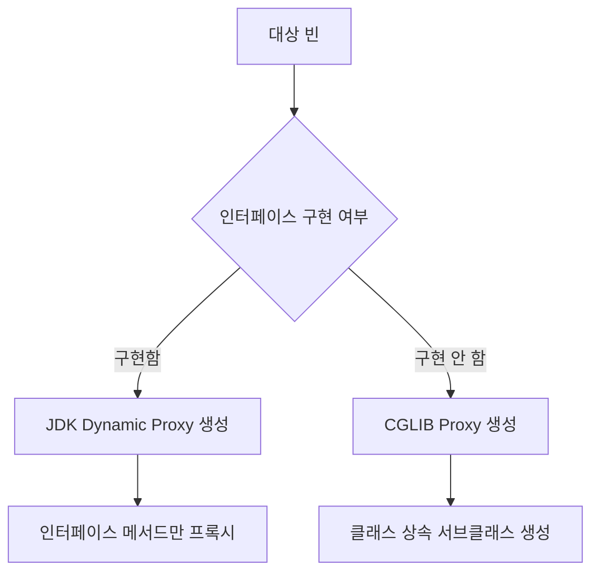

# JDK Dynamic Proxy와 CGLIB

## 핵심 정의
Spring AOP는 대상 객체를 감싸는 프록시(proxy)를 생성할 때 두 가지 방식을 사용한다. JDK Dynamic Proxy는 JDK에 내장된 `java.lang.reflect.Proxy` 기반으로 인터페이스를 구현해 프록시를 만드는 방식이고, CGLIB(Code Generation Library)는 대상 클래스를 상속받아 서브클래스를 런타임에 생성하는 방식이다(현재는 스프링 코어에 내부 재패키징되어 포함된다). 대상 객체의 인터페이스와 프록시 설정을 함께 보고 방식을 선택한다.

## 동작 원리 / 구조

| 구분 | JDK Dynamic Proxy | CGLIB |
|---|---|---|
| 전제 조건 | 대상이 인터페이스를 최소 1개 구현 | 인터페이스 유무 무관 (구현 없어도 가능) |
| 구현 방식 | 인터페이스를 구현하는 프록시 클래스를 런타임 생성 | 대상 클래스를 상속하는 서브클래스를 런타임 생성 |
| 프록시 대상 메서드 | public 인터페이스 메서드 호출 | public·protected 및 접근 가능한 package-private 메서드 호출. public만 대상으로 하려면 포인트컷에 명시 |
| final 클래스/메서드 | 인터페이스를 통해 호출하는 구현 메서드에 적용 가능 | final 클래스는 프록시 생성 불가, final 메서드는 가로채기 불가 |
| private/static 메서드 | 인터페이스에도 선언할 수 있지만 프록시 인스턴스의 가로채기 대상이 아님 | 어드바이스 적용 불가 (오버라이드 불가) |
| 인스턴스 생성 방식 | `Proxy.newProxyInstance` | Objenesis를 이용해 생성자 호출 없이 인스턴스화(대부분의 경우) |
| 성능 판단 | JDK·호출 방식·어드바이스 체인과 실제 부하로 측정 | JDK·호출 방식·어드바이스 체인과 실제 부하로 측정 |

동작 흐름:
- **JDK Dynamic Proxy**: `InvocationHandler`를 구현한 객체가 프록시로 들어오는 모든 메서드 호출을 가로채 `invoke()`로 위임한다. Spring은 `JdkDynamicAopProxy`가 이 역할을 하며, 내부적으로 어드바이스 체인을 실행한 뒤 target의 실제 메서드를 리플렉션으로 호출한다.
- **CGLIB**: 대상 클래스를 상속한 서브클래스를 바이트코드 조작으로 생성하고, 오버라이드된 메서드 안에서 `MethodInterceptor.intercept()`를 통해 어드바이스 체인을 실행한다. Spring에서는 `CglibAopProxy`가 이를 담당한다.

아래 그림은 클래스 프록시 강제나 빈별 지정이 없는 Framework 기본 선택을 요약한다.

**기본 선택 규칙(Spring Framework 7.0.9 기준)**: 별도 지정이 없으면 대상이 인터페이스를 구현할 때 JDK Dynamic Proxy, 그렇지 않으면 CGLIB를 사용한다. `proxyTargetClass=true`는 클래스 프록시를 전역 기본값으로 설정하며 Spring Boot AOP 자동 구성도 클래스 프록시를 기본으로 선택한다. 다만 Framework 7.0부터 `@Bean` 메서드·컴포넌트의 `@Proxyable(ProxyType.INTERFACES)` 또는 `TARGET_CLASS`로 빈별 선택을 우선할 수 있다. 애노테이션만으로 어드바이스나 프록시가 생기는 것은 아니며 해당 빈이 실제 자동 프록시 대상이어야 한다.

**메서드 가시성(visibility) 관련 주의**: JDK 프록시는 public 인터페이스 메서드를 노출한다. CGLIB는 public·protected와 접근 가능한 package-private 메서드도 가로챌 수 있다. `execution(* com.example..*.*(..))`이 public만 매칭한다고 가정하면 안 된다. public만 원하면 `execution(public * com.example..*.*(..))`로 제한한다. 실제 호출이 프록시를 거쳐야 한다는 조건과 개별 어노테이션 기능의 가시성 정책은 별도로 적용된다.

## 실무 관점
- 서비스 클래스를 인터페이스 없이 구체 클래스로만 설계하는 경우가 흔해졌는데(과잉 추상화 지양 트렌드), 이 경우 자동으로 CGLIB가 선택된다. Spring Boot 기본 설정과도 일치하므로 대부분 신경 쓸 필요는 없다.
- **CGLIB 사용 시 주의점**:
  - 클래스나 메서드에 `final`이 붙어 있으면 프록시 생성 자체가 실패하거나(클래스 final) 해당 메서드에 어드바이스가 적용되지 않는다(메서드 final). Lombok의 `@Value`(불변 클래스)나 유틸성 final 클래스에 AOP를 걸려다 실패하는 사례가 흔하다.
  - Spring 7.0.9의 일반 CGLIB AOP 프록시에서 `final` 인스턴스 메서드는 target으로 위임되지 않고 프록시 객체에서 실행된다. Objenesis로 만든 프록시의 초기화되지 않은 필드를 읽어 `null`·기본값을 받거나 NPE가 날 수 있다. 단순히 “트랜잭션만 빠지고 업무 코드는 동일하게 실행된다”고 가정하지 않는다. 프록시를 통해 호출할 메서드의 final을 제거하거나 적합한 인터페이스 프록시를 사용한다.
  - 기본 생성자가 없거나 생성자에서 무거운 초기화 로직이 있는 클래스는 Objenesis로 생성자를 우회하기 때문에 큰 문제는 없지만, 생성자 의존적인 초기화 로직이 있다면 프록시 인스턴스화 방식을 이해하고 있어야 디버깅이 쉽다.
  - 패키지 프라이빗(package-private) 메서드는 다른 패키지에서는 오버라이드가 불가능해 어드바이스가 적용되지 않는다.
- **JDK Dynamic Proxy 사용 시 주의점**: `UserService` 인터페이스를 구현하는 `UserServiceImpl`을 JDK 프록시로 감싸면 `UserService`로 사용할 수 있지만 `UserServiceImpl`로 캐스팅할 수는 없다. 구현 클래스 타입으로 주입하려 해도 타입 불일치가 발생할 수 있다.
- 테스트에서 `@MockitoBean`/`@MockitoSpyBean`과 AOP를 함께 사용하면 테스트가 프록시와 대상 중 어느 객체를 검증하는지 확인한다. 예전 Boot의 `@MockBean`/`@SpyBean`은 3.4에서 deprecated됐고 4.0에서 제거됐으므로 Boot 4 예제에 사용하지 않는다.
- 강제로 CGLIB를 쓰고 싶다면 `@EnableAspectJAutoProxy(proxyTargetClass = true)`, 트랜잭션의 경우 `@EnableTransactionManagement(proxyTargetClass = true)`처럼 각 기능별 애노테이션에 `proxyTargetClass` 옵션이 있다.

## 심화 Q&A

### Q. 같은 빈에 인터페이스가 있는데도 CGLIB를 강제로 쓰고 싶은 이유는 무엇인가?
클래스 내부에서 인터페이스에 정의되지 않은 public 메서드까지 AOP 적용 대상으로 삼고 싶을 때, 혹은 다른 빈이 구현 클래스 타입으로 직접 주입받아야 하는 레거시 코드가 있을 때 CGLIB를 강제한다. 또한 여러 모듈에서 프록시 방식이 혼재하면 캐스팅 이슈나 타입 불일치가 발생하기 쉬워, 팀 컨벤션으로 아예 CGLIB로 통일하는 경우도 많다.

### Q. CGLIB가 `final` 클래스를 프록시하지 못하는 근본 이유는?
CGLIB는 대상 클래스를 상속하는 서브클래스를 생성하는 방식이기 때문이다. Java 언어 스펙상 `final` 클래스는 상속이 금지되어 있으므로 서브클래스 생성 자체가 불가능하다. 같은 이유로 `final` 메서드는 오버라이드할 수 없어 그 메서드만 어드바이스 적용에서 제외된다. 이는 CGLIB의 구현 한계가 아니라 JVM/언어 차원의 제약이다.

### Q. Objenesis는 왜 필요하고, 어떤 트레이드오프가 있는가?
Objenesis는 프록시 인스턴스를 만들 때 대상 생성자를 다시 호출하지 않게 한다. 실제 target 객체의 생성자와 의존성 주입은 정상적으로 수행되므로 target의 필수 초기화가 생략되는 것은 아니다. JVM이 생성자 우회를 허용하지 않으면 이중 호출과 관련 로그가 생길 수 있으며, 모듈 접근 제약도 따로 확인해야 한다.

### Q. 모듈 시스템(JPMS) 환경에서 CGLIB 프록시 생성이 실패할 수 있는 경우는?
CGLIB의 클래스 정의·리플렉션 접근은 모듈의 공개/개방 여부에 영향을 받는다. 공식 문서는 module path에서 `java.lang`의 클래스를 프록시하는 경우 같은 제약과 `--add-opens=java.base/java.lang=ALL-UNNAMED`가 필요한 경우를 설명한다. 이를 모든 구성에서 불가능하다거나 `--add-opens`가 언제나 해결한다고 일반화하면 안 된다. 오류에 나온 대상 모듈·패키지·호출 모듈을 확인하고 최소 범위의 개방, 인터페이스 프록시, 대상 설계 변경 중 적합한 방법을 선택한다.

### Q. 인터페이스가 여러 개인 빈을 JDK Dynamic Proxy로 감싸면 어떤 일이 일어나는가?
`Proxy.newProxyInstance`는 지정한 여러 인터페이스를 함께 구현할 수 있다. Spring은 기본적으로 대상의 인터페이스들을 노출하지만 수동 프록시 설정이나 Framework 7.0의 `@Proxyable(interfaces = {...})`로 노출 범위를 제한할 수 있다. 어드바이스는 포인트컷에 매칭되는 메서드에만 적용되고, 프록시가 노출하지 않은 구현 클래스 고유의 메서드는 프록시를 통해 호출할 수 없다.

### Q. Spring Boot 기본값이 CGLIB인데 굳이 인터페이스를 만들어야 하는 이유가 있는가?
AOP 프록시 방식 선택과는 별개로, 인터페이스는 테스트 시 mock 대체 용이성, 모듈 간 의존 역전(DIP), 다중 구현체 교체 가능성 등 설계적 이유로 여전히 유효하다. 다만 "AOP가 적용되려면 인터페이스가 필요하다"는 것은 CGLIB 도입 이후 더 이상 사실이 아니므로, 인터페이스 도입 여부는 순수하게 설계 관점에서 판단해야 한다.

## 관련 개념
- [[프록시 기반 AOP 동작 원리]]
- [[Advice 종류와 실행 순서]]

## 참고 자료

부분 재검증: 2026-10-04. Framework 7.0.9 `ProxyFactory`·Objenesis 경로에서 동일 target의 일반 메서드는 초기화된 값을 반환하지만 final getter는 프록시의 null 필드를 읽고 어드바이스도 거치지 않는 것을 1건 실행했다. 모든 커스텀 프록시 생성 방식이나 AspectJ 위빙으로 일반화하지 않는다.

추가 실행 확인: 같은 버전에서 `@EnableTransactionManagement(proxyTargetClass=true)` 구성의 기본 빈은 CGLIB, `@Proxyable(INTERFACES)`로 지정한 final 구현체는 JDK 프록시로 동작하고 트랜잭션도 활성화됨을 확인했다. 트랜잭션 등 매칭 어드바이스가 없는 빈에는 Proxyable만 붙여도 프록시가 생성되지 않았다(JUnit 2건).

- [CglibAopProxy 7.0.9 소스](https://raw.githubusercontent.com/spring-projects/spring-framework/v7.0.9/spring-aop/src/main/java/org/springframework/aop/framework/CglibAopProxy.java) — final 메서드의 target 미위임과 미초기화 필드에 관한 진단.
- [Proxyable 7.0.9 API](https://docs.spring.io/spring-framework/docs/7.0.9/javadoc-api/org/springframework/context/annotation/Proxyable.html) — 빈별 프록시 방식·인터페이스 지정과 적용 전제. 아래 Proxying Mechanisms의 7.0 전역 기본값 설명도 재확인했다.

부분 재검증: 2026-09-22. Spring Framework 7.0.9의 non-public 메서드 인터셉트, 인터페이스의 private/static 메서드 구분, Boot 4 테스트 애노테이션 변경을 확인했다. 전체 노트의 `verified`는 이전 검증일을 유지한다.

- [Boot 4 마이그레이션](https://github.com/spring-projects/spring-boot/wiki/Spring-Boot-4.0-Migration-Guide) — MockBean/SpyBean 제거와 MockitoBean/MockitoSpyBean 전환.
- [Java 27 JLS 인터페이스 메서드](https://docs.oracle.com/javase/specs/jls/se27/html/jls-9.html#jls-9.4) — private/static 인터페이스 메서드의 선언과 상속 경계.

검증일: 2026-09-08. 적용 범위: Spring Framework 7.0; Framework 기본값과 Spring Boot 자동 구성은 구분.

- [Proxying Mechanisms](https://docs.spring.io/spring-framework/reference/core/aop/proxying.html) — 상속/가시성/Objenesis/모듈 제약과 프록시 선택.
- [Declaring a Pointcut](https://docs.spring.io/spring-framework/reference/core/aop/ataspectj/pointcuts.html) — CGLIB의 non-public 메서드 인터셉트 범위.
