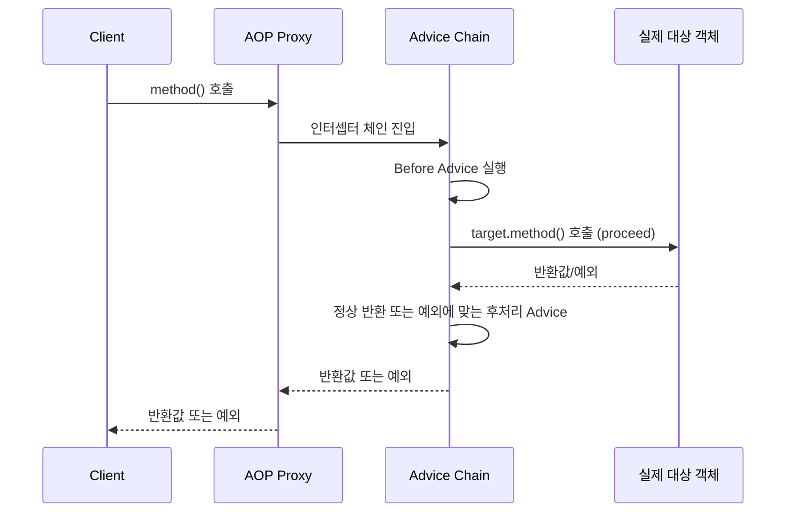

# 프록시 기반 AOP 동작 원리

## 핵심 정의
Spring AOP(Aspect-Oriented Programming)는 로깅·트랜잭션 같은 횡단 관심사를 핵심 비즈니스 로직과 분리한다. 컨테이너의 자동 프록시 기능은 어드바이스가 매칭되는 Bean을 프록시로 감싼다. JDK 동적 프록시와 CGLIB는 프록시 클래스의 바이트코드를 생성할 수 있지만, AspectJ처럼 대상 클래스 자체를 위빙하는 방식과는 다르다. 모든 Bean이 항상 프록시가 되는 것은 아니다.

## 동작 원리 / 구조
Spring AOP는 순수 Java 기반 프록시 패턴(proxy pattern)으로 동작한다. AspectJ처럼 클래스 로딩 시점이나 컴파일 시점에 바이트코드를 직접 수정하는 위빙 방식이 아니라, 메서드 호출을 가로채는(intercept) 프록시를 스프링 컨테이너 초기화 과정에서 생성해 빈으로 등록한다.

동작 흐름:
1. 빈 후처리기(`BeanPostProcessor`)인 `AnnotationAwareAspectJAutoProxyCreator`가 빈 생성 이후 시점에 개입한다.
2. 등록된 Advisor(포인트컷 + 어드바이스)의 포인트컷(pointcut) 표현식과 대상 빈의 클래스/메서드를 매칭한다.
3. 매칭되면 원본 빈 대신 JDK Dynamic Proxy 또는 CGLIB 프록시를 생성해 컨테이너에 등록한다.
4. 클라이언트가 의존성 주입(DI)으로 받는 것은 프록시 객체이며, 프록시의 메서드 호출은 `MethodInterceptor` 체인을 거쳐 어드바이스 로직 실행 후 실제 target 객체의 메서드를 호출(`proceed()`)한다.

핵심 제약은 이 구조에서 자연스럽게 도출된다.
- **프록시를 거치지 않는 호출은 부가 기능이 적용되지 않는다.** 같은 클래스 내부에서 `this.method()` 형태로 자기 자신의 다른 메서드를 호출하면 프록시를 우회하므로 self-invocation 문제가 발생한다.
- **프록시 종류와 어드바이스의 정책에 따라 가시성이 다르다.** JDK 프록시는 public 인터페이스 메서드 호출을 가로챈다. CGLIB는 프록시를 통한 public·protected 호출과 접근 가능한 package-private 호출도 가로챌 수 있다. public만 대상으로 삼으려면 포인트컷에 이를 명시한다. `private`·`final` 메서드는 클래스 기반 프록시로 가로챌 수 없으며, `@Transactional` 등 개별 기능의 메타데이터 처리 정책도 별도로 확인한다.
- **자동 프록시는 컨테이너가 관리하는 대상에 적용된다.** 직접 `new`로 만든 객체에는 자동 적용되지 않는다. 다만 Spring의 `ProxyFactory`로 수동 생성한 객체를 명시적으로 프록시로 감싸는 것은 가능하다.

## 실무 관점
- `@Transactional`, `@Async`, `@Cacheable`, `@Retryable` 등 스프링의 선언적 기능 대부분이 이 프록시 기반 AOP 위에서 동작한다. 따라서 이 원리를 모르면 "왜 트랜잭션이 안 걸리지?" 같은 문제를 self-invocation으로 오인하거나 반대로 놓치는 경우가 많다.
- **흔한 장애 패턴**: 내부 호출은 호출 대상의 `@Transactional` 속성을 적용하지 않는다. 이미 외곽 트랜잭션이 있으면 그 안에서 실행되지만, 내부 메서드의 `REQUIRES_NEW` 등은 무시된다. 별도 Bean으로 분리하는 방식을 우선 검토한다. `AopContext.currentProxy()`는 `exposeProxy=true`와 프록시 호출 문맥이 필요하며 AOP에 대한 결합을 늘리는 최후 수단이다.
- private 메서드에 `@Transactional`이나 커스텀 어드바이스를 걸어도 조용히 무시되는 경우가 있다. 로그나 예외 없이 실패하므로 디버깅 시 우선 확인 대상.
- 프록시 생성 비용과 메서드 호출마다 발생하는 인터셉터 체인 오버헤드는 일반적인 비즈니스 로직에서는 무시할 수준이지만, 매우 hot한 경로(초당 수만 회 호출)에서는 측정해볼 가치가 있다.
- Spring Boot에서는 `@EnableAspectJAutoProxy`를 명시하지 않아도 AOP starter 의존성이 있으면 자동 설정된다.

## 심화 Q&A

### Q. Spring AOP와 AspectJ의 위빙(weaving) 방식은 근본적으로 어떻게 다른가?
Spring AOP는 런타임 프록시 기반으로 메서드 실행 조인포인트(join point)를 지원한다. 일반 자동 프록시 대상은 컨테이너가 관리하는 빈이지만, 앞서 설명한 `ProxyFactory`의 수동 프록시도 가능하다. AspectJ는 컴파일 타임/로드 타임 위빙으로 대상 바이트코드를 수정해 필드 접근·생성자·private 메서드와 self-invocation까지 처리할 수 있다. 대신 AJC 컴파일러나 로드타임 위버 등 별도 구성이 필요하다.

### Q. self-invocation 문제를 해결하는 방법들을 비교하면?
(1) 메서드를 별도 빈/클래스로 분리해 외부에서 호출하도록 구조 변경 — 가장 권장되는 방식, 관심사 분리 관점에서도 자연스럽다. (2) `AopContext.currentProxy()`를 사용해 프록시를 통해 자기 자신을 호출 — `exposeProxy=true` 설정이 필요하고 코드가 AOP 구현에 종속되어 결합도가 높아진다. (3) AspectJ 로드타임 위빙으로 전환 — 근본 해결이지만 설정 복잡도가 크게 증가한다. 실무에서는 보통 (1)을 우선 고려한다.

### Q. 프록시 대상 빈이 필드 주입이 아니라 생성자 주입을 받을 때 프록시 생성 시점이 문제가 될 수 있는가?
순환 참조가 없는 일반적인 경우 문제 없다. 다만 생성자 주입 + 순환 의존성 조합에서는 스프링이 프록시를 조기 노출(early reference)하는 캐싱 메커니즘을 생성자 주입에는 적용할 수 없어 `BeanCurrentlyInCreationException`이 발생할 수 있다. 이는 AOP 자체 문제라기보다 순환 참조 설계 문제로 접근해야 한다.

### Q. `@Async`와 `@Transactional`을 같은 메서드에 함께 붙이면 실행 순서가 보장되는가?
둘 다 프록시 기반이며 프록시 중첩과 Advisor 순서에 영향을 받는다. `@Async`는 실행기에 위임하므로 실제 실행 스레드·시점은 실행기의 정책에 달려 있다. 워커 스레드로 넘어가면 호출자의 명령형 트랜잭션은 자동 전파되지 않으며, 워커가 통과하는 별도 서비스의 트랜잭션 프록시가 새 경계를 열 수 있다. 포화 시 호출자에서 실행하는 `CallerRunsPolicy`는 다른 결과를 만들 수 있다. [[Spring Event와 비동기 처리]]의 실행기 경계를 확인하고, 비동기 빈과 트랜잭션 업무 빈을 나누면 호출 순서를 드러내기 쉽다.

### Q. 프록시 방식이 성능에 미치는 영향을 실측 없이 판단해도 되는가?
안 된다. 비용은 프록시 종류, 어드바이스 수, 동적 포인트컷, JIT 최적화와 호출 부하에 따라 달라진다. 특정 시간 단위나 호출 횟수를 일반화하지 말고 실제 경로를 프로파일링하거나 적절한 벤치마크로 비교한다.

## 관련 개념
- [[JDK Dynamic Proxy와 CGLIB]]
- [[Advice 종류와 실행 순서]]
- [[Transactional 동작 원리]]

## 참고 자료

부분 재검증: 2026-10-04. Framework 7.0.9 공식 프록시·실행기 문서로 수동 프록시 허용과 Async 실행 위치를 대조했다. `@Async`·ThreadPoolTaskExecutor·H2 2.4.240의 정상 워커/CallerRuns 포화 경로 2건에서 실행 스레드·트랜잭션 활성 여부·미커밋 행 가시성을 비교했다. 자세한 적용 경계는 [[Spring Event와 비동기 처리]]에 둔다.

- [Task Execution and Scheduling](https://docs.spring.io/spring-framework/reference/integration/scheduling.html) — 실행기 위임과 CallerRunsPolicy의 제출 스레드 실행. 아래 Proxying Mechanisms의 수동 ProxyFactory 예제도 재확인했다.
- [Declaring Advice](https://docs.spring.io/spring-framework/reference/core/aop/ataspectj/advice.html) — 2026-10-04 도식 대조: 정상 반환의 AfterReturning, 예외의 AfterThrowing, finally 성격의 After를 구분한다.

검증일: 2026-09-08. 적용 범위: Spring Framework 7.0의 프록시 AOP; 선언적 기능별 가시성 정책은 별도.

- [Proxying Mechanisms](https://docs.spring.io/spring-framework/reference/core/aop/proxying.html) — 자기 호출, 프록시 종류, final/private 제약.
- [Declaring a Pointcut](https://docs.spring.io/spring-framework/reference/core/aop/ataspectj/pointcuts.html) — CGLIB의 protected/package-visible 메서드 지원.
