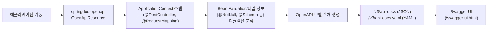

# OpenAPI와 Swagger 문서화

## 핵심 정의
OpenAPI Specification(OAS)은 REST API의 엔드포인트, 요청/응답 스키마, 인증 방식을 언어 중립적인 JSON/YAML 포맷으로 기술하는 표준 규격이다. Swagger는 이 규격의 전신이자 현재는 이를 기반으로 한 도구 생태계(Swagger UI, Swagger Editor 등)를 가리키는 이름으로 남아 있다. Spring Boot 환경에서는 `springdoc-openapi` 라이브러리를 사용할 수 있으며, 컨트롤러 코드를 리플렉션으로 스캔해 OpenAPI 3 문서를 런타임에 자동 생성하고 Swagger UI를 함께 제공한다. Spring Boot 3.x는 springdoc-openapi 2.x 계열, Spring Boot 4.x는 3.x 계열을 사용해야 하므로 부트 버전과 라이브러리 버전 호환 매트릭스를 반드시 확인해야 한다.

## 동작 원리 / 구조



- 문서는 애플리케이션 코드로부터 **런타임에** 조립된다. 별도 스펙 파일을 손으로 관리하는 것이 아니라 컨트롤러 메서드 시그니처, `@RequestBody`/`@ResponseBody` 타입, Bean Validation 애노테이션(`@NotBlank`, `@Min` 등)을 그대로 읽어 스키마를 만든다. 즉 코드가 진실의 원천(source of truth)이 되는 code-first 방식이다.
- `@Operation`, `@ApiResponse`, `@Parameter`, `@Schema` 같은 springdoc/swagger 애노테이션으로 자동 추론이 부족한 부분(설명, 예시 값, 에러 응답 목록)을 보강한다.
- `GroupedOpenApi` 빈으로 경로 패턴별 문서 그룹(예: 관리자 API, 공개 API)을 분리할 수 있다.
- SecurityScheme은 인증 방식의 문서 선언이고 SecurityRequirement가 적용 대상을 표현한다. 실제 인증·인가는 Spring Security가 별도로 강제해야 한다. 아래 예제는 모든 연산에 bearerAuth를 선언하므로 실제 익명 허용 API는 해당 연산의 문서 security도 재정의한다.

OpenAPI 3.1.1에서 `security` 배열의 항목 사이는 OR이고, 한 항목 안에 나열한 보안 방식 사이는 AND다. 토큰과 API 키를 모두 요구하려는데 배열 항목을 두 개로 나누면 문서는 둘 중 하나만 요구하는 계약이 된다.

| 연산의 `security` 선언 | 문서상 의미 |
|---|---|
| `[{bearerAuth: [], apiKey: []}]` | 두 인증 방식 모두 필요 |
| `[{bearerAuth: []}, {apiKey: []}]` | 둘 중 하나면 됨 |
| `[]` | 상위 보안 요구를 제거 |
| `[{}, {bearerAuth: []}]` | 익명 접근도 허용 |

이 선언을 바꿔도 서버의 접근 제어는 바뀌지 않는다. 생성된 문서의 의미와 실제 익명·인증 실패 응답을 함께 확인한다.

```java
@Configuration
public class OpenApiConfig {

    @Bean
    public OpenAPI apiInfo() {
        return new OpenAPI()
            .info(new Info().title("Member API").version("v1"))
            .addSecurityItem(new SecurityRequirement().addList("bearerAuth"))
            .components(new Components().addSecuritySchemes("bearerAuth",
                new SecurityScheme().type(SecurityScheme.Type.HTTP)
                    .scheme("bearer").bearerFormat("JWT")));
    }

    @Bean
    public GroupedOpenApi publicApi() {
        return GroupedOpenApi.builder()
            .group("public")
            .pathsToMatch("/api/public/**")
            .build();
    }
}
```

## 실무 관점
- **운영 환경 노출 차단**: `/v3/api-docs`, `/swagger-ui.html`은 API 구조(엔드포인트, 파라미터, 내부 DTO 필드명)를 그대로 드러낸다. 운영 환경에서는 `springdoc.api-docs.enabled=false` / `springdoc.swagger-ui.enabled=false` 프로필 분리 또는 인증이 걸린 경로 뒤로 숨겨야 한다. 이를 누락해 내부 스키마가 공개 인터넷에 노출되는 사고가 실무에서 반복적으로 발생한다.
- **code-first와 contract-first**: 코드 기반 생성은 중복 작성을 줄이지만 커스텀 직렬화·검증 그룹·조건부 응답·보안 실패·예외 응답까지 완전히 추론하지 못한다. 미리 합의할 계약이 있다면 spec-first와 생성 도구를 고려하고 어느 방식이든 실제 응답을 계약과 검증한다.
- **엔티티 직접 노출 금지**: 컨트롤러가 JPA 엔티티를 그대로 반환하면 문서에도 연관관계, 지연 로딩 프록시 필드가 그대로 노출된다. DTO를 분리해야 문서도 깔끔해지고 API 계약과 엔티티 변경이 분리된다.
- **버전 관리**: `GroupedOpenApi`로 `/v1`, `/v2` 그룹을 나누거나 별도 문서를 유지해 하위 호환성 깨짐을 문서 diff로 조기에 감지할 수 있다. CI에 OpenAPI diff 도구(openapi-diff 등)를 붙여 breaking change를 병합 전에 잡는 팀도 많다.
- **성능**: 문서는 최초 요청 시 캐시되어 재계산 비용은 크지 않지만, 컨트롤러 수가 매우 많은 모놀리스에서는 기동 시 스캔 비용이 늘어날 수 있어 `springdoc.packages-to-scan`으로 스캔 범위를 좁히는 것이 도움이 된다.

## 심화 Q&A

### Q. code-first(springdoc) 방식에서 API 계약이 실제 구현과 어긋날 위험은 없는가?
A. 어긋날 수 있다. 애노테이션의 수동 응답 스키마, Object/제네릭 타입, 커스텀 Jackson 직렬화, 런타임 조건과 필터 응답은 문서와 다를 수 있다. MockMvc 등으로 성공·실패 응답을 생성된 스키마에 대조하고, 의도한 계약과 문서 변경도 별도로 리뷰한다.
### Q. 제네릭 타입이나 다형성(polymorphic) DTO는 OpenAPI 스키마로 어떻게 표현되는가?
A. 구체적인 제네릭과 Jackson 다형성 메타데이터를 활용하지만 모든 상속 관계를 정확히 추론하지는 않는다. 실제 응답 타입에 따라 oneOf/anyOf/allOf와 discriminator를 선택하고 필요한 @Schema 선언을 추가한다. discriminator는 분기 선택 힌트이며 oneOf가 뜻하는 정확히 하나의 스키마 만족 조건을 대체하지 않는다.
### Q. Swagger UI를 운영 환경에서 완전히 끄지 않고 안전하게 유지하려면 어떻게 해야 하는가?
A. 별도 인증이 걸린 관리자 경로로 이동시키거나, `SecurityFilterChain`에서 해당 경로를 인증된 사용자(내부 IP 대역, 사내 SSO 등)에게만 허용하도록 명시적으로 제한한다. 완전히 끄는 것이 가장 안전하지만, 파트너사에 API 명세를 실시간으로 공유해야 하는 경우 이런 접근 제어형 절충안을 쓴다.
### Q. OpenAPI 3.1은 3.0과 무엇이 다르고, springdoc 적용 시 주의할 점은?
A. 3.1은 스키마 부분이 JSON Schema 2020-12와 완전히 정합하도록 바뀌어 `nullable` 키워드 대신 타입 배열(`type: [string, "null"]`)을 쓰는 등 표현 방식이 달라졌다. springdoc 버전에 따라 기본 출력 스펙 버전이 다르므로, 이미 3.0 기준으로 만들어진 클라이언트 코드 생성기나 검증 도구가 있다면 라이브러리 업그레이드 시 스펙 버전 호환성을 먼저 확인해야 한다.
### Q. 대규모 API에서 문서를 어떻게 그룹핑하는 것이 실무적으로 유리한가?
A. 소비자별 권한·계약이 다르면 소비 주체별로, 하나의 소비자가 여러 도메인을 탐색한다면 도메인별로 나눌 수 있다. 그룹 필터는 문서에 포함할 경로를 고르는 기능이며 실제 API·필드 접근 제어가 아니다. 공유 스키마에 민감 필드가 섞이지 않는지 생성 결과를 확인한다.
### Q. 문서화 애노테이션(`@Operation`, `@Schema`)이 코드 곳곳에 흩어지면서 컨트롤러 가독성이 떨어지는 문제는 어떻게 완화하는가?
A. `@Operation(summary = ...)` 같은 짧은 설명은 컨트롤러에 남기되, 긴 설명이나 예시 페이로드는 별도 상수 클래스나 `.properties`/YAML 리소스로 분리해 참조하는 방식을 쓴다. 또는 DTO 레벨에 `@Schema`를 몰아서 선언하고 컨트롤러 메서드에는 최소한의 애노테이션만 남기면 관심사가 분리된다.

## 관련 개념
- [[Bean Validation]]
- [[전역 예외 처리와 ControllerAdvice]]
- [[Spring Data REST]]

## 참고 자료

부분 재검증: 2026-10-04. OpenAPI 3.1.1의 보안 요구 AND/OR와 연산 수준 재정의 의미를 공식 명세로 확인했다. springdoc 공식 페이지의 Boot 3.x/4.x 대응 계열도 재확인했으며, 표는 명세의 구조 예시다. Swagger UI나 실제 SecurityFilterChain의 통합 실행 검증은 이번 범위에 포함하지 않았다.

- [OpenAPI 3.1.1 Security Requirement Object](https://spec.openapis.org/oas/v3.1.1.html#security-requirement-object), [Operation Object](https://spec.openapis.org/oas/v3.1.1.html#operation-object) — 한 객체의 AND, 배열의 OR, 익명 접근과 상위 요구 재정의.

검증일: 2026-09-08. 적용 범위: OpenAPI 3.1.1 Schema Object, springdoc 3.1.1(사용 프로젝트의 Boot minor 호환성 별도 확인).

- [springdoc 공식 문서](https://springdoc.org/) — 호환 계열·애노테이션·그룹·캐시와 엔드포인트.
- [OpenAPI 3.1.1 명세](https://spec.openapis.org/oas/v3.1.1.html) — JSON Schema·security 선언·다형성.
