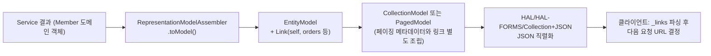

# Spring HATEOAS

## 핵심 정의
HATEOAS(Hypermedia As The Engine Of Application State)는 REST 아키텍처 제약 중 하나로, 클라이언트가 리소스 URL을 미리 하드코딩하지 않고 서버가 응답에 포함한 링크(`_links`)를 따라가며 다음 가능한 동작을 발견하도록 하는 설계 원칙이다. Spring HATEOAS는 이 원칙을 직접 작성하는 `@RestController` 위에서 구현할 수 있도록 `RepresentationModel`, `EntityModel`, `CollectionModel`, `Link`, `WebMvcLinkBuilder` 같은 빌더 API를 제공하는 독립 라이브러리다. 자동으로 리포지토리를 노출하는 [[Spring Data REST]]와 달리, 개발자가 직접 만든 컨트롤러/서비스 계층 응답에 하이퍼미디어 링크를 수동으로 붙이는 방식이라는 점이 핵심 차이다.

## 동작 원리 / 구조



- `WebMvcLinkBuilder.linkTo(methodOn(MemberController.class).getMember(id)).withSelfRel()`처럼 실제 컨트롤러 메서드 시그니처를 참조해 링크를 만들기 때문에, 컨트롤러 매핑 경로가 바뀌면 링크도 자동으로 따라 바뀐다. 문자열로 URL을 직접 조립하지 않아도 된다.
- `RepresentationModelAssembler<T, D>` 인터페이스를 구현해 도메인 객체 → 하이퍼미디어 모델 변환 로직을 한 곳에 모으는 것이 관례다.
- 미디어 타입은 기본 HAL(`application/hal+json`) 외에 폼 정보를 포함한 HAL-FORMS, Collection+JSON, UBER 등을 선택할 수 있다. `@EnableHypermediaSupport`로 지원 포맷을 선언한다.
- Affordance API(`Affordances`)를 쓰면 링크에 "이 리소스에 대해 PUT/DELETE도 가능하다"는 메타데이터(HAL-FORMS의 `_templates`)까지 표현할 수 있다.

```java
@RestController
class MemberController {

    @GetMapping("/members/{id}")
    public EntityModel<MemberDto> get(@PathVariable Long id) {
        MemberDto dto = memberService.find(id);
        return EntityModel.of(dto,
            linkTo(methodOn(MemberController.class).get(id)).withSelfRel(),
            linkTo(methodOn(OrderController.class).findByMember(id)).withRel("orders"));
    }
}
```

## 실무 관점
- **선택 기준**: 클라이언트가 링크와 relation의 의미를 해석해야 탐색 결합도를 줄일 수 있다. 고정 URL만 사용하는 클라이언트에서는 링크 생성 비용을 정당화할 요구가 있는지 먼저 확인한다.
- **그럼에도 쓰는 상황**: API 소비자가 다양하고 서버 주도로 워크플로우를 유연하게 바꿔야 하는 내부 플랫폼 API, 또는 리소스 상태에 따라 가능한 동작이 달라지는 상태 기계형 도메인(주문 상태별 취소/환불 가능 여부 등)에서는 `_links`로 "지금 가능한 동작"을 클라이언트에 알려주는 것이 URL 하드코딩보다 결합도를 낮춘다.
- **URL 결합도 감소**: 메서드 이름·인자 변경은 링크 작성 코드의 컴파일 오류로 드러날 수 있고 매핑 문자열만 바꾸면 링크가 새 URL을 따른다. 경로 변경 자체가 컴파일 오류를 내는 것은 아니다. methodOn은 반환 타입 등 프록시 생성 제약이 있어 모든 메서드에 적용할 수 있는 방식은 아니다.
- **성능 주의**: `methodOn(...)` 자체는 실제 메서드를 실행하지 않고 프록시로 메서드 시그니처만 캡처해 URL을 만드는 데 쓰이므로 그 자체로는 안전하다. 다만 목록 응답에서 각 항목마다 연관 리소스 링크(주문, 결제 등)를 붙이는 `RepresentationModelAssembler.toModel()` 구현 안에 실수로 실제 서비스/리포지토리 조회 로직을 함께 넣으면, 목록 크기만큼 불필요한 조회가 반복 실행되어 [[N+1 문제]]와 유사한 성능 저하가 생길 수 있다. Assembler는 이미 조회된 도메인 객체를 링크로 감싸는 역할에만 충실하고, 추가 조회는 상위 서비스 계층에서 한 번에 처리하도록 분리해야 한다.
- **포맷과 URL**: HAL은 링크·embedded 리소스를, HAL-FORMS는 동작·입력 메타데이터를 표현한다. 소비자가 지원하는 형식으로 정한다. 프록시 뒤의 절대 URL은 신뢰 경계에서 정리한 Forwarded 헤더를 사용하고, 외부 입력을 그대로 신뢰해 호스트가 바뀌지 않도록 한다.

## 심화 Q&A

### Q. Spring HATEOAS와 Spring Data REST의 근본적인 차이는 무엇인가?
A. Spring Data REST는 내장 범용 컨트롤러를 통해 저장소를 HTTP 리소스로 노출한다. 저장소마다 새 컨트롤러 클래스를 생성하는 뜻은 아니다. Spring HATEOAS는 직접 작성한 API에 표현 모델·링크·하이퍼미디어 지원을 추가하는 라이브러리다.
### Q. HAL과 HAL-FORMS의 차이는 실무에서 어떤 의미를 가지는가?
A. HAL은 링크와 embedded 리소스를 제공하고 HAL-FORMS는 _templates에 HTTP 메서드·입력 필드 등의 동작 정보를 더한다. 이 메타데이터를 소비하는 클라이언트가 있을 때 폼 구성과 다음 동작 발견에 활용할 수 있다.
### Q. 상태별 링크와 Affordance 메타데이터는 어떻게 활용하는가?
A. 상태별 취소·결제 링크를 제공하면 클라이언트가 현재 가능한 동작을 발견할 수 있다. Spring의 Affordance API는 여기에 메서드·입력 등 동작 메타데이터를 붙인다. 링크 숨김은 인가가 아니며 응답 이후 상태가 달라질 수도 있으므로 실행 API에서 권한과 상태 전이를 다시 검증한다.
### Q. 하이퍼미디어 응답을 테스트할 때 일반 JSON 응답 테스트와 무엇이 다른가?
A. 필드 값 검증 외에 `_links.self.href`, `_links.orders.href` 같은 링크의 존재와 URL 패턴을 함께 검증해야 한다. MockMvc의 `jsonPath("$._links.self.href")` 검증이나 Spring HATEOAS가 제공하는 `LinkDiscoverer`를 활용해 링크 relation 이름으로 링크를 찾아 검증하는 방식이 흔히 쓰인다. 링크 relation 이름이 오타로 잘못 바뀌면 클라이언트가 조용히 해당 기능을 잃어버리므로 이 부분 테스트를 누락하기 쉽다.
### Q. 클라이언트가 `_links`를 전혀 활용하지 않는 조직에서도 Spring HATEOAS 도입을 정당화할 수 있는 경우가 있는가?
A. API 버저닝 전략에서 유용할 수 있다. 리소스 관계가 URL 하드코딩이 아니라 링크로 표현되어 있으면, 서버가 내부적으로 경로 구조를 바꿔도 클라이언트가 링크를 따라가는 한 영향을 받지 않는다. 다만 클라이언트가 링크를 안 쓰고 URL을 직접 조립한다면 이 이점도 사라지므로, 팀 차원에서 클라이언트 쪽 관례를 함께 정하지 않으면 유지 비용만 남는 경우가 많다.

## 관련 개념
- [[Spring Data REST]]
- [[전역 예외 처리와 ControllerAdvice]]
- [[N+1 문제]]

## 참고 자료

검증일: 2026-09-08. 적용 범위: Spring HATEOAS 3.1.2의 표현 모델·링크 생성·미디어 타입.

- [Spring HATEOAS Reference](https://docs.spring.io/spring-hateoas/docs/current/reference/html/) — 모델·methodOn 제약·Affordances·미디어 타입·forwarded headers.
