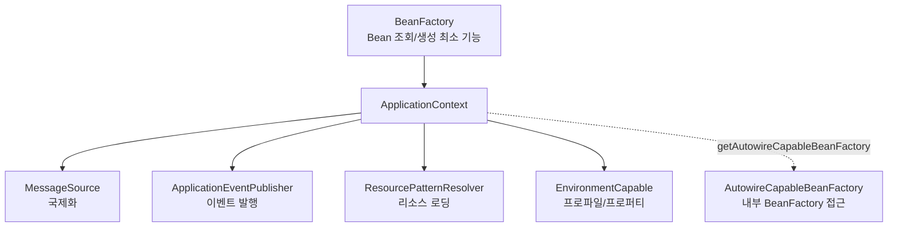

# ApplicationContext

## 핵심 정의

`ApplicationContext`는 Spring IoC 컨테이너의 핵심 인터페이스로, Bean의 생성/조립/생명주기 관리라는 `BeanFactory`의 기본 기능에 더해 국제화(i18n) 메시지 처리, 이벤트 발행/구독, 리소스 로딩, AOP 통합, 환경(profile/property) 추상화 같은 애플리케이션 수준 기능을 통합 제공하는 컨테이너다. Spring Boot 애플리케이션에서 `SpringApplication.run()`이 반환하는 객체가 바로 이 `ApplicationContext`의 구현체이며, 사실상 Spring 애플리케이션 전체의 런타임 실체라고 볼 수 있다.

## 동작 원리 / 구조

`BeanFactory`와 `ApplicationContext`는 상속 관계이며, `ApplicationContext`가 상위 확장이다.



대표 구현체:

- `AnnotationConfigApplicationContext`: `@Configuration` 클래스 기반, 순수 Java 설정 애플리케이션에서 사용.
- `AnnotationConfigServletWebServerApplicationContext`: Spring Boot 웹 애플리케이션의 기본 컨텍스트(내장 서블릿 컨테이너 통합).
- `AnnotationConfigReactiveWebServerApplicationContext`: WebFlux 기반 리액티브 웹 애플리케이션용.

컨테이너 초기화 흐름은 대략 다음과 같다.

1. `BeanDefinition` 등록 — 컴포넌트 스캔, `@Configuration` 클래스 파싱, XML 등에서 Bean 메타데이터 수집.
2. `BeanFactoryPostProcessor` 실행 — `BeanDefinition` 자체를 조작(예: `PropertySourcesPlaceholderConfigurer`가 `${}` 플레이스홀더 해석).
3. Bean 인스턴스화 및 의존성 주입, `BeanPostProcessor` 체인 적용 ([[Bean 생명주기]] 참고).
4. `ContextRefreshedEvent` 발행, 컨텍스트 refresh 완료. Spring Boot의 Runner 실행과 `ApplicationReadyEvent`는 이후 단계이므로 서비스 준비 완료와 동일시하지 않는다.

```java
ApplicationContext context =
    new AnnotationConfigApplicationContext(AppConfig.class);
OrderService orderService = context.getBean(OrderService.class);
```

이벤트 기반 통신도 `ApplicationContext`가 제공하는 핵심 기능이다.

```java
@Component
public class OrderCreatedListener {
    @EventListener
    public void handle(OrderCreatedEvent event) {
        // 컴포넌트 간 직접 의존 없이 느슨하게 결합된 통신
    }
}
```

## 실무 관점

- 순수 `BeanFactory`를 직접 다루는 코드는 실무에서 거의 없다. `ApplicationContext`가 사실상 유일한 선택지이며, `BeanFactory`는 개념 이해와 지연 초기화(lazy-init) 동작 차이를 설명할 때 주로 언급된다. 일반적인 BeanFactory 단독 사용에서는 별도 사전 생성 호출 전까지 조회 시 생성하며, `ApplicationContext`는 기본적으로 컨테이너 초기화 시점에 싱글톤 Bean을 즉시(eager) 생성한다.
- 멀티 모듈/멀티 컨텍스트 구성(부모-자식 컨텍스트)에서는 자식 컨텍스트가 부모의 Bean을 조회할 수 있지만 반대는 불가능하다. 과거 Spring MVC의 `DispatcherServlet` 컨텍스트(자식)와 루트 `ApplicationContext`(부모) 분리 구조가 대표 사례이며, Spring Boot는 대부분 단일 컨텍스트로 단순화되어 있다.
- 테스트에서는 `@SpringBootTest`가 매번 새 컨텍스트를 띄우면 테스트 스위트 전체가 느려진다. Spring TestContext Framework는 동일한 설정 조합에 대해 컨텍스트를 캐싱하므로, 테스트 클래스마다 프로파일/프로퍼티 조합을 불필요하게 바꾸면 캐시 미스가 늘어 빌드 시간이 급격히 늘어나는 문제가 흔하다.
- 대량 Bean을 가진 대형 애플리케이션에서는 컴포넌트 스캔 범위(`@ComponentScan` base package)를 과도하게 넓게 잡으면 컨텍스트 초기화 시간이 늘어난다. 필요한 패키지로 스캔 범위를 좁히거나 `@Import`로 명시적 조립을 고려한다.
- `ConfigurableApplicationContext.close()`나 등록된 JVM shutdown hook을 통한 정상 종료 시 관리 대상 singleton의 소멸 콜백이 실행된다. Spring Boot는 **3.4부터 graceful shutdown이 기본 활성화**된다. 종료를 시작하면 새 요청을 거절하면서 기존 요청 완료를 유예하며, 거절 방식은 서버마다 다르다. `spring.lifecycle.timeout-per-shutdown-phase`의 기본값은 phase당 30초이고 `server.shutdown=immediate`로 대기를 끌 수 있다. SIGKILL처럼 정상 종료 절차를 거치지 않는 경우에는 이 동작을 보장하지 않는다.

## 심화 Q&A

### Q. `BeanFactory`와 `ApplicationContext`의 싱글톤 Bean 초기화 시점 차이가 실무에서 어떤 차이를 만드는가?
`ApplicationContext`는 컨텍스트 refresh 중 lazy가 아닌 일반 singleton을 사전 생성하므로, 설정 오류나 의존성 문제를 애플리케이션 기동 시점에 fail-fast로 발견할 수 있다. 반대로 `BeanFactory`를 직접 쓰면 문제가 있는 Bean이라도 실제로 조회되기 전까지는 오류가 드러나지 않아, 운영 중 예상치 못한 시점에 장애가 터질 위험이 있다. 이 차이 때문에 Spring 생태계 전반이 `ApplicationContext`를 표준으로 채택했다.

### Q. `ApplicationEventPublisher`를 이용한 이벤트 발행과 직접 메서드 호출의 트레이드오프는 무엇인가?
이벤트 기반 방식은 발행자(publisher)가 구독자(listener)의 존재나 개수를 알 필요가 없어 결합도를 낮추고, 여러 리스너가 동일 이벤트에 반응하도록 쉽게 확장할 수 있다. 반면 호출 흐름이 코드 상에서 명시적으로 보이지 않아 추적이 어려워지고, 기본적으로 동기(synchronous) 처리이기 때문에 하나의 리스너가 예외를 던지면 이후 리스너 실행과 트랜잭션 흐름에 영향을 줄 수 있다. `@TransactionalEventListener`로 트랜잭션 커밋 이후 실행되도록 분리하거나, `@Async`로 비동기 처리해 발행자와 리스너의 실패를 격리하는 설계가 자주 쓰인다.

### Q. 부모-자식 컨텍스트 구조에서 동일한 타입의 Bean이 양쪽에 정의되어 있으면 어떤 일이 벌어지는가?
이름 기반 조회에서 같은 이름의 Bean이 자식에 있으면 부모의 Bean보다 우선한다. 타입 조회, 부모 포함 목록 조회, 의존성 자동 주입은 사용한 API와 후보 선택 규칙을 함께 봐야 하므로 “타입만 같으면 항상 부모 Bean을 가린다”고 일반화하지 않는다. `messageSource`처럼 특정 이름으로 찾는 컨테이너 전략은 해당 이름 규칙도 확인한다.

### Q. `@SpringBootTest`의 컨텍스트 캐싱이 깨지는 대표적인 원인은 무엇이고 어떻게 피하는가?
캐시 키는 `@ActiveProfiles`, `@TestPropertySource`, 등록할 설정 클래스, `@DynamicPropertySource`, `@MockitoBean`·`@MockitoSpyBean` 등의 context customizer를 포함한다. 단순 애노테이션 사용 여부뿐 아니라 실제 빈 override 구성도 영향을 준다. Boot의 `@MockBean`·`@SpyBean`은 3.4에서 deprecated되고 4.0에서 제거되었으므로 새 코드와 구버전 예제를 구분한다. 불필요하게 다른 프로파일·프로퍼티·mock 구성을 만들지 않되, 서로 다른 테스트 요구를 억지로 하나의 큰 컨텍스트에 합치지는 않는다. `@DirtiesContext`, 캐시 용량에 따른 축출, 별도 JVM 실행도 재사용을 제한한다.

### Q. `Environment` 추상화와 프로파일(profile)은 `ApplicationContext`의 어떤 문제를 해결하기 위해 도입되었는가?
운영/개발/테스트 환경마다 다른 데이터소스, 외부 API 엔드포인트 같은 설정을 코드 변경 없이 전환할 필요가 있다. `Environment`는 프로퍼티 소스(파일, 환경 변수, 커맨드라인 인자 등)를 우선순위를 가진 계층으로 추상화하고, `@Profile`은 특정 프로파일이 활성화된 경우에만 특정 Bean 정의를 컨테이너에 등록하도록 조건화한다. 이를 통해 동일한 코드베이스와 아티팩트를 여러 환경에 재사용할 수 있게 된다. 다만 프로파일 조합이 많아지면(`dev,local,mysql`처럼) 어떤 Bean이 실제로 활성화되는지 추적하기 어려워지는 복잡도 트레이드오프가 있다.

## 관련 개념

- [[Bean 생명주기]]
- [[Bean 스코프]]
- [[순환 참조 문제]]

## 참고 자료

부분 재검증: 2026-09-22. Spring Framework 7.0.9의 TestContext 캐시 키·축출·프로세스 경계와 Boot 4의 MockBean 제거를 공식 문서로 확인했다.

- [TestContext Caching](https://docs.spring.io/spring-framework/reference/testing/testcontext-framework/ctx-management/caching.html) — 설정 키·customizer·DirtiesContext·JVM 경계.
- [Boot 4 Migration Guide](https://github.com/spring-projects/spring-boot/wiki/Spring-Boot-4.0-Migration-Guide) — MockBean·SpyBean 제거.

검증일: 2026-09-08. 적용 범위: Spring Framework 7.0; Spring Boot 3.5의 서버 예시 및 3.4 이후 종료 기본값.

- [ApplicationContext API](https://docs.spring.io/spring-framework/docs/current/javadoc-api/org/springframework/context/ApplicationContext.html) — 상속 관계와 getAutowireCapableBeanFactory.
- [Additional Capabilities](https://docs.spring.io/spring-framework/reference/core/beans/context-introduction.html) — 메시지·이벤트·리소스·계층 컨텍스트.
- [Context Caching](https://docs.spring.io/spring-framework/reference/testing/testcontext-framework/ctx-management/caching.html) — 컨텍스트 캐시 키와 DirtiesContext.
- [Graceful Shutdown](https://docs.spring.io/spring-boot/3.5/reference/web/graceful-shutdown.html) — 종료 중 새 요청 처리와 유예 시간.
- [Spring Boot 3.4 Release Notes](https://github.com/spring-projects/spring-boot/wiki/Spring-Boot-3.4-Release-Notes) — graceful shutdown 기본 활성화 시점.
- [Common Application Properties](https://docs.spring.io/spring-boot/appendix/application-properties/index.html) — 종료 phase당 기본 30초 및 shutdown hook.
- [Boot application events](https://docs.spring.io/spring-boot/reference/features/spring-application.html) — runner와 ReadyEvent 순서.
