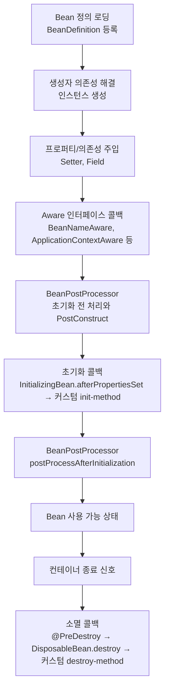

# Bean 생명주기

## 핵심 정의

Bean 생명주기(lifecycle)란 Spring IoC 컨테이너가 Bean 객체를 생성하고, 의존성을 주입하고, 초기화 콜백을 호출한 뒤, 컨테이너 종료 시점에 소멸 콜백을 호출하기까지의 전체 흐름을 말한다. 개발자가 객체 생성/소멸 시점을 직접 제어하지 않고 컨테이너에 위임한다는 점이 IoC(Inversion of Control, 제어의 역전)의 핵심이며, 생명주기 콜백은 이 흐름 중간에 커스텀 로직을 끼워 넣는 확장 지점이다.

## 동작 원리 / 구조

전체 흐름은 다음과 같다.



초기화/소멸 콜백을 여러 방식으로 등록하면 서로 다른 메서드는 어노테이션 → 인터페이스 → 설정 지정 메서드 순서로 호출된다. 같은 메서드를 여러 메커니즘으로 지정했다면 중복 호출하지 않는다. `@PostConstruct` 자체도 초기화 전 BeanPostProcessor 처리 중 실행되고, `ApplicationContextAware` 등 일부 Aware 콜백 역시 후처리기로 실행되므로 위 그림은 일반적인 단계의 요약이다.

```java
@Component
public class OrderService implements InitializingBean, DisposableBean {

    @PostConstruct
    public void init() {
        // 1순위: 어노테이션 기반 초기화
    }

    @Override
    public void afterPropertiesSet() {
        // 2순위: 인터페이스 기반 초기화
    }

    @Override
    public void destroy() {
        // 소멸 시 호출, 예: 리소스 반납
    }
}
```

`BeanPostProcessor`는 Bean의 초기화 전/후에 개입하는 컨테이너 확장 지점이다. 의존성 주입을 다루는 확장 인터페이스도 이 계열이며, `@Autowired` 처리와 AOP 프록시 생성에 사용된다. 다만 후처리기 등록 중 먼저 만들어진 Bean은 모든 후처리기를 거치지 못할 수 있어, 모든 Bean에 같은 처리 단계가 적용된다고 가정하지 않는다.

프로토타입(prototype) 스코프 Bean은 컨테이너가 생성과 초기화까지만 관여하고, 소멸 콜백은 호출하지 않는다. 소멸 시점 관리 책임이 컨테이너에서 클라이언트 코드로 넘어가기 때문이다.

## 실무 관점

- 리소스 정리(커넥션 풀 종료, 캐시 flush, 파일 핸들 close)는 `@PreDestroy`에 두는 것이 관례다. `@Component` + `@PostConstruct`/`@PreDestroy` 조합이 `InitializingBean`/`DisposableBean` 인터페이스 구현보다 Spring 종속성이 낮아 선호된다.
- `@Bean` 메서드로 등록한 외부 라이브러리 클래스는 인터페이스를 구현하게 만들 수 없으므로 `@Bean(initMethod = "init", destroyMethod = "close")` 방식을 쓴다. `close`/`shutdown` 같은 이름의 메서드는 Spring이 자동으로 추론해 호출하기도 한다(destroyMethod 추론, 기본값 `(inferred)`).
- 흔한 장애 패턴: 생성자에서 아직 주입되지 않은 다른 Bean의 메서드를 호출하거나, `@PostConstruct` 시점에 다른 Bean의 초기화가 끝나지 않은 상태를 가정하고 로직을 짜서 발생하는 초기화 순서 의존 버그. 초기화 순서를 코드로 강제하고 싶다면 `@DependsOn`을 명시하거나, 애초에 순서 의존을 없애는 설계(지연 초기화, 이벤트 기반)로 바꾸는 게 근본 해결책이다.
- 애플리케이션 종료 시 소멸 콜백이 호출되려면 컨테이너가 정상적으로 `close()`되어야 한다. `kill -9`처럼 강제 종료하면 소멸 콜백이 스킵될 수 있으므로, 운영 환경에서는 SIGTERM 기반 그레이스풀 셧다운(graceful shutdown) 설정이 함께 필요하다.
- `ApplicationListener<ContextRefreshedEvent>`나 `SmartLifecycle`은 단순 초기화 콜백보다 더 세밀한 시작/종료 순서 제어가 필요할 때(예: 여러 컴포넌트 간 시작 순서 보장) 사용한다.
- **비동기 종료의 완료 통지**: `SmartLifecycle.stop(Runnable)`은 종료 완료 후 전달받은 callback을 실행해야 한다. 메서드만 반환하고 callback을 누락하면 컨테이너가 해당 phase의 완료를 타임아웃까지 기다릴 수 있다. 단순히 작업 취소를 요청한 시점과 실제 종료 시점을 구분하며, 오랜 작업의 재처리·복구는 종료 콜백 하나에만 의존하지 않는다.
- **너무 이른 Bean 생성**: 후처리기에 업무 서비스 빈을 직접 주입하면 자동 프록시 생성기가 등록되기 전에 서비스가 만들어져 `@Transactional` 등이 빠질 수 있다. 기동 로그의 `not eligible for getting processed by all BeanPostProcessors`를 확인하고 후처리기 의존 관계를 줄인다. 후처리기용 `@Bean`은 `static`으로 선언하되, 메서드 인자로 업무 빈을 받으면 그 빈의 조기 생성까지 막아주지는 않는다.

## 심화 Q&A

### Q. `@PostConstruct`와 생성자 내부 초기화 로직의 차이는 무엇이고, 각각 어떤 초기화에 적합한가?
생성자에 전달된 의존성은 생성자 본문에서 사용할 수 있다. 아직 주입되지 않은 필드/setter 의존성을 생성자에서 참조하는 것이 문제다. `@PostConstruct`는 프로퍼티 주입 후 설정 검증이나 가벼운 초기화에 적합하다. 다른 Bean을 적극적으로 호출하는 긴 작업·스레드 시작은 초기화 잠금과 순환 의존성 문제를 만들 수 있으므로 `SmartInitializingSingleton`, 컨텍스트 refresh 이벤트, `SmartLifecycle` 등 목적에 맞는 시점으로 옮긴다.

### Q. 순환 참조 상황에서 두 Bean이 서로의 `@PostConstruct`에서 상대방 메서드를 호출하면 어떤 문제가 생기는가?
Spring이 순환 참조 자체를 해결(3차 캐시를 통한 조기 참조 노출)했더라도, 그 시점에 상대 Bean은 아직 초기화 콜백이 끝나지 않은 "생성 중" 상태일 수 있다. 즉 프록시나 초기화 미완료 객체를 참조하게 되어 `NullPointerException`이나 예상과 다른 상태를 만날 수 있다. 이런 문제는 생명주기 콜백 순서를 어노테이션만으로는 강제할 수 없다는 근본적 한계를 보여주며, 설계 단계에서 상호 의존을 제거하는 것이 정답이다.

### Q. `BeanPostProcessor`의 `postProcessBeforeInitialization`과 `postProcessAfterInitialization`은 각각 언제 AOP 프록시 생성에 관여하는가?
AOP 프록시는 일반적으로 `postProcessAfterInitialization` 단계에서 생성된다. 즉 원본 Bean의 초기화(`@PostConstruct` 등)가 완전히 끝난 뒤, 그 결과물을 감싸는 프록시 객체로 교체되어 컨테이너에 등록된다. 따라서 `@PostConstruct` 내부의 `this` 참조는 프록시가 아닌 원본(target) 객체를 가리키며, 이 시점에 `this.method()`로 자기 자신의 트랜잭션/캐시 어노테이션이 붙은 메서드를 호출하면 AOP가 적용되지 않는 자기 호출(self-invocation) 문제가 발생할 수 있다.

### Q. 프로토타입 스코프 Bean의 소멸 콜백이 호출되지 않는 이유와, 그럼에도 리소스 정리가 필요하다면 어떻게 처리해야 하는가?
싱글톤(singleton)은 컨테이너가 종료될 때까지 생명주기를 전부 관리하지만, 프로토타입은 생성 후 클라이언트에게 넘겨진 순간 컨테이너의 관리 범위를 벗어난다(컨테이너가 프로토타입 인스턴스에 대한 참조를 유지하지 않음). 따라서 컨테이너는 소멸 시점을 알 방법이 없다. 명시적 정리가 필요하면 `BeanPostProcessor`를 커스텀 구현해 생성 시점에 인스턴스를 추적하거나, 클라이언트 코드가 직접 `DisposableBean.destroy()`를 호출하거나, 애초에 프로토타입 대신 팩토리 패턴이나 수동 생성으로 대체하는 것을 고려해야 한다.

### Q. 초기화 콜백에서 예외가 발생하면 컨테이너 부팅에 어떤 영향을 주는가?
일반적인 eager singleton 초기화 중 콜백이 실패하면 Bean 생성 예외가 전파되어 컨텍스트 refresh가 실패한다. lazy/prototype Bean은 실제 조회 시점에 실패할 수 있다. 실패한 Bean이 초기화 도중 직접 확보한 자원은 스스로 정리하도록 작성하고, 이미 등록된 singleton의 정리와 실패한 객체 자체의 정리 책임을 구분한다. 생성·종료 실패를 포함한 자원 해제 경로를 검증한다.

### Q. `SmartLifecycle` phase와 빈 초기화 순서는 같은가?
A. phase는 lifecycle의 시작·정지 순서다. 작은 값부터 시작하고 큰 값부터 정지하며, 같은 phase 안의 상대 순서는 보장되지 않는다. `@DependsOn`의 명시적 의존 관계는 phase 순서보다 우선하여 의존 대상이 먼저 시작하고 나중에 정지하게 한다. 생성자·`@PostConstruct`의 일반 초기화 순서를 phase 숫자만으로 제어하는 것으로 해석하지 않는다. 자동 시작을 지원하는 `SmartLifecycle`은 보통 컨텍스트 시작 때 생성되므로 `lazy-init`으로 생성을 미룰 수 있다고 단정하지도 않는다.

## 관련 개념

- [[Bean 스코프]]
- [[ApplicationContext]]
- [[순환 참조 문제]]

## 참고 자료

검증일: 2026-09-08. 적용 범위: Spring Framework 7.0의 일반적인 singleton 초기화와 종료.

- [Customizing the Nature of a Bean](https://docs.spring.io/spring-framework/reference/core/beans/factory-nature.html) — 초기화/소멸 순서, 초기화 잠금, AOP 적용 시점.
- [Dependency Injection](https://docs.spring.io/spring-framework/reference/core/beans/dependencies/factory-collaborators.html) — 생성자·필드 주입 시점과 순환 의존성.
- [Bean Scopes](https://docs.spring.io/spring-framework/reference/core/beans/factory-scopes.html) — prototype의 소멸 관리 책임.

부분 재검증: 2026-09-23. Framework 7.0.9의 SmartLifecycle phase·의존 관계·비동기 정지 callback 계약을 확인했다. 실제 컨텍스트에서 오름차순 시작/내림차순 정지 및 callback 호출 전후의 종료 완료 2건을 실행했다. 운영 프로세스의 강제 종료·종료 유예 시간은 이 실행 범위가 아니다.

- [SmartLifecycle 7.0.9 API](https://docs.spring.io/spring-framework/docs/7.0.9/javadoc-api/org/springframework/context/SmartLifecycle.html) — phase·depends-on·정지 callback·lazy 초기화.
- [DefaultLifecycleProcessor 7.0.9 API](https://docs.spring.io/spring-framework/docs/7.0.9/javadoc-api/org/springframework/context/support/DefaultLifecycleProcessor.html) — phase별 시작·정지와 종료 대기 제한.

부분 재검증: 2026-10-04. Framework 7.0.9에서 `PriorityOrdered` 후처리기에 서비스 빈을 직접 주입한 구성과 의존성 없는 구성을 비교했다. 전자는 기동 경고·프록시 부재·트랜잭션 비활성, 후자는 프록시 생성·트랜잭션 활성을 실제 컨텍스트 시험 2건으로 확인했다. 모든 등록 순서에서 같은 결과가 난다는 뜻은 아니다.

- [Container Extension Points](https://docs.spring.io/spring-framework/reference/core/beans/factory-extension.html) — 7.0.9, 후처리기의 조기 초기화와 static·의존성 없는 등록 권고.
- [PostProcessorRegistrationDelegate 7.0.9](https://raw.githubusercontent.com/spring-projects/spring-framework/v7.0.9/spring-context/src/main/java/org/springframework/context/support/PostProcessorRegistrationDelegate.java) — 후처리기 단계별 등록과 조기 생성 경고.
