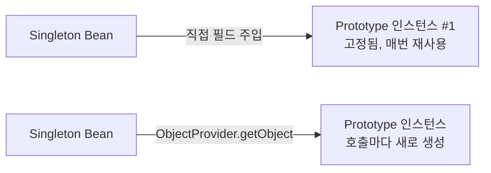

# Bean 스코프

## 핵심 정의

Bean 스코프(scope)는 Spring 컨테이너가 특정 Bean 정의(definition)로부터 인스턴스를 몇 개 만들고 어떤 생명주기 범위로 관리할지를 결정하는 설정이다. 같은 클래스라도 스코프에 따라 컨테이너 전체에서 하나만 존재할 수도 있고, 요청할 때마다 새로 생성될 수도 있다. 기본값은 싱글톤(singleton)이며, 웹 애플리케이션에서는 요청(request)/세션(session) 단위 스코프도 자주 쓰인다.

## 동작 원리 / 구조

Spring이 기본 제공하는 스코프는 다음과 같다.

| 스코프 | 범위 | 사용 가능 컨텍스트 |
|---|---|---|
| singleton | 컨테이너의 Bean 정의당 인스턴스 1개 (기본값) | 모든 컨테이너 |
| prototype | 조회(`getBean`)할 때마다 새 인스턴스 | 모든 컨테이너 |
| request | HTTP 요청 1개당 인스턴스 1개 | 웹 애플리케이션 컨텍스트 |
| session | HTTP 세션 1개당 인스턴스 1개 | 웹 애플리케이션 컨텍스트 |
| application | ServletContext당 인스턴스 1개 | 웹 애플리케이션 컨텍스트 |
| websocket | WebSocket 세션당 인스턴스 1개 | 웹소켓 컨텍스트 |

```java
@Component
@Scope("prototype")
public class ReportGenerator {
    public void generate() { /* 보고서 생성 로직 */ }
}
```

싱글톤 Bean이 프로토타입 Bean을 주입받는 경우가 문제의 핵심이다. 기본 의존성 주입은 해당 싱글톤 인스턴스 생성 시점에 한 번 일어나므로, 싱글톤 안에 주입된 프로토타입 참조는 그 최초 인스턴스에 고정되어 버린다. 이를 해결하는 방법이 스코프 프록시(scoped proxy)와 `ObjectProvider`다.



```java
@Component
public class ReportService {

    private final ObjectProvider<ReportGenerator> generatorProvider;

    public ReportService(ObjectProvider<ReportGenerator> generatorProvider) {
        this.generatorProvider = generatorProvider;
    }

    public void run() {
        ReportGenerator generator = generatorProvider.getObject(); // 호출 시점마다 새 인스턴스
        generator.generate();
    }
}
```

Servlet의 request/session 스코프 Bean을 싱글톤에 주입할 때는 스코프 프록시 또는 `ObjectProvider`로 실제 조회를 지연한다. `@RequestScope`/`@SessionScope`는 기본적으로 클래스 기반 프록시를 사용하며, 인터페이스 기반 프록시도 선택할 수 있다. 프록시는 메서드 호출 시 현재 스코프의 실제 객체를 찾는다. 이 Servlet 요청 스코프 모델이 WebFlux에도 그대로 적용되는 것은 아니다.

prototype을 스코프 프록시로 감싸면 프록시를 통해 위임하는 메서드 호출마다 새 대상이 생성된다. `setInput()` 다음 `generate()`가 같은 인스턴스를 사용할 것이라고 기대하면 상태가 이어지지 않는다. 여러 메서드를 한 작업의 같은 객체에 호출하려면 프록시 없는 prototype을 `ObjectProvider.getObject()`로 한 번 받아 지역 변수로 유지한다.

## 실무 관점

- 일반적인 Controller·Service·Repository는 요청별 가변 상태를 보관하지 않는 무상태(stateless) singleton으로 설계하기 쉽다. 공유 캐시·연결 풀처럼 상태가 필요한 빈도 있으므로 상태의 소유권·동시성·수명을 따로 판단한다. singleton 스코프 자체가 스레드 안전성을 제공하지는 않는다.
- 흔한 실수: 싱글톤 Service 안에 가변 인스턴스 필드를 두고 요청마다 값을 바꿔 쓰는 코드. 멀티스레드 환경에서 동시 요청이 들어오면 상태가 뒤섞이는 경쟁 상태(race condition) 버그로 이어진다. 요청별 상태가 필요하면 지역 변수나 request 스코프, 혹은 동기 Servlet 처리처럼 스레드 경계가 명확한 경우 `ThreadLocal`을 쓴다. 비동기·리액티브 흐름에는 자동 전파되지 않는다.
- 프로토타입 스코프는 소멸 콜백을 컨테이너가 관리하지 않으므로([[Bean 생명주기]] 참고), 무분별하게 쓰면 리소스 정리 누락으로 이어질 수 있다.
- 스코프 프록시에는 대상 조회와 위임 비용이 있다. 클래스 기반 프록시는 CGLIB의 상속 제약 때문에 `final` 클래스와 `final` 메서드를 가로챌 수 없다. 인터페이스 기반 프록시는 구현 클래스가 final이어도 사용할 수 있지만 프록시 인터페이스에 노출된 메서드로 접근한다.
- Servlet 스코프를 포함해 단독 검증한다면 `RequestContextHolder`에 테스트용 요청 속성을 바인딩하고 finally에서 해제하거나, Spring의 웹 테스트 지원을 사용한다. 객체의 비즈니스 로직만 검사하는 단위 테스트라면 객체를 직접 생성할 수 있다.

## 심화 Q&A

### Q. 싱글톤 Service에 프로토타입 Repository를 필드로 직접 주입하면 왜 매번 새 인스턴스가 아니게 되는가?
DI 컨테이너는 싱글톤 Bean을 초기화할 때 딱 한 번 의존성 그래프를 해석하고 주입을 완료한다. 이 시점에 프로토타입 Bean도 "그 순간 한 번" 생성되어 필드에 꽂히고, 이후 싱글톤 인스턴스가 재사용되는 한 그 필드 값도 그대로 재사용된다. 즉 프로토타입 스코프의 "매번 새로 생성"이라는 계약은 컨테이너에 새 인스턴스를 요청하는 시점에 성립하며, 싱글톤 생성 시 단 한 번 일어나는 필드 주입에는 적용되지 않는다. 매번 새 인스턴스가 필요하다면 `ObjectProvider`, `@Lookup` 메서드 주입, 또는 스코프 프록시로 조회 시점을 지연시켜야 한다.

### Q. `@Lookup` 메서드 주입과 `ObjectProvider` 중 어느 쪽을 선택해야 하는가?
`@Lookup`은 컨테이너가 만드는 서브클래스에서 메서드를 오버라이드한다. 추상 메서드뿐 아니라 stub 구현도 사용할 수 있고 클래스·메서드는 final이면 안 된다. 팩토리 메서드인 `@Bean`으로 직접 반환한 인스턴스에는 이 메서드 주입을 적용할 수 없다. `ObjectProvider`는 조회 시점이 코드에 드러나고 `getIfAvailable()` 같은 선택적 조회를 지원하므로, 필요한 인스턴스를 작업 단위로 명확히 획득할 때 사용하기 편하다.

### Q. request 스코프 Bean에 스코프 프록시 없이 직접 주입하면 어떤 예외가 발생하는가?
싱글톤 Controller나 Service가 컨테이너 초기화 시점에 request 스코프 Bean을 즉시 필요로 하면, 그 시점에는 아직 HTTP 요청 컨텍스트가 존재하지 않으므로 `BeanCreationException`(원인은 보통 요청 스코프가 활성화되어 있지 않다는 `IllegalStateException` 또는 유사한 스코프 관련 예외)이 발생한다. 스코프 프록시를 사용하면 이 문제를 프록시로 지연시켜, 실제 요청이 들어온 시점에만 진짜 인스턴스를 조회하도록 만든다.

### Q. 싱글톤 Bean 내부의 상태(state)를 동시성 문제 없이 안전하게 두는 방법에는 어떤 선택지가 있는가?
요청별 값은 메서드 파라미터와 지역 변수로 전달한다. 스레드 문맥이 필요해 `ThreadLocal`을 쓴다면 소유한 요청 경계의 finally에서 해제하고, 같은 스레드의 중첩 작업이 기존 문맥을 일시 교체했다면 원래 값으로 복원한다. 안쪽에서 무조건 remove하면 바깥 요청의 문맥까지 지울 수 있다. 구체적인 복원 예제는 [[ThreadLocal]]에서 다룬다. 공유 카운터의 단일 연산은 AtomicInteger 등으로 보호할 수 있지만 여러 필드를 함께 바꾸는 불변식은 별도 동기화가 필요하다. request 스코프도 같은 요청에 속한 객체를 여러 스레드가 공유하는 상황까지 안전하게 만들지는 않는다.

### Q. 커스텀 스코프(custom scope)는 어떻게 만들고 언제 필요한가?
`Scope` 인터페이스를 구현하고 `ConfigurableBeanFactory.registerScope()`로 등록하면 tenant 단위, 배치 작업 단위처럼 Spring이 기본 제공하지 않는 경계로 Bean 생명주기를 관리할 수 있다. 예를 들어 멀티테넌트(multi-tenant) 애플리케이션에서 테넌트별로 다른 설정을 가진 Bean을 캐싱하고 싶을 때, `ThreadLocal` 기반 커스텀 스코프를 만들어 현재 스레드의 테넌트 컨텍스트에 따라 다른 인스턴스를 반환하도록 구현하는 사례가 있다. 다만 구현 및 유지보수 비용이 크므로, 단순 캐싱이라면 `ConcurrentHashMap` 기반의 자체 캐시 관리로 대체하는 편이 나은 경우도 많다.

## 관련 개념

- [[Bean 생명주기]]
- [[ApplicationContext]]
- [[순환 참조 문제]]

## 참고 자료

부분 재검증: 2026-09-22. Spring Framework 7.0.9의 prototype scoped proxy는 위임 호출마다 새 대상을 얻는다는 계약을 확인하고, 작업 단위 ObjectProvider 조회와 구분했다. JDK 25에서 prototype의 호출 간 상태 단절, 직접 획득한 객체의 상태 유지, final 구현체에 대한 인터페이스 프록시를 실행 확인했다.

검증일: 2026-09-08. 적용 범위: Spring Framework 7.0; request/session/application은 Servlet 웹 컨텍스트 기준.

- [Bean Scopes](https://docs.spring.io/spring-framework/reference/core/beans/factory-scopes.html) — Bean 정의별 singleton, prototype 생명주기, 웹 스코프 및 scoped proxy.
- [Lookup API](https://docs.spring.io/spring-framework/docs/current/javadoc-api/org/springframework/beans/factory/annotation/Lookup.html) — 메서드 주입의 구현과 final/@Bean 제한.

부분 재검증: 2026-10-04. Java SE 25의 ThreadLocal get/set/remove 계약과 같은 날 대표 노트의 중첩 복원 실행 결과를 반영했다. 빈 스코프의 모든 설명을 재검증한 것은 아니다.

- [ThreadLocal Java SE 25](https://docs.oracle.com/en/java/javase/25/docs/api/java.base/java/lang/ThreadLocal.html) — 현재 스레드 값의 교체·삭제 범위.
