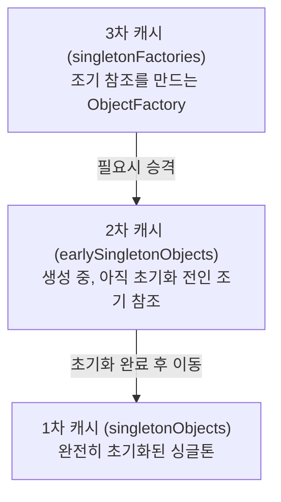

# 순환 참조 문제

## 핵심 정의

순환 참조(circular reference, circular dependency)는 두 개 이상의 Bean이 서로를 직접 또는 간접적으로 의존해 의존성 그래프에 사이클이 생기는 상황이다. 예를 들어 Bean A가 Bean B를 필요로 하고, Bean B도 Bean A를 필요로 하면 "누구를 먼저 완전히 생성해야 하는가"라는 선후 관계가 성립하지 않는다. Spring은 필드/setter 주입에 한해 3단계 캐시(three-level cache)를 이용한 조기 참조 노출로 일부 순환 참조를 해결할 수 있지만, 지연 프록시나 Provider 없이 서로를 즉시 요구하는 생성자 주입(constructor injection) 순환은 해결할 수 없고 컨테이너가 예외를 던지며 기동을 중단시킨다.

## 동작 원리 / 구조

Spring이 setter/필드 주입 기반 순환 참조를 푸는 메커니즘은 3단계 캐시다.



흐름: A를 생성하려고 인스턴스화한 직후(아직 프로퍼티 주입/초기화 전), A의 `ObjectFactory`를 3차 캐시에 등록한다. A의 의존성 주입 과정에서 B가 필요하면 B 생성을 시작하는데, B도 A를 필요로 하므로 캐시를 조회한다. 이때 3차 캐시에 있던 A의 `ObjectFactory`를 통해 조기 참조(아직 초기화가 끝나지 않은 A 인스턴스, 또는 AOP 대상이면 프록시)를 얻어 2차 캐시로 옮기고 B에 주입한다. B는 초기화를 완료해 1차 캐시로 이동하고, 이어서 A도 B를 마저 주입받아 초기화를 완료한다.

```java
// setter/필드 주입 - Spring Framework의 3단계 캐시 메커니즘 자체는 통과시킬 수 있다 (권장하지 않음)
// 단, Spring Boot 2.6+는 기본값(allow-circular-references=false)에서 이마저 차단한다 (아래 참고)
@Component
public class AService {
    @Autowired
    private BService bService;
}

@Component
public class BService {
    @Autowired
    private AService aService;
}
```

```java
// 서로 실제 인스턴스를 즉시 요구하는 생성자 순환: allow-circular-references=true로도 해결 불가
@Component
public class AService {
    private final BService bService;
    public AService(BService bService) { this.bService = bService; }
}

@Component
public class BService {
    private final AService aService;
    public BService(AService aService) { this.aService = aService; }
}
// BeanCurrentlyInCreationException 발생, 컨텍스트 기동 실패
```

생성자 주입은 "생성자 호출이 끝나야 인스턴스가 존재한다"는 성질 때문에 조기 참조를 만들 방법 자체가 없다. A의 생성자를 호출하려면 B가 완성돼 있어야 하고, B의 생성자를 호출하려면 A가 완성돼 있어야 하는 모순이 그대로 드러난다.

Spring Boot는 2.6부터 `spring.main.allow-circular-references` 기본값을 `false`로 바꿔, 필드/setter 주입 순환 참조라도 기본적으로는 실패하도록 정책을 강화했다(Spring Boot 4.1 / Spring Framework 7 기준으로도 기본값은 여전히 `false`다). 즉 "우연히 동작하던" 순환 참조를 명시적으로 걸러내는 방향으로 바뀌었다.

## 실무 관점

- 순환 참조가 발생했다는 것은 대부분 두 클래스의 책임 경계가 잘못 나뉘어 있다는 설계 신호다. 임시방편(`@Lazy`, setter 주입 전환)으로 넘기기 전에 공통 로직을 제3의 서비스로 추출하거나, 이벤트 발행/구독으로 결합을 끊는 근본적 리팩터링을 먼저 검토해야 한다.
- 급하게 우회해야 한다면 한쪽 주입 지점에 `@Lazy`를 붙여 지연 조회 프록시를 받을 수 있다. 다만 생성자나 초기화 콜백 안에서 곧바로 프록시를 호출하면 대상 조회가 다시 발생하므로 순환을 피하지 못할 수 있다. 주입 지점의 지연 조회와 대상 빈 정의의 지연 생성은 별개다. 대상이 일반 eager singleton이면 컨텍스트 초기화 중 별도로 생성될 수 있다.
- `spring.main.allow-circular-references=true`로 되돌려 옛날처럼 필드 주입 순환 참조를 허용하는 설정은 레거시 마이그레이션 과도기에만 임시로 쓰고, 신규 코드에서는 순환 자체를 없애는 방향으로 가야 한다.
- AOP 프록시가 걸린 Bean 사이에 순환 참조가 있으면 3단계 캐시가 조기 참조로 프록시를 미리 만들어 노출해야 하는데, 이 과정에서 프록시 생성 시점과 관련된 미묘한 버그(원본 객체가 섞여 들어가는 경우 등)가 보고된 바 있어 특히 주의가 필요한 조합이다.
- 순환 참조 예외 메시지(`BeanCurrentlyInCreationException`, `UnsatisfiedDependencyException`)는 관련된 Bean 이름과 의존 체인을 함께 출력해주므로, 스택 트레이스에서 어떤 Bean들이 사이클을 이루는지부터 정확히 특정하는 것이 첫 단계다.

## 심화 Q&A

### Q. 생성자 주입 순환 참조는 왜 3단계 캐시로도 해결할 수 없는가?
3단계 캐시가 노출하는 "조기 참조"는 인스턴스화(생성자 호출)는 끝났지만 프로퍼티 주입과 초기화는 아직 안 끝난 객체를 가리킨다. 그런데 생성자 주입은 정의상 의존 대상이 생성자 호출 전에 실제 의존 인스턴스를 확보해야 하므로, "인스턴스화는 끝났지만 아직 미완성"이라는 중간 상태 자체가 존재하지 않는다. 즉 조기 참조를 만들 시점이 없기 때문에 캐시 메커니즘이 개입할 지점이 없다.

### Q. `@Lazy`로 순환 참조를 우회할 때 실제로 주입되는 것은 무엇이며, 어떤 부작용이 있을 수 있는가?
`@Lazy`가 붙은 의존성 필드/파라미터에는 대상 대신 지연 조회 프록시가 주입된다. Framework 7.0.9는 주입 타입이 인터페이스면 이를 구현하는 프록시를 만들 수 있어 실제 구현 클래스가 `final`이어도 가능하다. `final` 구체 클래스 타입의 주입은 서브클래스 프록시를 만들 수 없어 실패한다. 대상 빈 자체도 지연 생성되는 구성이라면 생성 오류가 최초 호출까지 늦어질 수 있지만, 주입 지점에만 `@Lazy`를 붙였다고 대상의 eager 생성을 막는 것은 아니다. 대상이 없더라도 프록시 주입은 성공할 수 있어 선택적 의존성은 `ObjectProvider` 등으로 존재 여부와 사용 시점을 명시한다.

### Q. 순환 참조를 완전히 없애는 리팩터링 전략에는 어떤 것들이 있는가?
대표적으로 (1) 공통 로직을 제3의 서비스로 추출하거나 상위 조정자가 A와 B를 호출하도록 의존 방향을 바꾼다. (2) 결과가 즉시 필요하지 않은 후속 처리는 이벤트로 분리할 수 있지만 Spring 이벤트는 기본적으로 동기 실행이며 비동기는 별도 설정이다. (3) 인터페이스를 분리하더라도 실제 Bean의 A→B→A 의존성이 그대로면 순환은 해결되지 않는다. 인터페이스의 구현과 조립 그래프까지 바꿔야 한다.

### Q. Spring Boot 2.6 이전 버전에서 문제없이 동작하던 순환 참조 코드가 2.6 이후 버전으로 업그레이드하면서 기동 실패로 바뀌는 이유는 무엇인가?
2.6 이전에는 `allowCircularReferences`가 기본적으로 허용되어 있어 필드/setter 주입 순환 참조가 3단계 캐시로 조용히 해결되고 넘어갔다. 2.6부터 Spring Boot 팀이 이 기본값을 `false`로 바꿔, 순환 참조가 존재한다는 사실 자체를 fail-fast로 드러내는 정책을 택했다. 마이그레이션 시에는 임시로 `spring.main.allow-circular-references=true`를 설정해 우선 기동시키고, 이후 순환을 제거하는 리팩터링을 별도 작업으로 진행하는 단계적 접근이 실무적으로 안전하다.

### Q. 순환 참조가 성능이나 테스트 용이성 측면에서 어떤 숨은 비용을 만드는가?
설계 관점에서 순환 참조는 두 컴포넌트를 사실상 하나의 단위처럼 동작하게 만들어, 단위 테스트 시 한쪽만 격리해서 목(mock)으로 대체하기 어렵게 만든다(목 객체를 만들어도 순환 구조 자체는 실제 협력 관계를 정확히 반영하지 못한다). 또한 `@Lazy` 프록시를 남용하면 런타임에 프록시를 거치는 간접 호출이 늘어나 미세한 성능 저하와 스택 트레이스 가독성 저하가 누적된다. 장기적으로는 모듈 경계를 다시 그리는 리팩터링 비용이 순환을 방치한 기간에 비례해 커진다.

## 관련 개념

- [[Bean 생명주기]]
- [[Bean 스코프]]
- [[ApplicationContext]]

## 참고 자료

부분 재검증: 2026-10-04. Framework 7.0.9 실제 컨텍스트 시험 3건으로 주입 지점만 lazy일 때 대상의 eager 생성, 인터페이스를 통한 final 구현체의 지연 조회, final 구체 타입의 프록시 생성 실패를 확인했다. 모든 순환 그래프나 Boot 기동 설정 조합을 다시 시험한 것은 아니다.

- [Lazy 7.0.9 API](https://docs.spring.io/spring-framework/docs/7.0.9/javadoc-api/org/springframework/context/annotation/Lazy.html), [Lazy-initialized Beans](https://docs.spring.io/spring-framework/reference/core/beans/dependencies/factory-lazy-init.html) — 빈 정의와 주입 지점의 지연 처리, 대상 부재의 지연 발견.
- [ContextAnnotationAutowireCandidateResolver 7.0.9](https://raw.githubusercontent.com/spring-projects/spring-framework/v7.0.9/spring-context/src/main/java/org/springframework/context/annotation/ContextAnnotationAutowireCandidateResolver.java) — 주입 타입의 인터페이스 여부에 따른 프록시 구성.

검증일: 2026-09-08. 적용 범위: Spring Framework 7.0; Spring Boot 2.6 이후 기본 제한과 4.1 기본값.

- [Dependency Injection](https://docs.spring.io/spring-framework/reference/core/beans/dependencies/factory-collaborators.html) — 직접 생성자 순환과 조기 노출.
- [Lazy API](https://docs.spring.io/spring-framework/docs/current/javadoc-api/org/springframework/context/annotation/Lazy.html) — 주입 지점의 지연 조회 프록시.
- [Common Application Properties](https://docs.spring.io/spring-boot/appendix/application-properties/index.html) — allow-circular-references=false.
- [DefaultSingletonBeanRegistry 소스](https://raw.githubusercontent.com/spring-projects/spring-framework/v7.0.9/spring-beans/src/main/java/org/springframework/beans/factory/support/DefaultSingletonBeanRegistry.java) — 3단계 singleton 캐시.
- [AbstractAutowireCapableBeanFactory 소스](https://raw.githubusercontent.com/spring-projects/spring-framework/v7.0.9/spring-beans/src/main/java/org/springframework/beans/factory/support/AbstractAutowireCapableBeanFactory.java) — 초기 참조 노출과 초기화 순서.
