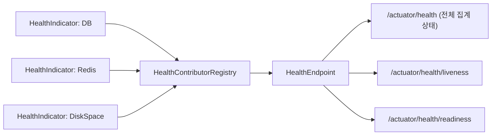

# Actuator와 헬스체크

## 핵심 정의
Spring Boot Actuator는 운영 중인 애플리케이션의 상태를 확인하고 관리하기 위한 프로덕션 준비(production-ready) 기능 모음이다. `/actuator/health`, `/actuator/metrics`, `/actuator/env` 같은 HTTP 엔드포인트를 통해 헬스 상태, 메트릭, 설정값, 스레드 덤프 등을 조회할 수 있다. 그중 헬스체크(`health` 엔드포인트)는 애플리케이션과 그 의존 자원(DB, 메시지 브로커, 디스크 등)의 상태를 `HealthIndicator` 구현체들이 취합해 `UP`/`DOWN`/`OUT_OF_SERVICE`/`UNKNOWN` 상태로 노출하는 기능으로, 로드밸런서·쿠버네티스 등 외부 오케스트레이션 도구가 인스턴스의 생존/트래픽 수신 가능 여부를 판단하는 근거로 쓰인다.

## 동작 원리 / 구조



- 각 `HealthIndicator`는 `health()` 메서드에서 `Health.up()`/`Health.down()` 등으로 상태와 세부 정보(details)를 반환한다.
- StatusAggregator가 상태들을 우선순위로 집계한다. 기본 순서는 DOWN > OUT_OF_SERVICE > UP > UNKNOWN이다. HealthAggregator는 예전 API 명칭이므로 현재 코드에 그대로 사용하지 않는다.
- **헬스 그룹(health groups)**: `management.endpoint.health.group.<name>.include=db,redis` 형태로 특정 인디케이터만 묶어 별도 하위 경로(`/actuator/health/<name>`)로 노출할 수 있다.
- **Liveness/Readiness 프로브**: `LivenessStateHealthIndicator`, `ReadinessStateHealthIndicator`가 `ApplicationAvailability`의 상태를 반영해 각각 `/actuator/health/liveness`, `/actuator/health/readiness`로 노출된다. Spring Boot 2.3에서 도입되었고 쿠버네티스 환경 감지 시 자동 활성화되며, Spring Boot 4부터는 `management.endpoint.health.probes.enabled`가 기본값으로 활성화되어 별도 설정 없이도 두 경로가 노출된다.
- liveness는 기본적으로 외부 의존성(DB 등)을 포함하지 않는다. 애플리케이션 프로세스 자체의 정상 여부만 판단해야 불필요한 재시작을 방지할 수 있다는 설계 의도 때문이다. readiness는 트래픽 수신 가능 여부이므로 필요에 따라 외부 의존성 체크를 그룹에 포함시킨다.

```yaml
management:
  endpoint:
    health:
      show-details: when-authorized
      probes:
        enabled: true
      group:
        readiness:
          include: readinessState, db, redis # 해당 인디케이터가 등록돼 있고 필수 의존성인 경우
        liveness:
          include: livenessState
  endpoints:
    web:
      exposure:
        include: health, info, metrics, prometheus
```

## 실무 관점
- 기본적으로 `show-details`는 `never`이므로 세부 원인(details)이 응답에 담기지 않는다. 운영 트러블슈팅을 위해 `when-authorized`(설정된 health roles에 따라 인가된 사용자에게) 또는 내부망 한정으로 `always`를 설정하는 경우가 많다. 외부에 무분별하게 노출하면 내부 인프라 정보(DB 호스트 등) 유출 위험이 있다.
- 쿠버네티스 `livenessProbe`에 외부 의존성(DB, 캐시)을 포함한 헬스 그룹을 잘못 연결하면, DB가 일시적으로 느려질 때 정상 파드까지 연쇄적으로 재시작되는 장애 패턴이 흔하다. liveness는 반드시 프로세스 자체 상태만 보도록 분리해야 한다.
- `management.endpoints.web.exposure.include`는 기본적으로 `health`만 노출한다. `*`로 전체 개방하는 것은 운영 환경에서 지양하고, 필요한 엔드포인트만 명시적으로 열어야 한다.
- `HealthIndicator`를 커스텀으로 만들 때 외부 호출에 타임아웃을 걸지 않으면, 그 자체가 헬스체크 응답 지연 및 스레드 점유로 이어져 오히려 헬스체크가 장애의 원인이 될 수 있다.
- **관리 포트 분리**: `management.server.port`가 별도면 관리 서버는 정상이지만 서비스 포트·요청 풀이 고장 난 상태를 놓칠 수 있다. `management.endpoint.health.probes.add-additional-paths=true`는 서비스 포트에 `/livez`·`/readyz`를 추가한다. 이 경로의 보안 정책도 프로브와 맞춘다.
- **공유 의존성의 readiness**: 기본 readiness 그룹에는 외부 인디케이터가 자동 포함되지 않는다. 공용 DB를 모든 파드의 readiness에 넣으면 DB 장애 때 모든 파드가 트래픽 대상에서 제외될 수 있다. DB 없이 제공할 수 있는 기능, 호출자 오류 처리와 대체 응답을 고려해 포함 여부를 정한다. readiness 실패가 항상 최선의 장애 대응은 아니다.
- 긴 기동에는 Kubernetes startupProbe를 검토한다. Boot는 초기 Starting에서 liveness=BROKEN, readiness=REFUSING_TRAFFIC이고 컨텍스트 refresh 뒤 Started에서는 liveness=CORRECT이지만 runner 완료 전 readiness는 계속 REFUSING_TRAFFIC이다. 둘이 기동 내내 같은 상태인 것은 아니다.
- `/actuator/metrics`, `/actuator/prometheus`(Micrometer 연동)는 헬스체크와 별개로 지표 수집 파이프라인의 기반이 되므로, 헬스체크는 "떠 있는가"를, 메트릭은 "어떻게 동작하고 있는가"를 답하는 서로 다른 목적임을 구분해야 한다.

### 상태 집계와 HTTP 응답 코드의 경계

Boot 4.1.1의 기본 HTTP 매핑은 `DOWN`·`OUT_OF_SERVICE`가 503이고, 매핑이 없는 `UP`·`UNKNOWN` 등은 200이다. 상태 집계 결과와 HTTP 코드 변환은 별도 단계다. 응답 본문이 `DOWN`인지와 프로브가 실패 HTTP 코드를 받는지를 함께 확인한다.

`management.endpoint.health.status.http-mapping`에 사용자 매핑을 하나라도 설정하면 기본 매핑에 추가되는 것이 아니라 이를 대체한다. 예를 들어 `fatal=503`만 등록하면 `DOWN`·`OUT_OF_SERVICE`는 매핑에서 빠져 200으로 응답할 수 있다. 기존 동작이 필요하면 `down=503`, `out-of-service=503`도 함께 명시한다. 헬스 그룹은 기본적으로 전체 설정을 상속하지만 그룹별 매핑을 따로 지정할 수 있으므로, 실제 프로브가 호출하는 그룹 경로에서 장애 상태·응답 코드를 확인한다.

## 심화 Q&A

### Q. liveness와 readiness를 같은 헬스 그룹으로 통합해서 운영하면 어떤 문제가 생기는가?
A. 외부 의존성 장애가 liveness까지 실패시키면 정상 프로세스를 반복 재시작할 수 있다. 해당 인스턴스만 요청을 처리할 수 없다면 readiness로 트래픽을 제외하되, 모든 인스턴스가 공유하는 의존성이라면 전체 서비스 제외와 대체 응답 중 어느 쪽이 나은지 판단한다. liveness 분리와 외부 의존성의 readiness 포함 여부는 별개 결정이다.

### Q. `HealthIndicator`가 예외를 던지면 어떻게 처리되는가?
A. AbstractHealthIndicator는 doHealthCheck에서 발생한 Exception을 잡아 DOWN으로 만드는 기본 구현을 제공한다. HealthIndicator 인터페이스를 직접 구현한 코드의 모든 예외까지 같은 방식으로 변환된다고 가정하지 않는다. 사용자 검사는 실패를 Health로 변환하고 외부 호출에 명시적 타임아웃을 둔다.

### Q. 헬스체크의 캐싱(`management.endpoint.health.cache.time-to-live`)은 왜 필요한가?
A. 기본 health 캐시 TTL은 0ms다. 엔드포인트 캐시는 입력 없는 read operation에 적용되는 기능이므로 그룹·경로·인증 정보를 포함한 모든 HTTP 호출에 동일한 캐시가 적용된다고 가정하지 않는다. 실제 호출 경로와 측정 결과를 확인한다. 비싼 외부 검사를 별도로 캐싱한다면 상태 변화 감지 지연을 프로브 주기와 함께 평가한다.

### Q. 여러 `HealthIndicator` 중 하나가 `UNKNOWN`을 반환하면 전체 상태에 어떤 영향을 주는가?
A. 기본 `StatusAggregator`의 우선순위(`DOWN > OUT_OF_SERVICE > UP > UNKNOWN`)에 따라 `UNKNOWN`은 `UP`보다 낮은 우선순위를 가지므로, 다른 인디케이터가 모두 `UP`이면 전체 상태는 `UP`으로 집계된다. `UNKNOWN`을 장애 신호로 쓰고 싶다면 커스텀 `StatusAggregator`로 우선순위를 재정의해야 한다.

### Q. Actuator 엔드포인트를 인증 없이 외부에 노출했을 때 발생할 수 있는 구체적인 위험은 무엇인가?
A. `/actuator/env`, `/actuator/heapdump`, `/actuator/threaddump` 같은 엔드포인트가 노출되면 환경 변수(DB 비밀번호 등이 마스킹되지 않은 경우), 힙 덤프를 통한 메모리 내 민감 정보, 스레드 상태를 통한 내부 로직 추론 등이 외부에 유출될 수 있다. 최소한 `health`, `info` 정도만 공개 노출하고 나머지는 Spring Security와 결합해 내부망/인증된 사용자에게만 접근을 허용해야 한다.

### Q. 헬스체크 응답이 `UP`인데도 실제로는 요청을 정상 처리하지 못하는 상황이 왜 발생할 수 있는가?
A. 헬스체크는 등록된 `HealthIndicator`가 검사하는 범위 내에서만 상태를 판단한다. 예를 들어 스레드 풀이 고갈되어 새 요청을 받지 못하는 상황이나, 특정 외부 API(헬스 인디케이터로 등록되지 않은 의존성)가 응답 지연 중인 경우는 기본 헬스체크로는 감지되지 않는다. 헬스체크는 "필요조건"이지 "충분조건"이 아니므로, 실제 트래픽 기반 메트릭(응답 지연, 에러율)과 함께 모니터링해야 한다.

## 관련 개념
- [[내장 WAS]]
- [[자동 구성 원리]]
- [[Kubernetes 프로브와 안전한 종료]]

## 참고 자료

부분 재검증: 2026-09-22. Boot 4.1.1의 관리 포트 분리, add-additional-paths, 기본 프로브 그룹과 공유 외부 의존성의 장애 전파 범위를 공식 Endpoints 문서로 확인했다.

검증일: 2026-09-08. 적용 범위: Spring Boot 4.1.1; 3.x 대비 프로브 기본 활성화 차이.

- [Actuator Endpoints](https://docs.spring.io/spring-boot/reference/actuator/endpoints.html) — 노출·상태 집계·프로브와 수명주기.
- [Actuator 설정 속성](https://docs.spring.io/spring-boot/appendix/application-properties/index.html) — health 기본값과 캐시 TTL.
- [AbstractHealthIndicator API](https://docs.spring.io/spring-boot/api/java/org/springframework/boot/health/contributor/AbstractHealthIndicator.html) — 기본 헬스 검사 클래스.

부분 재검증: 2026-09-23. Boot 4.1.1의 상태→HTTP 코드 기본값, 커스텀 매핑 대체와 그룹 상속 범위만 확인했다. 기존 전체 `verified`는 유지한다.

- [Boot 4.1.1 Endpoints 고정 문서](https://raw.githubusercontent.com/spring-projects/spring-boot/v4.1.1/documentation/spring-boot-docs/src/docs/antora/modules/reference/pages/actuator/endpoints.adoc) — 커스텀 매핑 시 기본 DOWN/OUT_OF_SERVICE 매핑 제거, 그룹 상속·재정의.
- [SimpleHttpCodeStatusMapper 4.1.1](https://raw.githubusercontent.com/spring-projects/spring-boot/v4.1.1/module/spring-boot-health/src/main/java/org/springframework/boot/health/actuate/endpoint/SimpleHttpCodeStatusMapper.java) — 비어 있지 않은 사용자 매핑 선택과 미등록 상태의 200 반환.
