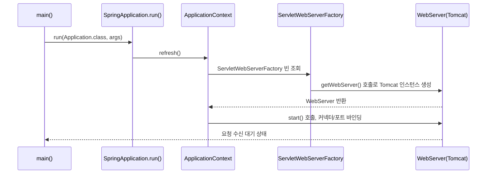

# 내장 WAS

## 핵심 정의
내장 WAS(embedded Web Application Server)는 별도의 외부 WAS(Tomcat, Jetty 등) 설치 없이 애플리케이션 JVM 프로세스 안에서 서버를 함께 기동하는 방식이다. 실행 가능한 JAR뿐 아니라 Boot의 실행 가능한 WAR로도 구성할 수 있다. Spring Boot는 서블릿 스택에서 기본으로 Tomcat을, `spring-boot-starter-webflux`(리액티브 스택)에서는 기본으로 Netty를 내장 컨테이너로 사용하며, Jetty로 교체할 수도 있다. Spring Boot 4.1.x 기준 기본 Tomcat 버전은 11.0.x 계열이다(Servlet 6.1 스펙). 서블릿 스택 스타터는 Spring Boot 4부터 `spring-boot-starter-web`이 `spring-boot-starter-webmvc`로 대체(구 이름은 deprecated)되었으며, 내부적으로 `spring-boot-starter-tomcat`을 포함해 Tomcat을 기본 제공한다는 점은 동일하다.

"WAR로 배포해 외부 WAS에 올리는 방식"과 반대되는 개념으로, 배포 단위와 실행 환경을 애플리케이션 안으로 가져와 실행 환경 일관성과 배포 단순성을 확보하는 것이 핵심 목적이다.

## 동작 원리 / 구조



핵심 구성 요소:
- `ServletWebServerApplicationContext`: 서블릿 기반 웹 애플리케이션 컨텍스트, 일반 `refresh()` 과정에서 `onRefresh()` 시점에 웹 서버를 생성한다.
- `ServletWebServerFactory` (구현체: `TomcatServletWebServerFactory`, `JettyServletWebServerFactory`): classpath에 있는 서버 라이브러리에 따라 자동 구성이 해당 팩토리 빈을 등록한다.
- `WebServer` 인터페이스: `start()`, `stop()`, `getPort()` 등 생명주기 메서드를 추상화해 특정 서버 구현에 종속되지 않게 한다.

패키징 구조(실행 가능 JAR):
```
myapp.jar
├── META-INF/MANIFEST.MF (Main-Class: org.springframework.boot.loader.launch.JarLauncher)
├── BOOT-INF/classes/       # 애플리케이션 클래스
├── BOOT-INF/lib/           # 의존 라이브러리(내장 Tomcat 포함)
└── org/springframework/boot/loader/  # 커스텀 클래스로더
```
`JarLauncher`가 `BOOT-INF/lib`의 라이브러리들과 애플리케이션 클래스를 하나의 클래스로더 계층으로 묶어 로딩한 뒤 실제 `main` 메서드를 실행한다.

## 실무 관점
- 서버 선택 기준: 서블릿 스택에서는 Tomcat이 기본이며 범용적으로 무난하다. 리액티브 스택(WebFlux)에서는 Netty(Reactor Netty)가 기본이다. Jetty는 특정 레거시/임베디드 요구사항이 있을 때 선택되는 경우가 많다. 참고로 Undertow는 Spring Boot 3.x까지는 논블로킹·저스레드 구성의 대안으로 자주 언급되었으나, Spring Boot 4.0부터는 `spring-boot-starter-undertow`가 더 이상 지원되지 않으므로(Tomcat/Jetty/Reactor Netty만 지원) Boot 4 기준 신규 프로젝트에서는 선택지에서 제외해야 한다.
- 플랫폼 스레드 기반 Tomcat에서는 `server.tomcat.threads.max`·`min-spare`로 작업 스레드 풀을 조정한다. `server.tomcat.accept-count`·`max-connections`는 접속 대기·연결 수에 관한 별도 설정이다. 스레드 풀이 너무 작으면 요청 대기(큐잉)로 응답 지연이 발생하고, 너무 크면 컨텍스트 스위칭 비용과 DB 커넥션 풀 등 하위 자원 고갈로 이어질 수 있다. 가상 스레드 자동 구성에서는 아래와 같이 풀 크기 제한의 의미가 달라진다.
- `server.port=0`으로 랜덤 포트를 할당해 통합 테스트에서 포트 충돌을 피하는 패턴이 흔하다.
- Boot 3.4부터 graceful shutdown이 기본 활성화된다. server.shutdown=immediate로 끌 수 있으며 종료 대기는 spring.lifecycle.timeout-per-shutdown-phase로 조정한다. 종료 유예 시간, 로드밸런서 대상 해제, 진행 중 요청의 최대 시간을 맞춰 검증한다. preStop 하나로 무중단이 보장되지는 않는다.
- 서블릿 애플리케이션을 외부 WAS에 배포하려면 WAR 패키징과 `SpringBootServletInitializer`를 구성하고, Maven에서는 `spring-boot-starter-tomcat`을 `provided`로 지정해 컨테이너 의존성 충돌을 피한다. Boot 4.1.1의 실행 가능한 WAR 재패키징은 이 의존성을 `WEB-INF/lib-provided`에 남겨 `java -jar` 실행도 지원하므로, `provided`가 서버 라이브러리를 산출물에서 완전히 제거한다는 뜻은 아니다. WebFlux는 이 WAR 배포 방식을 지원하지 않는다.
- HTTP/2, 압축(`server.compression.enabled`), TLS 설정 등도 내장 서버 설정 프로퍼티(`server.*`)로 관리되며 별도 WAS 설정 파일이 필요 없다는 점이 큰 이점이다.

## 심화 Q&A

### Q. 내장 Tomcat과 외부(standalone) Tomcat에 WAR로 배포하는 방식의 근본적인 차이는 무엇이고, 언제 후자를 선택해야 하는가?
A. 내장 방식은 애플리케이션과 서버 버전이 1:1로 묶여 배포되므로 환경 간 버전 불일치 문제가 사라지고 CI/CD가 단순해진다. 반면 여러 애플리케이션이 하나의 WAS 인스턴스를 공유해야 하거나, 조직의 운영 정책상 WAS를 중앙에서 별도로 패치/관리해야 하는 레거시 인프라에서는 외부 WAS + WAR 배포가 더 적합하다. 최근에는 컨테이너 오케스트레이션 환경 확산으로 내장 방식이 사실상 기본값이 되었다.

### Q. 내장 서버의 스레드 풀 크기를 늘리는 것이 항상 처리량을 높이는가?
A. 아니다. WAS 스레드 풀은 하위 자원(DB 커넥션 풀, 외부 API 커넥션, CPU 코어 수)과 균형을 맞춰야 한다. 스레드 풀만 키우면 DB 커넥션 풀 대기 큐로 병목이 이동할 뿐이고, context switching 비용 증가로 오히려 전체 처리량이 떨어질 수 있다. 스레드 풀, 커넥션 풀, 다운스트림 서비스의 처리 용량을 함께 고려해 사이징해야 한다.

### Q. Graceful shutdown 없이 배포하면 구체적으로 어떤 실패 패턴이 나타나는가?
A. 로드밸런서가 인스턴스를 트래픽 대상에서 제거하기 전에 JVM이 즉시 종료되면, 이미 라우팅된 요청이 커넥션 리셋(connection reset)으로 실패한다. `server.shutdown=graceful`을 켜면 새 요청은 거부하되 진행 중인 요청은 타임아웃 내에 완료시키지만, 로드밸런서의 헬스체크 해제 타이밍과 `preStop` 지연이 맞물리지 않으면 여전히 일부 요청 유실이 발생할 수 있어 인프라 설정과 함께 검증해야 한다.

### Q. 서블릿 스택(Tomcat)에서 리액티브 스택(Netty/WebFlux)으로 전환할 때 스레드 모델 차이가 실무에 미치는 영향은?
A. 일반적인 MVC 동기 처리는 요청 실행 동안 스레드를 점유하지만 유휴 keep-alive 연결마다 작업 스레드가 필요한 것은 아니다. Servlet 비동기 처리나 가상 스레드도 사용할 수 있다. Netty WebFlux는 이벤트 루프로 논블로킹 I/O를 처리하므로 그 위에 JDBC 같은 블로킹 작업을 실행하면 공유 루프가 막힌다. 블로킹 호출을 별도 제한된 스케줄러로 분리하거나 하위 드라이버까지 논블로킹으로 구성한다.

### Q. 같은 JVM에 여러 내장 서버 구현체(Tomcat, Jetty)가 classpath에 동시에 존재하면 어떻게 되는가?
A. 서버 자동 구성은 클래스 존재 여부와 WebServerFactory 빈 조건, 구성 순서에 따라 적용된다. 혼합 클래스패스에서 임의 선택을 기대하지 말고 기본 서버 스타터를 제외한 뒤 원하는 서버만 추가한다. 조건 평가 리포트와 실제 WebServerFactory 빈으로 결과를 확인한다.

### Q. 가상 스레드를 켠 뒤 `server.tomcat.threads.max`로 요청 동시성을 제한할 수 있는가?
A. Boot 4.1.1에서 Java 21 이상으로 `spring.threads.virtual.enabled=true`를 사용하면 Tomcat 자동 구성이 `VirtualThreadExecutor`를 설치한다. 이때 기존 작업 스레드 풀의 `max`를 요청 동시성 상한으로 사용할 수 없다. Java 25.0.2·Tomcat 11.0.24에서 `max=1`이어도 가상 스레드 요청 3개가 동시에 컨트롤러에 진입함을 확인했다. 연결 제한과 DB 풀 크기는 별개로 남으며, 하위 자원 보호가 필요하면 세마포어·벌크헤드(Bulkhead) 등으로 진행 중 작업과 대기량·대기 시간을 제한한다. 가상 스레드가 저렴하다는 사실이 DB 처리 용량을 늘리지는 않는다.

## 관련 개념
- [[자동 구성 원리]]
- [[Actuator와 헬스체크]]
- [[가상 스레드]]

## 참고 자료

검증일: 2026-09-08. 적용 범위: Spring Boot 4.1.1의 Servlet 6.1/Tomcat 11/Jetty 12.1 및 3.4 이후 graceful shutdown 기본값.

- [Boot 시스템 요구사항](https://docs.spring.io/spring-boot/system-requirements.html) — 지원 서블릿 컨테이너.
- [Boot 4.0 릴리스 노트](https://github.com/spring-projects/spring-boot/wiki/Spring-Boot-4.0-Release-Notes) — starter 재구성과 Undertow 지원 제거.
- [Graceful Shutdown](https://docs.spring.io/spring-boot/reference/web/graceful-shutdown.html) — 종료 동작과 제한.
- [Servlet 웹 애플리케이션](https://docs.spring.io/spring-boot/reference/web/servlet.html) — 내장 서버와 자동 구성.

부분 재검증: 2026-09-23. Boot 4.1.1의 가상 스레드 자동 구성 소스와 풀 설정 제약을 확인했다. OpenJDK 25.0.2·Tomcat 11.0.24를 로컬 랜덤 포트로 띄워 HTTP 요청 3개의 동시 진입과 `Thread.isVirtual()` 결과를 확인했다. 처리량 벤치마크나 운영 부하 시험은 아니다.

- [Boot Virtual Threads](https://docs.spring.io/spring-boot/reference/features/spring-application.html#features.spring-application.virtual-threads) — 4.1.1, 활성화 조건·풀 설정 제약.
- [TomcatVirtualThreadsWebServerFactoryCustomizer 4.1.1](https://raw.githubusercontent.com/spring-projects/spring-boot/v4.1.1/module/spring-boot-tomcat/src/main/java/org/springframework/boot/tomcat/autoconfigure/TomcatVirtualThreadsWebServerFactoryCustomizer.java) — protocol handler에 가상 스레드 실행기 설치.

부분 재검증: 2026-10-04. Boot 4.1.1 공식 문서에서 서블릿 WAR 배포 전제, 실행 가능한 WAR의 provided 의존성 보존, WebFlux의 WAR 배포 미지원을 확인했다. 외부 WAS 배포 실행은 검증하지 않았다.

- [Boot 4.1.1 Traditional Deployment](https://raw.githubusercontent.com/spring-projects/spring-boot/v4.1.1/documentation/spring-boot-docs/src/docs/antora/modules/how-to/pages/deployment/traditional-deployment.adoc) — WAR 패키징과 외부 컨테이너·실행 가능한 WAR의 의존성 처리.
