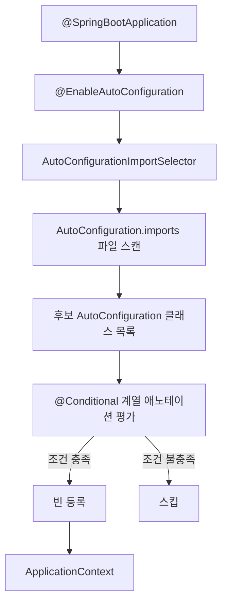

# 자동 구성 원리

## 핵심 정의
자동 구성(Auto-Configuration)은 classpath에 존재하는 라이브러리, 등록된 빈, 프로퍼티 값 등을 근거로 스프링부트가 필요한 빈들을 조건부로 자동 등록해 주는 메커니즘이다. `@SpringBootApplication`에 포함된 `@EnableAutoConfiguration`이 진입점이며, 개발자가 별도 설정 없이도 "관례에 맞으면 동작하는" 애플리케이션을 빠르게 구성할 수 있게 해준다.

Spring Boot 4.x(Spring Framework 7 기반, 최소 Java 17) 기준으로 자동 구성 대상 목록은 더 이상 `spring.factories`가 아니라 `META-INF/spring/org.springframework.boot.autoconfigure.AutoConfiguration.imports` 파일에 클래스 FQCN을 한 줄씩 나열하는 방식으로 로딩된다(`spring.factories` 기반 등록은 Spring Boot 2.7부터 대체되기 시작해 이후 버전에서 완전히 이 방식으로 정리됨).

## 동작 원리 / 구조



핵심 조건 애노테이션:
- `@ConditionalOnClass` / `@ConditionalOnMissingClass`: classpath에 특정 클래스 존재 여부
- `@ConditionalOnBean` / `@ConditionalOnMissingBean`: 이미 등록된 빈 존재 여부 (개발자가 직접 빈을 정의하면 자동 구성이 양보하는 근거)
- `@ConditionalOnProperty`: 파일뿐 아니라 환경 변수·명령행 인자 등을 포함한 Environment 프로퍼티 기준
- `@ConditionalOnWebApplication`: 서블릿/리액티브 웹 환경 여부
- `@AutoConfigureOrder`, `@AutoConfigureAfter`, `@AutoConfigureBefore`: 자동 구성 간 순서 제어

예시 (단순화한 형태):

```java
@AutoConfiguration
@ConditionalOnClass(DataSource.class)
@ConditionalOnMissingBean(DataSource.class)
@EnableConfigurationProperties(DataSourceProperties.class)
public class DataSourceAutoConfiguration {
    @Bean
    public DataSource dataSource(DataSourceProperties properties) {
        return properties.initializeDataSourceBuilder().build();
    }
}
```

이 예제는 DataSource 타입의 사용자 빈이 이미 있으면 등록을 건너뛴다. 모든 자동 구성이 무조건 사용자 빈에 양보하는 것은 아니며 각 조건의 대상 타입·이름·검색 범위를 확인해야 한다.

조건 평가는 `Condition` 인터페이스 구현체(`ConditionEvaluationReport`로 확인 가능)가 `ConditionContext`(빈 팩토리, 환경, 리소스 로더, classloader 정보)를 받아 매칭 여부를 결정한다.

## 실무 관점
- 빈 충돌·미등록 문제는 --debug의 조건 평가 리포트나 별도로 노출·보호한 Actuator /actuator/conditions에서 확인한다. management.endpoint.conditions 자체는 조회 URL이나 완전한 설정 키가 아니다.
- 특정 자동 구성을 배제하려면 `@SpringBootApplication(exclude = {DataSourceAutoConfiguration.class})` 또는 `spring.autoconfigure.exclude` 프로퍼티를 사용한다. 라이브러리를 classpath에 올렸지만 아직 설정이 끝나지 않은 시점(예: 테스트 슬라이스)에 유용하다.
- @ConditionalOnMissingBean은 value/type으로 타입을, name으로 이름을, annotation으로 애노테이션을 지정할 수 있다. @Bean 메서드에서 대상을 생략하면 반환 타입을 기준으로 판단한다.
- spring-boot-autoconfigure-processor는 조건 메타데이터를 생성해 맞지 않는 자동 구성의 조기 제외를 돕는다. 프로퍼티 설명과 IDE 자동완성용 spring-configuration-metadata.json은 spring-boot-configuration-processor의 역할이다.
- 다른 자동 구성이 등록할 빈에 의존하면 @AutoConfiguration(after=...) 등으로 평가 순서를 명시한다. 이 순서는 빈 정의 등록 순서이며 실제 인스턴스 생성 순서는 의존성과 @DependsOn 등이 결정한다.

## 심화 Q&A

### Q. `@ConditionalOnBean`과 `@ConditionalOnMissingBean`을 같은 자동 구성 클래스 안에서 함께 쓸 때 평가 순서 문제가 생길 수 있는 이유는?
A. 빈 조건은 평가 시점까지 처리한 빈 정의만 볼 수 있다. 따라서 공식 문서는 사용자 빈 정의 뒤에 처리되는 자동 구성 클래스에서 OnBean/MissingBean을 사용하도록 권고한다. 다른 자동 구성의 결과가 필요하면 after/before를 지정한다. 이는 다른 자동 구성의 빈에 의존하지 말라는 뜻이 아니다.

### Q. 사용자가 `@Bean`으로 직접 등록한 빈과 자동 구성이 등록하는 빈이 이름은 다르지만 타입이 같다면 어떻게 되는가?
A. 타입을 조건으로 명시했거나 @Bean 반환 타입이 추론된 경우에는 이름이 달라도 해당 타입의 사용자 빈이 있으면 물러난다. name 조건이면 이름 기준이다. 여러 사용자 빈 중 주입 대상을 고르는 @Primary/@Qualifier와 빈 생성 여부를 결정하는 조건을 구분한다.

### Q. 자동 구성과 `@Configuration` 컴포넌트 스캔 대상 설정 클래스의 우선순위는 어떻게 결정되는가?
A. 일반적인 Boot 처리에서 자동 구성은 DeferredImportSelector로 사용자 빈 정의 뒤에 적용되므로 사용자 설정을 조건에 반영할 수 있다. 그러나 사용자 빈이 전부 컴포넌트 스캔으로 등록되는 것은 아니며, 자동 구성도 OnMissingBean 없이 빈을 추가할 수 있다. 수동 등록·Import·부모 컨텍스트를 포함한 실제 조건을 확인한다.

### Q. 테스트 슬라이스(`@WebMvcTest`, `@DataJpaTest` 등)에서 자동 구성이 실제 운영 환경과 다르게 동작하는 이유는?
A. 테스트 슬라이스 애노테이션은 `@ImportAutoConfiguration`으로 필요한 자동 구성만 필터링해서 로드하고 나머지는 배제한다. 예를 들어 `@WebMvcTest`는 웹 계층 관련 자동 구성만 로드하고 `@Service`, `@Repository` 빈은 스캔 대상에서 빠지므로, 전체 컨텍스트 기동과 조건 평가 결과가 달라질 수 있다.

### Q. 다중 스타터를 조합했을 때 순환적인 `@AutoConfigureAfter` 관계가 생기면 어떤 문제가 발생하는가?
A. 순환적인 after/before 관계는 AutoConfigurationSorter의 순환 검사에서 오류가 발생한다. 무작위로 순서를 선택해 정상 기동하는 것으로 가정하지 않는다. 오류에 나온 자동 구성 관계를 수정하거나 충돌 구성을 제외하고 명시적으로 구성한다.

## 관련 개념
- [[내장 WAS]]
- [[Actuator와 헬스체크]]

## 참고 자료

검증일: 2026-09-08. 적용 범위: Spring Boot 4.1.1; AutoConfiguration.imports는 2.7 도입, 3.0부터 자동 구성 등록에 사용.

- [사용자 자동 구성](https://docs.spring.io/spring-boot/reference/features/developing-auto-configuration.html) — 조건·순서·두 메타데이터 프로세서의 역할.
- [Boot 시스템 요구사항](https://docs.spring.io/spring-boot/system-requirements.html) — Java 17과 Framework 7 요구사항.
- [AutoConfigurationSorter 소스](https://raw.githubusercontent.com/spring-projects/spring-boot/4.1.x/core/spring-boot-autoconfigure/src/main/java/org/springframework/boot/autoconfigure/AutoConfigurationSorter.java) — 순환 순서 의존성 검출.
