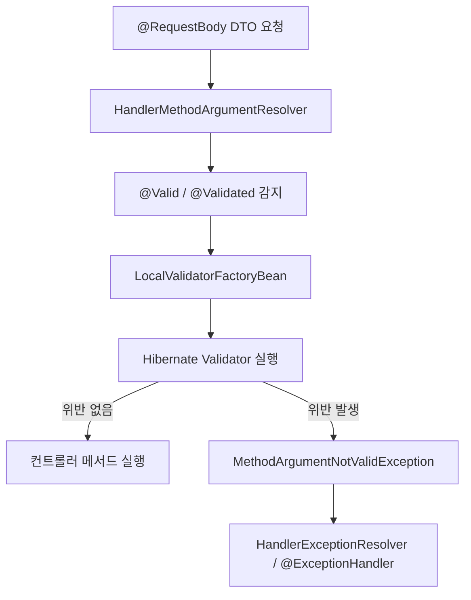

# Bean Validation

## 핵심 정의
Bean Validation(Jakarta Validation)은 객체 속성·메서드 인자·반환값 등에 선언한 제약을 검증하는 명세다. Spring MVC의 객체 인자 검증과 메서드 수준 검증은 적용 조건과 예외가 다르다. @Valid 자체는 제약이 아니라 중첩 객체 검증 표시이므로 단순 RequestParam에 붙이는 것만으로 값 제한이 생기지 않는다.

Spring Boot에서는 `spring-boot-starter-validation` 의존성을 추가해야 Hibernate Validator가 클래스패스에 포함되며, 이 스타터는 기본 스타터에 포함되어 있지 않으므로 명시적으로 추가해야 한다.

## 동작 원리 / 구조



주요 제약 어노테이션 예시:

```java
public record CreateUserRequest(
    @NotBlank
    @Size(min = 2, max = 20)
    String username,

    @Email
    @NotBlank
    String email,

    @Min(0)
    @Max(150)
    Integer age,

    @Pattern(regexp = "^[A-Z0-9]{8,}$")
    String apiKey
) {}
```

```java
@RestController
@RequiredArgsConstructor
public class UserController {

    @PostMapping("/users")
    public ResponseEntity<Void> create(@Valid @RequestBody CreateUserRequest request) {
        // 검증 실패 시 이 코드는 실행되지 않고
        // MethodArgumentNotValidException이 발생한다.
        return ResponseEntity.ok().build();
    }
}
```

동작 흐름:

1. `RequestMappingHandlerAdapter`가 파라미터를 바인딩하는 과정에서 `@Valid`(표준) 또는 `@Validated`(Spring 전용, 그룹 지정 가능)를 발견하면 검증을 트리거한다.
2. 실제 검증은 `LocalValidatorFactoryBean`이 감싸고 있는 `jakarta.validation.Validator` 구현체(Hibernate Validator)가 수행한다.
3. Spring MVC 6.1~7.0의 개별 객체 검증은 RequestBody와 ModelAttribute 모두 MethodArgumentNotValidException으로 처리된다. 이 예외는 BindException의 하위 타입이다. 직접 파라미터 제약으로 메서드 검증이 필요하면 HandlerMethodValidationException 경로가 우선한다.
4. 해당 객체 인자 바로 뒤에 Errors/BindingResult를 두면 그 객체의 오류를 직접 처리할 수 있다. 다른 인자의 메서드 검증 실패까지 모두 흡수하는 것은 아니다.
5. 예외가 던져진 경우 `@ExceptionHandler(MethodArgumentNotValidException.class)`나 `@ControllerAdvice`에서 이를 잡아 일관된 에러 응답 포맷으로 변환하는 것이 일반적인 패턴이다.

메서드 파라미터/반환값 검증(Method Validation)은 대상이 컨트롤러인지 일반 빈(예: `@Service`)인지에 따라 내부 메커니즘이 다르다. `@Service` 등 일반 빈에 클래스 레벨 `@Validated`를 붙이고 메서드 파라미터에 제약을 걸면, `MethodValidationPostProcessor`가 만드는 AOP 프록시를 통해 `MethodValidationInterceptor`가 개입해 `ConstraintViolationException`을 던진다. 반면 Spring Framework 6.1(Spring Boot 3.2)부터 Spring MVC/WebFlux 컨트롤러는 AOP 프록시 없이 자체적으로 메서드 검증을 지원한다. `@RequestParam`, `@PathVariable` 등에 제약 어노테이션을 직접 붙이면 별도의 클래스 레벨 `@Validated` 없이도 검증이 동작하며, 위반 시 `ConstraintViolationException`이 아니라 `HandlerMethodValidationException`이 발생한다. 컨트롤러에 옛 방식대로 클래스 레벨 `@Validated`를 남겨두면 AOP 프록시 경로가 우선 적용되어 `ConstraintViolationException`이 발생하므로, 신규 코드에서는 컨트롤러에 `@Validated`를 붙이지 않는 것이 권장된다.

일반 빈의 AOP 검증은 기본적으로 ConstraintViolationException을 던지지만, MethodValidationPostProcessor의 adaptConstraintViolations=true를 설정하면 MethodValidationException으로 결과를 변환할 수 있다. 예제의 age와 apiKey는 null을 허용하며 필수 입력이라면 NotNull/NotBlank를 추가한다.

## 실무 관점
- **입력과 반환값의 책임 구분**: MVC의 `HandlerMethodValidationException`은 입력 검증 실패면 400, 컨트롤러 반환값 검증 실패면 500을 사용한다. 서버가 만든 잘못된 결과를 일괄 400으로 바꾸면 결함을 클라이언트 잘못으로 숨긴다. 커스텀 처리기에서도 `isForReturnValue()`·기존 상태 코드로 구분한다.
- **`@Valid`와 `@Validated`의 실무 차이**: `@Valid`는 표준(Jakarta)이라 중첩 객체 검증(`@Valid` 필드 안의 또 다른 `@Valid` 객체)에 주로 쓰이고, `@Validated`는 Spring 전용이라 검증 그룹(Validation Group)을 지정하거나 클래스 레벨에 붙여 메서드 파라미터 검증(AOP 기반)을 활성화할 때 쓴다. 생성/수정 시나리오에서 필드별로 요구되는 제약이 다르면 그룹 인터페이스를 정의해 `@Validated(OnCreate.class)` 식으로 분기하는 패턴이 흔하다.
- **DTO 분리 vs 그룹 검증**: 그룹 검증은 코드 가독성이 떨어지고 그룹 조합이 늘어나면 관리가 어려워지므로, 실무에서는 생성/수정 요청 DTO 자체를 분리하는 방식을 더 선호하는 경향이 있다. 그룹 검증은 필드가 많고 DTO 분리 비용이 큰 경우의 절충안으로 쓴다.
- **그룹 추가 후 필수 입력 검증 누락**: 그룹을 생략한 제약은 `Default` 그룹에 속한다. `@Validated(OnCreate.class)`로 바꾸면 `Default` 제약까지 자동으로 실행되는 것이 아니다. 두 그룹을 명시하거나 `OnCreate extends Default`로 포함하고, 기존 필수 필드가 여전히 거부되는지 회귀 테스트한다. `@Valid` 중첩 검증에도 요청한 그룹이 전파되므로 자식 DTO의 그룹도 맞추거나 `@ConvertGroup`으로 변환한다. `@GroupSequence`는 앞 그룹의 위반이 있으면 뒤 그룹을 실행하지 않는다. 이를 모든 오류를 한 번에 수집하는 옵션으로 해석하지 않는다.
- **중첩 컬렉션 검증**: 필드 @Valid List<ChildDto> 또는 List<@Valid ChildDto>로 요소 객체를 cascade 검증한다. 컬렉션의 NotEmpty, 요소의 NotNull, 요소 내부 제약은 서로 다른 조건이다.
- **서비스 계층 검증 누락**: 컨트롤러 진입점에서만 검증하고 내부 서비스 메서드나 배치/메시지 컨슈머 진입점에서는 검증을 생략하는 경우가 많아, API가 아닌 경로로 들어오는 데이터에 대해 검증 공백이 생긴다. 서비스 계층에도 `@Validated` + 메서드 검증을 적용해 방어선을 이중화하는 것이 안전하다.
- **에러 응답 포맷 표준화**: `MethodArgumentNotValidException`을 그대로 노출하면 스택트레이스나 내부 필드명이 그대로 클라이언트에 전달될 수 있다. `@RestControllerAdvice`에서 `BindingResult.getFieldErrors()`를 순회해 필드명-메시지 맵으로 재구성한 표준 에러 응답을 만드는 것이 일반적이다.
- **국제화(i18n)**: 메시지는 기본적으로 `ValidationMessages.properties`에서 로드되며, Spring의 `MessageSource`와 연동하면 로케일별 메시지 커스터마이징이 가능하다.
- **DB 검증의 한계**: ConstraintValidator의 DB 호출은 지연을 늘리고 사전 중복 조회 뒤 동시 INSERT의 경쟁을 막지 못한다. 유일성은 DB UNIQUE 제약으로 최종 보장하고 충돌을 변환한다. Validator는 여러 호출에서 재사용될 수 있으므로 요청별 상태를 인스턴스 필드에 보관하지 않는다.

## 심화 Q&A

### Q. `@Valid`와 `@Validated`를 함께 검증 그룹 없이 사용했을 때 실질적인 동작 차이가 있는가?
A. 컨트롤러 파라미터 레벨에서 그룹을 지정하지 않고 단순히 위반 여부만 검사하는 경우 두 어노테이션의 동작은 사실상 동일하다. 차이가 드러나는 지점은 두 가지다. 첫째, `@Validated`는 `value()` 속성으로 검증 그룹을 지정할 수 있지만 `@Valid`는 표준 스펙상 그룹 파라미터가 없다. 둘째, 클래스 레벨에 붙여 메서드 파라미터/반환값에 대한 AOP 기반 검증(`MethodValidationInterceptor`)을 활성화하는 것은 `@Validated`만 가능하며 `@Valid`로는 되지 않는다.

### Q. 커스텀 `ConstraintValidator`를 만들 때 Spring 빈을 주입받을 수 있는가?
A. 가능하다. Spring이 등록하는 `LocalValidatorFactoryBean`은 `ConstraintValidator` 인스턴스를 생성할 때 Spring의 `AutowireCapableBeanFactory`를 통해 생성하도록 구성되어 있으므로, `ConstraintValidator` 구현체에 `@Autowired`로 리포지토리나 서비스를 주입해 DB 조회 기반 검증(예: 이메일 중복 체크)을 구현할 수 있다. 다만 이 방식은 매 요청마다 DB 접근이 발생할 수 있어 트래픽이 큰 엔드포인트에서는 신중히 사용해야 한다.

### Q. `BindingResult`를 파라미터로 선언한 경우와 선언하지 않은 경우, 검증 실패 시 흐름이 어떻게 달라지는가?
A. 검증할 객체 인자 바로 뒤에 BindingResult/Errors를 두면 그 객체 오류를 컨트롤러에서 처리할 수 있다. 메서드 검증에서 다른 인자에도 오류가 있으면 HandlerMethodValidationException이 발생한다. 위치가 잘못되면 원래 검증 예외가 먼저 발생하거나 Errors 인자 해석에 실패할 수 있어 무조건 하나의 예외 타입이라고 단정하지 않는다.

### Q. 중첩 객체 검증(`@Valid` cascading)에서 순환 참조가 있는 그래프를 검증하면 어떻게 되는가?
A. 명세는 현재 검증 경로에서 이미 방문한 인스턴스의 cascade를 중단해 무한 재귀를 막도록 정의한다. 같은 객체가 다른 경로로 도달하면 그 경로에서는 검증될 수 있다. 이는 단순 전역 방문 집합과 다르다. API DTO를 엔티티와 분리하면 불필요한 그래프 탐색과 직렬화 결합도 줄일 수 있다.

### Q. 클래스 레벨 검증(Class-Level Constraint)은 언제 필요하며 필드 레벨 검증과 무엇이 다른가?
A. 비밀번호와 비밀번호 확인 필드가 일치하는지처럼 두 개 이상의 필드를 함께 봐야 판단 가능한 제약은 필드 하나만으로 표현할 수 없다. 이런 경우 클래스 전체를 대상으로 하는 커스텀 `ConstraintValidator<MyConstraint, MyDto>`를 만들어 클래스 레벨 어노테이션으로 적용한다. 필드 레벨 검증은 각 필드가 독립적으로 위반 여부를 판정하지만, 클래스 레벨 검증은 여러 필드 값을 함께 참조해 하나의 위반 결과를 만든다는 점이 다르다.

### Q. `@NotNull`, `@NotEmpty`, `@NotBlank`를 잘못 선택하면 어떤 실무 문제가 생기는가?
A. `@NotNull`은 null만 막고 빈 문자열(`""`)이나 공백 문자열(`"   "`)을 통과시킨다. `@NotEmpty`는 null과 빈 문자열/빈 컬렉션을 막지만 공백만 있는 문자열은 통과시킨다. `@NotBlank`는 CharSequence가 null이 아니고 Character.isWhitespace 기준의 공백이 아닌 문자를 포함해야 한다. trim()과 모든 유니코드 문자의 판정이 같다고 가정하지 않는다. 사용자 입력 문자열 필드에 `@NotNull`만 적용하면 공백 문자열이 그대로 저장되어 이후 비즈니스 로직(예: 이름 표시)에서 빈 값이 노출되는 데이터 품질 문제로 이어지는 경우가 흔하다.

### Q. 컨트롤러 메서드의 `@RequestParam`에 `@Min` 같은 제약을 걸었을 때, 위반 시 발생하는 예외가 서비스 계층의 `@Validated` 메서드 검증과 다른 이유는 무엇인가?
A. 서비스 계층의 메서드 검증은 `MethodValidationPostProcessor`가 만드는 AOP 프록시를 거쳐 `MethodValidationInterceptor`가 리플렉션으로 파라미터를 검사하고 `ConstraintViolationException`을 던지는 구조다. 반면 Spring Framework 6.1부터 Spring MVC/WebFlux는 컨트롤러 메서드 파라미터(`@RequestParam`, `@PathVariable`, `@RequestHeader` 등)에 붙은 제약을 AOP 프록시 없이 프레임워크 내부에서 직접 검증하도록 바뀌었고, 이때 발생하는 예외는 `HandlerMethodValidationException`이다. 이 예외는 파라미터별 위반 결과(`ParameterValidationResult`)를 구조화해 담고 있어 `@RequestBody`/`@ModelAttribute` 검증 실패의 `MethodArgumentNotValidException`과 유사하게 다룰 수 있다. 만약 컨트롤러 클래스에 옛 관습대로 클래스 레벨 `@Validated`를 붙이면 AOP 프록시 경로가 다시 활성화되어 `ConstraintViolationException`이 발생하므로, 예외 처리기를 두 가지 예외 타입 모두에 대해 준비해두지 않으면 한쪽 경로에서 처리가 누락될 수 있다.

## 관련 개념
- [[DispatcherServlet 요청 처리 흐름]]
- [[Filter와 Interceptor]]

## 참고 자료

부분 재검증: 2026-10-04. Jakarta Validation 3.1의 그룹 상속·연쇄 검증·그룹 순서를 확인했다. Hibernate Validator 9.1.3.Final에서 명시 그룹의 Default 제외/상속, 중첩 객체에 그룹 전파, 순서 지정 시 후속 그룹 중단을 3개 JUnit 테스트로 재현했다. 다른 MVC·AOP 설명의 전체 검증일은 유지한다.

- [Jakarta Validation 3.1 — 그룹](https://jakarta.ee/specifications/bean-validation/3.1/jakarta-validation-spec-3.1#constraintdeclarationvalidationprocess-groupsequence) — §5.4 그룹·상속·순서 및 그룹 변환.

부분 재검증: 2026-09-22. Spring Framework 7.0.9의 입력·반환값 검증 실패 상태 코드를 확인했다. MockMvc와 Hibernate Validator 9.1.3.Final로 입력 제약 위반 400·반환값 제약 위반 500을 실행 검사했다.

- [HandlerMethodValidationException API](https://docs.spring.io/spring-framework/docs/7.0.9/javadoc-api/org/springframework/web/method/annotation/HandlerMethodValidationException.html) — 입력 400, 반환값 500.

검증일: 2026-09-08. 적용 범위: Jakarta Validation 3.1, Spring Framework 6.1~7.0의 MVC 검증.

- [MVC Validation](https://docs.spring.io/spring-framework/reference/web/webmvc/mvc-controller/ann-validation.html) — 인자 검증과 메서드 검증·BindingResult.
- [Spring Bean Validation](https://docs.spring.io/spring-framework/reference/core/validation/beanvalidation.html) — DI와 AOP 메서드 검증.
- [Jakarta Validation 3.1 명세](https://jakarta.ee/specifications/bean-validation/3.1/jakarta-validation-spec-3.1) — 제약·null·객체 그래프·그룹.
