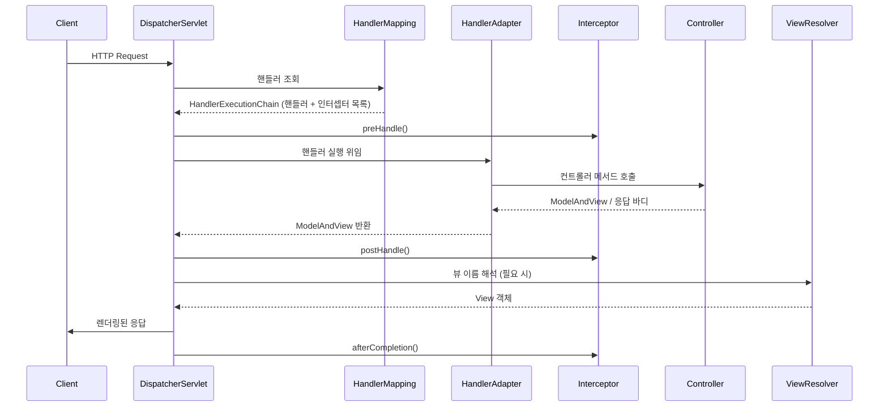

# DispatcherServlet 요청 처리 흐름

## 핵심 정의
`DispatcherServlet`은 Spring MVC의 프론트 컨트롤러(Front Controller)로, 자신에게 매핑되어 도달한 HTTP 요청을 받아 적절한 컨트롤러(Controller)로 위임하고 그 결과를 뷰(View)나 응답 본문으로 변환해 반환하는 역할을 한다. 서블릿 컨테이너(Servlet Container) 관점에서는 하나의 `HttpServlet` 구현체일 뿐이지만, 내부적으로 `HandlerMapping`, `HandlerAdapter`, `ViewResolver`, `HandlerExceptionResolver` 등 여러 전략 인터페이스(Strategy Interface)를 조합해 요청 처리 파이프라인을 구성한다.

Spring Boot 환경에서는 `DispatcherServletAutoConfiguration`이 자동으로 `DispatcherServlet`을 등록하고 `/` 경로에 매핑하므로, 개발자가 직접 `web.xml`이나 서블릿 등록 코드를 작성할 필요가 없다.

## 동작 원리 / 구조

요청이 들어오면 다음 순서로 처리된다.

세부 단계:

1. **핸들러 조회**: `HandlerMapping`이 요청 URL, HTTP 메서드 등을 기준으로 처리할 핸들러를 찾는다. `@RequestMapping` 기반이면 `RequestMappingHandlerMapping`이 담당하며, 결과로 핸들러와 적용할 `HandlerInterceptor` 목록을 담은 `HandlerExecutionChain`을 반환한다.
2. **어댑터 선택**: `HandlerAdapter`는 핸들러 타입(어노테이션 기반 컨트롤러, `HttpRequestHandler`, 레거시 `Controller` 인터페이스 등)에 맞춰 실제 실행 방식을 캡슐화한다. `@Controller` 기반이면 `RequestMappingHandlerAdapter`가 사용된다.
3. **인터셉터 preHandle**: 컨트롤러 실행 전에 등록된 `HandlerInterceptor`들의 `preHandle()`이 순서대로 호출된다. `false`를 반환하면 체인이 중단된다.
4. **컨트롤러 실행 및 데이터 바인딩**: `HandlerAdapter`가 `HandlerMethodArgumentResolver`를 이용해 `@RequestParam`, `@RequestBody`, `@PathVariable` 등 파라미터를 바인딩하고, Bean Validation을 트리거한 뒤 컨트롤러 메서드를 호출한다. 반환값은 `HandlerMethodReturnValueHandler`가 처리한다.
5. **postHandle**: 컨트롤러 메서드뿐 아니라 인자 처리·반환값 처리까지 `HandlerAdapter` 호출이 정상 완료되고 비동기 처리가 시작되지 않은 경우 호출된다. 컨트롤러가 객체를 정상 반환해도 JSON 직렬화 중 예외가 나면 생략된다. `@ResponseBody`/`ResponseEntity`는 이 시점에 메시지 컨버터가 본문을 작성한 뒤이고 `ModelAndView`도 보통 `null`이므로, 응답 변환에는 `ResponseBodyAdvice`를 사용한다. 실제 네트워크 전송·커밋 여부는 버퍼와 응답 래퍼에도 영향을 받는다. 비동기 최초 디스패치에서는 생략하며 정상 완료 재디스패치의 처리 결과에 따라 호출된다.
6. **예외 처리**: 처리 중 예외가 발생하면 `HandlerExceptionResolver` 체인(`ExceptionHandlerExceptionResolver`, `ResponseStatusExceptionResolver`, `DefaultHandlerExceptionResolver` 등)이 순서대로 예외 해석을 시도한다. `@ExceptionHandler`, `@ControllerAdvice`는 이 메커니즘 위에서 동작한다.
7. **뷰 해석 및 렌더링**: 컨트롤러가 뷰 이름을 반환하면 `ViewResolver`가 실제 `View` 객체로 변환하고 렌더링한다. `@ResponseBody`/`@RestController`의 경우 `HttpMessageConverter`가 객체를 직렬화해 응답 본문에 직접 기록하므로 이 단계는 생략된다.
8. **afterCompletion**: 해당 인터셉터의 preHandle이 성공해 true를 반환한 경우에만 역순 호출된다. 예외 리졸버가 처리한 예외는 ex 인자에 포함되지 않는다. 비동기 최초 dispatch에서는 생략된다.

## 실무 관점
- **요청 바인딩과 수정 권한 구분**: Spring MVC 7.0.9의 `@ModelAttribute` 프로퍼티 바인딩에는 `@InitBinder`의 `setAllowedFields("name")`처럼 허용할 필드를 지정할 수 있다. 이 설정이 `@RequestBody` JSON 역직렬화나 생성자 바인딩까지 제한하지는 않는다. 요청 전용 DTO에 수정 가능한 항목만 두고, 관리자 여부·소유자·테넌트는 서버에서 결정한다. Bean Validation의 값 검증도 사용자의 수정 권한 검사를 대신하지 않는다.
- **컨트롤러 vs REST 컨트롤러 흐름 차이**: `@Controller` + 뷰 이름 반환은 `ViewResolver`까지 전체 파이프라인을 타지만, `@RestController`(`@ResponseBody`)는 `HttpMessageConverter`가 이를 대체하므로 `postHandle` 단계의 실질적 의미가 줄어든다. REST API 위주 서비스에서 `ModelAndView` 기반 로직을 섞으면 혼란을 유발하기 쉽다.
- **HandlerMapping 우선순위**: 여러 `HandlerMapping`이 동시에 등록될 수 있으며(`RequestMappingHandlerMapping`, `SimpleUrlHandlerMapping`, `BeanNameUrlHandlerMapping` 등) `Ordered` 순서에 따라 매칭을 시도한다. 정적 리소스 매핑과 API 매핑이 충돌하면 이 순서 문제로 디버깅이 어려워질 수 있다.
- **예외 처리 우선순위 실수**: `@ControllerAdvice`에 여러 `@ExceptionHandler`가 있을 때 더 구체적인 예외 타입이 우선한다고 가정하고 순서를 잘못 설계하면, 의도한 것과 다른 핸들러가 예외를 가로채는 장애가 흔히 발생한다.
- **인터셉터 vs 필터 선택**: 인증/인가처럼 서블릿 레벨에서 끊어야 하는 로직은 [[Filter와 Interceptor]]에서 다루는 `Filter`로, 컨트롤러 실행 컨텍스트(핸들러 정보, `@PathVariable` 등)가 필요한 로직은 `Interceptor`로 구현하는 것이 일반적이다.
- **비동기 처리**: `Callable`/`DeferredResult`를 반환하는 비동기 컨트롤러는 `preHandle`/`postHandle`이 아닌 `AsyncHandlerInterceptor`의 콜백을 별도로 고려해야 하며, 일반 인터셉터를 그대로 쓰면 `afterCompletion` 타이밍이 기대와 다르게 동작할 수 있다.
- **404 처리**: Framework 6.1부터 DispatcherServlet은 핸들러가 없으면 기본적으로 NoHandlerFoundException을 던진다. 정적 리소스 핸들러에 매칭된 뒤 파일이 없으면 NoResourceFoundException 경로다. 구버전의 throw-exception-if-no-handler-found 설정을 관성적으로 추가하거나 404를 위해 정적 리소스 매핑을 무조건 끄지 않는다.

## 심화 Q&A

### Q. `HandlerInterceptor.preHandle()`이 여러 개 등록된 상태에서 두 번째 인터셉터가 `false`를 반환하면 어떤 일이 벌어지는가?
A. 체인이 즉시 중단되고 컨트롤러는 호출되지 않는다. 이미 `preHandle()`이 `true`를 반환한 인터셉터들에 대해서만 `afterCompletion()`이 역순으로 호출되며, `false`를 반환한 인터셉터 자신과 그 뒤 인터셉터의 `afterCompletion()`은 호출되지 않는다. 따라서 리소스 해제 로직을 `afterCompletion()`에만 의존하면 안 되고, `preHandle()`에서 자원을 선점했다면 실패 시 직접 해제해야 한다.

### Q. `@RestController`에서 예외가 발생했을 때 `HandlerExceptionResolver` 체인은 어떤 순서로 시도되는가?
A. 기본 등록 순서는 `ExceptionHandlerExceptionResolver` → `ResponseStatusExceptionResolver` → `DefaultHandlerExceptionResolver`이다. `@ExceptionHandler`/`@ControllerAdvice`가 가장 먼저 시도되고, 처리하지 못하면 `@ResponseStatus`가 붙은 예외를 처리하며, 마지막으로 Spring 내부 표준 예외(`TypeMismatchException` 등)를 HTTP 상태 코드로 변환한다. 어느 리졸버도 처리하지 못하면 예외가 서블릿 컨테이너까지 전파된다.

### Q. 동일 URL에 대해 두 개의 `HandlerMapping`이 서로 다른 핸들러를 매칭할 수 있는 상황이라면 어떻게 동작하는가?
A. `DispatcherServlet`은 등록된 `HandlerMapping`들을 `Ordered` 값 순서대로 순회하며, 가장 먼저 null이 아닌 핸들러를 반환하는 `HandlerMapping`의 결과를 채택하고 나머지는 시도하지 않는다. 즉 나중 순서의 매핑은 완전히 무시되므로, 정적 리소스 매핑과 API 매핑이 겹치는 경로 설계는 피해야 한다.

### Q. `postHandle()`이 아예 호출되지 않는 경우와, 지연되었다가 호출되는 경우, 호출은 되지만 사실상 무의미한 경우는 어떻게 다른가?
A. preHandle의 false 반환·예외, 인자 바인딩·검증·컨트롤러·반환값 처리의 예외, 비동기 최초 dispatch 등에서 postHandle이 생략된다. 일반 비동기 완료 재디스패치에서는 다시 preHandle부터 실행하지만 네트워크 오류·타임아웃으로 재디스패치되지 않으면 완료 콜백도 없을 수 있다. REST에서도 정상 동기 처리의 postHandle은 호출되지만 본문은 이미 작성된 뒤라 응답 변환에는 ResponseBodyAdvice가 적합하다. 예외가 리졸버에서 해결되면 afterCompletion의 ex는 null일 수 있다.

### Q. `DispatcherServlet`이 여러 개 등록된 멀티 서블릿 구성은 언제 필요하며 무엇을 주의해야 하는가?
A. 서로 다른 `WebApplicationContext`(예: `/api/*`와 `/admin/*`을 분리)를 두어 빈 스코프나 설정을 완전히 격리하고 싶을 때 사용한다. 이 경우 각 `DispatcherServlet`마다 독립된 `HandlerMapping`, 인터셉터, 예외 처리 설정이 필요하며, 공통 로직(로깅, 보안 헤더 등)은 서블릿 레벨 `Filter`로 빼는 것이 중복을 줄이는 방법이다. Spring Boot는 기본적으로 단일 `DispatcherServlet`을 가정하므로 멀티 구성은 수동 설정 비용이 크다.

### Q. 비동기 컨트롤러(`DeferredResult`)를 사용할 때 인터셉터의 `afterCompletion()` 호출 시점은 동기 컨트롤러와 어떻게 다른가?
A. 동기 요청은 처리·렌더링이 끝난 뒤 완료 콜백이 실행된다. 비동기 최초 dispatch는 afterConcurrentHandlingStarted로 종료하며 요청 스레드의 ThreadLocal 등을 이때 정리한다. 정상 완료의 재디스패치에서 afterCompletion을 받지만 재디스패치 없는 종료에 대비해 WebAsyncManager의 Callable/DeferredResult 인터셉터나 Servlet AsyncListener도 고려한다. 실제 클라이언트 수신 완료를 보장하는 콜백은 아니다.

## 관련 개념
- [[Filter와 Interceptor]]
- [[Bean Validation]]

## 참고 자료

부분 재검증: 2026-10-04. Framework 7.0.9의 `doDispatch`, 요청 프로퍼티 바인딩과 JSON 변환 경계를 확인했다. MockMvc 3건으로 폼의 비허용 필드 제외, 같은 필드의 JSON 역직렬화, 컨트롤러 정상 반환 후 직렬화 실패 시 `postHandle` 생략·`afterCompletion` 실행을 재현했다. 실제 네트워크 커밋 시점은 이 모의 서블릿 시험의 검증 범위가 아니다.

- [DispatcherServlet 7.0.9 소스](https://raw.githubusercontent.com/spring-projects/spring-framework/v7.0.9/spring-webmvc/src/main/java/org/springframework/web/servlet/DispatcherServlet.java) — `HandlerAdapter` 완료·비동기 시작 여부와 후속 콜백.
- [DataBinder 7.0.9 API](https://docs.spring.io/spring-framework/docs/7.0.9/javadoc-api/org/springframework/validation/DataBinder.html) — `setAllowedFields`의 프로퍼티 바인딩 적용 범위.
- [MVC InitBinder](https://docs.spring.io/spring-framework/reference/web/webmvc/mvc-controller/ann-initbinder.html), [RequestResponseBodyMethodProcessor 7.0.9 API](https://docs.spring.io/spring-framework/docs/7.0.9/javadoc-api/org/springframework/web/servlet/mvc/method/annotation/RequestResponseBodyMethodProcessor.html) — 요청 전용 모델·허용 필드와 메시지 컨버터의 별도 처리.

검증일: 2026-09-08. 적용 범위: Spring Framework 6.1~7.0의 Servlet MVC 동기·비동기 처리.

- [HandlerInterceptor API](https://docs.spring.io/spring-framework/docs/current/javadoc-api/org/springframework/web/servlet/HandlerInterceptor.html) — preHandle·postHandle·afterCompletion 조건.
- [AsyncHandlerInterceptor API](https://docs.spring.io/spring-framework/docs/current/javadoc-api/org/springframework/web/servlet/AsyncHandlerInterceptor.html) — 재디스패치·타임아웃 예외.
- [DispatcherServlet API](https://docs.spring.io/spring-framework/docs/current/javadoc-api/org/springframework/web/servlet/DispatcherServlet.html) — 전략과 no-handler 예외.
- [MVC Validation](https://docs.spring.io/spring-framework/reference/web/webmvc/mvc-controller/ann-validation.html) — 인자 검증 경로.
