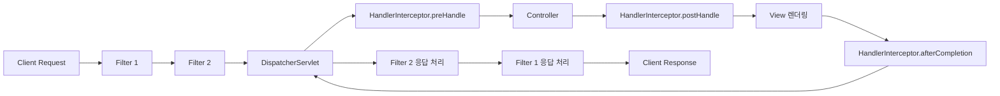

# Filter와 Interceptor

## 핵심 정의
`Filter`는 서블릿 스펙(Servlet Specification)이 정의하는 컴포넌트로, 서블릿 컨테이너(Servlet Container) 레벨에서 `DispatcherServlet`에 요청이 도달하기 전과 응답이 클라이언트로 나가기 전에 공통 로직을 끼워 넣는다. `HandlerInterceptor`는 Spring MVC가 제공하는 프레임워크 레벨 컴포넌트로, `DispatcherServlet`이 핸들러를 실행하는 과정 안에서 컨트롤러 호출 전후에 개입한다.

두 개념 모두 관심사 분리(Cross-Cutting Concern) 처리에 쓰이지만, 동작 위치와 접근 가능한 컨텍스트가 다르다는 점이 실무에서 선택 기준이 된다.

## 동작 원리 / 구조



| 구분 | Filter | HandlerInterceptor |
|---|---|---|
| 소속 | Servlet API (`jakarta.servlet.Filter`) | Spring MVC (`org.springframework.web.servlet.HandlerInterceptor`) |
| 등록 위치 | 서블릿 컨테이너 (web.xml, `FilterRegistrationBean`) | `WebMvcConfigurer.addInterceptors()` |
| 실행 시점 | `DispatcherServlet` 진입 전/후 | 핸들러 조회 이후, 컨트롤러 호출 전/후 |
| 접근 가능 정보 | `ServletRequest`/`ServletResponse` (원시 수준) | `HandlerMethod`, `@PathVariable`, Spring 빈 등 |
| Spring 컨텍스트 | 등록 방식에 따라 Spring 빈 DI 또는 Servlet 생명주기 적용 | 등록한 인스턴스가 Spring 빈이면 DI·생명주기 관리 가능 |
| 예외 처리 관여 | `HandlerExceptionResolver`의 영향을 받지 않음 | 리졸버가 해결하지 않은 예외만 afterCompletion의 ex에 전달 |
| 비동기 지원 | `asyncSupported`·dispatcher type 설정, 완료 관측에 `AsyncListener` 활용 | `AsyncHandlerInterceptor` 별도 인터페이스 |

핵심 인터페이스 메서드:

```java
// Filter
public interface Filter {
    void doFilter(ServletRequest request, ServletResponse response, FilterChain chain)
            throws IOException, ServletException;
}

// HandlerInterceptor
public interface HandlerInterceptor {
    default boolean preHandle(HttpServletRequest request, HttpServletResponse response, Object handler) { return true; }
    default void postHandle(HttpServletRequest request, HttpServletResponse response, Object handler, ModelAndView modelAndView) {}
    default void afterCompletion(HttpServletRequest request, HttpServletResponse response, Object handler, Exception ex) {}
}
```

Filter 체인은 `FilterChain.doFilter()`를 명시적으로 호출해야 다음 단계로 진행되며, 호출하지 않으면 요청이 그 자리에서 종료된다. Interceptor는 `preHandle()`이 `true`를 반환해야 다음 단계로 진행되는 boolean 기반 제어라는 차이가 있다.

## 실무 관점
- **역할 분담**: 인증·인가의 경계는 Spring Security의 필터 체인과 Method Security에 둔다. MVC 인터셉터는 핸들러 메타데이터를 이용하는 로깅·공통 처리에 사용한다. 컨트롤러 매핑과 인터셉터 매칭이 다를 수 있어 보안 경계로 단독 사용하지 않는다.
- **Spring Security와의 관계**: Spring Security는 `FilterChainProxy`를 통해 서블릿 `Filter` 체인 안에 여러 보안 필터를 끼워 넣는 방식으로 동작한다. `DispatcherServlet`보다 앞단에서 인증/인가를 처리하기 때문에, MVC `Interceptor`로 인증 로직을 이중 구현하면 순서 문제와 책임 중복이 생기기 쉽다.
- **요청 본문 로깅**: ContentCachingRequestWrapper는 하위 코드가 읽은 바이트를 캐시하며 getInputStream을 처음부터 다시 읽게 만들지는 않는다. chain.doFilter 뒤 getContentAsByteArray로 소비된 내용만 조회한다. 필터가 먼저 본문을 소비해야 한다면 크기를 제한한 별도 재생 가능한 래퍼가 필요하다. 인증정보·파일 본문을 그대로 로그에 남기지 않는다.
- **응답 본문 캐시의 전송 책임**: `ContentCachingResponseWrapper`에 쓴 본문은 원래 응답으로 자동 전달되지 않는다. 동기 요청의 정상 처리 경로에서 캐시를 확인한 뒤 `copyBodyToResponse()`로 전달해야 한다. 래퍼의 `flushBuffer()`만 호출해도 전송되지 않는다. 대용량 다운로드·SSE(Server-Sent Events)를 통째로 캐시하면 메모리와 전송 지연 문제가 생기므로 대상에서 제외하고, 비동기는 최종 완료 시점과 오류 처리 경로를 별도로 설계한다.
- **순서 문제**: 여러 `Filter`는 `@Order`나 `FilterRegistrationBean.setOrder()`로 순서를 명시하지 않으면 등록 순서에 의존하게 되어, 인코딩 필터가 인증 필터보다 늦게 실행되는 등의 미묘한 버그가 발생할 수 있다. `Interceptor`는 `registry.addInterceptor().order()`로 순서를 지정한다.
- **예외 처리 연계**: `Interceptor`의 `afterCompletion()`은 `HandlerExceptionResolver`가 예외를 처리한 뒤에 호출되므로 이미 처리된 예외의 세부 정보(원본 스택트레이스 등)에 접근하려는 목적으로는 한계가 있다. `Filter`는 `HandlerExceptionResolver`보다 바깥에 있어 예외가 서블릿까지 전파된 경우(처리되지 않은 예외)를 잡는 최후 방어선 역할(예: `Filter` 안에서 try-catch로 전역 에러 응답 포맷 통일)로도 쓰인다.
- **성능/리소스 튜닝**: 특정 경로만 필터를 적용하려면 `FilterRegistrationBean.addUrlPatterns()`를, 인터셉터는 `addPathPatterns()`/`excludePathPatterns()`를 사용해 정적 리소스나 헬스체크 엔드포인트를 제외시키는 것이 일반적이다.

## 심화 Q&A

### Q. 인증 로직을 Filter와 Interceptor 중 어디에 둘지 판단하는 기준은 무엇인가?
A. 인증·인가는 Spring Security 필터와 메서드 보안을 사용한다. Interceptor가 HandlerMethod를 볼 수 있다는 이유만으로 접근 제어를 옮기면 경로 매칭 차이나 MVC 밖 경로에서 누락될 수 있다. 정적 리소스·에러 요청도 구성에 따라 MVC를 통과하므로 리소스 종류만으로 실행 위치를 가정하지 않는다.

### Q. `doFilter()` 호출 이후에 작성한 응답 후처리 코드(로깅, 소요 시간 측정 등)가 실행되지 않는 경우가 있는가? 어떻게 방지하는가?
A. `doFilter(request, response)` 호출 자체가 하위 필터나 컨트롤러에서 던진 예외를 그대로 전파하므로, `doFilter()` 다음 줄에 단순히 나열한 후처리 코드는 하위 단계에서 예외가 발생하면 실행되지 않고 건너뛴다. 예를 들어 요청 소요 시간을 측정해 로깅하는 필터를 `try { chain.doFilter(request, response); } LOG 코드` 순서로만 작성하면, 컨트롤러에서 예외가 발생해 위로 전파되는 요청에 대해서는 소요 시간이 기록되지 않는 결측치가 생긴다. 이를 방지하려면 후처리 코드를 `finally` 블록에 두어 정상 응답이든 예외 전파든 항상 실행되도록 해야 한다. 다만 `finally`에서도 응답이 이미 부분적으로 커밋된 상태라면 응답 바디나 상태 코드를 변경하는 시도는 무시되거나 `IllegalStateException`을 유발할 수 있으므로, 후처리는 헤더 추가보다 로깅처럼 응답 자체를 건드리지 않는 작업에 한정하는 것이 안전하다.

### Q. `@RestController` 응답 본문을 `postHandle()`에서 바꾸면 왜 늦는가?
A. `@ResponseBody`·`ResponseEntity`는 `HandlerAdapter` 안에서 메시지 컨버터로 응답을 쓴 뒤 `postHandle()`을 호출한다. 따라서 이 콜백은 정상 호출의 관측에는 쓸 수 있어도 응답 본문·헤더 변경 시점으로 적합하지 않다. 컨버터가 쓰기 전 반환값을 가공하려면 `ResponseBodyAdvice`를 사용한다. `afterCompletion()`으로 옮긴다고 이미 작성한 응답을 다시 수정할 수 있는 것은 아니다. Filter에서 변경하려면 사전에 설치한 래퍼의 버퍼링·전송 책임까지 다뤄야 한다.

### Q. 비동기 컨트롤러(`Callable`, `DeferredResult`)를 사용할 때 Filter는 어떻게 대응해야 하는가?
A. 비동기를 사용하려면 관련 서블릿·필터가 asyncSupported여야 하고, ASYNC dispatch에서 재실행할 필터는 그 dispatcher type에 매핑되어야 한다. 실제 기본값은 등록 방식에 따라 확인한다. OncePerRequestFilter는 shouldNotFilterAsyncDispatch 정책도 적용한다. 최초 doFilter의 finally는 전체 비동기 완료가 아니므로 최종 완료 관측에는 AsyncListener 등 별도 콜백이 필요하다.

### Q. 여러 Interceptor가 등록된 상태에서 두 번째 Interceptor의 `preHandle()`이 예외를 던지면 첫 번째 Interceptor의 `afterCompletion()`은 호출되는가?
A. 첫 인터셉터의 preHandle이 true로 완료됐다면 afterCompletion이 호출된다. 두 번째 인터셉터 자신의 완료 콜백은 호출되지 않는다. 예외가 HandlerExceptionResolver에서 해결되면 첫 번째의 ex는 null일 수 있으므로 원본 예외를 항상 받을 것으로 가정하지 않는다.

### Q. CORS 처리를 Filter로 할 때와 Spring MVC의 `addCorsMappings()`로 할 때 차이는 무엇인가?
A. `CorsFilter`는 MVC 핸들러를 찾기 전에 CORS를 처리할 수 있다. 다만 필터·보안 체인의 매칭 경로, dispatcher type, `CorsConfigurationSource`에 매칭되는 정책 범위 안에서 적용된다. `OncePerRequestFilter`의 ASYNC·ERROR 건너뛰기 정책도 있으므로 모든 오류 디스패치에 자동 적용된다고 가정하지 않는다. MVC의 `addCorsMappings()`는 `HandlerMapping`에서 처리한다. Spring Security를 함께 쓸 때는 인증보다 프리플라이트(Preflight) 처리가 앞서도록 CORS를 통합하며, 정상 응답뿐 아니라 인증 실패·오류 응답의 헤더도 확인한다.

## 관련 개념
- [[DispatcherServlet 요청 처리 흐름]]
- [[Bean Validation]]

## 참고 자료

부분 재검증: 2026-10-04. Framework 7.0.9 CorsFilter의 정책 적용과 OncePerRequestFilter의 디스패치 계약으로 “오류 경로에도 항상 적용”, “비동기 사용에는 AsyncListener가 필수”라는 과장을 교정했다. 실제 컨테이너의 오류 디스패치를 실행 검증한 것은 아니다.

- [CorsFilter 7.0.9 API](https://docs.spring.io/spring-framework/docs/7.0.9/javadoc-api/org/springframework/web/filter/CorsFilter.html) / [OncePerRequestFilter 7.0.9 API](https://docs.spring.io/spring-framework/docs/7.0.9/javadoc-api/org/springframework/web/filter/OncePerRequestFilter.html) — CORS 정책과 필터 매핑·ASYNC/ERROR 실행 조건.

검증일: 2026-09-08. 적용 범위: Jakarta Servlet 기반 Spring MVC 7.0; 비동기와 요청 캐시 계약.

- [HandlerInterceptor API](https://docs.spring.io/spring-framework/docs/current/javadoc-api/org/springframework/web/servlet/HandlerInterceptor.html) — 인가 계층 권고와 완료 예외.
- [ContentCachingRequestWrapper API](https://docs.spring.io/spring-framework/docs/current/javadoc-api/org/springframework/web/util/ContentCachingRequestWrapper.html) — 읽힌 바이트 캐시와 제한.
- [AsyncHandlerInterceptor API](https://docs.spring.io/spring-framework/docs/current/javadoc-api/org/springframework/web/servlet/AsyncHandlerInterceptor.html) — 비동기 완료 처리.
- [OncePerRequestFilter API](https://docs.spring.io/spring-framework/docs/current/javadoc-api/org/springframework/web/filter/OncePerRequestFilter.html) — async/error dispatch 정책.

부분 재검증: 2026-09-23. Framework 7.0.9의 응답 캐시·인터셉터 호출 계약을 확인했다. MockMvc에서 응답 래퍼의 복사 누락 시 빈 본문, `copyBodyToResponse()` 호출 시 원래 본문이 전달되는 두 경로를 실행했다. 비동기·스트리밍 래퍼의 별도 구현을 검증한 것은 아니다.

- [ContentCachingResponseWrapper 7.0.9 API](https://docs.spring.io/spring-framework/docs/7.0.9/javadoc-api/org/springframework/web/util/ContentCachingResponseWrapper.html) — `flushBuffer`와 본문 복사 계약.
- [MVC Interception](https://docs.spring.io/spring-framework/reference/web/webmvc/mvc-servlet/handlermapping-interceptor.html) — 7.0.9, `postHandle` 이전 응답 작성과 `ResponseBodyAdvice` 대안.
