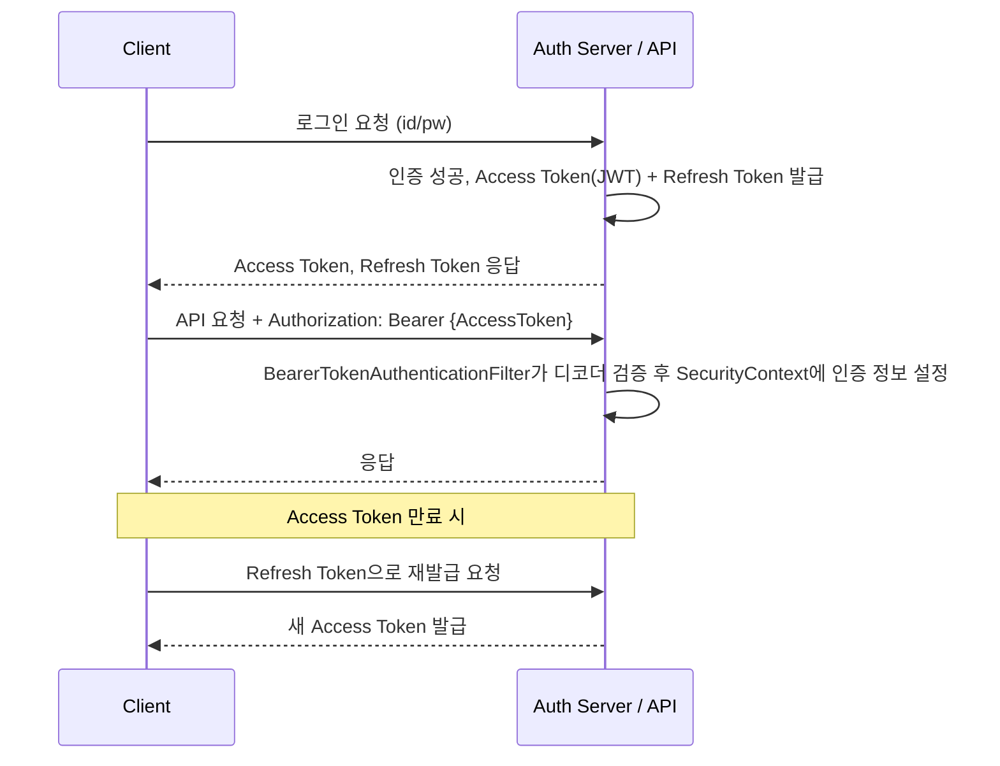

# JWT 인증

## 핵심 정의
JWT(JSON Web Token)는 JSON 클레임을 전달하는 토큰 형식이다. API에서 흔히 쓰는 서명된 JWS 토큰은 무결성을 검증하지만 암호화된 JWE 형태도 존재한다. 인증에는 서명뿐 아니라 신뢰할 발급자(iss), 대상 API(aud), 만료·사용 시작 시간(exp/nbf), 토큰 용도와 권한을 확인해야 한다. JWT 형식 자체가 세션을 금지하거나 자동 인증을 제공하지는 않는다.

이 노트는 서명된 JWS compact 형식인 header.payload.signature의 JWT를 다룬다. Base64URL 인코딩은 암호화가 아니므로 header와 payload의 민감 정보는 읽힐 수 있다.

## 동작 원리 / 구조



Spring Security Resource Server의 기본 BearerTokenAuthenticationFilter → AuthenticationManager → JwtAuthenticationProvider → JwtDecoder 경로를 사용할 수 있다. 아래는 Bearer 헤더만으로 인증하는 API 예제다. 지원되는 Boot의 Resource Server 스타터와 issuer/audience 설정이 필요하다.

```java
@Bean
SecurityFilterChain apiSecurity(HttpSecurity http) throws Exception {
    return http
        .csrf(AbstractHttpConfigurer::disable) // 쿠키·HTTP Basic 인증을 받지 않는 API
        .sessionManagement(s -> s.sessionCreationPolicy(SessionCreationPolicy.STATELESS))
        .authorizeHttpRequests(a -> a.anyRequest().authenticated())
        .oauth2ResourceServer(o -> o.jwt(Customizer.withDefaults()))
        .build();
}
```

```yaml
spring:
  security:
    oauth2:
      resourceserver:
        jwt:
          issuer-uri: https://idp.example.com/issuer
          audiences: https://api.example.com
```

issuer-uri를 사용하면 발급자 검증을 포함한 디코더를 구성하며, audiences로 이 API의 수신 대상을 제한한다. 허용 알고리즘·신뢰할 키·필수 클레임·시간 허용 오차는 발급 계약에 맞춘다. 잘못된 Bearer 토큰은 인증 실패로 처리하고, 커스텀 필터를 쓰더라도 예외와 SecurityContext 정리를 빠뜨리지 않는다.

**시간 검증과 필수값 검증은 다르다.** Security 7.1.1의 기본 `JwtTimestampValidator`는 존재하는 `exp`·`nbf`의 시간을 검사하지만 두 클레임이 빠진 토큰도 허용한다. 유효기간이 필수인 Access Token 계약이라면 누락도 거부하는 검증기를 추가하고, 기존 발급자·시간·수신 대상 검증을 대체해 없애지 않는다. ID Token을 Access Token으로 받아들이지 않도록 토큰 용도도 확인한다.

`NimbusJwtDecoder.setJwtValidator(...)`는 검증기를 추가하는 API가 아니라 기존 클레임 검증기를 **교체**한다. 예를 들어 aud만 검사하는 검증기로 바꾸면 기본 시간 검사나 기존 issuer 검사가 사라질 수 있다. 서명 검증은 별도 단계로 유지되므로 “정상 서명 토큰이 통과한다”는 시험만으로 이 누락을 찾을 수 없다. 다음은 신뢰할 키로 이미 구성된 `NimbusJwtDecoder decoder`에 일반 JWT 계약을 연결하는 예다(Security 7.1.1).

```java
var requireExpiry = new JwtTimestampValidator();
requireExpiry.setAllowEmptyExpiryClaim(false); // 이 API의 Access Token 계약
var audienceValidator = new JwtClaimValidator<List<String>>("aud",
    values -> values != null && values.contains(expectedAudience));
decoder.setJwtValidator(new DelegatingOAuth2TokenValidator<>(
    JwtValidators.createDefaultWithIssuer(expectedIssuer),
    audienceValidator,
    requireExpiry));
```

`expectedIssuer`·`expectedAudience`는 서버의 신뢰 설정에서 얻는다. 예제는 exp를 필수로 하고 nbf 누락은 허용한다. 토큰 프로파일에 따라 typ·추가 필수 클레임 검증도 유지하며, 만료·잘못된 발급자·수신 대상 누락/불일치·필수 exp 누락을 각각 테스트한다.

서명 알고리즘은 대칭키 방식(HS256 등, 서버가 하나의 비밀키로 서명·검증 모두 수행)과 비대칭키 방식(RS256/ES256 등, 개인키로 서명하고 공개키로 검증)으로 나뉜다. 마이크로서비스 환경에서는 인증 서버만 개인키를 갖고 리소스 서버들은 공개키로 검증하는 비대칭키 방식이 키 노출 위험을 줄여 더 널리 쓰인다.

## 실무 관점
- **세션 대비 트레이드오프**: 서버가 상태를 갖지 않아 수평 확장(scale-out)이 쉽고 로드밸런서 뒤에서 세션 동기화가 필요 없다는 장점이 있는 반면, 발급된 토큰을 서버 쪽에서 즉시 무효화(revoke)하기 어렵다는 것이 가장 큰 단점이다.
- **만료 시간 설계**: Access Token의 수명은 탈취 피해·재인증 비용·폐기 지연 요구로 결정한다. 특정 분/일 범위가 JWT 명세의 표준 기본값은 아니다. Refresh Token의 보관·만료·회전 정책은 별도로 설계한다.
- **로그아웃/강제 만료 문제**: JWT 자체는 서버 저장소 없이 검증되므로, 로그아웃해도 만료 전까지는 토큰이 유효하다. 이를 보완하려면 블랙리스트(주로 Redis에 토큰 또는 jti를 저장)를 두거나, Refresh Token만 서버에 저장해 회전(rotation)시키고 Access Token은 아주 짧게 유지하는 전략을 쓴다.
- **저장 위치**: 브라우저에서 JWT를 localStorage에 저장하면 XSS(Cross-Site Scripting)에 노출되기 쉽고, 쿠키에 저장하면 CSRF 대응이 필요하다. `HttpOnly` + `Secure` + `SameSite` 쿠키에 저장하고 CSRF 토큰을 병행하는 방식이 비교적 안전하다고 알려져 있다.
- **흔한 실수**: 페이로드에 민감 정보(비밀번호, 개인정보)를 그대로 넣는 것, 서명 검증 없이 페이로드만 디코딩해서 신뢰하는 것, 서버마다 다른 비밀키를 사용해 검증이 실패하는 것(비밀키/공개키 배포 관리 누락), 만료 검증을 클라이언트에만 맡기는 것 등이 실무에서 반복적으로 나타나는 장애 패턴이다.
- **키 관리**: 대칭키 방식에서 비밀키가 소스코드나 설정 파일에 하드코딩되어 저장소에 커밋되는 사고가 잦다. 비밀키/개인키는 별도 시크릿 관리 도구(Vault, AWS Secrets Manager 등)나 환경변수로 분리해야 한다.

## 심화 Q&A

### Q. JWT를 발급한 서버가 특정 토큰만 즉시 무효화하고 싶을 때 어떤 방법이 가능한가?
A. 매 요청에 jti 등의 폐기 목록을 조회하면 특정 토큰을 차단할 수 있다. 여러 인스턴스에서 폐기 상태를 일관되게 적용하고 토큰 만료까지 기록을 유지한다. Refresh Token 삭제는 새 Access Token 발급을 막지만 이미 발급된 Access Token은 만료나 별도 폐기 검사 전까지 유효하다. 짧은 만료만으로 즉시 무효화를 보장하지 않는다.

### Q. Refresh Token Rotation은 왜 필요한가?
A. 회전은 갱신 시 이전 토큰을 소비하고 후속 토큰을 발급한다. 발급 서버가 토큰 계보·소비 상태를 유지해 재사용을 탐지하고 연관 갱신 권한을 폐기해야 효과가 있다. 소비와 교체를 원자적으로 처리하며 정상 동시 갱신·재시도와 공격 재사용을 구분할 정책을 정한다. 회전 자체가 기존 Access Token까지 즉시 폐기하지는 않는다.

### Q. HS256과 RS256 중 마이크로서비스 아키텍처에서는 왜 RS256(또는 ES256)이 선호되는가?
A. HS256은 서명과 검증에 동일한 비밀키를 쓰므로, 토큰을 검증해야 하는 모든 서비스가 그 비밀키를 알아야 한다. 서비스가 늘어날수록 비밀키 배포 범위가 넓어져 유출 위험이 커진다. RS256은 인증 서버만 개인키를 보유하고 나머지 서비스는 공개키만으로 검증하므로, 개인키 노출 지점을 인증 서버 하나로 좁힐 수 있다.

### Q. 세션 기반 인증과 비교했을 때 JWT가 오히려 불리한 상황은 언제인가?
A. 강제 로그아웃, 권한 변경 즉시 반영, 특정 사용자 세션 강제 종료 같은 요구사항이 강한 서비스(예: 관리자가 계정을 즉시 차단해야 하는 금융/보안 서비스)에서는 세션 기반(서버 측 저장소 조회) 방식이 오히려 구현이 단순하고 안전하다. JWT는 이런 요구를 만족시키려면 결국 서버 측 상태(블랙리스트 등)를 다시 두어야 해서 stateless의 이점이 희석된다.

### Q. 클라이언트가 보낸 JWT의 서명 검증을 생략하고 페이로드만 파싱해서 사용하면 어떤 문제가 생기는가?
A. 페이로드는 Base64URL로 인코딩만 되어 있을 뿐 암호화되지 않았으므로 누구나 조작할 수 있다. 서명 검증 없이 파싱만 하면 공격자가 `role: ADMIN` 같은 클레임을 임의로 조작한 토큰을 만들어 권한 상승 공격을 시도할 수 있다. 반드시 서명 검증(발급자·만료·알고리즘 확인 포함) 이후에만 클레임을 신뢰해야 한다.

### Q. `alg: none` 취약점은 무엇이고 어떻게 방어하는가?
A. 일부 JWT 라이브러리 구현체가 header의 `alg` 값을 클라이언트가 지정한 대로 신뢰해, `none`으로 설정된 토큰을 서명 검증 없이 통과시킨 취약점이 있었다. 방어책은 서버 쪽 검증 로직에서 허용할 알고리즘을 화이트리스트로 명시적으로 고정하고, 라이브러리가 최신 버전인지 확인하는 것이다.

## 관련 개념
- [[Security Filter Chain]]
- [[OAuth2와 소셜 로그인]]
- [[TTL과 캐시 무효화 전략]]

## 참고 자료

부분 재검증: 2026-09-22. Security 7.1.1의 기본 시간 검증기 소스와 실행으로 exp/nbf 누락 허용 및 만료 거부를 확인했다. 서명 없는 테스트 Jwt 객체를 검증기에 직접 전달한 단위 검증이며, 전체 HTTP 인증 경로를 검증한 것은 아니다.

- [JwtTimestampValidator 7.1.1 소스](https://raw.githubusercontent.com/spring-projects/spring-security/7.1.1/oauth2/oauth2-jose/src/main/java/org/springframework/security/oauth2/jwt/JwtTimestampValidator.java) — allowEmptyExpiryClaim/allowEmptyNotBeforeClaim 기본값과 시간 비교.

검증일: 2026-09-08. 적용 범위: JWT RFC 7519/8725 및 Spring Security 7.1.1 Resource Server.

- [JWT 명세](https://www.rfc-editor.org/rfc/rfc7519.html) — JWS/JWE와 클레임.
- [JWT 보안 권고](https://www.rfc-editor.org/rfc/rfc8725.html) — 알고리즘·발급자·수신 대상 검증.
- [Spring Resource Server JWT](https://docs.spring.io/spring-security/reference/servlet/oauth2/resource-server/jwt.html) — 필터 경로와 issuer/audience 설정.
- [OAuth 보안 권고](https://www.rfc-editor.org/rfc/rfc9700.html) — refresh rotation과 재사용 탐지.

부분 재검증: 2026-10-04. Security 7.1.1·JDK 25.0.4에서 임시 RSA 키로 서명한 토큰을 NimbusJwtDecoder에 전달해 JUnit 3건을 실행했다. aud 전용 검증기로 교체한 뒤 만료·다른 발급자 토큰이 통과하는 경계, 기본 검증과 exp 필수 검증을 합친 정상/거부 경로, 다른 키의 서명 거부를 확인했다. HTTP 인증 체인·원격 JWK 갱신·발급 서버는 이 시험의 범위가 아니다.

- [NimbusJwtDecoder 7.1.1 소스](https://github.com/spring-projects/spring-security/blob/7.1.1/oauth2/oauth2-jose/src/main/java/org/springframework/security/oauth2/jwt/NimbusJwtDecoder.java) — 검증기 교체와 서명·클레임 처리 단계.
- [JwtValidators 7.1.1 소스](https://github.com/spring-projects/spring-security/blob/7.1.1/oauth2/oauth2-jose/src/main/java/org/springframework/security/oauth2/jwt/JwtValidators.java) — 기본 검증과 발급자 검증 조합.
- [Resource Server JWT 사용자 검증기](https://docs.spring.io/spring-security/reference/servlet/oauth2/resource-server/jwt.html#_configuring_a_custom_validator) — 기존 검증기와 추가 검증기의 명시적 결합.
