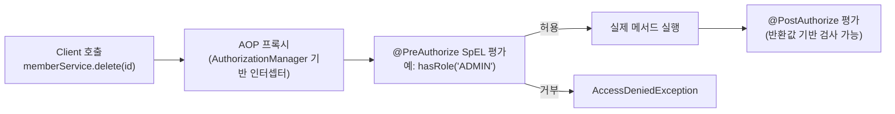
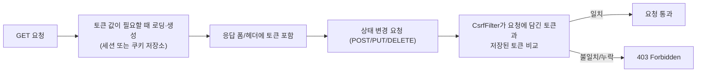

# Method Security와 CSRF 방어

## 핵심 정의
Method Security(메서드 보안)는 URL 경로가 아니라 서비스/컨트롤러의 개별 메서드 단위로 인가(authorization) 규칙을 선언하는 방식으로, Spring Security 5.6에 도입된 `@EnableMethodSecurity`가 현행 권장 구성이다. `@PreAuthorize`/`@PostAuthorize`/`@PreFilter`/`@PostFilter`를 사용하며 과거 `@EnableGlobalMethodSecurity`는 deprecated다. CSRF(Cross-Site Request Forgery, 사이트 간 요청 위조)는 메서드 인가와 별도로 방어해야 하는 위협으로, 인증된 사용자의 브라우저가 공격자가 만든 페이지에 의해 의도치 않은 상태 변경 요청을 서버로 보내도록 유도하는 공격이다. Spring Security는 토큰 검증으로 이를 방어하며, 두 주제 모두 [[Security Filter Chain]]에서 다루는 URL 기반 `authorizeHttpRequests`와 상호 보완적으로 동작한다.

## 동작 원리 / 구조

### Method Security

- [[프록시 기반 AOP 동작 원리]]와 동일하게, 메서드 보안도 대상 빈을 감싸는 프록시가 호출을 가로채 SpEL 표현식을 평가한 뒤 실제 메서드를 호출하는 구조다.
- `@PreAuthorize`는 메서드 실행 **전** 파라미터 기반 검사(`hasRole`, `#id == authentication.principal.id` 등), `@PostAuthorize`는 실행 **후** 반환값 기반 검사(`returnObject.ownerId == authentication.principal.id`)에 쓴다. `@PreFilter`/`@PostFilter`는 컬렉션 파라미터/반환값에서 조건에 안 맞는 요소를 걸러낸다.
- `@EnableMethodSecurity`는 기본적으로 `@PreAuthorize`/`@PostAuthorize`와 `@PreFilter`/`@PostFilter`를 활성화한다. `securedEnabled = true`, `jsr250Enabled = true`로 `@Secured`, `@RolesAllowed`를 추가할 수 있다. Boot Security starter만 추가해서는 메서드 보안이 자동 활성화되지 않는다. 애노테이션이나 별도 pointcut이 적용되지 않은 메서드는 이 기능만으로 보호되지 않는다.

### CSRF 방어

- 기본 저장소는 `HttpSessionCsrfTokenRepository`(세션 기반)이다. SPA처럼 서버 세션 없이 JS로 값을 읽어야 하는 경우 `CookieCsrfTokenRepository.withHttpOnlyFalse()`로 `XSRF-TOKEN` 쿠키에 토큰을 저장하고, 클라이언트가 이를 읽어 `X-XSRF-TOKEN` 헤더로 되돌려 보내는 방식을 쓴다.
- Security 6부터 토큰은 지연 로딩되며 응답에 노출할 값에 XOR 마스킹을 적용해 BREACH를 완화한다. Security 7의 csrf.spa()는 쿠키 저장소·SPA 요청 처리·새 토큰 로딩을 구성한다. 6.x 문서의 SpaCsrfTokenRequestHandler/CsrfCookieFilter는 사용자 정의 예제 클래스일 수 있으므로 라이브러리 내장 클래스처럼 import하지 않는다.

```java
// Spring Security 7.0 이상, SPA용 HttpSecurity 설정 일부
http.csrf(csrf -> csrf.spa());
```

## 실무 관점
- **URL 인가와 메서드 인가의 병행**: `authorizeHttpRequests`는 "이 경로에 누가 들어올 수 있는가"라는 1차 방어선이고, `@PreAuthorize`는 "이 리소스의 소유자만 수정할 수 있다"처럼 URL만으로는 표현하기 어려운 세밀한 규칙(리소스 소유권, 도메인 상태 기반 조건)을 서비스 계층에서 강제하는 2차 방어선이다. 둘 중 하나만 믿고 나머지를 생략하면, 컨트롤러 경로 추가/변경 시 방어가 뚫리는 사고로 이어진다.
- **self-invocation 함정**: AOP 프록시 기반이므로 같은 클래스 내부에서 `this.otherMethod()`로 자기 자신의 메서드를 호출하면 프록시를 거치지 않아 `@PreAuthorize`가 적용되지 않는다. 컨트롤러/서비스 리팩터링 중 이 부분을 놓쳐 보안 검사가 우회되는 사고가 실무에서 흔하다.
- **표현식의 파라미터 이름**: Security 7.1.1·Framework 7.0.9의 기본 Java 이름 탐색에서 `#id`를 쓰려면 `-parameters`로 컴파일하거나 `org.springframework.security.core.parameters.P`의 `@P("id")` 등 지원되는 명시적 이름을 제공한다. 디버그 정보(`-g`)만으로는 충분하지 않다. 위치 별칭 `#p0`·`#a0`도 가능하지만 인자 순서 변경에 영향을 받는다. IDE와 배포 빌드의 설정을 맞추고 실제 인가 표현식을 테스트하며, 정책 함수가 누락된 필수 ID를 허용하지 않게 한다.
- **Bearer API의 CSRF**: 인증을 오직 애플리케이션이 명시한 Authorization: Bearer 헤더로 받고 쿠키·브라우저 자동 HTTP 인증을 허용하지 않는 경로라면 전형적인 CSRF의 자동 자격증명 전송 조건이 없다. 이 전제를 확인한 경로에서 CSRF 제외를 검토한다. stateless나 REST라는 이름만으로 끄지 않는다.
- **`@PostAuthorize`와 커밋 순서**: 사후 검사는 메서드가 실행한 부수 효과를 자동으로 되돌리지 않는다. Security 7.1.1·Framework 7.0.9 기본 어드바이스 순서에서는 같은 메서드의 `@Transactional`이 커밋한 뒤 사후 인가가 거부될 수 있다. 쓰기에는 사전 인가를 우선한다. 사후 검사 실패를 DB 롤백에 포함해야 한다면 트랜잭션 어드바이스가 인가를 바깥에서 감싸도록 순서를 구성하고 실제 커밋 테스트로 확인한다. 기본 인가 순서에서 `@EnableTransactionManagement(order=0)`가 그 구성의 한 예지만 사용자 offset·추가 어드바이스도 함께 확인한다. 이미 수행한 외부 API 호출은 DB 롤백으로 취소되지 않는다.
- **CORS와 CSRF는 다른 문제**: [[CORS 설정|CORS]]는 브라우저가 다른 오리진의 응답을 JS가 읽지 못하게 막는 것이고, CSRF는 응답을 읽지 못해도 요청 자체가 부작용(상태 변경)을 일으키는 것을 막는 것이다. CORS를 넓게 허용했다고 CSRF 방어가 필요 없어지는 것은 아니며, 둘은 독립적으로 설정해야 한다.

## 심화 Q&A

### Q. self-invocation으로 `@PreAuthorize`가 무시되는 문제를 어떻게 근본적으로 예방하는가?
A. AOP 프록시 기반 한계이므로 완전히 없앨 수는 없지만, 보안 검사가 필요한 메서드를 별도의 빈으로 분리해 항상 프록시를 통해 호출되도록 설계하는 것이 가장 확실하다. 또는 AspectJ 컴파일 타임 위빙으로 전환하면 self-invocation도 감지되지만, 대부분의 팀은 설계로 우회하는 쪽을 택한다. 코드 리뷰 단계에서 "같은 클래스 내부 호출인데 `@PreAuthorize`가 붙어 있는가"를 점검 항목으로 두는 것도 실무적인 완화책이다.
### Q. URL 기반 `authorizeHttpRequests`와 `@PreAuthorize`의 규칙이 서로 다르게 설정되어 충돌하면 어떻게 되는가?
A. 둘은 서로 다른 필터/인터셉터 체인에서 독립적으로 평가되므로 "충돌"이라기보다 "둘 다 통과해야 최종 허용"되는 AND 관계다. 예를 들어 URL 레벨에서는 인증만 요구하고 메서드 레벨에서 `hasRole('ADMIN')`을 요구하면, 인증된 일반 사용자는 URL 필터는 통과하지만 메서드 인터셉터에서 403을 받는다. 반대로 URL 레벨에서 이미 특정 역할만 허용했다면 메서드 레벨 검사는 사실상 중복 방어선이 된다. 이 중복을 무의미하다고 보지 말고, 컨트롤러 경로가 실수로 넓게 열렸을 때의 안전망으로 유지하는 것이 좋다.
### Q. Bearer 헤더 전용 API에서 CSRF 위험이 줄어드는 전제는 무엇인가?
A. 공격 사이트가 피해자의 토큰을 알지 못하고 대상 API가 명시적인 Bearer 헤더만 받으면 단순 폼·이미지 요청으로 인증된 상태 변경을 일으키기 어렵다. 쿠키 인증을 함께 받거나 요청 URL·헤더를 공격자 입력으로 구성하는 클라이언트 측 CSRF가 있으면 이 전제가 깨질 수 있다. 로그인·토큰 갱신 경로의 인증 방식도 각각 점검한다.
### Q. `CookieCsrfTokenRepository.withHttpOnlyFalse()`와 인증 쿠키의 HttpOnly는 어떻게 구분하는가?
A. SPA가 CSRF 토큰 쿠키를 읽어 헤더로 전송해야 할 때 해당 쿠키만 JS에 노출한다. 이 설정 자체가 XSS를 발생시키는 것은 아니며 세션 인증 쿠키까지 HttpOnly를 해제할 이유는 없다. JS에서 읽을 필요가 없으면 기본 저장소 설정을 유지한다. 동일 출처에서 악성 스크립트를 실행할 수 있는 XSS는 토큰 읽기나 사용자 권한 요청을 통해 CSRF 방어를 무력화할 수 있으므로 출력 인코딩·안전한 DOM 사용과 CSP 등을 별도로 적용한다.
### Q. `@PreFilter`/`@PostFilter`로 컬렉션을 필터링하는 방식과 서비스 계층에서 쿼리 조건으로 미리 걸러내는 방식 중 무엇이 나은가?
A. PostFilter는 반환 데이터에 대한 사후 필터라 DB에서 필요 이상으로 읽을 수 있다. PreFilter는 입력 컬렉션을 줄여 실제 작업 전에 제외하는 기능이다. 둘 다 대량 데이터의 DB 조건을 대체하지 않으며, 지원 타입·변경 가능성·페이징 total과 결과 수의 불일치를 고려한다.
### Q. CSRF 토큰이 "지연 로딩(deferred)"된다는 것이 SPA 통합에서 왜 문제가 되는가?
A. 토큰 값이 실제로 필요하기 전에는 생성·저장을 미룰 수 있어 최초 GET만으로 쿠키가 준비되지 않을 수 있다. 로그인·로그아웃 성공 시 기존 CSRF 토큰도 지워지므로 다음 변경 요청 전에 새 값을 얻어야 한다. Security 7의 spa() 또는 버전에 맞는 요청 핸들러/토큰 엔드포인트로 이 흐름을 구현한다.

## 관련 개념
- [[Security Filter Chain]]
- [[프록시 기반 AOP 동작 원리]]
- [[JWT 인증]]
- [[CORS 설정]]
- [[Spring 테스트 트랜잭션과 커밋 검증]]

## 참고 자료

부분 재검증: 2026-10-04. Security 7.1.1·Framework 7.0.9·JDK 25.0.4에서 메서드를 각각 이름 정보 없음, `-g`만, `-parameters`, `@P`로 컴파일해 기본 MethodSecurityExpressionHandler의 표현식 평가 4건을 실행했다. 앞의 두 구성은 `#id`가 연결되지 않았고 뒤의 두 구성은 연결됐다. 모든 구성에서 `#p0`·`#a0`는 동작했다. 커스텀 이름 탐색기·Kotlin·전체 HTTP 인가 실행을 검증한 것은 아니다. 현재 가이드에 남은 debug-symbol fallback 설명보다 아래 고정 버전 구현과 실행 범위로 한정한다.

- [DefaultSecurityParameterNameDiscoverer 7.1.1](https://raw.githubusercontent.com/spring-projects/spring-security/7.1.1/core/src/main/java/org/springframework/security/core/parameters/DefaultSecurityParameterNameDiscoverer.java) / [DefaultParameterNameDiscoverer 7.0.9](https://raw.githubusercontent.com/spring-projects/spring-framework/v7.0.9/spring-core/src/main/java/org/springframework/core/DefaultParameterNameDiscoverer.java) — 명시 애노테이션과 Java reflection 기반 이름 탐색.
- [MethodBasedEvaluationContext 7.0.9](https://raw.githubusercontent.com/spring-projects/spring-framework/v7.0.9/spring-context/src/main/java/org/springframework/context/expression/MethodBasedEvaluationContext.java) — 이름·위치 기반 변수 등록.

검증일: 2026-09-08. 적용 범위: Spring Security 7.1.1; CSRF spa()는 7.0 도입.

- [Method Security](https://docs.spring.io/spring-security/reference/servlet/authorization/method-security.html) — 인가 인터셉터·위빙·필터링.
- [CSRF](https://docs.spring.io/spring-security/reference/servlet/exploits/csrf.html) — deferred 토큰과 SPA 구성.
- [CsrfConfigurer API](https://docs.spring.io/spring-security/reference/api/java/org/springframework/security/config/annotation/web/configurers/CsrfConfigurer.html) — spa()의 7.0 도입.

부분 재검증: 2026-09-23. Security 7.1.1·Framework 7.0.9의 기본 메서드 보안 범위, 사후 인가와 트랜잭션 순서, CSRF 쿠키 역할을 확인했다. H2 2.4.240에서 기본 순서는 거부 후 저장 행이 남고, 트랜잭션 order=0은 롤백되는 두 경로를 실행 검증했다. 웹 응답 상태는 필터/예외 처리 구성에 달려 있으며, 비HTTP 호출에는 HTTP 403 변환이 자동 적용되지 않는다.

- [AuthorizationInterceptorsOrder API](https://docs.spring.io/spring-security/reference/api/java/org/springframework/security/authorization/method/AuthorizationInterceptorsOrder.html) — Security 7.1.1 인가 어드바이스 순서.
- [EnableTransactionManagement 7.0.9 API](https://docs.spring.io/spring-framework/docs/7.0.9/javadoc-api/org/springframework/transaction/annotation/EnableTransactionManagement.html) — 트랜잭션 어드바이스의 order 설정.
- [OWASP CSRF Prevention](https://cheatsheetseries.owasp.org/cheatsheets/Cross-Site_Request_Forgery_Prevention_Cheat_Sheet.html) — 2026-09-23 확인, 사용자 권한과 XSS의 방어 한계.

- [EnableMethodSecurity 7.1.1 소스](https://github.com/spring-projects/spring-security/blob/7.1.1/config/src/main/java/org/springframework/security/config/annotation/method/configuration/EnableMethodSecurity.java) — 5.6 도입과 기본 활성 애노테이션.
