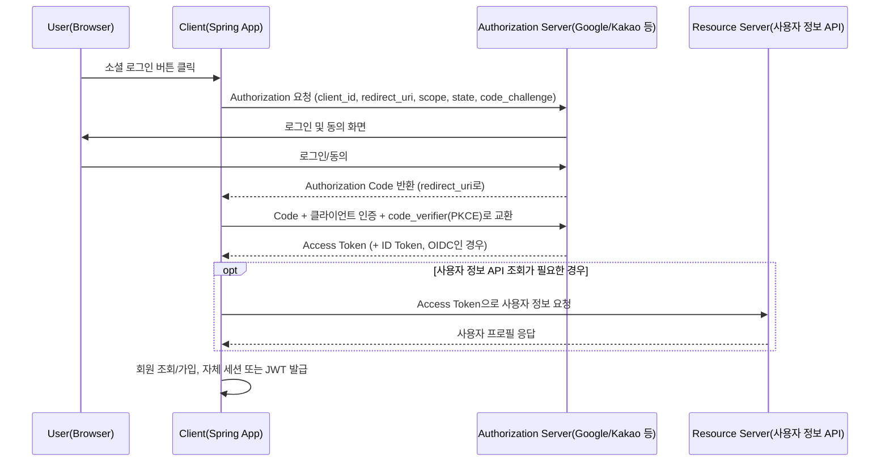

# OAuth2와 소셜 로그인

## 핵심 정의
OAuth 2.0은 사용자가 자신의 비밀번호를 제3자 애플리케이션에 직접 넘기지 않고, 리소스 소유자(Resource Owner)의 승인을 거쳐 제한된 권한 범위(scope)의 접근 토큰(Access Token)을 발급받아 위임 인가(delegated authorization)를 수행하는 프로토콜 표준(RFC 6749)이다. OAuth2 자체는 "인가" 프로토콜이며 "이 사용자가 누구인지"를 표준화하지 않기 때문에, 구글·카카오·네이버 같은 소셜 로그인에서 사용자 인증(authentication) 정보까지 표준화하려면 OAuth2 위에 얹은 OpenID Connect(OIDC)를 함께 사용한다.

Boot 4.1.1에서는 `org.springframework.boot:spring-boot-starter-security-oauth2-client`를 사용한다. Boot 3 계열에서 사용한 `spring-boot-starter-oauth2-client` 이름은 4.1.1에서 deprecated 호환 스타터로 남아 있다. Spring Security OAuth2 Client/JOSE 모듈이 Authorization Code 기반 OAuth2/OIDC 로그인을 지원한다.

## 동작 원리 / 구조



Spring Security의 핵심 컴포넌트:
- `ClientRegistration`: 각 소셜 로그인 제공자(provider)별 client-id, client-secret, authorization-uri, token-uri, scope 등 설정 정보.
- `AuthorizationRequestRepository<OAuth2AuthorizationRequest>`: 로그인 시작 시 만든 요청의 `state`·PKCE verifier 등 콜백 검증에 필요한 상태를 보관한다. 기본 `HttpSessionOAuth2AuthorizationRequestRepository`는 HTTP 세션을 사용한다. 아래 발급 완료 토큰 저장소와 역할이 다르다.
- `OAuth2AuthorizedClientService`: 발급받은 Access Token/Refresh Token을 저장·조회.
- `OAuth2UserService`는 OAuth2 사용자 정보 응답을 사용자 객체로 매핑한다. `OidcUserService`는 검증된 ID Token과 필요할 때 조회한 UserInfo 응답으로 OidcUser를 구성하므로 항상 추가 UserInfo HTTP 요청이 발생하는 것은 아니다. OAuth2용 userService와 OIDC용 oidcUserService를 구분해 확장한다.

```yaml
spring:
  security:
    oauth2:
      client:
        registration:
          google:
            client-id: ${GOOGLE_CLIENT_ID}
            client-secret: ${GOOGLE_CLIENT_SECRET}
            scope: [openid, profile, email]
          kakao:
            client-id: ${KAKAO_CLIENT_ID}
            client-secret: ${KAKAO_CLIENT_SECRET}
            authorization-grant-type: authorization_code
            redirect-uri: "{baseUrl}/login/oauth2/code/kakao"
            client-authentication-method: client_secret_post
        provider:
          kakao:
            authorization-uri: https://kauth.kakao.com/oauth/authorize
            token-uri: https://kauth.kakao.com/oauth/token
            user-info-uri: https://kapi.kakao.com/v2/user/me
            user-name-attribute: id
```

```java
@Bean
public SecurityFilterChain filterChain(HttpSecurity http) throws Exception {
    http
        .authorizeHttpRequests(auth -> auth
            .requestMatchers("/", "/login/**").permitAll()
            .anyRequest().authenticated())
        .oauth2Login(oauth2 -> oauth2
            .userInfoEndpoint(userInfo -> userInfo.userService(customOAuth2UserService))
            .successHandler(oAuth2AuthenticationSuccessHandler));
    return http.build();
}
```

## 실무 관점
- **제공자 설정**: 카카오는 OIDC를 지원하며 앱 설정과 요청 scope에 따라 활성화한다. 위 카카오 YAML은 OAuth2 사용자 정보 API 방식의 예시다. OIDC 모드를 사용하려면 제공자의 discovery·openid scope·콘솔 설정을 맞춘다. 사용자 정의 userService와 OIDC용 oidcUserService는 별도 확장 지점이다.
- **회원 연동**: OIDC는 iss+sub 조합, 순수 OAuth 사용자 정보는 제공자와 안정적인 사용자 ID를 외부 계정 키로 사용한다. 이메일은 변경·재사용될 수 있으므로 기본 식별자로 쓰거나 일치만으로 기존 계정에 연결하지 않는다.
- **토큰 저장**: 기본 InMemoryOAuth2AuthorizedClientService는 재시작·다중 인스턴스 공유에 한계가 있다. 외부 API 지속 호출과 갱신이 필요하면 JdbcOAuth2AuthorizedClientService 또는 적절한 공유 저장 구현을 고려한다. 토큰 저장과 로그인 HttpSession 공유는 별개의 문제다.
- **로그인 후 자체 인증 수단 발급**: 소셜 로그인 성공 후 그 자체로 API 인증에 쓰기보다, 자체 JWT 또는 세션을 발급해 이후 요청은 자체 토큰으로 처리하는 구조가 일반적이다. 소셜 제공자의 Access Token을 그대로 자사 API 인증에 재사용하면 제공자 쪽 토큰 정책 변경에 서비스 전체가 종속된다.
- **state와 PKCE**: state는 인증 요청과 콜백을 브라우저 세션에 결합해 로그인 CSRF를 방어한다. PKCE는 코드와 원래 요청의 verifier를 결합해 코드 탈취·주입을 완화한다. 각각의 검증을 생략하지 말고 제공자와 클라이언트 타입에 맞춰 적용한다.
- **PKCE 기본값의 적용 버전**: Spring Security 7.1.1의 `ClientRegistration.ClientSettings` 빌더는 `requireProofKey=true`가 기본이다. 기본 요청 resolver는 Authorization Code 흐름의 기밀 클라이언트(Confidential Client)에도 PKCE를 넣는다. 따라서 “client-secret이 있으면 PKCE를 자동 사용하지 않는다”는 구버전 설명을 그대로 적용하지 않는다. 미지원 제공자와 연동할 때만 해당 등록의 설정을 검토하고, 공개 클라이언트(Public Client, 인증 방식 `none`)에서는 이 값을 `false`로 바꿔도 기본 resolver가 PKCE를 적용한다.
- **흔한 실수/장애 패턴**: redirect-uri를 콘솔(구글/카카오 개발자 센터)에 등록한 값과 실제 애플리케이션 값이 불일치해 로그인이 실패하는 문제, scope 부족으로 이메일 정보를 못 받아오는 문제, 로컬 개발 환경(http)과 운영 환경(https)의 redirect-uri 차이를 실수로 혼용하는 문제가 반복적으로 발생한다.

## 심화 Q&A

### Q. OAuth2와 OIDC의 근본적인 차이는 무엇이며, 소셜 로그인 구현에 어떤 실질적 차이를 만드는가?
A. OAuth2는 리소스 접근 위임을 다루고 OIDC는 openid scope, ID Token과 인증 의미를 추가한다. ID Token의 서명·iss·aud·만료와 필요한 nonce 등을 검증한 뒤 신원을 받아들인다. /userinfo는 관례적인 경로 예시이며 실제 주소는 discovery로 찾는다. email 클레임은 항상 있거나 인증됐다고 보장되지 않는다.

### Q. Authorization Code Grant에서 `state` 파라미터가 없으면 어떤 공격이 가능한가?
A. 공격자가 자신의 Authorization Code를 피해자의 브라우저 콜백 URL로 유도해, 피해자의 세션에 공격자의 소셜 계정이 연결되게 만드는 CSRF 성격의 공격(로그인 CSRF)이 가능하다. `state`는 요청 시점에 생성해 세션에 저장하고, 콜백 시 동일한지 검증함으로써 요청과 응답이 같은 브라우저 세션에서 발생했음을 보장한다.

### Q. 여러 소셜 제공자가 동일한 이메일을 반환할 때 계정을 자동 병합해도 되는가?
A. 이메일 일치나 email_verified만으로 기존 계정 소유권을 이전하지 않는다. 기존 계정에 인증된 상태에서 새 제공자 인증을 완료하는 연결 절차 등으로 두 계정의 통제권을 확인한다. iss/sub를 안정적인 키로 저장하고 이메일은 속성으로 다룬다.

### Q. 소셜 로그인에서 받은 Access Token을 자사 리소스 서버 인증에 그대로 재사용하면 안 되는 이유는?
A. 소셜 제공자의 Access Token은 그 제공자의 API(예: 사용자 프로필 조회)에 접근하기 위한 용도로 발급된 것이며, audience(수신 대상)가 자사 서버가 아니다. 이를 자사 API 인증에 재사용하면 토큰 검증 책임이 외부 제공자에 종속되고, 제공자가 토큰 형식이나 만료 정책을 바꾸면 서비스 인증이 깨진다. 로그인 성공 후에는 자체 세션 또는 JWT를 별도로 발급하는 것이 표준적인 패턴이다.

### Q. `OAuth2AuthorizedClientService`를 기본 InMemory 구현 그대로 운영 환경에 쓰면 어떤 문제가 생기는가?
A. 토큰이 공유되지 않으면 다른 인스턴스의 외부 API 호출·갱신이 실패할 수 있고 재시작하면 소실된다. 지속 보관이 필요한 경우 JdbcOAuth2AuthorizedClientService 등으로 대체한다. OAuth2AuthorizedClientRepository는 HTTP 요청 맥락의 저장·조회 추상화이고 Service와 같은 인터페이스가 아니다. 모든 소셜 로그인에서 제공자 토큰의 영구 저장이 필수인 것은 아니다.

로그인 시작 요청과 콜백이 서로 다른 인스턴스로 가는 경우에는 **인증 요청 저장소**도 공유돼야 한다. 발급된 토큰을 JDBC에 저장해도 로그인 중인 `state`·verifier가 들어 있는 세션은 자동 공유되지 않는다. 요청 저장소와 로그인 후 세션, 발급된 토큰 각각의 수명·공유 범위를 확인한다.

### Q. Authorization Code Grant 대신 Implicit Grant나 Resource Owner Password Grant를 소셜 로그인에 쓰지 않는 이유는?
A. RFC 9700은 브라우저에 Access Token을 직접 발급하는 implicit 방식 대신 code 응답을 권고하며 Resource Owner Password Credentials grant는 MUST NOT으로 금지한다. Authorization Code와 PKCE는 코드 가로채기·재사용을 완화하지만 토큰이 절대로 노출되지 않는다는 보장은 아니다. TLS, 정확한 redirect URI와 토큰의 안전한 저장도 필요하다.

## 관련 개념
- [[JWT 인증]]
- [[Security Filter Chain]]
- [[RESTful API 설계 원칙]]

## 참고 자료

검증일: 2026-09-08. 적용 범위: Spring Security 7.1.1, OpenID Connect Core 1.0 및 RFC 9700.

- [OAuth2 Login Core](https://docs.spring.io/spring-security/reference/servlet/oauth2/login/core.html) — 로그인·클라이언트 설정.
- [OAuth2 Client Core](https://docs.spring.io/spring-security/reference/servlet/oauth2/client/core.html) — Service/Repository 역할과 JDBC 저장.
- [OIDC Core](https://openid.net/specs/openid-connect-core-1_0.html) — ID Token 검증과 iss/sub 식별자.
- [OAuth 보안 권고](https://www.rfc-editor.org/rfc/rfc9700.html) — PKCE·CSRF·금지된 password grant.
- [카카오 로그인](https://developers.kakao.com/docs/ko/kakaologin/common) — OIDC 지원과 제공자 엔드포인트.
- [Boot 4.1.1 OAuth2 starter](https://raw.githubusercontent.com/spring-projects/spring-boot/v4.1.1/starter/spring-boot-starter-security-oauth2-client/build.gradle) — 정식 스타터 이름.
- [Boot 4.1.1 compatibility starter](https://raw.githubusercontent.com/spring-projects/spring-boot/v4.1.1/starter/spring-boot-starter-oauth2-client/build.gradle) — 기존 스타터 deprecation.
- [OidcUserService 7.1.1](https://raw.githubusercontent.com/spring-projects/spring-security/7.1.1/oauth2/oauth2-client/src/main/java/org/springframework/security/oauth2/client/oidc/userinfo/OidcUserService.java) — 조건부 UserInfo 조회.

부분 재검증: 2026-09-23. Security 7.1.1 공식 문서·소스로 PKCE 기본값과 인증 요청 저장소를 확인했다. 기본 resolver 실행에서 기밀 클라이언트의 기본 활성화·명시적 비활성화, 공개 클라이언트의 PKCE 유지 3건을 확인했다. 실제 제공자 로그인·토큰 교환은 실행하지 않았다.

- [OAuth2 Authorization Grants](https://docs.spring.io/spring-security/reference/servlet/oauth2/client/authorization-grants.html) — 7.1.1, PKCE·인증 요청 저장소.
- [ClientRegistration 7.1.1](https://raw.githubusercontent.com/spring-projects/spring-security/7.1.1/oauth2/oauth2-client/src/main/java/org/springframework/security/oauth2/client/registration/ClientRegistration.java) — `ClientSettings.Builder`의 `requireProofKey=true` 기본값.
- [DefaultOAuth2AuthorizationRequestResolver 7.1.1](https://raw.githubusercontent.com/spring-projects/spring-security/7.1.1/oauth2/oauth2-client/src/main/java/org/springframework/security/oauth2/client/web/DefaultOAuth2AuthorizationRequestResolver.java) — 공개 클라이언트 또는 proof key 설정에 따른 적용 조건.
