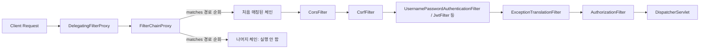

# Security Filter Chain

## 핵심 정의
Security Filter Chain(보안 필터 체인)은 Spring Security가 HTTP 요청을 가로채 인증(authentication)·인가(authorization) 등 보안 처리를 수행하는 서블릿 필터(Servlet Filter)들의 순서 있는 집합이다. Spring Security 6부터는 `WebSecurityConfigurerAdapter`를 상속하는 방식이 완전히 제거되고, `SecurityFilterChain` 타입의 빈(bean)을 직접 등록하는 컴포넌트 기반 설정 방식이 표준이다.

내부적으로는 `DelegatingFilterProxy`가 서블릿 컨테이너의 필터 체인에 끼어들어 요청을 Spring이 관리하는 `FilterChainProxy`에 위임하고, `FilterChainProxy`가 등록된 여러 `SecurityFilterChain` 중 요청 경로에 매칭되는 하나를 선택해 그 안의 필터들을 순차 실행하는 구조다.

## 동작 원리 / 구조



주요 특징:
- `FilterChainProxy`는 등록된 `SecurityFilterChain` 목록을 순서대로 검사하며, 요청 경로에 대해 `securityMatcher()` 조건이 처음으로 매칭되는 체인 하나만 실행한다. 나머지 체인은 무시된다.
- 하나의 체인 내부에서는 필터들이 고정된 순서(예: `CorsFilter` → `CsrfFilter` → 인증 필터 → `ExceptionTranslationFilter` → `AuthorizationFilter`)로 실행되며, 이 순서는 `FilterOrderRegistration`에 의해 관리된다.
- Spring Boot 환경에서는 `@EnableWebSecurity` 없이도 `SecurityFilterChain` 빈만 등록하면 자동 구성이 적용된다.
- Security 7 코드는 authorizeHttpRequests와 requestMatchers/securityMatcher를 사용한다. 제거된 구 API와 6.x의 deprecation 안내를 혼용하지 않는다.

다음 예제의 API는 Bearer 헤더 전용 인증이고 쿠키·자동 브라우저 인증을 사용하지 않는다는 전제다. JWT decoder의 issuer·서명 키 등은 [[JWT 인증]]의 설정이 필요하다.

```java
@Bean
@Order(1)
public SecurityFilterChain apiFilterChain(HttpSecurity http) throws Exception {
    http
        .securityMatcher("/api/**")
        .csrf(AbstractHttpConfigurer::disable)
        .sessionManagement(sm -> sm.sessionCreationPolicy(SessionCreationPolicy.STATELESS))
        .authorizeHttpRequests(auth -> auth
            .requestMatchers("/api/public/**").permitAll()
            .anyRequest().authenticated()
        )
        .oauth2ResourceServer(oauth2 -> oauth2.jwt(Customizer.withDefaults()));
    return http.build();
}

@Bean
@Order(2)
public SecurityFilterChain webFilterChain(HttpSecurity http) throws Exception {
    http
        .authorizeHttpRequests(auth -> auth.anyRequest().authenticated())
        .formLogin(Customizer.withDefaults());
    return http.build();
}
```

## 실무 관점
- **SecurityContext 저장**: SecurityContextHolderFilter는 저장소에서 컨텍스트를 읽지만 자동 저장하지 않는다. 커스텀 세션 로그인에서 이후 요청에도 인증을 유지하려면 인증 성공 뒤 SecurityContextRepository.saveContext(...)를 호출해야 한다. 기본 인증 필터가 수행하는 저장 경로와 구분한다.
- API 서버와 웹(폼 로그인) 서버가 하나의 애플리케이션에 공존할 때, 멀티 체인 구성(`securityMatcher` + `@Order`)으로 API는 stateless JWT 인증, 웹은 세션 기반 인증처럼 서로 다른 보안 정책을 분리 적용하는 것이 정석이다.
- `@Order`를 명시하지 않으면 체인 등록 순서가 모호해지고, 의도치 않게 더 넓은 매처가 먼저 매칭되어 특정 체인이 아예 실행되지 않는 장애가 흔하다. 가장 구체적인 매처를 낮은 순번(먼저 평가)으로 둬야 한다.
- `addFilterBefore/After`로 커스텀 필터(JWT 파싱 필터 등)를 끼워 넣을 때, 기준 필터 클래스를 잘못 지정하면 인증 필터보다 늦게 실행되어 `SecurityContext`가 비어 있는 상태로 인가 필터를 통과하는 문제가 생길 수 있다.
- `permitAll()`은 로그인·공개 API·공개 정적 리소스 등 의도한 익명 접근에만 적용한다. 공개 경로와 HTTP 메서드를 명시하고 넓은 와일드카드에 민감한 새 API가 포함되는지 검사한다.
- **공개 경로에도 필터는 실행**: `permitAll()`은 인가 규칙이며 인증·CSRF 등 앞쪽 필터를 생략하지 않는다. 7.1.1 기본 Resource Server 필터는 공개 API라도 Bearer 토큰이 있으면 인증을 시도하고, 만료·유효하지 않은 토큰의 인증 실패는 인가 단계 전에 401로 끝날 수 있다. 토큰 없는 공개 요청과 잘못된 토큰을 첨부한 요청을 따로 확인한다. 브라우저용 공개 POST 역시 `permitAll()`만으로 CSRF 검사가 해제되지는 않는다.
- CSRF는 세션 기반 웹 폼에서는 활성화 유지, stateless REST API에서는 보통 비활성화하지만 무조건 끄기보다 인증 방식(쿠키 세션 vs 헤더 토큰)에 따라 판단해야 한다.

### 체인 매칭 범위와 로그인 엔드포인트

`formLogin()`이 제공하는 기본 `GET /login`·`POST /login`도 해당 체인이 실행돼야 동작한다. 예를 들어 `securityMatcher("/secured/**")`로 좁힌 체인은 `/login`을 처리하지 않으며 매처가 로그인 URL을 자동으로 `/secured/login`으로 바꾸지도 않는다. 다른 체인이나 컨트롤러가 처리하지 않으면 404가 된다. 로그인 페이지·처리 URL을 체인 범위 안으로 맞추거나 해당 경로를 처리하는 별도 체인을 둔다. 커스텀 `loginPage()`를 지정하면 실제 페이지 제공도 애플리케이션 책임이므로, URL 설정만으로 기본 생성 페이지가 옮겨진다고 가정하지 않는다.

## 심화 Q&A

### Q. 여러 `SecurityFilterChain`을 등록했는데 특정 경로가 어느 체인에도 안 걸리면 어떻게 되는가?
A. 매칭되는 체인이 없으면 보안 필터 없이 다음 Servlet 필터로 진행한다. 마지막 SecurityFilterChain의 securityMatcher를 제한하지 않아 전체 요청에 매칭되게 만들고 그 안에서 anyRequest 정책을 정한다. anyRequest는 체인 안의 인가 규칙이며 좁혀진 securityMatcher를 넓혀주지는 않는다.

### Q. `addFilterBefore`와 `addFilterAfter`를 잘못 쓰면 어떤 문제가 생기는가?
A. ExceptionTranslationFilter는 자신이 chain.doFilter로 호출한 뒤쪽에서 발생한 AuthenticationException/AccessDeniedException을 잡는다. 앞쪽 커스텀 인증 필터가 던진 예외는 잡지 못하므로 그 필터가 AuthenticationEntryPoint나 실패 핸들러로 처리해야 한다. 인증은 AuthorizationFilter보다 먼저 완료해야 한다. Spring 빈인 Filter를 보안 체인에 추가하면 Boot의 Servlet 필터 자동 등록과 중복 실행되지 않도록 등록도 제어한다.

### Q. Stateless JWT 인증과 세션 기반 인증을 같은 애플리케이션에서 함께 쓸 때 필터 체인을 어떻게 나누는 것이 안전한가?
A. 예제의 API는 Authorization Bearer 헤더로만 인증하고 쿠키·브라우저가 자동 첨부하는 자격 증명을 사용하지 않는다는 전제에서 CSRF를 끈다. JWT를 쿠키에 저장했다면 STATELESS여도 CSRF 방어가 필요할 수 있다. 경로별 인증·세션·CSRF 정책을 분리하고 웹 체인은 세션 로그인과 CSRF 방어를 유지한다.

### Q. `FilterChainProxy`가 요청마다 모든 체인의 매처를 평가하는 비용이 성능에 영향을 주는가?
A. 첫 매칭에서 중단하므로 항상 모든 체인을 평가하는 것은 아니다. 매처의 비용도 경로 문자열 비교로 한정되지 않고 사용자 정의 로직·정규식에 좌우된다. 체인과 매처를 단순하게 구성하고 실제 병목일 때 측정한다.

### Q. `authorizeHttpRequests`에서 규칙 선언 순서가 왜 중요한가?
A. 인가 규칙은 먼저 매칭된 규칙을 적용한다. 구체적인 공개 경로를 먼저 선언하고 anyRequest를 마지막에 둔다. anyRequest 뒤에 requestMatchers를 추가하면 단순히 가려지는 수준을 넘어 설정 오류가 발생할 수 있다.

### Q. Spring Security 6에서 `WebSecurityConfigurerAdapter`가 제거된 것이 필터 체인 구성에 어떤 실질적 차이를 만드는가?
A. 빈 구성은 설정 의존성과 여러 체인의 범위를 명시하기 쉽다. 이전 상속 구성에서도 여러 어댑터와 순서를 이용한 멀티 체인은 가능했으므로 이 기능이 처음 도입된 것으로 설명하면 안 된다. 각 체인의 매칭 범위·순서와 최종 fallback을 테스트한다.

## 관련 개념
- [[JWT 인증]]
- [[OAuth2와 소셜 로그인]]
- [[Filter와 Interceptor]]

## 참고 자료

검증일: 2026-09-08. 적용 범위: Spring Security 7.1.1; SecurityFilterChain 컴포넌트 구성.

- [Servlet Architecture](https://docs.spring.io/spring-security/reference/servlet/architecture.html) — 체인 선택과 예외 변환 필터.
- [Resource Server JWT](https://docs.spring.io/spring-security/reference/servlet/oauth2/resource-server/jwt.html) — 기본 JWT 인증 구성.
- [CSRF](https://docs.spring.io/spring-security/reference/servlet/exploits/csrf.html) — 헤더 전용 인증과 CSRF 구분.
- [Authentication persistence](https://docs.spring.io/spring-security/reference/servlet/authentication/persistence.html) — SecurityContextHolderFilter 읽기와 명시적 저장.

부분 재검증: 2026-09-23. Spring Security 7.1.1의 체인 제공 로그인 엔드포인트 범위와 `permitAll()` 이전 Bearer 인증 실패 처리만 확인했다. CSRF 실행 순서는 기존 설명과 대조했으며 전체 `verified`는 유지한다.

- [Security 7.1.1 Java Configuration 고정 문서](https://raw.githubusercontent.com/spring-projects/spring-security/7.1.1/docs/modules/ROOT/pages/servlet/configuration/java.adoc) — securityMatcher와 기본 로그인 URL 불일치·커스텀 로그인 페이지의 책임.
- [BearerTokenAuthenticationFilter 7.1.1](https://raw.githubusercontent.com/spring-projects/spring-security/7.1.1/oauth2/oauth2-resource-server/src/main/java/org/springframework/security/oauth2/server/resource/web/authentication/BearerTokenAuthenticationFilter.java) — 토큰이 있으면 인증 후 다음 필터로 진행하며 인증 실패는 failure handler에서 처리.
- [FilterOrderRegistration 7.1.1](https://raw.githubusercontent.com/spring-projects/spring-security/7.1.1/config/src/main/java/org/springframework/security/config/annotation/web/builders/FilterOrderRegistration.java)·[CsrfFilter 7.1.1](https://raw.githubusercontent.com/spring-projects/spring-security/7.1.1/web/src/main/java/org/springframework/security/web/csrf/CsrfFilter.java) — AuthorizationFilter보다 먼저 실행되는 CSRF 검사와 실패 시 다음 필터로 진행하지 않는 경로.
