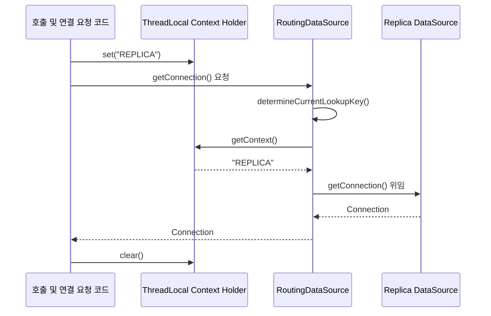

# 다중 데이터소스와 라우팅

## 핵심 정의
하나의 애플리케이션이 두 개 이상의 데이터베이스(또는 같은 DB의 서로 다른 스키마/인스턴스)에 접속해야 할 때, 여러 `DataSource`를 구성하고 실행 시점의 조건(요청 컨텍스트, 테넌트, 읽기/쓰기 여부 등)에 따라 실제로 연결을 가져올 대상을 동적으로 선택하는 것을 다중 데이터소스 라우팅(multi-datasource routing)이라 한다. Spring은 `AbstractRoutingDataSource`라는 추상 클래스를 제공해, `DataSource`처럼 보이는 프록시 뒤에서 실제 커넥션 획득을 다른 `DataSource`로 위임하는 구조를 표준적으로 지원한다.

대표적인 활용 사례는 (1) 읽기/쓰기 분리(read-write splitting, 마스터에는 쓰기, 리플리카에는 읽기), (2) 데이터베이스 단위 멀티테넌시(tenant별 스키마/DB 분리), (3) 레거시 DB와 신규 DB를 동시에 다뤄야 하는 마이그레이션 과도기, (4) 감사 로그·배치처럼 트래픽 특성이 다른 워크로드를 별도 커넥션 풀로 분리하는 경우다.

## 동작 원리 / 구조

### AbstractRoutingDataSource 동작 흐름
아래는 REPLICA 키로 새 연결을 얻는 경로다. 라우터는 SQL 결과가 아니라 선택한 DataSource의 `Connection`을 반환한다.



핵심은 `determineCurrentLookupKey()` 메서드 하나뿐이다. 이 메서드가 반환하는 키로 내부 맵(`targetDataSources`)에서 실제 `DataSource`를 찾아 커넥션 획득을 위임한다.

```java
public class RoutingDataSource extends AbstractRoutingDataSource {
    @Override
    protected Object determineCurrentLookupKey() {
        return DataSourceContextHolder.getContext(); // ThreadLocal
    }
}

public class DataSourceContextHolder {
    private static final ThreadLocal<String> CONTEXT = new ThreadLocal<>();
    public static void set(String key) { CONTEXT.set(key); }
    public static String getContext() { return CONTEXT.get(); }
    public static void clear() { CONTEXT.remove(); }
}
```

```java
@Configuration
public class DataSourceConfig {
    @Bean @ConfigurationProperties("app.datasource.master")
    public HikariDataSource masterDataSource() { return new HikariDataSource(); }

    @Bean @ConfigurationProperties("app.datasource.replica")
    public HikariDataSource replicaDataSource() { return new HikariDataSource(); }

    @Bean @Primary
    public DataSource routingDataSource(
            @Qualifier("masterDataSource") DataSource master,
            @Qualifier("replicaDataSource") DataSource replica) {
        RoutingDataSource routing = new RoutingDataSource();
        routing.setTargetDataSources(Map.of("MASTER", master, "REPLICA", replica));
        routing.setDefaultTargetDataSource(master); // 읽기/쓰기 분리의 기본값
        routing.setLenientFallback(false); // 알 수 없는 non-null 키는 오류
        return routing;
    }
}
```

위 예시는 HikariCP에 직접 바인딩하므로 각 prefix 아래 `jdbc-url`, `username`, `password` 등을 설정한다. `url`을 쓰려면 `DataSourceProperties.initializeDataSourceBuilder()`로 변환하는 구성을 사용한다. 사용자 `DataSource`가 있으면 관련 자동 구성이 물러나므로 `DataSourceAutoConfiguration` 제외는 필수가 아니다. 이 기본값은 읽기/쓰기 분리용이며, 테넌트 키 누락을 다른 고객 DB로 연결하는 데 사용하면 안 된다.

### 읽기/쓰기 분리를 지연 커넥션 획득으로 처리
Spring Framework 6.1.2부터 `LazyConnectionDataSourceProxy`에 읽기 전용 데이터소스를 지정할 수 있다. 아래 Bean은 위 `routingDataSource` Bean을 **대체하는 별도 구성**이다. 트랜잭션 매니저와 데이터 접근 계층이 같은 프록시를 사용해야 한다.

```java
@Bean @Primary
public DataSource dataSource(
        @Qualifier("masterDataSource") DataSource master,
        @Qualifier("replicaDataSource") DataSource replica) {
    LazyConnectionDataSourceProxy proxy = new LazyConnectionDataSourceProxy(master);
    proxy.setReadOnlyDataSource(replica);
    return proxy;
}
```

실제 Statement가 필요해질 때까지 물리 커넥션 획득을 늦추므로 트랜잭션의 read-only 속성을 적용해 풀을 선택할 수 있다. 리플리카 풀은 미리 read-only로 설정하고 두 풀의 기본 auto-commit·격리 수준을 맞춘다. `@Transactional(readOnly = true)`만 선언하면 자동으로 라우팅되는 것은 아니다. `REQUIRED`로 기존 쓰기 트랜잭션에 참여하면 그 물리 트랜잭션과 커넥션을 그대로 사용한다.

수동 AOP 라우팅을 구현한다면 트랜잭션 인터셉터보다 먼저 키를 설정하고, 클래스·인터페이스·합성 애노테이션과 중첩 호출의 이전 키 복원까지 처리해야 한다. 메서드의 `getAnnotation()`만 호출하는 예제는 이 조건을 충족하지 못한다.

### 완전히 분리된 다중 DB(라우팅이 아닌 병렬 구성)
멀티테넌시가 아니라 "서로 다른 스키마를 완전히 별개로 다루는" 경우(예: 주문 DB와 통계 DB)는 라우팅이 아니라 `DataSource`, `EntityManagerFactory`, `PlatformTransactionManager`, `@EnableJpaRepositories(basePackages=..., entityManagerFactoryRef=..., transactionManagerRef=...)`를 데이터소스마다 완전히 별도로 구성한다. 이 경우 두 DB에 걸친 단일 `@Transactional`은 원자성을 보장하지 못한다는 점이 핵심 제약이다.

## 실무 관점
- **풀과 프록시를 구분한다**: 각각의 HikariDataSource는 독립된 풀을 갖지만 RoutingDataSource와 LazyConnectionDataSourceProxy 자체는 풀을 추가하지 않는다. 각 물리 DB를 향하는 모든 애플리케이션 인스턴스의 최대 연결 수를 합산해 DB 한도와 운영 여유를 확인한다.
- **ThreadLocal 컨텍스트 정리 누락**: 라우팅 키는 커넥션 풀의 스레드가 아니라 코드를 실행하는 요청·작업 스레드에 저장된다. 재사용 전에 finally에서 제거하고, 중첩 호출이라면 이전 키를 복원한다. @Async 등으로 스레드를 옮길 때는 필요한 컨텍스트만 명시적으로 전달하고 대상 스레드에서도 정리한다. 테넌트 값은 인증된 권한과 대조하며, 임의 요청 값을 그대로 라우팅 키로 신뢰하지 않는다.
- **테넌트 누락을 별도로 시험한다**: `setLenientFallback(false)`와 기본 데이터소스를 함께 설정하면 알 수 없는 non-null 키는 실패하지만 null 키는 기본 DB로 연결된다. 테넌트 격리용이라면 필수 컨텍스트 누락을 커넥션 획득 전에 거부한다. 정상 테넌트만 검증하지 말고 누락·미등록·권한 없는 테넌트, 작업 스레드 재사용 후 이전 값 잔존까지 확인한다.
- **복제 지연(replication lag)**: 커밋 직후 별도 읽기를 리플리카로 보내면 최신 데이터가 없을 수 있다. 쓰기 후 읽기 일관성이 필요한 흐름은 primary 조회 또는 해당 커밋까지 복제됐음을 확인하는 규칙을 사용한다. 일정 시간 primary를 사용하는 방식은 지연을 줄이는 휴리스틱이며 복제 지연의 상한을 보장하지 않는다.
- **트랜잭션 매니저와 라우팅의 관계**: `AbstractRoutingDataSource`는 `DataSource` 레벨의 커넥션 라우팅이지 트랜잭션 매니저를 여러 개 두는 것이 아니다. 하나의 `@Transactional` 안에서 라우팅 키를 중간에 바꾸면 이미 획득한 커넥션과 새 라우팅 대상이 어긋나 예기치 않은 동작이 발생할 수 있으므로, 라우팅 키는 트랜잭션 시작 전에 결정하고 트랜잭션 도중에는 바꾸지 않는 것이 원칙이다.
- **프로퍼티 바인딩**: 사용자 풀별 prefix와 실제 풀의 속성 이름을 명시한다. Hikari 직접 바인딩의 jdbc-url과 DataSourceProperties의 url을 혼동하지 않는다. 비밀번호는 소스에 고정하지 않고 외부 설정으로 공급한다.
- **마이그레이션(Flyway/Liquibase)과의 충돌**: 다중 데이터소스 환경에서는 마이그레이션 도구가 기본적으로 어떤 데이터소스에 적용될지 명시적으로 지정해야 하며, 자동 구성에 맡기면 의도치 않은 데이터소스에 스키마 변경이 적용되는 사고가 날 수 있다.

## 심화 Q&A

### Q. `AbstractRoutingDataSource`로 라우팅 키를 트랜잭션 도중에 바꾸면 왜 위험한가?
`DataSource.getConnection()`은 트랜잭션이 시작되는 시점(또는 최초 쿼리 시점)에 한 번 호출되고, 이후 같은 트랜잭션 내의 쿼리들은 이미 획득한 커넥션을 재사용한다. 라우팅 키를 트랜잭션 도중에 바꿔도 이미 열려 있는 커넥션에는 영향이 없어 "바뀐 줄 알았는데 실제로는 이전 DB에 계속 쿼리가 나가는" 혼란스러운 상태가 될 수 있고, 반대로 트랜잭션 경계와 무관하게 매 호출마다 새 커넥션을 얻는 구조라면 하나의 논리적 트랜잭션이 서로 다른 DB에 걸쳐 실행되어 원자성이 깨진다. 그래서 라우팅 키 결정은 항상 트랜잭션/서비스 메서드 진입 시점에 고정해야 한다.

### Q. 읽기 전용 트랜잭션을 리플리카로 자동 라우팅하는 AOP 방식과, 리포지토리를 아예 물리적으로 분리하는 방식 중 어떤 것이 더 안전한가?
자동 라우팅은 코드 중복을 줄이지만 read-only 지정 실수, 기존 트랜잭션 참여, 커넥션 획득 시점의 영향을 받는다. readOnly는 일반적으로 최적화 힌트이며 쓰기를 확실히 차단하려면 DB 계정 권한도 제한한다. 명시적 리포지토리 분리는 경로를 드러내지만 코드가 늘어난다. 필요한 일관성과 쓰기 차단 수준을 기준으로 선택한다.

### Q. 데이터소스 라우팅과 [[샤딩 전략]]은 어떻게 다른가?
라우팅은 조건에 따라 데이터소스를 선택하는 메커니즘이고, 샤딩은 데이터를 나누는 전략이다. 라우터가 샤드 키를 이용해 대상 샤드를 선택할 수도 있다. 각 샤드에 복제본이 있을 수 있으므로 레코드가 물리적으로 단 한 곳에만 존재하는 것은 아니다. 샤드 선택 뒤 해당 샤드의 primary/replica를 고르는 계층적 라우팅도 가능하다.

### Q. 기본 데이터소스(`setDefaultTargetDataSource`)를 지정하지 않으면 어떤 문제가 생기는가?
기본 대상이 없고 키에 해당하는 대상도 없으면 IllegalStateException이 발생한다. 기본 lenientFallback=true는 알 수 없는 키도 기본 대상으로 보낸다. false로 설정하면 null 키에만 기본값을 허용하고 알 수 없는 non-null 키는 실패한다. 테넌트 격리에서는 누락을 오류로 차단하는 것이 필요할 수 있으므로 기본 데이터소스를 반드시 지정해야 한다는 규칙은 없다.

### Q. 두 개의 서로 다른 물리 DB에 걸친 작업을 하나의 트랜잭션처럼 묶어야 할 때 어떤 선택지가 있는가?
라우팅이나 별도 로컬 트랜잭션 매니저만으로 여러 DB의 원자성을 얻을 수 없다. XA를 지원하는 리소스와 JTA 매니저로 2PC를 적용하거나, [[트랜잭셔널 아웃박스]]·Saga로 재시도와 보상을 설계할 수 있다. 후자는 여러 DB의 즉시 원자적 커밋과 같은 보장이 아니며 중간 상태와 중복 처리까지 모델링해야 한다.

### Q. 커넥션 풀(HikariCP) 관점에서 데이터소스를 여러 개 두는 것이 리소스 사용에 어떤 영향을 주는가?
각 실제 풀은 연결과 관리 자원을 소비하지만 라우팅·지연 프록시에는 별도 풀이 없다. DB별로 자신에게 연결되는 풀들의 최대 크기를 모든 앱 인스턴스에 걸쳐 합산한다. 서로 다른 DB의 풀 수를 무조건 한 DB의 max_connections에 곱하지 않는다. PgBouncer 등을 추가하면 트랜잭션 풀링과 세션 기능의 호환성도 확인한다.

## 관련 개념
- [[샤딩 전략]]
- [[트랜잭션 전파와 격리]]
- [[Transactional 동작 원리]]
- [[리플리케이션]]

## 참고 자료

부분 재검증: 2026-10-04. Spring Framework 7.0.9 라우팅·지연 커넥션 API를 확인하고 H2 기반 3개 JUnit 테스트로 null 키 fallback, 트랜잭션 중 키 변경 후 기존 커넥션 유지, 쓰기 트랜잭션에 참여한 REQUIRED read-only의 primary 사용을 확인했다. H2 실행은 라우터/트랜잭션 동작 확인이며 실제 리플리카의 복제 지연이나 DB별 쓰기 차단 검증은 아니다.

- [AbstractRoutingDataSource 7.0.9](https://docs.spring.io/spring-framework/docs/7.0.9/javadoc-api/org/springframework/jdbc/datasource/lookup/AbstractRoutingDataSource.html) / [7.0.9 소스](https://raw.githubusercontent.com/spring-projects/spring-framework/v7.0.9/spring-jdbc/src/main/java/org/springframework/jdbc/datasource/lookup/AbstractRoutingDataSource.java) — `setLenientFallback`의 null 키 예외와 `getConnection()` 위임·반환 경로. 도식도 같은 범위로 대조했다.
- [LazyConnectionDataSourceProxy 7.0.9](https://docs.spring.io/spring-framework/docs/7.0.9/javadoc-api/org/springframework/jdbc/datasource/LazyConnectionDataSourceProxy.html) — `setReadOnlyDataSource`와 물리 연결 지연.

검증일: 2026-09-08. 적용 범위: Spring Framework 6.1.2~7.0의 JDBC 라우팅 API와 Boot 사용자 DataSource 구성.

- [AbstractRoutingDataSource API](https://docs.spring.io/spring-framework/docs/current/javadoc-api/org/springframework/jdbc/datasource/lookup/AbstractRoutingDataSource.html) — 키 선택과 lenient fallback.
- [LazyConnectionDataSourceProxy API](https://docs.spring.io/spring-framework/docs/current/javadoc-api/org/springframework/jdbc/datasource/LazyConnectionDataSourceProxy.html) — 읽기 전용 풀과 지연 획득.
- [Boot Data Access](https://docs.spring.io/spring-boot/how-to/data-access.html) — 다중 DataSource와 Hikari 바인딩.
- [트랜잭션 전파](https://docs.spring.io/spring-framework/reference/data-access/transaction/declarative/tx-propagation.html) — 물리 트랜잭션과 커넥션 재사용.
