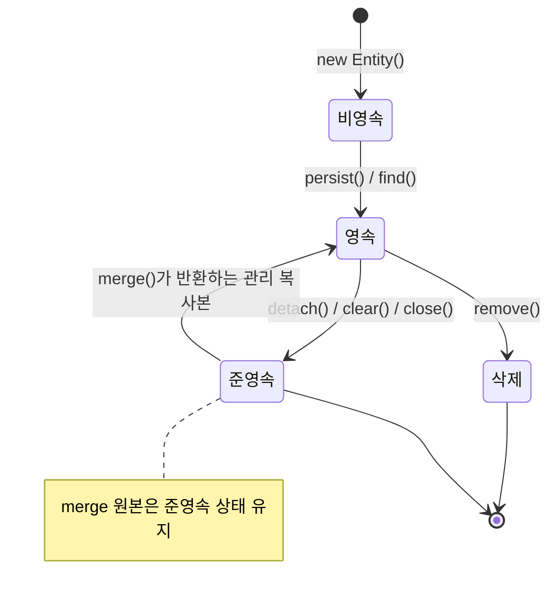

# JPA 영속성 컨텍스트

## 핵심 정의
영속성 컨텍스트(Persistence Context)는 엔티티의 영속 상태와 동일성을 관리하는 단위다. 같은 컨텍스트에서는 같은 엔티티 타입·식별자에 대응하는 관리 인스턴스를 공유한다. EntityManager로 접근하지만 Spring에서 주입받는 EntityManager 참조는 현재 트랜잭션 등에 맞는 실제 EntityManager로 위임하는 프록시일 수 있으므로, 주입 객체 하나가 컨텍스트 하나를 전역 공유한다고 해석하면 안 된다.

Spring의 일반적인 JpaTransactionManager 구성은 실제 EntityManager를 트랜잭션에 연결한다. OSIV는 요청 범위까지 컨텍스트를 유지할 수 있고 extended 컨텍스트도 있으므로, 영속성 컨텍스트의 생명주기가 언제나 트랜잭션과 일치하는 것은 아니다.

## 동작 원리 / 구조

### 엔티티의 4가지 상태
- 비영속(New/Transient): `new`로 생성만 하고 영속성 컨텍스트에 올리지 않은 상태
- 영속(Managed): `persist()`, `find()` 또는 `merge()`의 반환값 등으로 영속성 컨텍스트가 관리하는 상태
- 준영속(Detached): 영속 상태였다가 `detach()`, `clear()`, `close()` 등으로 컨텍스트에서 분리된 상태
- 삭제(Removed): `remove()` 호출로 삭제 예정 상태



### 주요 기능
1. **1차 캐시**: `find`로 이미 관리 중인 엔티티를 식별자로 다시 조회하면 기존 인스턴스를 사용할 수 있다. JPQL·native query·refresh·잠금 조회가 모든 SQL을 생략한다는 뜻은 아니다.
2. **동일성 보장(Identity Map)**: `em.find(A.class, 1L) == em.find(A.class, 1L)` 이 `true`.
3. **쓰기 지연(Write-Behind)**: 변경을 모아 flush 시 동기화할 수 있다. 다만 IDENTITY 식별자를 얻기 위한 INSERT처럼 `persist()` 부근에서 SQL이 바로 필요한 경우도 있으므로 항상 커밋까지 INSERT가 지연된다고 가정하지 않는다.
4. **변경 감지(Dirty Checking)**: Hibernate는 스냅샷 비교 또는 바이트코드 강화에 의한 변경 추적 등으로 관리 엔티티의 변경을 감지해 flush에서 UPDATE를 실행할 수 있다. 실제 방식과 UPDATE 컬럼 구성은 매핑·설정에 따라 다르다.
5. **지연 로딩(Lazy Loading)의 기반**: 프록시 객체가 실제 데이터를 필요로 하는 시점에 영속성 컨텍스트(정확히는 `EntityManager`)를 통해 초기화된다.

### Flush 시점
- `commit()` 직전
- AUTO 모드에서 쿼리 결과에 영향을 줄 변경을 동기화해야 할 때. Hibernate는 대기 중 변경과 쿼리 대상이 겹치는지 등을 고려하므로 모든 JPQL 앞에서 무조건 flush하지는 않는다.
- `em.flush()` 명시적 호출

Flush는 영속성 컨텍스트를 비우는 것이 아니라 변경 내용을 DB에 동기화하는 것이다. 컨텍스트 자체를 비우는 것은 `clear()`.

```java
@Transactional
public void updateName(Long id, String newName) {
    Member member = em.find(Member.class, id); // 영속 상태로 관리 시작, 스냅샷 저장
    member.setName(newName);                   // 필드만 변경, SQL 없음
    // 메서드 종료 시 트랜잭션 커밋 -> flush -> dirty checking -> UPDATE 실행
}
```

### 롤백 이후의 객체는 이전 상태로 돌아가지 않는다

Jakarta Persistence 3.2에서 트랜잭션 범위 컨텍스트와 해당 트랜잭션에 참여한 extended 컨텍스트의 관리·삭제 엔티티는 롤백 후 분리된다. 그러나 애플리케이션이 보관한 Java 객체의 필드는 롤백 시점의 값을 유지한다. DB의 UPDATE가 취소되었다고 객체의 `quantity`나 `name`도 이전 값으로 복원된다고 가정하면 안 된다. 트랜잭션에 참여하지 않은 extended 컨텍스트는 그 롤백의 영향을 받지 않는 별도 경우다.

버전 값과 생성된 식별자도 DB 상태와 어긋날 수 있다. 예를 들어 INSERT를 flush한 뒤 롤백하면 객체에는 ID가 남아 있어도 해당 행은 커밋되지 않았다. 실패한 객체를 그대로 `merge()`하면 새 요청과 같은 방식으로 재사용할 수 있다는 보장도 없다. 재시도는 새 트랜잭션·정상 컨텍스트에서 DB 상태를 다시 읽고 원래의 업무 명령을 재평가한다. 실패한 엔티티 객체 자체를 재시도 입력이나 성공 응답으로 사용하지 않는다.

JDBC 세이브포인트(Savepoint)까지만 되돌리는 경우도 DB 상태와 관리 객체는 따로 움직인다. Hibernate 7.4.5.Final의 버전 필드 없는 일반 엔티티에서 변경·flush 후 JDBC savepoint로 롤백하면 DB는 복구되어도 객체 필드는 변경값이었다. 이어 다른 필드를 수정해 전체 컬럼 UPDATE가 발생하자 되돌렸던 값까지 다시 저장됐다. 이 결과는 해당 매핑의 재현 사례이며 모든 매핑의 SQL이 같다는 뜻은 아니다. JPA 작업을 JDBC 부분 롤백으로 감싸 컨텍스트도 복구됐다고 가정하지 않는다. Spring NESTED의 지원 조건은 [[트랜잭션 전파와 격리]]에서 구분한다.

## 실무 관점
- **OSIV(Open Session In View)**: 영속성 컨텍스트를 뷰 렌더링까지 열어두는 옵션(`spring.jpa.open-in-view`, Spring Boot 기본값 `true`이며 기동 시 경고 로그가 뜬다). 컨트롤러/뷰 계층에서 지연 로딩을 편하게 쓸 수 있지만, DB 커넥션을 오래 점유해 커넥션 풀 고갈 위험이 있다. API 서버는 보통 `false`로 끄고 서비스 계층에서 필요한 데이터를 전부 로딩하도록 설계하는 것을 권장한다.
- **지연 로딩의 경계**: 사용 가능한 Session이 없는 미초기화 프록시·컬렉션을 초기화하면 `LazyInitializationException`이 발생한다. 트랜잭션이 끝났어도 OSIV로 Session이 열려 있을 수 있으므로 트랜잭션 종료와 컨텍스트 종료를 동일시하지 않는다.
- **준영속 엔티티 수정 실수**: 분리된 엔티티의 필드 변경은 자동 반영되지 않는다. 다만 `@Transactional`이 없는 코드에서 얻었다는 이유만으로 준영속이라고 판단하지 않는다. 외곽 트랜잭션이나 OSIV 유무, 실제 EntityManager의 관리 여부를 확인한다.
- **대량 배치 처리 시 1차 캐시 메모리 누수**: 수만 건을 반복 `persist()` 하면 영속성 컨텍스트에 엔티티가 계속 쌓여 OOM 위험이 있다. 일정 건수마다 `flush()` + `clear()`로 컨텍스트를 비워줘야 한다(배치 insert 패턴).
- **벌크 연산과의 정합성 문제**: JPQL/Criteria 벌크 UPDATE·DELETE는 DB를 직접 바꾸며 관리 엔티티의 상태나 `@Version` 검사를 자동으로 동기화하지 않는다. 보존할 변경을 먼저 `flush()`하고 벌크 연산 후 `clear()`·재조회하는 경계를 설계한다. `clear()`만 호출하면 미반영 변경을 버릴 수 있다. Spring Data JPA의 `@Modifying(flushAutomatically = true, clearAutomatically = true)`도 적용 범위와 순서를 확인해 선택한다. 두 옵션의 기본값은 false다.

## 심화 Q&A

### Q. `save()`를 호출하지 않았는데 데이터가 UPDATE되는 이유는?
JPA의 변경 감지(dirty checking) 때문이다. 트랜잭션 안에서 영속 상태 엔티티의 필드를 변경하면, 커밋 시점에 최초 스냅샷과 비교해 자동으로 UPDATE SQL이 생성된다. Spring Data JPA의 `save()`는 신규 엔티티 저장(`persist`) 또는 준영속 엔티티 병합(`merge`) 용도이지, 영속 상태 엔티티를 수정하는 데는 필요 없다.

### Q. 여러 트랜잭션의 1차 캐시와 스레드 안전성은 어떻게 구분하는가?
실제 EntityManager·영속성 컨텍스트를 여러 스레드가 동시에 공유하면 안 된다. Spring의 주입 프록시는 호출 문맥에 맞는 EntityManager로 위임하는 것이지 하나의 컨텍스트를 스레드 안전하게 바꾸는 것이 아니다. 별도 컨텍스트의 트랜잭션이 같은 행을 수정할 때의 갱신 손실은 별개의 DB 동시성 문제다. 발생 여부는 격리 수준·SQL·버전 검사에 따라 달라지며, [[JPA 낙관적 락과 비관적 락]]이나 원자적 조건부 갱신으로 필요한 불변식을 보호한다.

### Q. `merge()`와 영속 상태 직접 수정의 차이는?
`merge()`는 원본의 상태를 같은 영속 식별자의 관리 인스턴스에 복사하고 그 관리 인스턴스를 반환한다. 이미 관리 중인 인스턴스를 반환할 수도 있으며 준영속 원본 자체는 다시 관리되지 않는다. 미로딩 LAZY 필드는 표준상 병합에서 제외되지만, 로딩된 필드나 직접 만든 객체의 null은 기존 값을 덮어쓸 수 있다. 부분 수정에는 관리 엔티티를 조회해 허용된 필드만 변경하는 방법이 명확하다.

### Q. `flush()`와 `commit()`은 어떻게 다른가?
`flush()`는 영속성 컨텍스트의 변경 내용을 DB에 SQL로 반영하는 것이고, `commit()`은 그 트랜잭션을 물리적으로 확정(데이터베이스 커밋)하는 것이다. `flush()` 이후에도 트랜잭션이 롤백되면 DB 반영은 취소된다. 즉 flush는 "동기화", commit은 "확정"이다.

### Q. 같은 트랜잭션 안에서 `find()`로 조회한 엔티티를 수정한 뒤, JPQL로 같은 데이터를 다시 조회하면 어떤 값이 보이는가?
AUTO 모드의 쿼리가 변경된 데이터의 영향을 받으면 provider가 그 변경을 쿼리에 반영하도록 동기화한다. Hibernate의 JPQL은 일반적으로 SQL을 실행하지만 결과의 엔티티 식별자가 이미 관리 중이면 같은 관리 인스턴스로 해석한다. 따라서 JPQL로 재조회했다고 기존 인스턴스의 상태가 DB 값으로 덮어써지는 것은 아니다. 명시적 새로고침이 필요하면 `refresh()`의 의미와 트랜잭션 격리도 확인한다.

### Q. 대량 데이터 배치 처리 시 영속성 컨텍스트 크기를 어떻게 관리해야 하는가?
일정 건수(예: 100건) 단위로 `em.flush()` → `em.clear()`를 호출해 컨텍스트를 비워야 한다. 그렇지 않으면 커밋 전까지 모든 엔티티가 컨텍스트에 쌓여 dirty checking 대상 스냅샷까지 이중으로 메모리를 점유해 OOM으로 이어질 수 있다. Spring Batch의 chunk 트랜잭션과 JpaItemWriter의 flush/clear 동작은 연결되지만, 모든 Reader/Writer가 이 패턴을 동일하게 실행한다고 가정하지 않는다.

## 관련 개념
- [[지연 로딩과 즉시 로딩]]
- [[N+1 문제]]
- [[Transactional 동작 원리]]

## 참고 자료

부분 재검증: 2026-09-22. Jakarta Persistence 3.2의 벌크 연산·컨텍스트 경계, Spring Data JPA의 Modifying 옵션을 확인했다. Hibernate 7.1.0.Final/H2 2.3.232에서 벌크 갱신 후 관리 객체·버전이 그대로인 점과 clear에 의한 미반영 변경 유실을 실행 확인했다. 이 실행은 다른 DB의 잠금·격리 검증을 대신하지 않는다.

- [Spring Data JPA Modifying API](https://docs.spring.io/spring-data/jpa/docs/current/api/org/springframework/data/jpa/repository/Modifying.html) — flushAutomatically/clearAutomatically의 기본값과 동작.

검증일: 2026-09-08. 적용 범위: Jakarta Persistence 3.2, Hibernate ORM 7.1, Spring의 트랜잭션 범위 EntityManager 사용.

- [Jakarta Persistence 3.2](https://jakarta.ee/specifications/persistence/3.2/jakarta-persistence-spec-3.2) — 3.3 엔티티 생명주기·merge, 3.11 flush, 7장 EntityManager 범위.
- [Hibernate ORM User Guide](https://docs.hibernate.org/orm/7.1/userguide/html_single/) — 영속 상태, flushing, 식별자 생성과 배치.
- [JpaTransactionManager API](https://docs.spring.io/spring-framework/docs/current/javadoc-api/org/springframework/orm/jpa/JpaTransactionManager.html) — EntityManager 바인딩과 트랜잭션 통합.
- [Boot properties](https://docs.spring.io/spring-boot/appendix/application-properties/index.html) — open-in-view 기본값.

부분 재검증: 2026-09-23. Jakarta Persistence 공식 버전 목록에서 3.2와 개발 중인 4.0을 구분하고, 3.2 §3.4.3의 rollback·detach·Java 상태·생성 값 재사용 제한을 대조했다. 아래 H2 실행은 명세 중 일부 사례를 확인한 것이며 PostgreSQL/MySQL은 실행하지 않았다. 기존 전체 `verified`는 유지한다.

- [Jakarta Persistence 버전 목록](https://jakarta.ee/specifications/persistence/) — 확인일 3.2 정식 명세와 4.0 개발 상태.
- [Jakarta Persistence 3.2 §3.4.3](https://jakarta.ee/specifications/persistence/3.2/jakarta-persistence-spec-3.2#a2049) — 롤백 후 분리, 객체 값·버전·생성 식별자의 불일치와 merge 재사용 경계.

추가 실행 확인: 2026-09-23. Hibernate ORM 7.4.5.Final·H2 2.4.240에서 변경 엔티티를 flush 후 rollback해도 Java 필드는 변경값을 유지하고 새 세션의 DB 조회는 원래 값을 반환했다. IDENTITY 신규 엔티티는 rollback 후 ID가 남았지만 해당 행은 DB에 없었다. 버전 값 불일치·merge 실패·rollback 자체의 detach 시점은 이 실행에서 검증하지 않았다.

부분 재검증: 2026-10-04. Framework 7.0.9의 JpaTransactionManager 경계 안에서 Hibernate 7.4.5.Final·pgJDBC 42.7.13·PostgreSQL 18.6으로 JDBC savepoint를 직접 만들고 위 부분 롤백·관리 인스턴스 유지·다른 필드 변경 후 재저장 사례를 실행했다. `@Version`·`@DynamicUpdate` 없는 엔티티이며, Spring NESTED가 지원되어 실행된 시험은 아니다.

- [JpaTransactionManager 7.0.9 API](https://docs.spring.io/spring-framework/docs/7.0.9/javadoc-api/org/springframework/orm/jpa/JpaTransactionManager.html) — JDBC savepoint와 JPA 컨텍스트의 서로 다른 범위.
