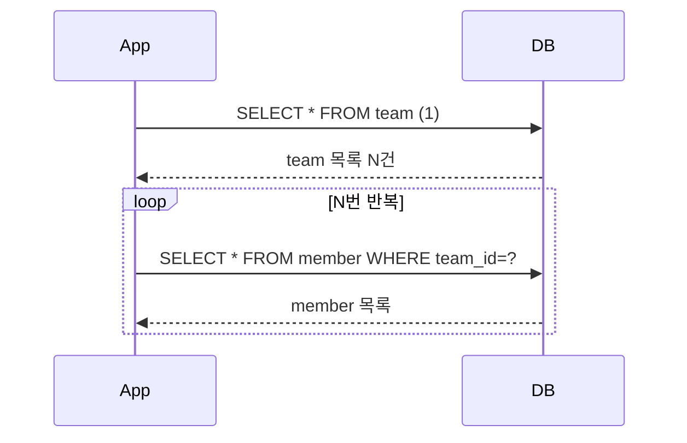

# N+1 문제

## 핵심 정의
N+1 문제는 부모 엔티티를 조회하는 쿼리 1번에 더해, 그 결과로 나온 N개의 부모 각각에 대해 연관 엔티티를 조회하는 쿼리가 추가로 N번 발생하는 현상이다. 즉 총 `1 + N`번의 쿼리가 실행된다. JPA/Hibernate 환경에서 연관관계를 다룰 때 가장 흔하게 발생하는 성능 문제이며, 지연 로딩·즉시 로딩 여부와 무관하게 발생할 수 있다(다만 발생 시점이 다르다).

## 동작 원리 / 구조

### 발생 흐름 예시
```java
List<Team> teams = teamRepository.findAll(); // 쿼리 1: SELECT * FROM team

for (Team team : teams) {
    System.out.println(team.getMembers().size()); // team마다 지연 로딩 초기화 -> 쿼리 N번
}
```



- **지연 로딩(LAZY)인 경우**: 미초기화 연관 상태가 필요할 때 추가 SELECT가 발생할 수 있다. 모든 getter 호출이 SQL은 아니다. 식별자 접근, 이미 초기화한 연관, 캐시·배치 로딩 여부에 따라 달라진다.
- **즉시 로딩(EAGER)인 경우**: 연관 데이터를 즉시 이용할 수 있어야 한다는 요구다. JOIN 하나로 가져오거나 별도 SELECT를 사용할 수 있으므로 EAGER 자체가 N+1의 발생 또는 해결을 보장하지 않는다. 부모 조회의 WHERE 조건이 무시된다는 뜻도 아니다.
- **조회 계획에 명시가 없을 때 발생**: JPQL은 엔티티 모델을 대상으로 provider가 해석한다. `join fetch`나 EntityGraph 없이 필요한 연관 데이터를 각각 초기화하면 추가 SQL이 생길 수 있다. 실제 횟수는 1·2차 캐시, 연관 대상 중복, 배치 로딩 등에 따라 달라진다.

### 해결 전략 비교
| 전략 | 방식 | 장점 | 한계 |
|---|---|---|---|
| Fetch Join | JPQL에 `join fetch` 명시 | 쿼리 1번으로 해결, 명확함 | 여러 bag의 동시 fetch 제한, 다중 to-many의 카테시안 곱, 컬렉션 페이징 주의 |
| `@EntityGraph` | 선언적으로 fetch 그래프 지정 | 리포지토리 메서드에 애너테이션만 추가 | SQL JOIN 사용은 provider 결정; 컬렉션 JOIN이면 같은 페이징/곱집합 위험 |
| `hibernate.default_batch_fetch_size` / `@BatchSize` | 지연 로딩을 `IN` 절 배치로 묶어서 조회 | 페이징과 함께 사용 가능, 컬렉션 여러 개도 안전 | 단순한 한 종류의 연관관계는 대략 `1 + ceil(N/배치크기)`; 캐시·로드 계획에 따라 달라짐 |
| DTO 직접 조회 | 처음부터 필요한 컬럼만 JOIN해서 DTO로 조회 | 쿼리 1번, 필요한 데이터만 전송 | 엔티티 재사용 불가, 조회 전용 코드 별도 관리 필요 |

## 실무 관점
- **가장 흔한 장애 패턴**: 리스트 API에서 데이터가 몇 건일 때는 안 보이다가, 운영 데이터가 늘어나면서 응답 시간이 급격히 느려지는 형태로 나타난다. 로컬 테스트 데이터가 적어 리뷰 단계에서 놓치기 쉽다.
- **탐지 방법**: `spring.jpa.properties.hibernate.generate_statistics=true` 로 통계를 켜거나, P6Spy/datasource-proxy 같은 쿼리 로깅 라이브러리로 실행 쿼리 수를 직접 확인하는 것이 가장 확실하다. 로그 레벨(`org.hibernate.SQL=DEBUG`)만으로는 반복 쿼리를 놓치기 쉽다.
- **연쇄 N+1**: 부모-자식-손자로 연관관계가 깊어지면 각 단계마다 N+1이 중첩되어 쿼리 수가 폭발적으로 늘어날 수 있다(`1 + N + N*M` 형태).
- **`@BatchSize`(또는 전역 `default_batch_fetch_size`) 설정값 선택**: 너무 작으면 배치 효과가 떨어지고, 너무 크면 `IN` 절이 비대해져 DB 옵티마이저에 부담을 줄 수 있다. DB의 파라미터 수 제한·조회량·메모리와 실행 계획을 측정해 정한다.
- **QueryDSL/JPQL DTO 프로젝션과의 조합**: 목록 화면처럼 읽기 전용이고 트래픽이 많은 API는 애초에 엔티티 그래프를 로딩하지 않고 필요한 컬럼만 조인해서 DTO로 바로 뽑는 것이 N+1 회피뿐 아니라 네트워크 전송량 면에서도 유리하다.
- **조회 수와 결과 완전성을 함께 확인**: HQL에서 fetch join한 컬렉션의 자식에 WHERE 조건을 걸면 조건에 맞는 일부 원소만 들어 있는 컬렉션이 초기화될 수 있다. 부모를 찾는 조건과 전체 컬렉션을 로딩하는 쿼리를 구분하거나, 부분 목록임을 드러내는 DTO 조회로 반환한다. SQL 1회라는 사실만으로 올바른 조회 계획이 되지는 않는다.

## 심화 Q&A

### Q. 왜 즉시 로딩(EAGER)으로 바꾸면 N+1이 해결된다고 오해하는가, 실제로는 어떤가?
EAGER는 로딩 시점 요구이지 SQL 형태의 지정이 아니다. 단건 조회와 JPQL 목록 조회에서 서로 다른 조회 계획을 사용할 수 있고 별도 SELECT도 가능하다. 필요한 데이터의 범위, JOIN 카디널리티, 실제 SQL 수를 조회 경로별로 확인한다.

### Q. fetch join과 페이징(`Pageable`)은 Hibernate 버전에 따라 어떻게 다른가?
컬렉션 JOIN의 행 수와 부모 엔티티 수는 다르다. Hibernate 6.x·7.4 이전은 컬렉션 fetch join의 페이징을 메모리에서 처리하는 경로가 있어 대량 적재가 문제였다. **7.4부터는 서브쿼리의 LIMIT/OFFSET을 지원하는 DB에서 부모를 SQL로 제한한 뒤 컬렉션을 fetch**한다. 따라서 모든 버전에서 메모리 페이징한다고 단정하면 안 된다. 공식 문서는 Sybase ASE를 미지원 예로 든다.

기존의 `hibernate.query.fail_on_pagination_over_collection_fetch=true`를 모든 컬렉션 페이징의 금지 스위치로 해석하지 않는다. 7.4에서 SQL로 처리 가능한 쿼리는 실행되며, 7.4.5의 `org.hibernate.limitInMemory=true` query hint는 이 보호 설정이 켜져 있어도 명시적으로 메모리 제한 경로를 선택했다(소스·실행 확인). 생성 SQL과 실제 적재량을 확인해야 한다.

지원 여부와 별개로 다중 컬렉션의 곱집합 비용·정렬의 유일성·count 쿼리는 남는다. 생성 SQL과 실행 계획을 확인하고, 구버전에서는 배치 로딩이나 ID 선조회 후 상세 조회를 검토한다. 두 단계 조회는 ID 순서를 상세 결과에도 보존하고 두 쿼리 사이 변경을 어떤 격리 수준으로 허용할지도 정한다.

### Q. `@BatchSize`를 적용해도 쿼리가 `1+1`로 줄지 않고 여전히 여러 번 나가는 이유는?
배치 사이즈는 N번의 개별 쿼리를 `ceil(N/배치사이즈)`번의 `IN` 절 쿼리로 묶어주는 것이지, 무조건 쿼리를 1번으로 만들어주는 게 아니다. 예를 들어 부모가 250건이고 배치 사이즈가 100이면, 자식 조회 쿼리는 3번(100, 100, 50) 나간다. 반대로 미초기화 대상이 배치 크기 이하면 관련 조회가 한 번에 처리되어 1+1이 될 수도 있다. 캐시와 provider의 배치 선택에 따라 실제 SQL 수가 달라진다.

### Q. `@OneToMany`와 `@ManyToOne` 중 어느 쪽에서 N+1이 더 자주 문제가 되는가?
어느 쪽이 더 흔한지는 데이터와 접근 패턴에 따라 다르다. to-one은 목록에서 작성자 등을 순회할 때, to-many는 부모마다 컬렉션을 순회할 때 문제가 드러난다. 특히 여러 부모가 같은 to-one 대상을 참조하면 캐시 때문에 추가 쿼리가 부모 수보다 적을 수 있다. 관계 종류별 빈도를 단정하기보다 실제 SQL 수와 카디널리티를 확인한다.

### Q. QueryDSL이나 JPQL에서 DTO로 직접 조회하면 N+1이 원천 차단되는 원리는?
엔티티 대신 필요한 스칼라 컬럼만 DTO로 매핑하면 DTO 자체에는 지연 로딩 프록시가 없어 이후 필드 접근으로 추가 SQL이 생기지 않는다. DTO 생성자 인자에 엔티티를 넣거나 후속 서비스 호출로 데이터를 보충하면 N+1이 다시 생길 수 있다. “DTO라는 타입을 썼다”가 아니라 실제 SELECT와 반환 객체 구성으로 판단한다.

### Q. N+1은 테스트 코드로 어떻게 조기에 잡을 수 있는가?
`getQueryExecutionCount()`만으로 모든 지연 로딩 SELECT를 셌다고 볼 수 없다. JDBC 레벨 SQL 계수기를 사용하거나, 초기화·캐시 상태를 통제한 테스트에서 `getPrepareStatementCount()` 증분과 entity/collection fetch 통계를 함께 확인한다. prepared statement 획득 횟수도 모든 환경에서 DB 왕복과 일대일은 아니므로 측정 대상을 명확히 한다.

## 관련 개념
- [[지연 로딩과 즉시 로딩]]
- [[JPA 영속성 컨텍스트]]

## 참고 자료

검증일: 2026-09-08. 적용 범위: Jakarta Persistence 3.2 및 Hibernate ORM 7.1의 fetch 계획과 통계.

- [Hibernate ORM User Guide](https://docs.hibernate.org/orm/7.1/userguide/html_single/) — fetch join, batch fetching, SQL 생성과 페이징.
- [MultipleBagFetchException](https://docs.hibernate.org/orm/7.1/javadocs/org/hibernate/loader/MultipleBagFetchException.html) — 동시에 여러 bag을 fetch하는 경우의 제한.
- [Statistics API](https://docs.hibernate.org/orm/7.1/javadocs/org/hibernate/stat/Statistics.html) — query 통계와 prepared statement 통계의 차이.
- [Jakarta Persistence 3.2](https://jakarta.ee/specifications/persistence/3.2/jakarta-persistence-spec-3.2) — 3.8 EntityGraph의 fetch 의미와 4장 constructor projection.
- [Hibernate QuerySettings](https://docs.hibernate.org/orm/7.1/javadocs/org/hibernate/cfg/QuerySettings.html) — 컬렉션 fetch join 메모리 페이징 실패 옵션.

부분 재검증: 2026-09-23. Jakarta Persistence 3.2의 로딩 계약, Hibernate 7.4의 컬렉션 fetch·페이징 변경을 확인했다. Boot 4.1.1 관리 버전인 ORM 7.4.5.Final·H2 2.4.240에서 N+1 계수, 필터링한 fetch 컬렉션의 불완전성, SQL 페이징과 메모리 페이징 보호 장치를 재현했다. ORM 7.4.10.Final에서도 같은 4건을 확인했고, 7.1.0.Final에서는 해당 페이징이 보호 설정에 의해 거부됨을 포함한 3건을 확인했다(7.4 전용 hint 검사는 제외). 실제 운영 DB의 실행 계획을 검증한 것은 아니다. 기존 7.1 적용 설명과 7.4 차이를 구분하며 전체 `verified`는 유지한다.

- [Hibernate ORM 7.4 What's New](https://docs.hibernate.org/orm/7.4/whats-new/) — 컬렉션 fetch join과 SQL LIMIT/OFFSET 지원 조건.
- [Hibernate ORM 7.4 Migration Guide](https://docs.hibernate.org/orm/7.4/migration-guide/) — `org.hibernate.limitInMemory` 호환 힌트.
- [Hibernate ORM 7.4 Query Language Guide](https://docs.hibernate.org/orm/7.4/querylanguage/html_single/Hibernate_Query_Language.html) — fetch 대상 제한 시 불완전 컬렉션, 다중 컬렉션 곱집합.
- [SqmSelectionQueryImpl 7.4.5 소스](https://github.com/hibernate/hibernate-orm/blob/7.4.5/hibernate-core/src/main/java/org/hibernate/query/sqm/internal/SqmSelectionQueryImpl.java) — 명시적 limitInMemory 경로가 자동 메모리 제한 검사와 구분됨.
