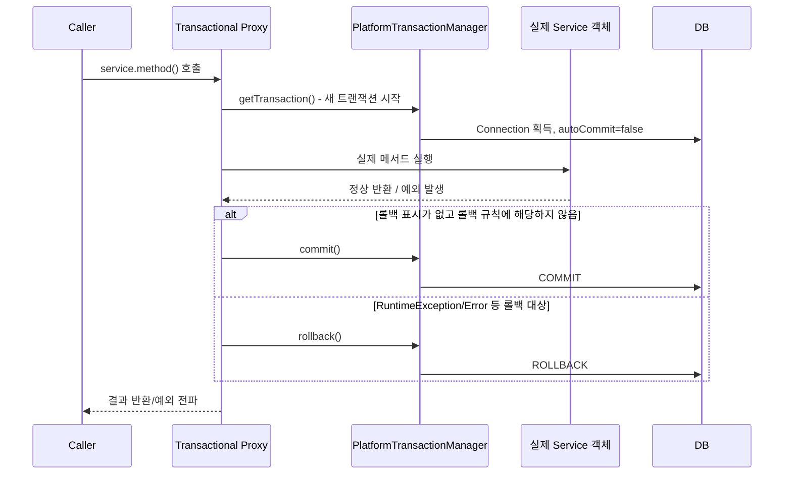

# Transactional 동작 원리

## 핵심 정의
`@Transactional`은 메서드 실행 전후로 트랜잭션을 시작/커밋/롤백하는 코드를 개발자가 직접 작성하지 않아도 되게 해주는 선언적 트랜잭션 관리(Declarative Transaction Management) 기능이다. Spring은 이를 AOP(Aspect-Oriented Programming) 기반 프록시로 구현한다. 즉 `@Transactional`이 붙은 빈은 실제로는 원본 객체가 아니라, 트랜잭션 처리 로직을 감싼 프록시 객체로 컨테이너에 등록되어 호출된다.

## 동작 원리 / 구조

### 프록시 생성과 호출 흐름

아래는 동기 JDBC에서 새 물리 트랜잭션을 시작하는 대표 흐름이다. 기존 트랜잭션에 참여한 내부 메서드는 종료 시 물리 COMMIT을 수행하지 않는다. rollback-only 표시·커밋 자체의 실패는 아래 예외 규칙과 별도로 고려하며, 실제 커넥션 획득 시점은 지연 획득 설정에 따라 다르다. `ReactiveTransactionManager`는 Reactor Context를 사용하므로 이 ThreadLocal 모델과 구분한다.
Spring은 빈 후처리기(`BeanPostProcessor`)의 일종인 `InfrastructureAdvisorAutoProxyCreator`(트랜잭션 관련 어드바이저를 처리)를 통해, `@Transactional`이 붙은 빈에 대해 프록시를 생성한다.
- 대상 클래스가 인터페이스를 구현하면 기본적으로 JDK 동적 프록시(interface 기반)
- 인터페이스가 없거나 클래스 기반 프록시를 강제하면(`proxyTargetClass=true`, Spring Boot는 기본적으로 CGLIB 계열을 기본으로 사용하도록 설정됨) CGLIB 기반 클래스 상속 프록시



핵심 구성 요소:
- `PlatformTransactionManager` (JPA 환경에서는 보통 `JpaTransactionManager`): 실제 트랜잭션 시작/커밋/롤백을 담당하는 추상화. 데이터 접근 기술(JDBC, JPA, 여러 리소스를 다루는 JTA 등)에 따라 구현체가 다르다.
- `TransactionInterceptor`: 프록시가 호출을 가로챈 뒤 `PlatformTransactionManager`를 이용해 트랜잭션 경계를 관리하는 AOP 어드바이스.
- `TransactionAttribute`: `@Transactional`의 속성(propagation, isolation, timeout, readOnly, rollbackFor 등)을 담은 메타데이터.

### 프록시 기반이기 때문에 생기는 제약
- **자기 호출(self-invocation) 무시**: 같은 클래스 내부에서 `this.method()`로 호출하면 프록시를 거치지 않아 트랜잭션이 적용되지 않는다.
- **클래스 기반 프록시의 제약**: CGLIB는 `private`·`final` 메서드를 가로챌 수 없다. JDK 프록시는 인터페이스 호출을 가로채므로 target 구현 메서드가 final이라는 이유만으로 적용 불가가 되는 것은 아니다.
- **생성자에는 적용 불가**: 프록시가 생성되기 전 시점이므로 생성자 로직에는 트랜잭션이 걸리지 않는다.

### 예외와 롤백 규칙
기본 동작:
- `RuntimeException`과 `Error`가 발생하면 롤백
- 체크 예외(`Exception`을 상속하지만 `RuntimeException`이 아닌 것)는 커밋

이 규칙은 `rollbackFor`, `noRollbackFor` 속성으로 바꿀 수 있다. Spring 6.2부터는 `@EnableTransactionManagement(rollbackOn = RollbackOn.ALL_EXCEPTIONS)`로 체크 예외도 롤백하는 전역 기본 규칙을 선택할 수 있다. 메서드별 명시 규칙이 우선하며, DB/JPA가 이미 rollback-only로 표시했다면 정상 반환이나 체크 예외라고 커밋이 보장되지는 않는다.

```java
@Transactional(rollbackFor = Exception.class) // 체크 예외에서도 롤백하도록 확장
public void process() throws IOException { ... }
```

## 실무 관점
- **`readOnly = true` 튜닝**: Hibernate의 flush 모드·읽기 전용 엔티티 처리와 JDBC read-only 힌트에 활용된다. 효과와 쓰기 차단 여부는 매니저·드라이버·DB에 따라 다르다. 이 속성만으로 읽기 replica가 자동 선택되지는 않으며, 별도의 DataSource 라우팅과 커넥션 획득 시점 설계가 필요하다.
- **트랜잭션은 필요한 비즈니스 작업의 경계에 둔다**: 보통 서비스에서 설정하면 웹 처리와 분리하기 쉽다. 컨트롤러에 붙여도 트랜잭션은 해당 메서드 반환 시 종료되며 이후 뷰 렌더링·응답 직렬화까지 자동으로 감싸지 않는다. 메서드 안의 외부 API 호출 등은 트랜잭션과 커넥션 점유 시간을 늘릴 수 있다.
- **메서드 가시성은 프록시 방식과 버전에 따라 다르다**: Spring 6.0부터 기본 클래스 기반 트랜잭션 프록시는 protected·package-visible 메서드도 처리한다. JDK 프록시는 public 인터페이스 메서드여야 한다. `publicMethodsOnly=true`로 제한한 설정인지도 확인한다. 모든 경우 실제 호출이 프록시를 거쳐야 한다.
- **테스트 코드의 자동 롤백 범위**: 테스트 관리 트랜잭션에 참여한 변경은 기본적으로 종료 시 롤백된다. 다른 스레드·실제 HTTP 서버·REQUIRES_NEW가 독립적으로 커밋한 데이터까지 정리되지는 않는다. 실제 커밋 이후 이벤트와 새 트랜잭션에서의 조회는 [[Spring 테스트 트랜잭션과 커밋 검증]]처럼 별도로 검증한다.
- **`@Async`, `@Transactional`을 같은 메서드에 함께 사용할 때의 함정**: 둘 다 프록시 기반 AOP라 동작 순서가 프록시 체인에 좌우되며, 비동기로 실행된 스레드는 원래 스레드의 트랜잭션(스레드 로컬 기반 `TransactionSynchronizationManager`)을 이어받지 못한다. 새로운 트랜잭션이 필요하면 명시적으로 설계해야 한다.

## 심화 Q&A

### Q. `@Transactional`이 걸린 메서드를 같은 클래스의 다른 `@Transactional` 메서드에서 호출하면 왜 새 트랜잭션이 안 생기는가?
Spring AOP는 프록시를 통해서만 부가 기능을 적용한다. 클래스 내부에서 `this.innerMethod()`처럼 호출하면 컴파일 시점에 이미 원본 객체의 메서드를 직접 호출하는 바이트코드가 생성되어 프록시를 거치지 않는다. 그 결과 `innerMethod()`에 설정된 전파 옵션(REQUIRES_NEW 등)이 완전히 무시되고 외곽 트랜잭션 컨텍스트 안에서 그대로 실행된다. 해결책은 해당 메서드를 별도 빈으로 분리해 외부에서 프록시를 통해 호출되도록 만드는 것이다.

### Q. 트랜잭션 매니저가 여러 개(JPA + JDBC 등) 등록된 상태에서 `@Transactional`은 어떤 매니저를 쓰는가?
한 개의 후보 또는 명시된 기본 매니저를 사용한다. 여러 후보가 있으면 `@Transactional("txManagerBeanName")`, qualifier, `@Primary`, `TransactionManagementConfigurer` 등으로 선택 규칙을 명확히 한다. 모호한 구성의 실패가 항상 기동 시점에 드러나는 것은 아니며 첫 메서드 호출에서 발생할 수도 있다. 여러 DataSource의 로컬 매니저를 등록했다고 하나의 원자적 트랜잭션이 되지는 않는다. 여러 리소스를 원자적으로 묶을 때는 지원되는 JTA/XA 구성, 원자성이 필요하지 않을 때는 outbox나 보상 흐름을 검토한다.

### Q. 프록시 방식(런타임 AOP)과 AspectJ 컴파일 타임 위빙 방식의 `@Transactional`은 자기 호출 문제에서 차이가 있는가?
있다. AspectJ의 컴파일 타임/로드 타임 위빙은 바이트코드 자체에 어드바이스를 삽입하므로 프록시를 거치지 않는 자기 호출에도 트랜잭션이 적용된다. 다만 빌드 파이프라인에 위빙 과정을 추가해야 하는 복잡성이 있어, 대부분의 Spring Boot 프로젝트는 기본 프록시 방식을 그대로 쓰고 자기 호출 문제는 설계로 회피하는 쪽을 선택한다.

### Q. `@Transactional(readOnly = true)`로 표시했는데 내부에서 실제로 INSERT를 실행하면 어떻게 되는가?
매니저·드라이버 설정에 따라 다르므로 “언제나 힌트에 그친다”거나 “모든 쓰기를 막는다”고 단정하지 않는다. 예를 들어 Spring Framework 7.0.9의 `DataSourceTransactionManager`와 pgJDBC 42.7.13의 기본 `readOnlyMode=transaction` 조합은 autoCommit=false인 읽기 전용 트랜잭션을 `BEGIN READ ONLY`로 시작한다. PostgreSQL 18은 이 상태에서 일반 테이블 INSERT를 SQLSTATE `25006`으로 거부한다.

같은 드라이버라도 `readOnlyMode=ignore`이면 JDBC 힌트만으로 차단되지 않는다. `DataSourceTransactionManager.setEnforceReadOnly(true)`는 별도 `SET TRANSACTION READ ONLY`를 실행하며, 해당 SQL을 지원하는 DB에서 강제할 수 있다. 이미 시작된 쓰기 트랜잭션에 REQUIRED로 합류하는 경우나 Hibernate의 변경 감지 최적화는 별도 문제다. 운영과 같은 매니저·연결 설정에서 실제 쓰기 시도를 검증하고, 권한 통제가 필요하면 DB 계정 권한도 설계한다.

### Q. `TransactionSynchronizationManager`는 어떤 역할을 하며 왜 필요한가?
현재 스레드에 진행 중인 트랜잭션 관련 리소스(커넥션, 동기화 콜백 목록 등)를 스레드 로컬(ThreadLocal)로 보관하는 역할을 한다. 같은 스레드 안에서 여러 리포지토리/매니저가 동일한 커넥션을 공유하도록 만들어주는 핵심 메커니즘이며, `@TransactionalEventListener`가 커밋/롤백 시점을 알 수 있는 것도 이 동기화 콜백 등록 덕분이다. 스레드 로컬 기반이기 때문에 비동기 스레드나 별도 스레드 풀로 작업이 넘어가면 트랜잭션 컨텍스트가 함께 전파되지 않는다는 한계가 여기서 비롯된다.

### Q. 체크 예외에서는 기본적으로 롤백되지 않는다는 규칙이 실무에서 왜 자주 문제가 되는가?
외부 API 클라이언트나 파일 I/O 코드가 체크 예외(`IOException` 등)를 던지도록 설계된 경우, 이를 서비스 메서드에서 그대로 전파시키면 트랜잭션이 커밋되어 DB에는 이미 일부 변경이 반영된 채로 예외만 호출자에게 전달되는 상황이 생긴다. 이는 "예외가 발생했으니 당연히 롤백됐겠지"라는 직관과 어긋나는 대표적인 함정이라, 체크 예외를 다루는 트랜잭션 메서드에는 `rollbackFor`를 명시하거나 체크 예외를 런타임 예외로 감싸 던지는 컨벤션을 팀 차원에서 정해두는 것이 안전하다.

## 관련 개념
- [[트랜잭션 전파와 격리]]
- [[JPA 영속성 컨텍스트]]
- [[프록시 기반 AOP 동작 원리]]

## 참고 자료

부분 재검증: 2026-09-23. Framework 7.0.9의 TestContext 기본 롤백·별도 스레드·REQUIRES_NEW 경계를 확인하고 H2 재현 테스트를 실행했다. 아래 기존 proxy·JPA 전체 검증 범위는 2026-09-08을 유지한다.

- [TestContext transaction management](https://docs.spring.io/spring-framework/reference/testing/testcontext-framework/tx.html) — 테스트 관리 트랜잭션과 애플리케이션 트랜잭션의 구분.

검증일: 2026-09-08. 적용 범위: Spring Framework 6.2·7.0의 기본 proxy 모드와 동기 JDBC/JPA 트랜잭션.

- [Using @Transactional](https://docs.spring.io/spring-framework/reference/data-access/transaction/declarative/annotations.html) — 가시성, 기본 속성, rollbackOn, 매니저 지정.
- [Transaction Propagation](https://docs.spring.io/spring-framework/reference/data-access/transaction/declarative/tx-propagation.html) — 참여 트랜잭션과 rollback-only.
- [JpaTransactionManager API](https://docs.spring.io/spring-framework/docs/current/javadoc-api/org/springframework/orm/jpa/JpaTransactionManager.html) — 리소스 바인딩과 JDBC/JPA 경계.

부분 재검증: 2026-10-04. Framework 7.0.9·pgJDBC 42.7.13·PostgreSQL 18.6의 독립 로컬 트랜잭션에서 기본 readOnlyMode의 INSERT 거부, ignore의 쓰기 허용, ignore+enforceReadOnly의 거부를 JUnit 2건으로 실행했다. 각 트랜잭션의 `SHOW transaction_read_only`와 SQLSTATE·최종 저장 결과를 확인했다. JPA·다른 DB·사용자 지정 풀 전체의 동작을 검증한 것은 아니다.

- [pgJDBC 연결 설정](https://jdbc.postgresql.org/documentation/use/#connection-parameters) / [42.7.13 PGProperty](https://github.com/pgjdbc/pgjdbc/blob/REL42.7.13/pgjdbc/src/main/java/org/postgresql/PGProperty.java) — readOnlyMode의 기본값·BEGIN READ ONLY 조건.
- [DataSourceTransactionManager 7.0.9 API](https://docs.spring.io/spring-framework/docs/7.0.9/javadoc-api/org/springframework/jdbc/datasource/DataSourceTransactionManager.html#setEnforceReadOnly(boolean)) — JDBC 힌트와 명시 SQL 강제의 차이.
- [PostgreSQL 18 SET TRANSACTION](https://www.postgresql.org/docs/18/sql-set-transaction.html) — 읽기 전용 트랜잭션의 명령 제한과 임시 테이블 예외.
- [AbstractPlatformTransactionManager 7.0.9 소스](https://raw.githubusercontent.com/spring-projects/spring-framework/v7.0.9/spring-tx/src/main/java/org/springframework/transaction/support/AbstractPlatformTransactionManager.java) — 2026-10-04 도식 대조: 참여 트랜잭션과 새 물리 트랜잭션의 commit 경계, rollback-only 분기.
