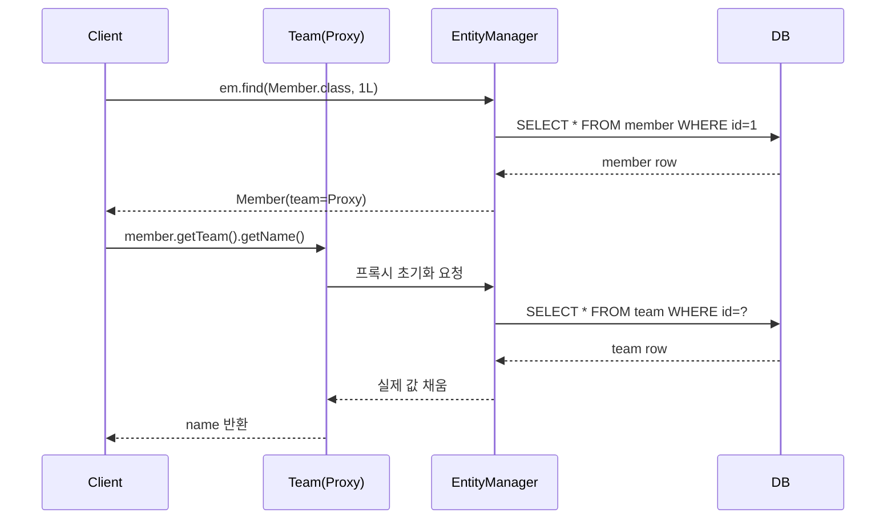

# 지연 로딩과 즉시 로딩

## 핵심 정의
지연 로딩(Lazy Loading)과 즉시 로딩(Eager Loading)은 JPA 연관관계 상태를 언제 로드해야 하는지에 관한 전략이다. LAZY는 사용 시점까지 로딩을 미루도록 하는 힌트이며 프록시·컬렉션 래퍼·바이트코드 강화 등으로 구현한다. EAGER는 반환 시 필요한 연관 상태가 로드돼야 한다는 요구이지 반드시 하나의 SQL JOIN으로 가져오라는 지시는 아니다.

JPA 표준 기본 페치(fetch) 전략은 `@ManyToOne`, `@OneToOne`은 `EAGER`, `@OneToMany`, `@ManyToMany`는 `LAZY`이다. 다만 이 기본값을 그대로 쓰는 경우는 실무에서 드물고, 대부분 모든 연관관계를 `LAZY`로 명시하고 필요한 곳에서만 조회 전략을 조절하는 방식을 권장한다.

## 동작 원리 / 구조

### 지연 로딩: 프록시 기반
Hibernate는 미로딩 to-one 연관관계에 엔티티 프록시를 사용하거나, 바이트코드 강화로 엔티티의 필드 접근을 감지한다. 컬렉션은 PersistentCollection 같은 래퍼로 처리하므로 모든 LAZY 연관관계가 같은 프록시 방식은 아니다. 식별자 접근은 보통 초기화를 요구하지 않지만 다른 상태가 필요해지면 열려 있는 Session을 통해 로딩한다.



```java
@Entity
public class Member {
    @Id @GeneratedValue
    private Long id;

    @ManyToOne(fetch = FetchType.LAZY) // 명시적으로 LAZY 지정
    @JoinColumn(name = "team_id")
    private Team team;
}
```

### 즉시 로딩: 로딩 시점의 요구
EAGER는 요구되는 시점까지 데이터를 로딩해야 한다는 계약이며 SQL JOIN을 강제하지 않는다. provider는 조인 또는 별도 SELECT를 선택할 수 있다. LAZY는 표준상 힌트이므로 매핑·provider가 지연 처리를 지원하지 않으면 미리 로딩될 수 있다. 실제 SQL은 매핑, 쿼리, EntityGraph와 실행 계획을 함께 확인한다.

### 프록시 관련 주의 사항
- `getClass()`로 실제 엔티티 타입을 단정하지 않는다. 특히 다형적 연관관계의 미초기화 프록시는 구체 하위 타입을 아직 모르므로 `instanceof`도 원하는 판별이 아닐 수 있다. 필요하면 `Hibernate.getClass()`/`unproxy()`를 사용하되 초기화 부작용을 고려한다.
- `equals()/hashCode()`를 구현할 때 프록시를 고려하지 않으면 동등성 비교가 깨질 수 있다.
- null 여부는 직접 null 검사로 확인하고, `Hibernate.isInitialized()`는 프록시·컬렉션의 로딩 상태 확인에 사용한다. 이 메서드의 true가 “연관 엔티티가 존재한다”는 뜻은 아니다.

## 실무 관점
- **조회 계획**: LAZY 매핑을 출발점으로 필요한 데이터는 fetch join, `@EntityGraph`, 배치 로딩으로 선택한다. EAGER도 fetch join 등으로 최적화할 수 있지만 여러 조회 경로에서 불필요한 로딩을 만들기 쉬워 조정 비용이 커진다. 어느 방식도 매핑만으로 SQL 횟수·JOIN 형태를 보장하지 않는다.
- **`@ManyToOne`/`@OneToOne` 기본값 EAGER 함정**: 매핑 시 `fetch` 속성을 빼먹으면 기본이 EAGER라서, 연쇄적으로 연관 엔티티까지 즉시 로딩되어 예상치 못한 쿼리가 발생할 수 있다. 코드 리뷰에서 자주 걸리는 포인트다.
- **`LazyInitializationException`**: 사용 가능한 Session이 닫힌 뒤 컨트롤러나 뷰에서 미초기화 지연 로딩 필드에 접근하면 발생한다. OSIV를 켜서 우회하기보다는, 서비스 계층에서 필요한 데이터를 DTO로 미리 조립해 반환하는 방식을 권장한다.
- **컬렉션 지연 로딩과 `hibernate.default_batch_fetch_size`**: `@OneToMany` 컬렉션을 여러 엔티티에서 지연 로딩할 때 발생하는 N+1을 줄이기 위해 배치 사이즈를 설정하면, `IN` 절을 이용해 여러 부모의 자식을 한 번에 가져온다.
- **JSON 직렬화 시 지연 로딩 폭탄**: 컨트롤러에서 엔티티를 그대로 JSON으로 반환하면 Jackson이 프록시 필드에 접근해 지연 로딩을 유발하거나, `LazyInitializationException`으로 500 에러가 나는 경우가 흔하다. DTO 변환을 강제하는 이유 중 하나다.

## 심화 Q&A

### Q. to-one 관계가 하나뿐인데도 기본 EAGER가 부담이 되는 이유는?
부모 한 건의 to-one 대상은 최대 한 건이지만 부모 목록 N건에서는 서로 다른 대상 N건을 추가 조회할 수 있다. 선택적 연관관계는 대상이 없을 수도 있다. to-many는 컬렉션 크기까지 커져 전송량이 더 늘 수 있으므로 실제 사용 경로와 카디널리티를 기준으로 로딩 계획을 정한다. 명세가 정한 기본값과 그 선택 배경에 대한 추측은 구분한다.

### Q. fetch join과 `@EntityGraph`는 무엇이 다른가?
fetch join은 쿼리에 연관관계 fetch를 명시한다. EntityGraph는 로딩해야 할 속성 집합을 선언하며, fetch graph와 load graph는 명시하지 않은 속성을 다루는 규칙이 다르다. EntityGraph가 반드시 하나의 JOIN SQL이 된다는 보장은 없다. Hibernate가 to-many를 JOIN으로 로딩한다면 두 방식 모두 카테시안 곱과 컬렉션 페이징 문제를 검토해야 한다.

### Q. 컬렉션에 대해 fetch join을 두 개 이상 동시에 사용하면 어떤 문제가 생기는가?
Hibernate에서 여러 bag을 동시에 fetch하면 `MultipleBagFetchException`이 발생할 수 있다. 모든 List나 모든 컬렉션 두 개가 무조건 금지되는 것은 아니다. 예외가 없는 Set·인덱스 기반 List 조합도 여러 to-many를 한꺼번에 JOIN하면 카테시안 곱이 커질 수 있으므로, 단순히 Set으로 바꾸는 것을 성능 해결책으로 보지 않는다. 하나만 fetch하고 나머지를 별도 조회·배치로 처리하는 방식을 비교한다.

### Q. 지연 로딩된 프록시 객체를 트랜잭션 밖으로 반환하면 항상 예외가 나는가?
반환 자체는 초기화를 요구하지 않는다. 문제는 Session이 닫힌 미초기화 프록시의 데이터를 읽을 때 발생한다. 단순 null 검사는 괜찮지만 로그의 `toString()`·디버거 표현식도 초기화를 유발할 수 있어 안전하다고 가정하지 않는다. OSIV 등으로 Session이 열려 있는 경우와 이미 초기화된 값도 구분한다.

### Q. `Hibernate.initialize()`는 언제 쓰는가?
트랜잭션이 살아있는 동안 특정 지연 로딩 필드를 명시적으로 미리 초기화해두고 싶을 때 사용한다. 예를 들어 서비스 계층에서 DTO로 변환하기 직전에 `Hibernate.initialize(member.getTeam())`을 호출해두면, 이후 Session이 닫혀도 이미 초기화된 값이라 `LazyInitializationException` 없이 접근할 수 있다. 다만 컬렉션 초기화가 내부 엔티티의 모든 연관관계까지 초기화한다는 보장은 없고, 반복 호출은 N+1을 만들 수 있으므로, fetch join이 어려운 특수한 경우에 한정해 쓰는 것이 좋다.

### Q. 즉시 로딩이 성능에 유리한 경우도 있는가?
연관 데이터가 항상 함께 사용되고, 카디널리티가 낮고 고정적인 경우(예: 거의 모든 화면에서 함께 노출되는 1:1 설정 값성 데이터)라면 즉시 로딩이 오히려 별도 쿼리 왕복을 줄여 유리할 수 있다. 다만 이런 케이스도 매핑 자체를 EAGER로 고정하기보다, LAZY로 두고 조회 지점에서 fetch join으로 필요할 때만 즉시 로딩하는 편이 유연성과 성능을 동시에 잡을 수 있어 더 권장된다.

## 관련 개념
- [[JPA 영속성 컨텍스트]]
- [[N+1 문제]]

## 참고 자료

부분 재검증: 2026-09-22. Jakarta Persistence 3.2의 fetch 계약·optional 연관관계와 Hibernate ORM 7.1의 동적 fetch 계획을 대조해 EAGER 최적화 불가라는 단정과 기본값 배경의 추측을 제거했다.

검증일: 2026-09-08. 적용 범위: Jakarta Persistence 3.2 및 Hibernate ORM 7.1.

- [Jakarta Persistence 3.2](https://jakarta.ee/specifications/persistence/3.2/jakarta-persistence-spec-3.2) — 매핑별 fetch 기본값, LAZY 힌트와 EAGER 요구, EntityGraph.
- [Hibernate API](https://docs.hibernate.org/orm/7.1/javadocs/org/hibernate/Hibernate.html) — 프록시/바이트코드 강화, 초기화 및 타입 판별.
- [MultipleBagFetchException](https://docs.hibernate.org/orm/7.1/javadocs/org/hibernate/loader/MultipleBagFetchException.html) — 동시 bag fetch 제한.
- [Hibernate ORM User Guide](https://docs.hibernate.org/orm/7.1/userguide/html_single/) — fetch join, 컬렉션 페이징과 로딩 전략.
