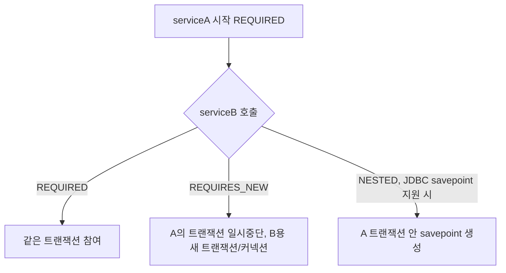

# 트랜잭션 전파와 격리

## 핵심 정의
트랜잭션 전파(Propagation)는 이미 진행 중인 트랜잭션이 있을 때, 새로 시작되는 메서드(트랜잭션 경계)가 그 트랜잭션에 어떻게 합류할지를 결정하는 규칙이다. 트랜잭션 격리(Isolation)는 동시에 실행되는 여러 트랜잭션이 서로의 변경 내용을 어느 수준까지 볼 수 있게 허용할지를 정하는 수준이다. 전파는 "트랜잭션 경계를 어떻게 나눌 것인가"의 문제이고, 격리는 "동시성 이상 현상을 얼마나 허용할 것인가"의 문제로, 서로 독립적인 축이다.

Spring의 `@Transactional`은 전파 기본값이 `REQUIRED`, 격리 기본값이 `DEFAULT`(사용 중인 DB 드라이버의 기본 격리 수준을 그대로 사용)다.

## 동작 원리 / 구조

### 전파 옵션
| 옵션 | 동작 |
|---|---|
| REQUIRED (기본값) | 기존 트랜잭션이 있으면 참여, 없으면 새로 생성 |
| REQUIRES_NEW | 기존 트랜잭션을 일시 중단(suspend)하고 완전히 새로운 트랜잭션 생성 |
| NESTED | JDBC savepoint를 지원하는 매니저·드라이버에서는 기존 트랜잭션 안에 savepoint 생성. 기존 트랜잭션이 없으면 REQUIRED와 동일 |
| MANDATORY | 기존 트랜잭션이 반드시 있어야 하며, 없으면 예외 발생 |
| SUPPORTS | 기존 트랜잭션이 있으면 참여, 없으면 트랜잭션 없이 실행 |
| NOT_SUPPORTED | 기존 트랜잭션을 일시 중단하고 트랜잭션 없이 실행 |
| NEVER | 트랜잭션이 있으면 예외 발생 |

- **REQUIRES_NEW**는 독립된 물리 트랜잭션을 사용한다. 동기 JDBC에서는 외곽 커넥션을 보유한 채 내부용 커넥션을 추가로 얻을 수 있다. 내부 롤백 상태 자체는 외곽에 전파되지 않지만, 내부 예외가 외곽 경계까지 전파되면 외곽도 자신의 롤백 규칙에 따라 롤백될 수 있다.
- **NESTED**는 지원되는 JDBC 매니저에서 같은 물리 트랜잭션의 savepoint로 부분 롤백한다. JPA 자체는 중첩 트랜잭션을 지원하지 않는다. `JpaTransactionManager`의 `nestedTransactionAllowed`는 기본 false이며, true로 켜는 것만으로 provider의 savepoint 지원이 생기지는 않는다. Framework 7.0.9의 기본 `HibernateJpaDialect`·Hibernate 7.4.5.Final 조합은 이 플래그를 켜도 활성 JPA 트랜잭션의 NESTED 진입을 `NestedTransactionNotSupportedException`으로 거부했다. JDBC savepoint를 직접 사용해도 EntityManager의 엔티티 상태까지 되돌려주지는 않는다.
- REQUIRED의 내부 논리 경계에서 롤백 대상 예외가 프록시 밖으로 나가면 공유 물리 트랜잭션이 rollback-only로 표시될 수 있다. 이를 외곽 메서드가 catch해도 플래그가 해제되지 않으므로 최종 커밋에서 `UnexpectedRollbackException`이 발생한다. 반대로 내부 메서드 본문에서 예외를 잡아 프록시에 전달하지 않았다면 Spring의 예외 규칙만으로 자동 마킹되지는 않는다. 단, DB/JPA가 자체적으로 트랜잭션을 실패 상태로 만들 수는 있다.

### 격리 수준
| 수준 | Dirty Read | Non-repeatable Read | Phantom Read |
|---|---|---|---|
| READ_UNCOMMITTED | 발생 가능 | 발생 가능 | 발생 가능 |
| READ_COMMITTED | 방지 | 발생 가능 | 발생 가능 |
| REPEATABLE_READ | 방지 | 방지 | 발생 가능(구현체에 따라 방지되기도 함) |
| SERIALIZABLE | 방지 | 방지 | 방지 |

- PostgreSQL 18의 기본 격리 수준은 READ_COMMITTED, MySQL 8.4 InnoDB의 기본값은 REPEATABLE_READ다. 서버·세션·커넥션 풀 설정으로 바꿀 수 있으므로 `Isolation.DEFAULT`는 고정된 특정 수준이 아니라 실제 리소스의 설정을 따른다는 뜻이다. 표는 표준 최소 보장을 요약하며 구현체는 더 강하게 보장할 수 있다.
- 격리 수준은 트랜잭션이 새로 시작될 때만 적용된다. 이미 시작된 트랜잭션에 REQUIRED로 참여하는 메서드에 다른 격리 수준을 지정해도 무시된다(외곽 트랜잭션의 격리 수준을 따름). 이를 엄격히 검증하려면 `AbstractPlatformTransactionManager.setValidateExistingTransaction(true)`를 설정해 불일치 시 예외를 던지게 할 수 있다.

### REQUIRES_NEW의 일시 중단은 DB 잠금 해제가 아니다

Spring Framework 7.0.9의 `JpaTransactionManager`·`DataSourceTransactionManager`에서 suspend는 외부 리소스를 현재 실행 문맥에서 분리해 보관하는 동작이다. 외부 트랜잭션을 커밋·롤백하거나 연결을 반환하는 동작이 아니다. 예를 들어 PostgreSQL 18에서는 다음 흐름이 가능하다.

1. 외부 트랜잭션 A가 `SELECT ... FOR UPDATE`로 재고 행을 잠근다.
2. A가 다른 빈의 `REQUIRES_NEW` 메서드 B를 동기 호출한다. B는 별도 연결·트랜잭션을 얻는다.
3. B가 같은 행을 갱신하려 하면 A의 잠금 해제를 기다린다. A는 B의 반환을 기다리므로 자기 커밋까지 진행하지 못한다.

이는 커넥션 풀에 여유가 있어도 생긴다. DB에는 B→A 잠금 대기만 보이고 A→B는 Java 호출 대기이므로, DB의 순환 잠금 데드락 탐지만으로 해소될 것이라고 기대하면 안 된다. 잠금·문장 타임아웃을 두고, 외부가 잠근 행에 내부 독립 트랜잭션이 다시 접근하지 않도록 업무 경계를 바꾼다. 부모 작업의 성공 이후에 실행해도 되는 후속 처리는 커밋 후 처리나 아웃박스와 함께 검토한다.

## 실무 관점
- **REQUIRES_NEW 남용 주의**: 별도 커넥션을 새로 점유하므로 커넥션 풀 고갈 위험이 있고, 중첩 호출이 많아지면 데드락 가능성도 커진다. "이 작업은 부모 트랜잭션 성공 여부와 무관하게 반드시 커밋되어야 한다"는 명확한 요구가 있을 때만 사용한다(예: 알림 발송 이력, 감사 로그).
- **같은 클래스 내부 메서드 호출 시 전파가 적용되지 않는 문제**: 프록시 모드에서 `this.methodB()`는 프록시를 거치지 않아 내부 메서드의 `REQUIRES_NEW` 등이 적용되지 않는다. 별도 빈으로 분리하거나 `TransactionTemplate`으로 경계를 명시한다. `AopContext.currentProxy()`는 `exposeProxy=true`와 현재 프록시 호출 문맥이 필요하며 프레임워크 결합도 생기므로 일반적인 첫 선택으로 삼지 않는다.
- **SERIALIZABLE의 비용과 재시도**: DB는 잠금 또는 직렬화 충돌 탐지 등으로 이를 구현한다. 충돌 빈도와 쿼리에 따라 대기·실패·처리량이 달라지므로 항상 급격히 느리다고 단정하지 않는다. 직렬화 실패를 처리할 때는 트랜잭션 전체를 재시도하도록 설계한다.
- **재고·포인트 갱신**: 원자적 조건부 UPDATE, 제약조건, `@Version`, `SELECT ... FOR UPDATE`, SERIALIZABLE 중 보존할 불변식에 맞는 방법을 선택한다. 격리 수준은 읽기 이상만 다루고 갱신 충돌은 반드시 별도 락으로 막아야 한다는 구분은 부정확하다.
- **트랜잭션 경계와 예외 처리**: `@Transactional`은 기본적으로 `RuntimeException`(및 `Error`)에서만 롤백하고 체크 예외(checked exception)에서는 커밋한다. 체크 예외까지 롤백하려면 `rollbackFor` 또는 Spring 6.2 이후의 전역 `rollbackOn` 정책을 사용하며, 이를 놓쳐서 "예외가 났는데 커밋됐다"는 장애가 종종 발생한다.

## 심화 Q&A

### Q. REQUIRED로 묶인 트랜잭션에서 내부 호출의 예외를 외곽 메서드가 try-catch로 삼켰는데도 왜 전체가 롤백되는가?
내부 Bean의 프록시가 롤백 대상 예외를 관찰해 공유 트랜잭션을 rollback-only로 만든 뒤, 호출한 외곽 메서드가 예외를 catch한 경우다. 내부 본문에서 먼저 catch한 경우와 다르다. 부분 실패를 허용하려면 별도 트랜잭션이나 지원되는 savepoint를 설계하고, 예외가 외곽으로 전파되는 경계도 제어해야 한다. 단순히 try-catch 위치를 바꿔 DB/JPA의 실패 상태를 복구할 수 있다고 가정하지 않는다.

### Q. NESTED와 REQUIRES_NEW는 실패 시 롤백 범위가 비슷해 보이는데 어떻게 구분해서 써야 하는가?
NESTED는 같은 물리 트랜잭션/커넥션 안의 savepoint이므로 커넥션 자원을 추가로 쓰지 않고, 부모 트랜잭션이 커밋되기 전까지는 완전히 독립적이지 않다(부모가 롤백되면 savepoint 이후 내용도 함께 사라진다). REQUIRES_NEW는 완전히 별도의 물리 트랜잭션이라 부모가 롤백돼도 이미 커밋된 자식 트랜잭션은 그대로 유지된다. "부모 실패와 무관하게 반드시 남아야 하는 기록"은 REQUIRES_NEW, "부모 트랜잭션 안에서 일부만 되돌리고 싶은 경우"는 NESTED가 개념적으로 맞지만, JDBC 드라이버/JPA 구현체의 savepoint 지원 여부 때문에 실무에서는 NESTED 대신 예외 처리 로직이나 REQUIRES_NEW로 대체하는 경우가 많다.

### Q. MySQL의 기본 격리 수준이 REPEATABLE_READ인데도 Phantom Read가 발생하지 않는 이유는?
InnoDB REPEATABLE_READ의 일반 SELECT는 같은 consistent-read 스냅샷을 사용하고, 범위 locking read는 필요한 gap/next-key lock으로 다른 트랜잭션의 삽입을 막는다. 스냅샷 읽기와 현재 상태를 보는 locking read·DML을 섞으면 서로 다른 관점의 데이터를 볼 수 있다. “FOR UPDATE는 팬텀을 막지 못한다”거나 “모든 SELECT가 next-key lock을 잡는다”로 설명하면 안 된다.

### Q. 트랜잭션 격리 수준을 애플리케이션 레벨에서 올리는 것과 DB 락을 명시적으로 거는 것 중 무엇을 우선해야 하는가?
먼저 보존할 불변식의 범위를 정한다. 같은 행의 수량을 줄이는 작업은 조건부 UPDATE·버전 검사·행 잠금으로 충돌을 좁힐 수 있다. 반면 여러 행의 합계나 조건을 만족하는 행의 존재에 의존하는 규칙은 각자 수정할 행만 잠가서는 부족할 수 있다. PostgreSQL 18의 REPEATABLE READ도 직렬화 이상을 허용한다. 이런 경우 공통 잠금 대상·DB 제약·SERIALIZABLE과 전체 트랜잭션 재시도 중 적합한 방법을 선택한다. 더 높은 격리 수준이 언제나 과도하다거나 행 잠금이 언제나 우선이라고 정하지 않는다.

### Q. 같은 클래스 안에서 `@Transactional(propagation = REQUIRES_NEW)` 메서드를 `this`로 호출하면 왜 새 트랜잭션이 안 생기는가?
Spring의 선언적 트랜잭션은 프록시(JDK 동적 프록시 또는 CGLIB)를 통해 부가 기능을 적용하는 AOP 방식이다. 외부에서 빈을 통해 호출할 때만 프록시가 개입해 트랜잭션 어드바이스가 실행되고, 클래스 내부에서 `this.method()`로 호출하면 프록시를 거치지 않고 원본 객체의 메서드가 바로 실행되므로 어떤 `@Transactional` 속성도 적용되지 않는다. 이 문제는 대상 메서드를 별도의 빈으로 분리하거나, `self-invocation`을 피하도록 설계를 변경해서 해결한다.

### Q. 격리 수준이 다른 두 트랜잭션이 동시에 같은 로우를 다룰 때 어느 쪽 격리 수준이 적용되는가?
격리 수준은 트랜잭션마다 독립적으로 적용되는 속성이라, 같은 로우에 접근하더라도 트랜잭션 A는 A의 격리 수준으로, 트랜잭션 B는 B의 격리 수준으로 각자 읽기/쓰기 가시성이 결정된다. 예를 들어 A가 SERIALIZABLE, B가 READ_COMMITTED라면 A 입장에서는 B의 커밋되지 않은 변경이 안 보이지만, B 입장에서는 A의 커밋된 변경을 볼 수 있는 등 비대칭적인 가시성이 생길 수 있어 설계 시 주의가 필요하다.

## 관련 개념
- [[Transactional 동작 원리]]
- [[JPA 영속성 컨텍스트]]

## 참고 자료

부분 재검증: 2026-09-22. Spring Framework 7.0.9의 프록시 자기 호출과 AopContext 사용 전제. CGLIB 실행 예제로 내부 호출이 어드바이스를 재진입하지 않음을 확인했다.

- [Proxying Mechanisms](https://docs.spring.io/spring-framework/reference/core/aop/proxying.html) — 자기 호출·프록시 노출의 전제.

검증일: 2026-09-08. 적용 범위: Spring Framework 7.0; JDBC/JPA와 MySQL 8.4·PostgreSQL 18의 격리 동작.

- [Transaction Propagation](https://docs.spring.io/spring-framework/reference/data-access/transaction/declarative/tx-propagation.html) — 논리/물리 트랜잭션, rollback-only, 풀 고갈.
- [Using @Transactional](https://docs.spring.io/spring-framework/reference/data-access/transaction/declarative/annotations.html) — 기본 속성 및 롤백 규칙.
- [JpaTransactionManager API](https://docs.spring.io/spring-framework/docs/current/javadoc-api/org/springframework/orm/jpa/JpaTransactionManager.html) — JPA의 nested 미지원과 JDBC savepoint 범위.
- [MySQL Transaction Isolation Levels](https://dev.mysql.com/doc/refman/8.4/en/innodb-transaction-isolation-levels.html) — consistent read와 locking read 구분.
- [PostgreSQL Transaction Isolation](https://www.postgresql.org/docs/18/transaction-iso.html) — 격리 수준, 직렬화 실패와 재시도.

부분 재검증: 2026-09-23. Spring Framework v7.0.9 고정 소스의 doSuspend/doResume와 REQUIRES_NEW 문서를 PostgreSQL 18 행 잠금 수명과 대조했다. 외부 잠금·동기 내부 호출의 대기 예시는 이 계약에서 도출한 운영 시나리오다. 로컬 PostgreSQL/MySQL에서 재현하지 않았고 나머지 전파·격리의 전체 `verified`는 유지한다.

- [Spring 7.0.9 JpaTransactionManager 소스](https://github.com/spring-projects/spring-framework/blob/v7.0.9/spring-orm/src/main/java/org/springframework/orm/jpa/JpaTransactionManager.java) — doSuspend의 EntityManager/Connection holder 분리와 doResume 재연결.
- [Spring 7.0.9 DataSourceTransactionManager 소스](https://github.com/spring-projects/spring-framework/blob/v7.0.9/spring-jdbc/src/main/java/org/springframework/jdbc/datasource/DataSourceTransactionManager.java) — 리소스 일시 중단과 실제 commit/rollback의 별도 구현.
- [Spring 7.0.9 Transaction Propagation](https://github.com/spring-projects/spring-framework/blob/v7.0.9/framework-docs/modules/ROOT/pages/data-access/transaction/declarative/tx-propagation.adoc) — 외부 리소스 유지와 독립 내부 트랜잭션.
- [PostgreSQL 18 Explicit Locking](https://www.postgresql.org/docs/18/explicit-locking.html#LOCKING-ROWS) — FOR UPDATE 충돌과 트랜잭션 종료·savepoint rollback의 잠금 해제 범위.

추가 실행 확인: 2026-09-23. Framework 7.0.9의 `DataSourceTransactionManager`·`TransactionTemplate`과 H2 2.4.240(`LOCK_TIMEOUT=100`)에서 외부 UPDATE가 잠근 행을 내부 `REQUIRES_NEW` UPDATE가 기다리다 타임아웃이 발생했다. H2 오류 50200이 Spring `QueryTimeoutException`으로 변환됐으며 내부 실패를 처리한 뒤 외부 변경은 커밋됐다. 비풀링 `SimpleDriverDataSource`로 확인한 JDBC/H2 경계이고, 위 PostgreSQL의 `SELECT FOR UPDATE`나 JPA 매니저 경로를 직접 실행한 것은 아니다.

부분 재검증: 2026-10-04. Framework 7.0.9·pgJDBC 42.7.13·PostgreSQL 18.6에서 외부 SELECT FOR UPDATE, 별도 backend PID의 REQUIRES_NEW UPDATE, lock_timeout에 의한 SQLSTATE 55P03, 외부 연결 복귀·커밋을 실행했다. 별도 JUnit에서 Hibernate 7.4.5.Final의 NESTED 거부를 확인했다. 다중 행 불변식에 대한 선택 기준은 PostgreSQL 18 공식 격리 문서에서 확인한 범위이며 모든 충돌 패턴을 재현한 것은 아니다.

- [JpaTransactionManager 7.0.9 소스](https://github.com/spring-projects/spring-framework/blob/v7.0.9/spring-orm/src/main/java/org/springframework/orm/jpa/JpaTransactionManager.java) / [HibernateJpaDialect 7.0.9 소스](https://github.com/spring-projects/spring-framework/blob/v7.0.9/spring-orm/src/main/java/org/springframework/orm/jpa/vendor/HibernateJpaDialect.java) — SavepointManager 제공 전제와 미지원 경로.
- [PostgreSQL 18 Transaction Isolation](https://www.postgresql.org/docs/18/transaction-iso.html) — 스냅샷과 직렬화 보장의 차이, 업무 규칙과 재시도 경계.
