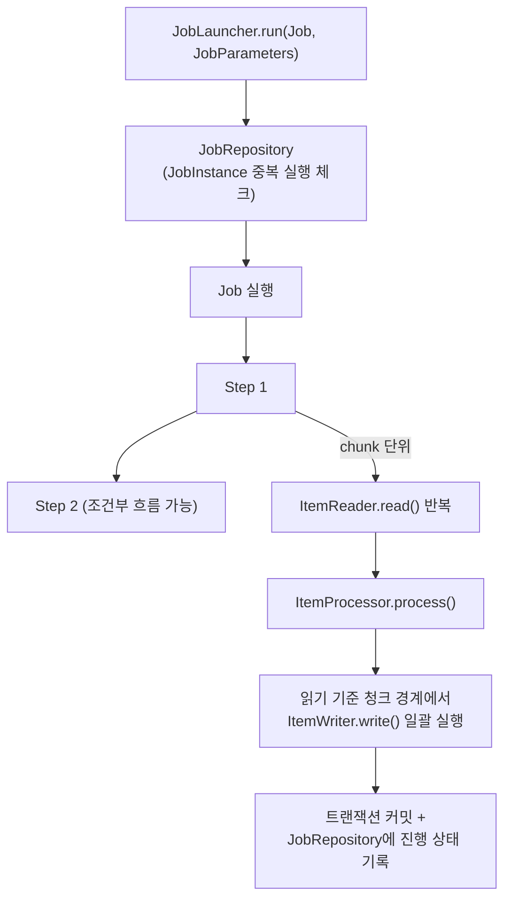

# Spring Batch 아키텍처

## 핵심 정의
Spring Batch는 대용량 데이터를 일괄 처리(batch processing)하기 위한 프레임워크로, 하나의 배치 작업을 `Job`(전체 작업) → `Step`(독립적인 처리 단계) → `ItemReader`/`ItemProcessor`/`ItemWriter`(청크 단위 읽기·가공·쓰기)로 계층화해 재시작(restart), 스킵(skip), 재시도(retry), 트랜잭션 경계를 프레임워크 수준에서 관리한다. Spring Boot 3.x 기준 Spring Batch 5는 Spring Framework 6/Java 17을 기반으로 하며, `JobBuilderFactory`/`StepBuilderFactory`가 5.0에서 deprecated 및 기본 빈 제공 중단되고 5.2에서 제거됐으며 `JobRepository`와 트랜잭션 매니저를 빌더에 명시적으로 전달하는 방식으로 바뀌었다.

## 동작 원리 / 구조



- **JobRepository**: JDBC 구현은 실행 메타데이터를 BATCH_* 테이블에 저장한다. JobInstance 식별자는 잡 이름과 identifying JobParameters이며 실패/완료/실행 중 상태를 구분한다. Map 구현 제거가 JDBC만 가능하다는 뜻은 아니다. 5.2에는 MongoDB 저장소와 메타데이터를 보존하지 않는 ResourcelessJobRepository도 있다. 후자는 재시작·공유 동시 실행에 적합하지 않다.
- **JobLauncher**: `Job`과 `JobParameters`를 받아 실행을 시작한다. Spring Batch 5의 표준 구현은 `TaskExecutorJobLauncher`(과거 `SimpleJobLauncher`)이며, 내부 `TaskExecutor` 설정에 따라 동기/비동기 실행 여부가 갈린다.
- **Chunk 지향 처리(Batch 5)**: Step의 청크 트랜잭션 안에서 read/process/write를 수행하고 커밋한다. Reader가 별도 커넥션이나 트랜잭션을 사용하는 구현이면 자원 참여 방식은 따로 확인한다. 크기는 읽은 항목 기준이며 Processor가 null로 필터링하면 쓰기 수는 줄어든다. 이전 커밋은 유지되지만 실패 청크의 외부 비트랜잭션 부수 효과까지 롤백되지는 않는다.
- **Tasklet**: execute를 호출해 FINISHED가 반환될 때까지 반복할 수 있다. 파일 이동·정리처럼 청크 항목 모델이 불필요한 작업에 적합하며 반드시 한 번만 실행되는 것은 아니다.
- **Batch 6 차이**: EnableBatchProcessing과 저장소별 EnableJdbcJobRepository/EnableMongoJobRepository를 분리하고, 기본 Framework 구성은 resourceless로 바뀌었다. JobRepository가 JobExplorer를, JobOperator가 JobLauncher를 확장해 별도 빈 필요성을 줄인다. 청크 구현·빌더도 바뀌므로 아래 Batch 5 코드를 인자 하나 변경만으로 마이그레이션하지 말고 공식 6.0 예제를 따른다.

```java
@Bean
public Job importJob(JobRepository jobRepository, Step importStep) {
    return new JobBuilder("importJob", jobRepository)
        .incrementer(new RunIdIncrementer())
        .start(importStep)
        .build();
}

@Bean
public Step importStep(JobRepository jobRepository,
                        PlatformTransactionManager transactionManager,
                        ItemReader<Member> reader,
                        ItemProcessor<Member, MemberEntity> processor,
                        ItemWriter<MemberEntity> writer) {
    return new StepBuilder("importStep", jobRepository)
        .<Member, MemberEntity>chunk(1000, transactionManager)
        .reader(reader)
        .processor(processor)
        .writer(writer)
        .faultTolerant()
        .skipLimit(10)
        .skip(DataFormatException.class)
        .build();
}
```

## 실무 관점
- **chunk vs tasklet 선택**: 수백만 건 단위의 읽기-가공-쓰기 파이프라인은 chunk 지향으로, 파일 압축/이동/알림 발송처럼 단일 동작은 tasklet으로 구현한다. tasklet을 chunk처럼 반복 로직으로 억지로 구현하면 재시작/스킵 정책의 이점을 못 살린다.
- **멱등성 설계**: 재시작이 핵심 기능이므로 `ItemWriter`가 같은 데이터를 두 번 써도 안전하도록(upsert, 유니크 제약 활용) 설계해야 한다. 그렇지 않으면 재시작 시 중복 삽입 장애로 이어진다. 새 identifying 파라미터로 새 인스턴스를 만들지, 동일 파라미터로 실패한 인스턴스를 재시작할지 구분한다. **Batch 5**의 `JobLauncher.run`은 incrementer 등록만으로 전달 파라미터를 자동 증가시키지 않는다. **Batch 6.0.5의 `JobOperator.start(Job, JobParameters)`**는 incrementer가 있으면 다음 인스턴스의 파라미터를 계산하며, 전달한 파라미터는 경고와 함께 무시한다. 반면 6.0.5에서도 `TaskExecutorJobLauncher.run`과 새 operator에서 상속한 `run`은 전달값을 사용한다. 날짜·처리 범위가 사라지지 않도록 버전뿐 아니라 실제 호출 API와 incrementer 설정을 확인한다.
- **재시작과 처음부터 재처리를 구분한다**: Batch 5.2에서 완료된 Step은 실패 잡을 재시작할 때 기본적으로 건너뛴다. `allowStartIfComplete(true)`는 완료 Step도 다시 실행하게 하므로, 입력 파일 삭제·작업 테이블 초기화 Step에 무심코 적용하면 재시작에 필요한 상태를 지울 수 있다. 매번 새 `run.id`로 실행하는 것은 기존 체크포인트를 이어가는 재시작과 다르다. 운영 요청에는 JobInstance·실패 Step·입력 범위·이미 커밋된 업무 데이터를 함께 확인한다.
- **Batch 5 → 6 전환 전 실패 실행 정리**: 파라미터 직렬화 형식이 달라 Batch 5에서 시작한 실패 인스턴스를 Batch 6으로 재시작할 수 없다. 전환 전에 기존 버전에서 재시작해 완료하거나, 업무 데이터의 잔여 처리를 결정한 뒤 포기(abandon)한다. 메타데이터의 포기 상태가 이미 커밋된 업무 데이터를 되돌리는 것은 아니다.
- **확장 패턴**: 처리 로직 자체가 무거우면 원격 청킹(remote chunking, 매니저가 읽고 워커에 처리를 위임), 읽기 자체가 병목이면 파티셔닝(partitioning, 워커마다 독립적인 데이터 슬라이스를 읽고 처리)을 선택한다. 두 방식을 혼동해 적용하면 오히려 네트워크 비용만 늘어나는 역효과가 난다.
- **스케줄링 연동**: Spring Batch 자체는 스케줄링 기능이 없다. [[Spring Scheduling]]의 `@Scheduled`나 외부 스케줄러(Quartz, k8s CronJob)가 `JobLauncher`를 호출하는 트리거 역할을 한다.
- **트랜잭션 경계 명시화**: Spring Batch 5에서 `chunk(size, transactionManager)`처럼 트랜잭션 매니저를 명시적으로 전달해야 하므로, 여러 데이터소스를 다루는 배치에서 어떤 트랜잭션 매니저가 실제로 커밋 경계를 잡는지 코드에서 바로 확인할 수 있다. [[다중 데이터소스와 라우팅]] 환경에서는 이 설정 누락이 흔한 실수다.
- **모니터링**: `JobExecutionListener`, `StepExecutionListener`로 시작/종료 훅을 걸어 Slack 알림, 메트릭 전송(read/write/skip count)을 붙이는 것이 실무 표준 구성이다.

## 심화 Q&A

### Q. chunk 처리 중 특정 항목에서 예외가 나면 해당 chunk 전체가 롤백되는데, 이미 커밋된 이전 chunk들은 영향을 받는가?
A. 이전 청크의 커밋은 유지된다. 재시작 위치는 저장된 ExecutionContext와 ItemStream의 체크포인트 구현에 달려 있으며 단순히 청크 번호만 저장해 항상 정확히 이어지는 것은 아니다. 안정적인 조회 순서·입력 재현성·메타데이터와 업무 데이터의 트랜잭션 관계를 확인하고 재실행 가능한 Writer를 설계한다.
### Q. skip 정책과 retry 정책은 각각 언제 쓰고, 함께 쓰면 어떤 순서로 동작하는가?
A. retry는 일시적 실패, skip은 허용 가능한 결함 항목을 제외할 때 쓴다. 처리 단계·예외 분류에 따라 흐름이 다르다. Batch 5의 reader skip은 기본적으로 롤백 없이 다음 항목을 읽고, processor/writer는 재시도·롤백·실패 항목 식별을 거칠 수 있다. 모든 예외를 반드시 retry한 뒤 skip하는 하나의 순서로 일반화하지 않는다.
### Q. 원격 파티셔닝과 원격 청킹 중 무엇을 선택할지 판단 기준은?
A. 병목이 "읽기"에 있고 데이터를 독립적인 범위(날짜, ID 범위 등)로 나눌 수 있다면 파티셔닝이 유리하다. 각 워커가 자신의 슬라이스를 처음부터 끝까지 독립적으로 처리하므로 네트워크로 오가는 데이터가 메타데이터(파티션 경계)뿐이다. 반대로 병목이 "가공(processing)"에 있고 읽기는 순차적으로만 가능하다면 원격 청킹으로 매니저가 읽은 항목을 메시징 큐를 통해 워커들에게 분배해 처리시킨다. 원격 청킹은 네트워크로 실제 데이터 항목이 오가므로 데이터 크기가 크면 오버헤드가 커진다.
### Q. `@StepScope`, `@JobScope`가 지연 바인딩(late binding)을 가능하게 하는 이유는 무엇인가?
A. StepScope/JobScope 프록시는 실제 대상 생성을 실행 컨텍스트에 결합해 jobParameters 같은 값을 늦게 해석한다. 일반 singleton에서 해당 컨텍스트를 참조하면 첫 값이 계속 남는다고 단정할 수 없고 아예 표현식 해석에 실패할 수 있다. 멀티 스레드/파티션 작업에서는 스코프의 실행 컨텍스트 전파 제약을 확인한다.
### Q. 여러 인스턴스(파드)에서 동시에 같은 배치 애플리케이션을 띄우면 `JobRepository` 동시성 문제가 생기지 않는가?
A. 같은 JDBC JobRepository를 공유하는 경우 인스턴스 식별의 유니크 제약, 기존 실행 상태 확인, `create*` 메서드의 트랜잭션·격리 수준을 함께 사용한다. Batch 5.2의 생성 메서드는 기본 `SERIALIZABLE`이다. 유니크 제약 하나가 모든 중복 실행을 막는다고 설명하면 부족하다. 같은 인스턴스에도 실패 후 재시작을 위한 여러 JobExecution이 존재할 수 있다. 서로 다른 메타데이터 저장소나 매번 새 identifying 파라미터를 쓰면 이 조정 범위를 벗어나며, 업무 데이터 충돌·외부 부수 효과는 별도로 제어한다.
### Q. Spring Batch 5에서 `@EnableBatchProcessing`을 붙이지 않는 것이 권장되는 이유는?
A. Boot 3의 배치 자동 구성 대신 EnableBatchProcessing을 선택하면 해당 애노테이션이 Batch 인프라를 구성한다. 모든 빈을 손으로 정의해야 하는 것은 아니다. 다만 Boot가 하던 스키마 초기화·프로퍼티 적용 등도 물러날 수 있으므로 커스터마이징 범위를 이해해야 한다.

## 관련 개념
- [[Spring Scheduling]]
- [[Transactional 동작 원리]]
- [[다중 데이터소스와 라우팅]]
- [[Spring Retry와 재시도 전략]]

## 참고 자료

부분 재검증: 2026-10-04. Batch 5.2의 완료 Step 재실행 조건과 Batch 6.0 마이그레이션의 incrementer·실패 실행 호환성을 확인했다. 마이그레이션 안내의 incrementer 설명은 고정 6.0.3·6.0.5 소스와 실행으로 `start`/`run` 경계를 구분했다. 새 ResourcelessJobRepository에서 legacy run·operator start·operator run·incrementer 없는 start의 4경로 16조건을 두 버전에 각각 실행했다. `run.id=42`와 업무 날짜 입력은 start+incrementer 경로에서만 `run.id=1`·날짜 없음으로 바뀌었다. JDBC 저장소·청크·재시작의 실행 시험은 아니며 전체 노트 검증일은 유지한다.

- [Step 재시작 설정 — Batch 5.2](https://docs.spring.io/spring-batch/reference/5.2/step/chunk-oriented-processing/restart.html) — 완료 Step 건너뛰기와 `allowStartIfComplete`.
- [Batch 6.0 Migration Guide](https://github.com/spring-projects/spring-batch/wiki/Spring-Batch-6.0-Migration-Guide) — JobParametersIncrementer 변경과 v5 실패 인스턴스의 재시작 제한.
- [SimpleJobOperator 6.0.5](https://raw.githubusercontent.com/spring-projects/spring-batch/v6.0.5/spring-batch-core/src/main/java/org/springframework/batch/core/launch/support/SimpleJobOperator.java) / [TaskExecutorJobLauncher 6.0.5](https://raw.githubusercontent.com/spring-projects/spring-batch/v6.0.5/spring-batch-core/src/main/java/org/springframework/batch/core/launch/support/TaskExecutorJobLauncher.java) — start의 incrementer 분기와 run의 전달 파라미터 사용. TaskExecutorJobOperator는 이 start 구현을 호출한다.

부분 재검증: 2026-09-22. Batch 5.2.6의 JobRepository 트랜잭션·동시 생성 제어와 청크 처리 문서를 대조하고 출처 버전을 고정했다.

- [Configuring a JobRepository 5.2](https://docs.spring.io/spring-batch/reference/5.2/job/configuring-repository.html) — 메타데이터 트랜잭션과 create 격리 수준.

검증일: 2026-09-08. 적용 범위: 코드와 청크 설명은 Spring Batch 5.2.6; 6.0.5 차이는 별도 표기.

- [Chunk Processing 5.2](https://docs.spring.io/spring-batch/reference/5.2/step/chunk-oriented-processing.html) — read/process/write와 커밋. 2026-10-04에 도식의 청크 경계를 읽기 개수 기준과 다시 대조했다.
- [Batch 5.2 변경](https://docs.spring.io/spring-batch/reference/5.2/whatsnew.html) — Mongo와 Resourceless 저장소.
- [Batch 6 변경](https://docs.spring.io/spring-batch/reference/whatsnew.html) — 저장소 구성·통합된 운영 인터페이스·새 청크 모델.
- [Batch 5.2 롤백](https://docs.spring.io/spring-batch/reference/5.2/step/chunk-oriented-processing/controlling-rollback.html) — reader buffering과 skip 예외.
- [Batch 5 migration](https://github.com/spring-projects/spring-batch/wiki/Spring-Batch-5.0-Migration-Guide) — 빌더 factory 폐기 및 API 전환.
