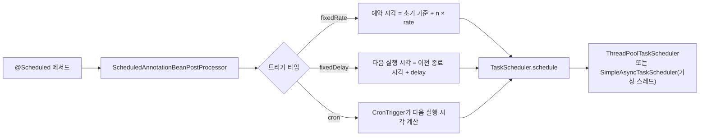

# Spring Scheduling

## 핵심 정의
Spring Scheduling은 `@Scheduled` 어노테이션과 `TaskScheduler` 추상화를 통해 애플리케이션 내부에서 주기적/시각 기반 작업(배치 집계, 만료 데이터 정리, 외부 폴링 등)을 별도의 외부 스케줄러(cron, Quartz 서버) 없이 실행하는 기능이다. `@EnableScheduling`으로 활성화하며, 고정 주기(`fixedRate`), 고정 지연(`fixedDelay`), cron 표현식 세 가지 트리거 방식을 지원한다.

## 동작 원리 / 구조



- `ScheduledAnnotationBeanPostProcessor`가 빈 초기화 시점에 `@Scheduled` 메서드를 스캔해 `TaskScheduler`에 등록한다.
- **fixedRate**: 초기 기준 시각과 주기의 배수에 맞춰 실행을 예약한다. ThreadPoolTaskScheduler의 동일 주기 작업은 풀 크기가 여러 개여도 자체 실행이 겹치지 않는다. 늦어진 실행은 종료 후 따라잡으려 할 수 있다. SimpleAsyncTaskScheduler·Async 위임·별도 중복 등록은 중첩 조건이 다르다.
- **fixedDelay**: 이전 작업 완료 뒤 설정한 지연을 둔다. 단일 등록의 직접 실행을 순차화하지만 Async로 실제 작업을 분리하거나 여러 인스턴스에 등록한 경우의 중첩까지 막지는 않는다.
- **cron**: Spring은 초 필드를 포함한 6필드 표현식을 사용하므로 일반 Unix의 5필드 표현식을 그대로 복사하지 않는다. 요일은 0·7=일요일이며 Quartz의 1=일요일과도 다르다. `MON-FRI`처럼 이름을 쓰면 혼동을 줄일 수 있다.
- Boot 4.1.1에서 가상 스레드가 비활성화된 자동 구성 `ThreadPoolTaskScheduler`는 기본 풀 크기가 1이다. 여러 동기 작업이 서로 대기할 수 있으므로 실행 시간과 `spring.task.scheduling.pool.size`를 함께 확인한다. 사용자 정의 스케줄러나 가상 스레드 자동 구성을 사용하면 같은 기본값을 전제하지 않는다.
- Spring Framework 6.1부터 가상 스레드(virtual thread, JDK 21+)에 정렬된 `SimpleAsyncTaskScheduler`가 추가되었다. Spring Boot에서 `spring.threads.virtual.enabled=true`(Java 21+ 전제)로 설정하면 자동 구성된 스케줄러가 풀링 없이 실행마다 새 가상 스레드를 띄우는 방식으로 전환된다. 다만 `fixedDelay`는 단일 스케줄러 스레드에서 작업을 직접 실행한다. Framework 7.0.9 구현은 이 실행기와 `fixedRate`·cron·단발 예약의 트리거 실행기를 분리하므로, 오래 걸리는 고정 지연 작업이 같은 인스턴스의 모든 예약을 막는다고 일반화하지 않는다. Spring Framework 6.2부터는 `ThreadPoolTaskScheduler`/`ThreadPoolTaskExecutor`에도 `setVirtualThreads()`로 가상 스레드를 직접 지정할 수 있게 확장됐다(단, Spring Boot의 자동 구성 프로퍼티로는 아직 노출되지 않아 커스텀 빈 등록이 필요).

```java
@Scheduled(cron = "0 0 * * * *", zone = "Asia/Seoul")
public void hourlyJob() { ... }

@Bean
public TaskScheduler taskScheduler() {
    ThreadPoolTaskScheduler scheduler = new ThreadPoolTaskScheduler();
    scheduler.setPoolSize(5);
    scheduler.setThreadNamePrefix("scheduled-task-");
    scheduler.setErrorHandler(t -> log.error("scheduled task failed", t));
    return scheduler;
}
```

### 리액티브 작업은 메서드 호출과 구독 시점이 다르다

Framework 6.1+는 리액티브 `@Scheduled` 메서드를 호출해 Publisher를 한 번 얻고 매 실행 시 그 Publisher에 다시 구독한다. 실행마다 읽어야 하는 시간·토큰·조회 결과를 메서드 조립 시점에 고정하지 않는다.

```java
@Scheduled(fixedDelay = 10_000)
public Mono<Void> refresh() {
    return Mono.defer(() -> refreshService.refreshNow());
}
```

`Mono.defer`의 함수는 구독마다 실행된다. 직접 `subscribe()`를 호출해 작업을 분리하지 않고 Publisher를 반환해야 스케줄러가 완료·오류를 관찰할 수 있다. 리액티브 `fixedDelay`는 완료 후 지연 의미를 지키기 위해 구독 완료를 기다린다. 끝나지 않는 Publisher는 다음 실행도 막는다. `CompletableFuture`처럼 지연 구독을 지원하지 않는 반환 타입은 리액티브 Scheduled 대상으로 지원되지 않는다.

## 실무 관점
- **완료와 취소의 대상**: Framework 7.0.9의 `SimpleAsyncTaskScheduler.schedule(Runnable, Instant)`가 반환한 `ScheduledFuture`는 실행 스레드로의 전달 완료를 나타낸다. `get()`이 반환되어도 본문은 실행 중일 수 있고 이미 전달된 작업을 그 Future의 취소로 중단한다고 가정하지 않는다. 실제 업무 완료·실패는 별도로 추적한다. `ThreadPoolTaskScheduler`의 같은 단발 API는 본문 완료까지 Future가 기다린다.
- 인스턴스를 여러 대(스케일 아웃) 운영하는 환경에서 `@Scheduled`를 그대로 쓰면 **각 인스턴스가 독립적으로 같은 작업을 실행**하므로 중복 처리가 발생할 수 있다. 배치가 멱등하지 않다면 데이터 중복 처리로 이어지므로, ShedLock/Quartz JDBC 클러스터링/Kubernetes CronJob 같은 중복 억제와 멱등 처리가 필요하다. 락 만료·스케줄러 장애로 중복/누락이 가능하므로 exactly-once로 가정하지 않는다.
- 기본 단일 스레드 스케줄러 풀 크기를 그대로 방치하면, 스케줄 작업 하나가 예상보다 오래 걸릴 때(외부 API 응답 지연 등) 다른 모든 스케줄 작업이 함께 밀리는 장애가 흔하다. 운영 전 반드시 풀 크기와 각 작업의 예상 실행 시간을 점검해야 한다.
- 일반 반복 Runnable 작업은 기본 오류 핸들러가 실패를 기록하고 후속 실행을 유지한다. 오류를 재던지는 사용자 ErrorHandler는 주기 작업을 중단시킬 수 있다. 6.1 이후 리액티브 Scheduled의 onError는 WARN으로 기록·회복되며 이 ErrorHandler 경로를 사용하지 않는다. 실패 지표와 알림을 실행 모델별로 연결한다.
- 장시간 배치성 작업은 `@Scheduled`보다 별도 배치 프레임워크(Spring Batch)나 외부 스케줄러(Kubernetes CronJob, Airflow)로 분리하는 것이 낫다. `@Scheduled`는 애플리케이션 프로세스와 생명주기를 공유하므로, 배포로 인한 재시작이 실행 중인 배치를 그대로 끊어버릴 수 있다.
- cron의 `zone`을 생략하면 스케줄러가 사용하는 시간대를 따른다. 기본 구성에서는 시스템 기본 시간대의 영향을 받지만 사용자 정의 Clock을 사용하는 경우도 있으므로 `zone`을 명시하고 배포 환경을 확인한다. 일광 절약 시간(DST) 전환이 있는 시간대는 존재하지 않거나 반복되는 지역 시각을 `CronExpression.next`로 점검한다. 업무 날짜별 실행 완료 기록과 멱등 키로 누락·중복을 별도로 관리한다.

## 심화 Q&A

### Q. `fixedRate`로 등록한 작업이 실행 시간보다 주기가 짧을 때 실제로는 어떻게 동작하는가?
A. ThreadPoolTaskScheduler는 ScheduledThreadPoolExecutor를 사용하므로 하나의 scheduleAtFixedRate 등록은 풀 크기와 무관하게 중첩되지 않는다. 실행 시간이 길면 다음 실행이 늦어지고 밀린 실행을 바로 수행할 수 있어 종료 후 간격을 두는 fixedDelay와 다르다. 서로 다른 등록·반복 애노테이션·Async 위임·SimpleAsyncTaskScheduler에서는 같은 메서드도 겹칠 수 있다.

### Q. 여러 인스턴스로 스케일 아웃된 환경에서 특정 스케줄 작업만 한 인스턴스에서 실행되도록 보장하는 방법은?
A. 대표적으로 ShedLock 같은 라이브러리로 DB/Redis 기반 분산 락을 걸어 락을 선점한 인스턴스만 실행하게 하거나, Quartz를 JDBC JobStore로 클러스터링해 Quartz 자체의 트리거 획득(acquire) 메커니즘에 위임하는 방법이 있다. Kubernetes 환경이라면 애플리케이션 스케줄링 자체를 걷어내고 `CronJob` 리소스로 별도 파드를 주기 실행시키는 방식도 널리 쓰인다.

### Q. 가상 스레드 정렬 스케줄러(`SimpleAsyncTaskScheduler`)를 쓸 때 `fixedDelay` 작업을 피해야 하는 이유는 무엇인가?
A. Framework 7.0.9에서는 고정 지연 작업들이 전용 단일 스레드를 공유하므로 느린 작업이 다른 고정 지연 작업을 지연시킨다. fixedRate·cron의 트리거 실행기는 별도다. 고정 지연이 업무 요구라면 실행 의미를 바꾸려고 fixedRate로 교체하기보다, ThreadPoolTaskScheduler 등 적합한 실행 모델을 선택한다. 가상 스레드 사용 자체가 작업 간 격리를 보장하지는 않는다.

### Q. `@Async`와 `@Scheduled`를 함께 쓰면 어떤 효과가 있는가?
A. `@Async` 프록시를 거치면 본문을 해당 `TaskExecutor`에 제출한다. 워커로 전달되는 구성에서는 스케줄러가 본문 완료 전에 돌아오므로 `fixedDelay`도 실제 업무 완료 후 지연을 보장하지 않는다. 반면 포화 시 `CallerRunsPolicy`나 동기 실행기는 스케줄러 스레드에서 본문을 실행할 수 있다. 제출 거부·대기·작업 중첩을 실행기 정책과 함께 확인하며, 실제 완료가 기준인 작업은 중간 비동기 위임을 피하거나 완료를 별도로 관리한다. 실행 위치와 트랜잭션의 관계는 [[Spring Event와 비동기 처리]]를 참고한다.

### Q. cron 표현식 대신 fixedRate/fixedDelay를 쓰는 것이 유리한 경우는 언제인가?
A. "몇 시 몇 분에 반드시 실행"처럼 특정 시각이 중요한 작업(일 배치, 정산)은 cron이 명확하다. 반면 "이전 작업이 끝난 뒤 일정 간격을 두고 계속 폴링"하는 작업(외부 큐 폴링, 캐시 워밍)은 fixedDelay가 더 자연스럽다. cron으로 짧은 간격(수 초 단위)을 표현하면 가독성이 떨어지고 의도(고정 지연 vs 특정 시각)가 흐려지므로, 실행 목적에 맞는 트리거 타입을 고르는 것이 유지보수에 유리하다.

### Q. 스케줄 작업 안에서 데이터베이스 커넥션 풀 고갈이 다른 요청 처리에 영향을 주는 상황은 왜 생기는가?
A. 스케줄 작업이 애플리케이션과 동일한 커넥션 풀(예: HikariCP)을 공유하는데, 대량의 데이터를 처리하는 배치성 스케줄 작업이 커넥션을 오래 점유하면 일반 API 요청이 커넥션을 확보하지 못해 대기하거나 타임아웃될 수 있다. 스케줄 작업 전용 데이터소스/커넥션 풀을 분리하거나, 배치 처리를 청크 단위로 나눠 커넥션 점유 시간을 짧게 유지하는 것이 완화책이다.

## 관련 개념
- [[Spring Event와 비동기 처리]]
- [[내장 WAS]]
- [[Actuator와 헬스체크]]
- [[오토스케일링]]

## 참고 자료

검증일: 2026-09-08. 적용 범위: Framework 6.1~7.0, JDK 25 ScheduledThreadPoolExecutor, Boot 스케줄러 구성.

- [Spring Scheduling](https://docs.spring.io/spring-framework/reference/integration/scheduling.html) — 스케줄러·비동기·리액티브·가상 스레드.
- [ScheduledThreadPoolExecutor](https://docs.oracle.com/en/java/javase/25/docs/api/java.base/java/util/concurrent/ScheduledThreadPoolExecutor.html) — 동일 주기 작업 중첩 금지.
- [ExecutorConfigurationSupport](https://docs.spring.io/spring-framework/docs/current/javadoc-api/org/springframework/scheduling/concurrent/ExecutorConfigurationSupport.html) — 6.2 virtualThreads API.
- [SimpleAsyncTaskScheduler](https://docs.spring.io/spring-framework/docs/current/javadoc-api/org/springframework/scheduling/concurrent/SimpleAsyncTaskScheduler.html) — fixed-delay 실행 방식.

부분 재검증: 2026-09-23. Framework 7.0.9·Boot 4.1.1의 리액티브 재구독, cron 문법·시간대, 스케줄러 자동 구성 조건을 확인했다. 7.0.9·OpenJDK 25.0.2에서 메서드 조립 1회/구독 3회 이상을 직접 검증했다. 나머지 기존 설명의 전체 재검증 날짜는 유지한다.

- [Scheduled 7.0.9 API](https://docs.spring.io/spring-framework/docs/7.0.9/javadoc-api/org/springframework/scheduling/annotation/Scheduled.html) — 반복 구독·fixedDelay 완료 대기·zone 기본값.
- [CronExpression 7.0.9 API](https://docs.spring.io/spring-framework/docs/7.0.9/javadoc-api/org/springframework/scheduling/support/CronExpression.html) — 6필드·요일 번호와 next API.
- [Boot task execution and scheduling](https://docs.spring.io/spring-boot/reference/features/task-execution-and-scheduling.html) — Boot 4.1.1 자동 구성과 가상 스레드.

부분 재검증: 2026-10-04. Framework 7.0.9·JDK 25.0.4에서 고정 지연 실행기 분리, SimpleAsyncTaskScheduler의 단발 Future 조기 완료, ThreadPoolTaskScheduler의 본문 완료 대기 3건을 실행했다. 첫 고정 지연 작업을 보류한 동안 두 번째 고정 지연 작업은 대기하고 단발 작업은 실행됨을 확인했다. 배포 종료·cron·외부 executor 조합 전체를 시험한 결과는 아니다.

추가 확인: 같은 버전의 공식 실행기 문서와 [[Spring Event와 비동기 처리]]의 Async 포화 시험으로 “항상 즉시 다른 스레드로 넘긴다”는 설명을 교정했다. Scheduled와 Async를 함께 등록한 통합 실행 시험으로 확대 해석하지 않는다.

- [SimpleAsyncTaskScheduler 7.0.9 소스](https://github.com/spring-projects/spring-framework/blob/v7.0.9/spring-context/src/main/java/org/springframework/scheduling/concurrent/SimpleAsyncTaskScheduler.java) — triggerExecutor와 fixedDelayExecutor, 작업 전달 경계.
- [SimpleAsyncTaskScheduler 7.0.9 API](https://docs.spring.io/spring-framework/docs/7.0.9/javadoc-api/org/springframework/scheduling/concurrent/SimpleAsyncTaskScheduler.html) / [ThreadPoolTaskScheduler 7.0.9 API](https://docs.spring.io/spring-framework/docs/7.0.9/javadoc-api/org/springframework/scheduling/concurrent/ThreadPoolTaskScheduler.html) — 반환 Future의 완료 의미.
