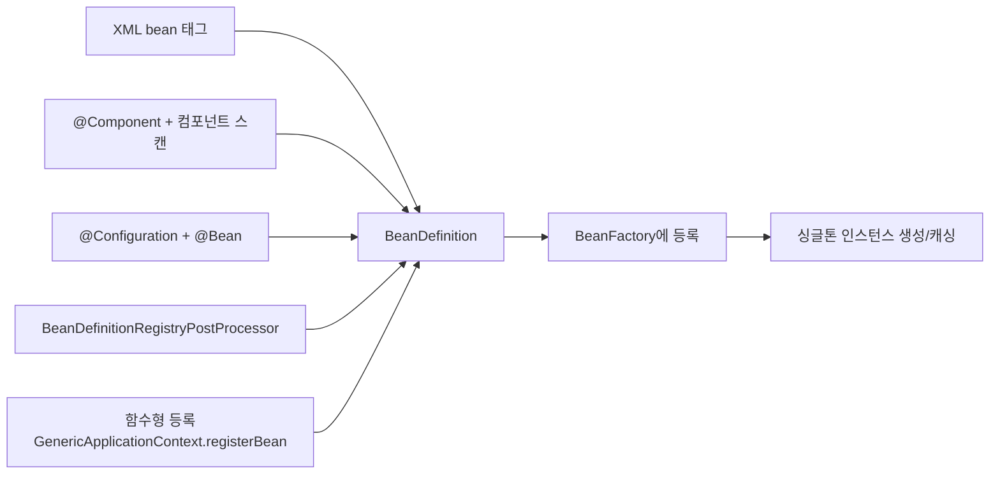

# Bean 정의 방법 비교

## 핵심 정의

Spring 컨테이너에 Bean을 등록하는 방법은 XML 설정, `@Component` 계열 애노테이션 + 컴포넌트 스캔(component scan), `@Configuration` + `@Bean`(자바 기반 설정, JavaConfig), `BeanDefinitionRegistryPostProcessor`/`ImportBeanDefinitionRegistrar`를 이용한 프로그래밍적 등록, 그리고 함수형 빈 등록(functional bean registration)까지 여러 가지가 있다. 방식은 다르지만 여기 열거한 정의 기반 방식은 `BeanDefinition`으로 표현되어 `BeanFactory`에 등록된다는 공통 메커니즘 위에서 동작하며, 차이는 "언제, 어떻게 이 메타데이터를 만드는가"에 있다.

## 동작 원리 / 구조



| 방식 | 등록 시점 | 리플렉션 의존 | 조건부 등록 | 특징 |
|---|---|---|---|---|
| XML | 컨텍스트 로딩 시 파싱 | 낮음(문자열 기반 리플렉션 호출은 있음) | 제한적 (profile 정도) | 레거시, 대부분 신규 프로젝트에서 미사용 |
| `@Component` + 스캔 | 클래스패스 스캔 시점 | 메타데이터는 주로 ASM, 생성·주입은 방식에 따라 다름 | `@Conditional`, `@Profile` | 작성 편의성 높음, 대상 클래스를 직접 소유해야 함 |
| `@Configuration` + `@Bean` | 설정 클래스 파싱 시점 | 있음 | `@Conditional`, `@Profile` | 외부 라이브러리 클래스도 등록 가능, 로직 있는 초기화에 유리 |
| `BeanDefinitionRegistryPostProcessor` | `BeanFactory` 후처리 단계 | 사용자 구현에 따라 다름 | 완전 자유(코드로 직접 판단) | 동적/대량 등록, 프레임워크·라이브러리 내부에서 주로 사용 |
| 함수형 등록 | 컨텍스트 부트스트랩 코드 실행 시점 | Supplier 직접 생성은 줄일 수 있으나 후처리는 별도 | 완전 자유 | Supplier 등록만으로 AOT 지원이 보장되지는 않음 |

### `@Configuration`의 full mode와 lite mode

`@Configuration(proxyBeanMethods = true)`(기본값)는 설정 클래스를 CGLIB로 서브클래싱해, 같은 클래스 안에서 `@Bean` 메서드를 직접 호출해도 매번 새 인스턴스를 만들지 않고 컨테이너에서 해당 빈의 scope에 맞게 조회하도록 가로챈다.

```java
@Configuration // proxyBeanMethods 기본값 true
public class AppConfig {
    @Bean
    public DataSource dataSource() { ... }

    @Bean
    public JdbcTemplate jdbcTemplate() {
        return new JdbcTemplate(dataSource()); // 프록시가 가로채 싱글톤 dataSource 반환
    }
}
```

`proxyBeanMethods = false`(lite mode)는 프록시 생성을 생략해 부팅 속도와 메모리를 아끼지만, 위 코드에서 `dataSource()`를 직접 호출하면 컨테이너를 거치지 않은 새 인스턴스가 만들어진다. lite mode에서는 `@Bean` 메서드 간 의존이 필요하면 파라미터로 주입받는 방식을 써야 한다.

```java
@Configuration(proxyBeanMethods = false)
public class AppConfig {
    @Bean
    public JdbcTemplate jdbcTemplate(DataSource dataSource) { // 파라미터 주입으로 대체
        return new JdbcTemplate(dataSource);
    }
}
```

### 함수형 빈 등록

Spring 5부터 `GenericApplicationContext.registerBean(...)`으로 애노테이션/리플렉션 스캔 없이 코드로 직접 `BeanDefinition`을 만들어 등록할 수 있다. Spring Boot의 AOT(Ahead-Of-Time) 처리와 GraalVM 네이티브 이미지 빌드는 내부적으로 애노테이션 기반 설정을 이런 함수형 등록 형태로 변환한 소스 코드를 생성해, 런타임 리플렉션 스캔 비용을 빌드 타임으로 옮긴다.

## 실무 관점

- 자신이 소유한(직접 작성한) 클래스는 `@Component`/`@Service`/`@Repository`로, 외부 라이브러리 클래스나 조건에 따라 다른 구현체를 만들어야 하는 경우는 `@Configuration` + `@Bean`으로 등록하는 것이 관례다.
- 컴포넌트 스캔은 편하지만 스캔 범위(`@ComponentScan(basePackages = ...)`)가 넓어질수록 부팅 시 클래스패스 탐색 비용이 커진다. 대규모 모놀리식 서비스에서는 스캔 범위를 세분화하거나 명시적 `@Import`로 필요한 설정만 로딩하는 편이 부팅 시간에 유리하다.
- `proxyBeanMethods = true`(기본값)는 안전하지만 CGLIB 프록시 생성 비용이 있다. 설정 클래스 내부에서 `@Bean` 메서드 간 직접 호출이 없다면 `proxyBeanMethods = false`로 명시해 부팅 시간을 아낄 수 있다. Spring Boot 자동 구성 클래스 다수도 이미 lite mode로 작성되어 있다.
- 흔한 실수: lite mode(`proxyBeanMethods = false`)로 설정된 `@Configuration` 클래스 내부에서 다른 `@Bean` 메서드를 직접 호출해 "싱글톤인 줄 알았는데 매번 새 인스턴스가 생성"되는 버그. 파라미터 주입으로 바꿔야 한다.
- Spring AOT는 컴포넌트 스캔도 빌드 시점에 처리한다. 명시적 @Bean/Supplier만 쓰면 자동으로 네이티브 호환성이 좋아지는 것은 아니다. 빈 타입·등록 경로가 분석 가능해야 하며 임의 Supplier의 동작이나 런타임에 달라질 빈 집합은 별도 제약이 있다. 힌트는 리플렉션·리소스 접근을 지원하지만 빌드 시 제외된 빈을 되살리지 않는다.
- `BeanDefinitionRegistryPostProcessor`는 매우 강력하지만 컨테이너 초기화 순서에 개입하기 때문에, 애플리케이션 코드에서 직접 쓰기보다는 프레임워크/라이브러리 확장 지점으로 남겨두는 것이 안전하다.

## 심화 Q&A

### Q. `proxyBeanMethods = true`와 `false`의 성능 차이는 실제로 어느 정도이고, 언제 `false`를 선택해야 하는가?
A. `true`는 설정 클래스마다 CGLIB 서브클래스를 생성하는 비용이 추가되며, `@Bean` 메서드 개수와 설정 클래스 개수가 많을수록 부팅 시간에 누적된다. 대부분의 단일 애플리케이션에서는 체감하기 어려운 수준이지만, 자동 구성 클래스가 수백 개 로딩되는 Spring Boot 자체 내부에서는 의미 있는 차이가 된다. `@Bean` 메서드 간 자바 메서드 호출로 의존을 표현하지 않고 항상 파라미터 주입을 쓰는 팀 컨벤션이라면 `false`로 명시해 프록시 생성 자체를 없애는 것이 합리적이다.

### Q. 컴포넌트 스캔과 명시적 `@Bean` 등록을 함께 쓸 때 같은 타입의 빈이 중복 등록되면 어떤 일이 벌어지는가?
A. 이름 충돌은 등록 경로에 따라 스캔 충돌 예외나 BeanDefinitionOverrideException 등으로 나타날 수 있다. Boot는 기본적으로 빈 정의 덮어쓰기를 허용하지 않는다. 이름이 다르고 타입만 같으면 여러 빈을 등록할 수 있으며 단일 주입 시 Primary/Qualifier/이름 등으로 선택되지 않을 때 NoUniqueBeanDefinitionException이 발생한다.

### Q. XML 기반 설정은 완전히 사라졌는가, 여전히 남아 있는 사용처가 있는가?
A. 신규 프로젝트에서는 사실상 쓰이지 않지만, XML은 여전히 Spring Framework가 지원하는 설정 방식이며 레거시 시스템 마이그레이션이나 일부 인프라 설정(예: 특정 배치 프레임워크의 잡 정의)에서 남아 있는 경우가 있다. `@ImportResource`로 XML 설정을 자바 기반 설정과 혼용할 수 있어, 점진적 마이그레이션 경로로 활용된다.

### Q. `BeanDefinitionRegistryPostProcessor`와 `@Import(ImportBeanDefinitionRegistrar.class)`는 둘 다 프로그래밍적으로 빈을 등록하는데 언제 무엇을 선택하는가?
A. `ImportBeanDefinitionRegistrar`는 특정 `@Configuration` 클래스에 `@Import`로 연결되어, 그 설정 클래스가 로딩될 때 부가적으로 빈을 등록하고 싶을 때 쓴다(예: `@EnableXxx` 스타일 애노테이션 구현). `BeanDefinitionRegistryPostProcessor`는 특정 설정 클래스에 종속되지 않고 컨테이너 전체의 빈 정의 목록에 접근해 더 넓은 범위의 후처리(기존 빈 정의 수정, 대량의 동적 빈 생성)를 할 때 사용한다. 전자는 "이 기능을 켜면 따라오는 빈"을, 후자는 "컨테이너 전체를 조작하는 인프라 코드"를 만들 때 적합하다.

### Q. AOT 처리와 네이티브 이미지 빌드에서 왜 함수형 등록이나 명시적 `@Bean`이 컴포넌트 스캔보다 유리한가?
A. 컴포넌트 스캔은 주로 ASM으로 클래스 메타데이터를 읽으며 곧바로 전부 리플렉션 로딩하는 방식은 아니다. Spring AOT는 빈 정의와 조건을 빌드 시 처리하고 인스턴스 생성·주입 코드를 생성한다. 일반 애플리케이션 빈을 모두 생성해 서버 전체를 실행하는 과정은 아니며 일부 인프라 빈은 필요하다. 런타임 리플렉션이 남는 경로는 RuntimeHints로 지원한다. 중요한 것은 설정 형식보다 분석 가능한 빈 정의와 빌드 때 확정되는 빈 집합이다.

### Q. 같은 인터페이스 타입의 빈을 XML, `@Component`, `@Bean` 세 가지 방식으로 동시에 등록하도록 설정이 뒤섞여 있다면 어떤 문제가 생기고 어떻게 진단하는가?
A. 등록 순서(컴포넌트 스캔이 먼저, 자동 구성이 나중)와 이름 충돌 여부에 따라 결과가 달라져 예측하기 어려운 빈 구성이 만들어진다. `ApplicationContext.getBeanDefinitionNames()`나 Actuator의 `beans` 엔드포인트로 실제 등록된 빈 목록과 그 출처(어떤 설정 클래스/스캔에서 왔는지)를 확인하는 것이 첫 진단 단계이며, 근본적으로는 한 타입의 빈은 하나의 등록 방식으로 통일하는 것이 유지보수에 유리하다.

## 관련 개념

- [[Bean 생명주기]]
- [[Bean 스코프]]
- [[자동 구성 원리]]
- [[Conditional과 조건부 빈]]

## 참고 자료

검증일: 2026-09-08. 적용 범위: Spring Framework 7.0의 빈 정의와 Spring AOT 처리.

- [Java 설정 기본 개념](https://docs.spring.io/spring-framework/reference/core/beans/java/basic-concepts.html) — full/lite와 직접 호출.
- [Spring AOT](https://docs.spring.io/spring-framework/reference/core/aot.html) — 빈 정의 처리·조건 고정·생성 코드와 힌트.
- [사용자 자동 구성](https://docs.spring.io/spring-boot/reference/features/developing-auto-configuration.html) — 빈 조건과 사용자 설정.
