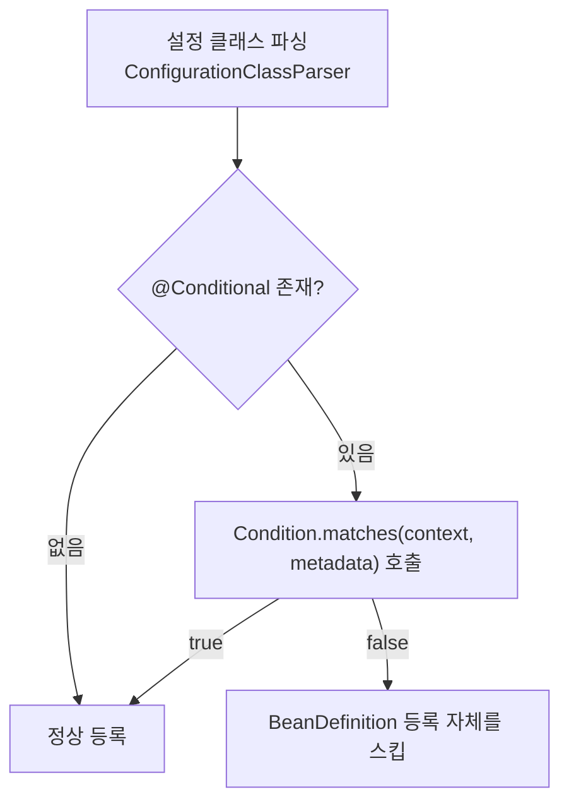

# Conditional과 조건부 빈

## 핵심 정의

`@Conditional`은 Spring Framework 4부터 제공되는 메커니즘으로, 특정 조건(`Condition` 인터페이스 구현체의 판정 결과)이 참일 때만 `@Configuration` 클래스나 `@Bean` 메서드, `@Component` 클래스를 컨테이너 등록 대상으로 처리하도록 제어한다. `@Profile`도 내부적으로 `@Conditional(ProfileCondition.class)`로 구현된 메타 애노테이션이며, Spring Boot의 자동 구성(auto-configuration)이 광범위하게 의존하는 `@ConditionalOnClass`, `@ConditionalOnMissingBean` 같은 애노테이션들도 모두 이 메커니즘 위에 만들어진 확장이다. 자동 구성 맥락에서의 구체적인 조건 애노테이션 목록과 활용은 [[자동 구성 원리]]에서 다루고, 이 노트는 `@Conditional`의 일반적인 동작 원리와 직접 커스텀 조건을 만드는 방법에 집중한다.

## 동작 원리 / 구조



`Condition` 인터페이스는 단일 메서드로 구성된다.

```java
public interface Condition {
    boolean matches(ConditionContext context, AnnotatedTypeMetadata metadata);
}
```

- `ConditionContext`: `BeanDefinitionRegistry`, `Environment`(프로퍼티/프로파일 조회), `ResourceLoader`, `ClassLoader`에 접근할 수 있는 창구.
- `AnnotatedTypeMetadata`: 조건이 붙은 대상(클래스 또는 메서드)의 애노테이션 정보.

커스텀 조건 예시:

```java
public class OnLinuxCondition implements Condition {
    @Override
    public boolean matches(ConditionContext context, AnnotatedTypeMetadata metadata) {
        String os = context.getEnvironment().getProperty("os.name", "");
        return os.toLowerCase(Locale.ROOT).contains("linux");
    }
}

@Configuration
@Conditional(OnLinuxCondition.class)
public class LinuxOnlyConfig {
    @Bean
    public FileWatcher fileWatcher() { return new InotifyFileWatcher(); }
}
```

### ConfigurationPhase: 언제 조건을 평가하는가

`@Conditional`을 커스텀 애노테이션으로 합성할 때 `ConfigurationCondition` 인터페이스로 평가 시점(phase)을 지정할 수 있다.

| Phase | 의미 | 대표 사례 |
|---|---|---|
| `PARSE_CONFIGURATION` | 설정 클래스 자체를 파싱할지 말지 결정. 조건이 거짓이면 그 클래스 안의 `@Bean` 메서드들도 아예 파싱되지 않는다. | 설정 클래스 전체를 판단하는 사용자 ConfigurationCondition |
| `REGISTER_BEAN` | 설정 클래스 파싱은 진행하되, 개별 빈을 실제로 등록할지만 결정한다. | `@ConditionalOnMissingBean` 계열 다수 |

ProfileCondition은 ConfigurationCondition이 아닌 일반 Condition이다. 단계 미지정 시 평가기는 대상이 설정 클래스 후보인지 등에 따라 parse/register 단계를 추론하며 일반 Condition은 해당 평가 단계에서 적용될 수 있다. @Profile에 고정된 PARSE_CONFIGURATION 속성이 있는 것은 아니다.

### 조건의 논리 결합

@Conditional({A.class, B.class}) 또는 여러 합성 애노테이션으로 조건을 모으면 기본적으로 AND로 결합된다. 클래스 레벨 조건과 메서드 레벨 조건이 함께 있으면 두 조건 모두 참이어야 빈이 등록된다. `AnyNestedCondition`, `NoneNestedCondition` 같은 Spring Boot 제공 헬퍼 클래스를 상속하면 OR/NOT 조합의 커스텀 조건도 만들 수 있다.

## 실무 관점

- `@ConditionalOnProperty`의 기본 판정은 “값이 존재하고 false가 아님”이다. 임의 문자열도 통과할 수 있으므로 boolean 기능 스위치는 `havingValue="true"`와 누락 정책 `matchIfMissing`을 명시한다. 여러 `name`을 지정하면 전부 만족해야 한다. `values[0]` 같은 컬렉션 원소 속성의 존재를 부모 `values` 조건으로 판정하지 않는다(Boot 4.1.1).
- AOT 모드에서는 빈 존재를 결정하는 프로파일·조건부 속성을 **빌드 시점**에 평가한다. 실행 때 속성만 변경하여 빈 집합을 바꿀 수 있다고 가정하지 않는다. 이미 선택된 빈의 일반 런타임 값 바인딩과는 구분한다. [[Spring AOT와 네이티브 이미지]] 참고.

- 직접 `Condition` 구현체를 만드는 경우는 대부분 사내 공용 스타터(starter)나 라이브러리를 배포할 때다. 애플리케이션 코드 레벨에서는 `@Profile`, `@ConditionalOnProperty` 등 Spring Boot가 제공하는 조건 애노테이션 조합으로 대부분 해결되며, 커스텀 `Condition` 클래스를 직접 작성할 일은 드물다.
- `@Profile`은 배포 환경(로컬/개발/운영)처럼 "어떤 환경에서 실행되는가"를 기준으로 빈을 가르는 데 적합하고, `@ConditionalOnProperty`는 같은 환경 안에서도 기능 플래그(feature flag) 성격으로 세밀하게 켜고 끄는 데 적합하다. 두 개념을 혼용해서 프로파일 이름에 기능 on/off 의미까지 욱여넣으면(`prod-with-cache`, `prod-without-cache`처럼) 조합이 폭발적으로 늘어나 관리가 어려워진다.
- 일반 Condition에 REGISTER_BEAN이라는 고정 기본값이 있다고 가정하지 않는다. 단계가 중요한 조건은 ConfigurationCondition을 구현하고 평가 위치를 확인한다. 존재하지 않을 수 있는 타입은 별도 조건부 설정 클래스로 격리한다.
- `Condition.matches()` 안에서 외부 API 호출이나 DB 조회 같은 무거운 연산을 하면, 컨텍스트 파싱마다(설정 클래스/빈 후보 개수만큼) 반복 호출되어 부팅 시간이 비정상적으로 늘어난다. 조건 판단에 필요한 값은 `Environment`나 이미 로딩된 메타데이터 수준으로 한정하는 것이 원칙이다.
- 조건부 빈이 많아질수록 "왜 이 빈이 등록 안 됐는지" 추적이 어려워진다(자동 구성 맥락의 진단 방법은 [[자동 구성 원리]] 참고). 사용자 코드에서도 조건이 3개 이상 겹치는 빈은 조건 자체를 하나의 이름 있는 커스텀 애노테이션으로 합성해 의도를 드러내는 것이 유지보수에 유리하다.
- 테스트에서는 `ApplicationContextRunner`(Spring Boot Test)로 특정 프로퍼티/클래스패스 조건을 흉내 내어 조건부 빈이 예상대로 등록/제외되는지 검증할 수 있다.

## 심화 Q&A

### Q. `ConfigurationPhase.PARSE_CONFIGURATION`과 `REGISTER_BEAN`을 잘못 선택하면 구체적으로 어떤 장애가 나는가?
A. PARSE_CONFIGURATION은 설정 클래스 파싱을 막을 수 있고 REGISTER_BEAN은 파싱 뒤 등록 단계에서 적용된다. 파싱 전에 제외해야 하는 선택 의존성을 너무 늦게 검사하면 메타데이터 해석 중 오류가 날 수 있다. 반대로 @Bean 메서드 조건에 parse 전용 조건을 잘못 쓰면 등록 단계에서 평가되지 않을 수 있다. 단계뿐 아니라 애노테이션을 클래스와 메서드 중 어디에 붙였는지 함께 봐야 한다.

### Q. 여러 `@Conditional` 계열 애노테이션이 하나의 빈에 걸려 있을 때 평가 순서와 short-circuit(단락 평가) 여부는 어떻게 되는가?
A. 여러 조건은 AND로 결합되고, 내부적으로 `OrderComparator` 기준 정렬된 순서로 평가되며 하나라도 거짓을 반환하면 즉시 등록을 스킵하고 나머지 조건은 평가하지 않는다. 이 순서는 대부분 클래스패스 검사(`@ConditionalOnClass`)처럼 비용이 낮은 조건을 먼저, 빈 조회(`@ConditionalOnBean`)처럼 다른 빈의 등록 상태에 의존하는 무거운 조건을 나중에 평가하도록 설계되어 있다. 커스텀 조건을 여러 개 조합할 때도 비용이 낮은 조건을 먼저 배치하는 것이 이론적으로 유리하지만, Spring이 정렬 기준으로 쓰는 `@Order`를 명시하지 않으면 순서를 보장하기 어렵다.

### Q. `@Profile`과 `@ConditionalOnProperty`는 기능적으로 비슷해 보이는데 언제 무엇을 선택해야 하는가?
A. 프로파일은 환경별 빈 집합을, OnProperty는 기능별 구성 값을 표현할 때 유용하다. 둘 다 기본적으로 컨텍스트 구성 시 평가한다. 실행 중 프로퍼티만 바꿔 기존 빈이 자동 생성·삭제되는 기능 플래그가 되는 것은 아니다. 동적 전환이 필요하면 런타임 전략이나 명시적 재구성 기능을 별도로 설계한다.

### Q. `Condition` 구현체 안에서 다른 빈의 존재 여부를 확인하려고 `context.getBeanFactory()`로 직접 조회하면 어떤 위험이 있는가?
A. 아직 처리되지 않은 빈 정의는 보이지 않으며 getBean으로 인스턴스를 요청하면 조기 생성까지 유발할 수 있다. 조건은 빈 인스턴스와 상호작용하지 말고 메타데이터 수준으로 판단한다. Boot는 OnBean/MissingBean을 사용자 정의 뒤에 처리되는 자동 구성 클래스에서 쓰도록 권고하며, 자동 구성 간 의존에는 after/before를 지정한다.

### Q. 조건 평가가 컴포넌트 스캔 대상 클래스(`@Component`)와 `@Configuration`의 `@Bean` 메서드에서 동일하게 동작하는가?
A. 메커니즘은 같지만 적용 위치가 다르다. `@Component` 클래스에 붙은 조건은 컴포넌트 스캔 과정에서 후보 클래스를 걸러내는 데 쓰이고, `@Bean` 메서드에 붙은 조건은 이미 파싱된 설정 클래스 내부에서 개별 메서드 단위로 걸러낸다. 실무 영향은, 조건에 걸려 스킵된 `@Component` 클래스는 스캔 로그나 진단 도구에서 아예 후보 목록에 없던 것처럼 보이는 반면, 스킵된 `@Bean` 메서드는 설정 클래스 자체는 정상 파싱됐다는 것이 확인 가능해 원인 추적 난이도에 차이가 있다는 점이다.

### Q. `ApplicationContextRunner`로 조건부 빈을 테스트할 때 실제 애플리케이션 부팅과 다르게 나올 수 있는 부분은 무엇인가?
A. `ApplicationContextRunner`는 필요한 설정 클래스와 프로퍼티만 최소로 조합해 격리된 컨텍스트를 띄우므로, 실제 운영 애플리케이션에 함께 로딩되는 다른 자동 구성이나 사용자 설정 클래스가 만드는 부수적인 빈(예: 다른 곳에서 등록되는 같은 타입의 빈)은 테스트 컨텍스트에 없을 수 있다. 즉 "이 조건은 통과했다"는 것은 검증되지만, "실제 운영 환경에서도 이 조건 평가 결과가 같다"는 것까지 보장하지는 않으므로 조건이 참조하는 프로퍼티/클래스패스 조합을 운영 설정과 최대한 맞춰 테스트해야 한다.

## 관련 개념

- [[자동 구성 원리]]
- [[Bean 정의 방법 비교]]
- [[Bean 생명주기]]
- [[ApplicationContext]]

## 참고 자료

검증일: 2026-09-08. 적용 범위: Spring Framework 7.0 조건 평가, Boot 4.1.1 자동 구성.

- [ConditionEvaluator 소스](https://raw.githubusercontent.com/spring-projects/spring-framework/main/spring-context/src/main/java/org/springframework/context/annotation/ConditionEvaluator.java) — 단계 추론·조건 정렬·단락 평가.
- [ProfileCondition 소스](https://raw.githubusercontent.com/spring-projects/spring-framework/main/spring-context/src/main/java/org/springframework/context/annotation/ProfileCondition.java) — 일반 Condition 구현.
- [ConfigurationPhase API](https://docs.spring.io/spring-framework/docs/current/javadoc-api/org/springframework/context/annotation/ConfigurationCondition.ConfigurationPhase.html) — parse/register 차이.
- [자동 구성](https://docs.spring.io/spring-boot/reference/features/developing-auto-configuration.html) — 빈 조건의 권장 위치와 순서.

부분 재검증: 2026-09-23. Boot 4.1.1의 OnProperty 판정과 Framework 7.0.9의 AOT 조건 평가 시점을 확인했다. AOT 빌드 시 활성화한 조건이 JVM AOT 실행 때 유지되는 것을 실행 검증했다.

- [ConditionalOnProperty API](https://docs.spring.io/spring-boot/api/java/org/springframework/boot/autoconfigure/condition/ConditionalOnProperty.html) — havingValue·matchIfMissing·다중 이름·컬렉션 속성의 한계.
- [Framework AOT](https://docs.spring.io/spring-framework/reference/core/aot.html) — 빌드 시 빈 집합 결정.
