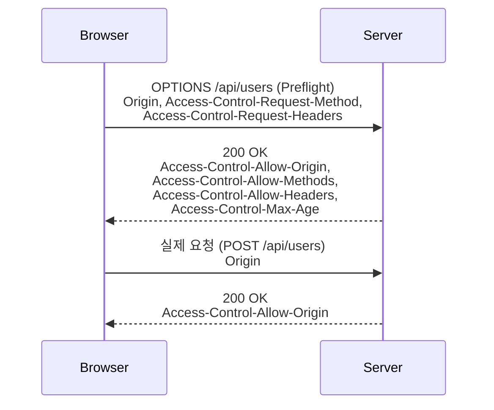

# CORS 설정

## 핵심 정의

CORS(Cross-Origin Resource Sharing)는 다른 출처(origin: scheme·host·port)의 응답을 브라우저 스크립트가 읽을 수 있는지 HTTP 헤더로 제어한다. 일부 요청은 사전 요청(preflight)으로 실제 전송 허용 여부도 검사하지만, 단순 요청은 서버에 먼저 도달할 수 있다. 따라서 CORS는 인증·인가나 CSRF 방어를 대체하지 않는다. Spring MVC는 CrossOrigin·addCorsMappings·CorsFilter로 구성한다.

## 동작 원리 / 구조

### CORS 프리플라이트(Preflight)



단순 요청(Simple Request, GET/HEAD/POST 중 표준 헤더·`Content-Type: application/x-www-form-urlencoded`/`multipart/form-data`/`text/plain` 조합)은 프리플라이트 없이 바로 전송되지만, `application/json` 바디를 쓰는 대부분의 REST API 호출이나 커스텀 헤더(예: `Authorization`)를 포함한 요청은 프리플라이트 대상이다. 프리플라이트는 `OPTIONS` 메서드로 먼저 서버에 허용 여부를 묻고, 서버가 허용 헤더를 응답해야 브라우저가 실제 요청을 전송한다.

```java
@Configuration
public class CorsConfig implements WebMvcConfigurer {
    @Override
    public void addCorsMappings(CorsRegistry registry) {
        registry.addMapping("/api/**")
            .allowedOrigins("https://app.example.com")
            .allowedMethods("GET", "POST", "PUT", "DELETE")
            .allowedHeaders("Authorization", "Content-Type")
            .allowCredentials(true)
            .maxAge(3600);
    }
}
```

`allowCredentials(true)`(credentials=include 모드의 응답 공유 허용)와 `allowedOrigins("*")`는 스펙상 동시에 쓸 수 없다. 자격 증명을 포함한 요청을 허용하려면 출처를 와일드카드가 아닌 구체적인 값으로 지정해야 하며, Spring은 `allowedOriginPatterns()`로 패턴 기반 매칭을 지원한다.

## 실무 관점

- **Security 연동**: preflight에는 일반적으로 로그인 쿠키가 없으므로 인증보다 먼저 CORS를 처리한다. http.cors(withDefaults())와 MVC가 있으면 별도 CorsConfigurationSource 없이 MVC 설정을 사용할 수도 있다. 여러 source가 있으면 사용할 source를 체인별로 지정한다.
- **자격증명 모드**: credentials=include인 요청은 Allow-Origin의 *를 허용하지 않는다. 명시적 Authorization 헤더가 있다는 사실만으로 항상 include 모드인 것은 아니다. Bearer 헤더는 Access-Control-Allow-Headers에 명시적으로 허용해야 한다. 모든 origin에 매칭되는 allowedOriginPatterns("*") 역시 인증된 응답을 폭넓게 공개하므로 신뢰할 출처로 제한한다.

## 심화 Q&A

### Q. CORS는 서버 측 보안 메커니즘인가?
A. CORS를 범용 서버 접근 제어로 사용해서는 안 된다. 브라우저는 CORS 응답 정책을 강제하지만, 서버 구현도 요청을 거부할 수 있다. 예를 들어 Spring Framework 7.0.9의 구성된 DefaultCorsProcessor가 허용되지 않은 Origin을 검사하면 HTTP 403으로 거부한다. 따라서 curl이면 항상 같은 응답을 받는다는 설명도 정확하지 않다. 다만 브라우저 밖 클라이언트는 Origin을 생략하거나 임의로 지정할 수 있으므로, Origin 허용만으로 사용자를 신뢰하지 않는다. 실제 요청의 인증·인가는 별도로 적용한다.

### Q. `GET` 요청인데도 프리플라이트가 발생하는 경우는 언제인가?
A. GET에도 Authorization이나 safelist에 없는 요청 헤더를 붙이면 preflight 대상이다. 요청 Content-Type을 application/json으로 설정한 경우도 해당한다. 서버가 JSON 응답을 반환한다는 이유나 Accept: application/json만으로 preflight가 필요한 것은 아니다.

### Q. `@CrossOrigin`을 컨트롤러 메서드에 붙인 설정과 `WebMvcConfigurer.addCorsMappings()`의 전역 설정이 동시에 있으면 어떻게 병합되는가?
A. 출처·메서드·헤더 같은 목록은 보통 전역과 로컬을 합친다. allowCredentials·maxAge 같은 단일값은 로컬이 덮어쓴다. 로컬 allowedOrigins를 더 좁게 적으면 전역 허용 목록을 빼준다고 가정하면 안 된다. 합쳐진 실제 정책을 테스트한다.

### Q. 프록시나 로드밸런서(예: Nginx, ALB)를 앞단에 둔 환경에서 CORS 응답 헤더가 애플리케이션 설정대로 나가는데도 브라우저에서 CORS 오류가 발생하는 경우 흔한 원인은?
A. 프록시 레벨에서 별도로 CORS 헤더를 추가하거나 동일 헤더를 중복으로 설정해 `Access-Control-Allow-Origin` 헤더가 응답에 두 번 포함되는 경우가 흔한 원인이다. 브라우저는 이 헤더가 정확히 하나의 값만 있어야 유효하다고 판단하므로, 애플리케이션과 프록시 양쪽에서 각각 CORS를 설정하면 헤더 중복으로 요청이 실패한다. CORS 설정 책임을 애플리케이션과 인프라 계층 중 한 곳으로 명확히 일원화해야 한다.

## 관련 개념

- [[Filter와 Interceptor]]
- [[Security Filter Chain]]
- [[Method Security와 CSRF 방어]]
- [[파일 업로드 처리]]

## 참고 자료

검증일: 2026-09-08. 적용 범위: Fetch Living Standard와 Spring MVC/Security 7 계열 CORS.

- [Spring MVC CORS](https://docs.spring.io/spring-framework/reference/web/webmvc-cors.html) — 전역·로컬 병합과 자격증명.
- [Spring Security CORS](https://docs.spring.io/spring-security/reference/servlet/integrations/cors.html) — 보안 필터 이전 처리와 MVC 구성 재사용.
- [Fetch Standard](https://fetch.spec.whatwg.org/) — preflight·credentials mode·헤더 허용.

부분 재검증: 2026-09-23. [DefaultCorsProcessor 7.0.9 소스](https://raw.githubusercontent.com/spring-projects/spring-framework/v7.0.9/spring-web/src/main/java/org/springframework/web/cors/DefaultCorsProcessor.java)의 Origin 검사·403 거부·CORS가 아닌 요청의 통과 분기를 확인해 서버 측 검사와 브라우저 정책을 구분했다. [Fetch Standard](https://fetch.spec.whatwg.org/)의 credentials 모드와 명시적 Authorization 헤더의 구분에 맞춰 allowCredentials 설명도 좁혔다. 이 문단과 관련 설명만 확인했으며 실행 시험 없이 기존 verified를 유지했다.
