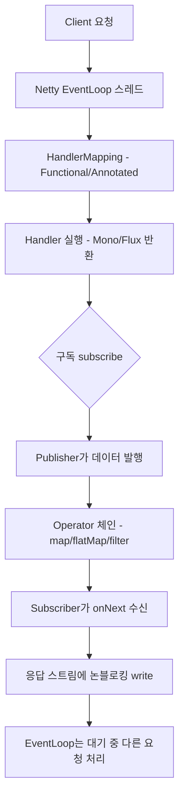

# Spring WebFlux와 리액티브 스트림

## 핵심 정의
Spring WebFlux는 Spring Framework 5에서 도입된 리액티브 스택(Reactive Stack) 웹 프레임워크로, 소수의 스레드로 대량의 동시 요청을 논블로킹(Non-blocking) 방식으로 처리하도록 설계됐다. 내부적으로 리액티브 스트림(Reactive Streams) 명세를 구현한 Project Reactor(`Mono`, `Flux`)를 기반으로 동작하며, Boot WebFlux의 기본 서버는 Reactor Netty이며 Framework 7/Boot 4에서는 지원되는 Tomcat·Jetty의 Servlet 비동기 기반으로도 실행할 수 있다. 과거 Undertow 지원 목록을 Boot 4에 그대로 적용하지 않는다.

리액티브 스트림은 발행자(Publisher)-구독자(Subscriber) 사이의 비동기 데이터 스트림 처리와 배압(Backpressure) 전달을 표준화한 명세(Java에서는 `java.util.concurrent.Flow`로 JDK 9부터 표준 API에도 반영됨)이며, WebFlux/Reactor는 이 명세의 구현체 역할을 한다.

## 동작 원리 / 구조



| 구분 | Spring MVC (서블릿 스택) | Spring WebFlux (리액티브 스택) |
|---|---|---|
| 스레드 모델 | 동기 요청은 실행 스레드 점유; Servlet 비동기도 지원 | 이벤트 루프(Event Loop), 소수 스레드 |
| 기본 서버(Boot) | Tomcat | Netty |
| 프로그래밍 모델 | 어노테이션 컨트롤러 위주 | 어노테이션 컨트롤러 + 함수형 라우팅(`RouterFunction`) |
| 데이터 접근 | JDBC·JPA 등 블로킹 접근에 적합 | 논블로킹 드라이버 권장; 불가피한 블로킹 호출은 별도 실행기에 격리 |
| 동시성 확보 방식 | 플랫폼 스레드 풀 또는 가상 스레드; 하위 자원 한도는 별도 | 논블로킹 I/O + 백프레셔 |
| 디버깅 난이도 | 스택트레이스가 직관적 | 콜백 체인으로 스택트레이스 추적이 어려움 |

Reactive Streams 4대 인터페이스:

```java
public interface Publisher<T> {
    void subscribe(Subscriber<? super T> s);
}
public interface Subscriber<T> {
    void onSubscribe(Subscription s);
    void onNext(T t);
    void onError(Throwable t);
    void onComplete();
}
public interface Subscription {
    void request(long n);   // 배압: 구독자가 처리 가능한 만큼만 요청
    void cancel();
}
public interface Processor<T, R> extends Subscriber<T>, Publisher<R> {}
```

Mono는 최대 한 요소, Flux는 여러 요소를 표현하며 동기적으로 신호를 전달할 수도 있다. 대부분의 작업은 구독 후 실행되지만 모든 Publisher가 cold인 것은 아니다. Mono.just(expensiveCall())의 인자는 조립 전에 Java가 평가한다. 구독마다 지연 실행하려면 defer/fromCallable 등으로 작업 자체를 감싼다.

```java
@GetMapping("/users/{id}")
public Mono<UserResponse> getUser(@PathVariable Long id) {
    return userRepository.findById(id)
        .flatMap(user -> enrichmentService.enrich(user))
        .map(UserResponse::from)
        .switchIfEmpty(Mono.error(new UserNotFoundException(id)));
}
```

## 실무 관점
- **선택 기준**: 스트리밍·다중 비동기 호출·배압 조합이 필요한지, 기존 JDBC/JPA와 팀의 운영 경험을 함께 본다. MVC와 가상 스레드도 대안이며 특정 서비스 유형에 하나가 업계의 정답이라고 단정하지 않는다. 대표 부하에서 지연·처리량·자원 사용량을 비교한다.
- **블로킹 호출 격리**: 이벤트 루프에서 JDBC·sleep·동기 HTTP 호출을 실행하지 않는다. 불가피하면 Mono.fromCallable(() -> blockingCall()).subscribeOn(Schedulers.boundedElastic())처럼 실행 자체를 옮긴다. Mono.just(blockingCall()) 뒤 스케줄러를 붙이면 이미 호출된 뒤다. 별도 풀도 동시성·큐·타임아웃을 제한해야 한다.
- **Mono 캐시의 공유 범위**: Reactor 3.8.7의 `cache()`는 값뿐 아니라 빈 완료와 오류도 보관한다. `source.cache().retry(1)`은 캐시된 오류를 다시 받아 원본 호출이 반복되지 않을 수 있다. 재시도와 캐시의 순서, 오류·빈 결과의 TTL(Time To Live)을 따로 정한다. 사용자별 `Context`로 데이터를 조회하는 Mono 하나를 싱글턴 필드에 캐시하면 첫 사용자의 결과가 다른 사용자에게 재사용될 수 있다. 캐시 키·인스턴스 수명을 인증 범위와 맞추고 다른 테넌트의 연속 요청으로 확인한다.
- **디버깅/운영**: `Hooks.onOperatorDebug()`는 연산자 조립 때 스택을 캡처하므로 비용이 크다. 필요한 지점의 checkpoint 또는 바이트코드 계측으로 비용을 줄이는 `ReactorDebugAgent`를 검토한다. 두 방식을 같은 오버헤드로 간주하지 말고 배포·계측 범위와 실제 부하에서 측정한다.
- **배압의 한계**: request(n)은 Publisher가 보내도 되는 요소 수를 제어한다. 무제한 request, unbounded buffer·collectList, 큰 단일 요소, 외부 소스의 속도 제어 불가 때문에 여전히 메모리가 고갈될 수 있다. 네트워크 전체의 동시 요청 수와 큐·버퍼 예산은 별도로 제한한다.
- **팀 러닝 커브**: 명령형 코드에 익숙한 팀이 리액티브 코드베이스로 전환하면 `flatMap`/`zip`/`Mono.zip` 조합, 에러 처리 연산자(`onErrorResume`, `onErrorReturn`) 학습 비용이 상당하다. 도입 전 팀 전체의 러닝 커브를 트레이드오프로 고려해야 한다.

## 심화 Q&A

### Q. WebFlux 환경에서 스레드 수를 늘리면 처리량이 비례해서 늘어나는가?
A. 처리량은 CPU·외부 I/O·큐·연결 한도 중 병목에 좌우된다. 스레드 수를 늘리면 컨텍스트 전환 비용이 증가할 수 있다. 긴 CPU 연산을 적절한 스케줄러로 옮기면 이벤트 루프 응답성을 보호할 수 있지만 CPU 용량 자체가 늘지는 않는다. 연산량·병렬화 가능성·동시성을 측정해 제한한다.
### Q. `Mono.zip()`으로 여러 리액티브 소스를 조합할 때 그중 하나가 에러를 던지면 나머지 소스는 어떻게 되는가?
A. zip은 각 소스가 요소를 하나씩 내야 조합 값을 만든다. 하나가 error면 실패하고 empty면 조합 없이 완료하며 다른 소스를 취소한다. 동기적인 빈 완료라면 일부 소스가 구독되지 않을 수도 있다. 취소는 이미 발생한 외부 부수 효과를 되돌리지 않는다. empty와 부분 실패를 값으로 모델링하거나 업무상 보상 정책을 정한다.
### Q. `Flux`를 구독하지 않고 파이프라인만 조립해 두면 어떤 일이 벌어지는가?
A. 구독하지 않은 cold 작업은 실행되지 않는다. 그러나 just의 인자 평가나 이미 시작된 hot 소스의 부수 효과는 구독 전에도 일어날 수 있다. 컨트롤러가 반환한 Publisher는 WebFlux가 구독하므로 내부에서 별도 subscribe로 작업을 분리하지 말고 반환 체인에 연결한다.
### Q. R2DBC를 도입하면 JPA의 영속성 컨텍스트(1차 캐시, 변경 감지)와 같은 기능을 그대로 쓸 수 있는가?
A. 아니다. R2DBC는 논블로킹 관계형 DB 접근을 위한 사양일 뿐이며, JPA의 영속성 컨텍스트, 지연 로딩, 변경 감지(Dirty Checking) 같은 ORM 기능을 제공하지 않는다. Spring Data R2DBC는 상대적으로 얇은 매핑 계층에 가깝고, 엔티티 간 연관 관계 로딩도 직접 조합해야 하는 경우가 많다. JPA에 익숙한 팀이 WebFlux로 전환할 때 이 기능 격차를 과소평가해 설계가 예상보다 복잡해지는 경우가 많다. 자세한 JPA 동작은 [[JPA 영속성 컨텍스트]] 참고.
### Q. WebFlux 컨트롤러에서 예외를 던지면 `@ExceptionHandler`가 정상적으로 동작하는가?
A. 애노테이션 컨트롤러는 동기 예외와 연결된 Publisher의 오류에 ExceptionHandler/ControllerAdvice를 지원한다. WebFlux에는 MVC의 HandlerExceptionResolver 체인이 없으며 컨트롤러 어댑터의 예외 처리와 바깥 WebExceptionHandler를 구분한다. 함수형 라우트·WebFilter 오류가 ControllerAdvice에 자동 적용되지는 않는다. 응답이 커밋된 스트림 오류는 새 상태 코드·본문으로 바꿀 수 없다.
### Q. 서블릿 스택에 가상 스레드를 도입하면 WebFlux를 도입할 이유가 완전히 사라지는가?
A. 아니다. 가상 스레드는 블로킹 호출로 인한 스레드 점유 비용 문제를 해결해 "요청당 스레드" 모델의 확장성 한계를 크게 완화하지만, 어디까지나 스레드 모델의 문제를 해결하는 것이지 리액티브 스트림의 배압, 연산자 기반 스트림 조합, 논블로킹 I/O 자체가 주는 이점(예: 대량 동시 커넥션을 유지하는 스트리밍, 세밀한 흐름 제어)을 대체하지는 못한다. 일반적인 요청-응답형 CRUD 서비스라면 가상 스레드 도입만으로 충분한 경우가 많지만, 스트리밍/게이트웨이 성격의 워크로드에는 여전히 WebFlux가 적합한 선택지로 남아 있다.

## 관련 개념
- [[WebClient와 RestTemplate]]
- [[내장 WAS]]
- [[JPA 영속성 컨텍스트]]
- [[DispatcherServlet 요청 처리 흐름]]

## 참고 자료

부분 재검증: 2026-10-04. Reactor Core 3.8.7로 캐시 뒤 재시도의 원본 호출 1회, 재시도 뒤 캐시의 원본 호출 2회 후 성공 재사용, 서로 다른 테넌트 Context가 같은 캐시 결과를 받는 경우를 3건 실행했다. Reactor 연산자 경계의 시험이며 실제 WebFlux 서버·인증 필터를 실행한 검증은 아니다.

- [Mono 3.8.7 API](https://projectreactor.io/docs/core/3.8.7/api/reactor/core/publisher/Mono.html) — `cache`, 신호별 TTL, `retry`, `deferContextual` 계약. 테넌트 공유 위험은 이 계약을 조합한 실행 사례다.
- [WebFlux 동시성 모델](https://docs.spring.io/spring-framework/reference/web/webflux/new-framework.html) / [Boot 가상 스레드](https://docs.spring.io/spring-boot/reference/features/spring-application.html#features.spring-application.virtual-threads) — 2026-10-04 표 대조: Framework 7.0·Boot 4.1의 MVC 비동기·가상 스레드 선택과 블로킹 라이브러리 격리. 서버 성능 비교를 실행한 것은 아니다.

검증일: 2026-09-08. 적용 범위: Spring Framework 7.0 WebFlux, Reactor Core 3.8 및 Reactive Streams.

- [Spring WebFlux](https://docs.spring.io/spring-framework/reference/web/webflux.html) — 리액티브 서버 스택.
- [Hot and Cold](https://projectreactor.io/docs/core/release/reference/advancedFeatures/reactor-hotCold.html) — just·defer와 구독 시점.
- [Mono API](https://projectreactor.io/docs/core/release/api/reactor/core/publisher/Mono.html) — zip의 empty/error 취소.
- [WebFlux Multipart](https://docs.spring.io/spring-framework/reference/web/webflux/controller/ann-methods/multipart-forms.html) — 스트림과 버퍼 처리.
- [Reactor debugging](https://projectreactor.io/docs/core/release/reference/debugging.html) — Hooks·checkpoint·운영용 agent 차이.
