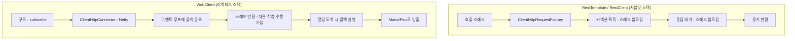

# WebClient와 RestTemplate

## 핵심 정의
`RestTemplate`은 서블릿 스택(Servlet Stack)에서 쓰던 동기(Synchronous)/블로킹(Blocking) 방식의 HTTP 클라이언트다. `WebClient`는 Spring WebFlux와 함께 Spring Framework 5에 도입된 비동기(Asynchronous)/논블로킹(Non-blocking) HTTP 클라이언트로, `Mono`/`Flux` 기반 리액티브 스트림(Reactive Streams)을 반환한다.

RestClient는 Framework 6.1에 도입됐으며 7.0부터 RestTemplate은 deprecated이고 향후 제거 대상으로 안내된다. 제거될 특정 버전을 추측하지 않는다. 동기 호출에는 RestClient, 비동기·스트리밍 조합에는 WebClient를 고려한다. 두 동기 클라이언트는 Servlet 밖 배치·일반 Java 코드에서도 사용할 수 있다.

## 동작 원리 / 구조



| 구분 | RestTemplate | RestClient | WebClient |
|---|---|---|---|
| 도입 시점 | Spring 3.0 | Spring Framework 6.1 | Spring 5.0 (WebFlux) |
| 실행 모델 | 동기/블로킹 | 동기/블로킹(fluent API) | 비동기/논블로킹 |
| 반환 타입 | 도메인 객체, `ResponseEntity` | 도메인 객체, `ResponseEntity` | `Mono<T>`, `Flux<T>` |
| 내부 구현 | `ClientHttpRequestFactory` | `RestTemplate`과 동일 인프라 공유 | `ClientHttpConnector` (Reactor Netty 기본) |
| 필요 의존성 | `spring-web` | `spring-web` | `spring-webflux` (Reactor Netty 등) |
| 현재 상태 | Framework 7.0에서 deprecated | 신규 동기 클라이언트, 적극 유지보수 | 리액티브 표준, 적극 유지보수 |

핵심 API 비교다. Spring Boot 애플리케이션에서는 주입받은 `RestClient.Builder`·`WebClient.Builder`로 클라이언트를 구성해야 자동 구성된 관측 가능성·사용자 정의 설정을 이어받을 수 있다. 아래 `create()`는 독립 생성 예다.

```java
// RestClient (동기, 서블릿 스택 신규 권장)
RestClient restClient = RestClient.create("https://api.example.com");
UserResponse user = restClient.get()
    .uri("/users/{id}", userId)
    .retrieve()
    .body(UserResponse.class);

// WebClient (비동기, 리액티브 스택)
WebClient webClient = WebClient.create("https://api.example.com");
Mono<UserResponse> userMono = webClient.get()
    .uri("/users/{id}", userId)
    .retrieve()
    .bodyToMono(UserResponse.class);

// 리액티브 컨트롤러/서비스에서는 userMono를 호출자에게 반환한다.
// 명시적 구독이 필요한 경계에서는 오류·취소·수명주기를 함께 관리한다.
```

`WebClient`가 블로킹 코드(예: 서블릿 스택 MVC 컨트롤러)에서 결과를 즉시 필요로 한다면 `.block()`을 호출할 수 있지만, 이는 리액티브 파이프라인을 강제로 동기화하는 것이라 호출 스레드가 컨트롤러 워커 스레드일 경우 스레드 풀 고갈 위험을 그대로 안게 된다. 반대로 `RestTemplate`/`RestClient`를 WebFlux 이벤트 루프 스레드(Netty EventLoop) 안에서 호출하면 그 소수의 이벤트 루프 스레드를 블로킹시켜 전체 처리량이 급격히 떨어진다.

## 실무 관점
- **선택 기준**: 동기 요청에는 `RestClient`, 스트리밍·비동기 조합에는 `WebClient`를 고려한다. Boot 4의 MVC 권장 스타터는 `spring-boot-starter-webmvc`이며 기존 `spring-boot-starter-web`은 deprecated다. MVC에서도 WebClient로 여러 요청을 병렬 조합하거나 `Mono`를 반환할 수 있으므로 서버 스택만으로 클라이언트를 고정하지 않는다.
- **동기 클라이언트 자원**: 직접 new RestTemplate()한 경우와 RestClient/Boot Builder의 팩토리 자동 선택은 다르다. RestClient는 클래스패스의 Apache·Jetty, JDK HttpClient 등을 선택할 수 있다. 모든 기본값이 SimpleClientHttpRequestFactory이거나 연결이 무제한이라고 단정하지 말고 실제 팩토리의 풀·대기·연결·읽기 제한을 확인한다.
- **WebClient 자원**: 기본 Reactor Netty HttpClient는 전역 HttpResources의 이벤트 루프와 풀을 공유한다. WebClient.create 호출마다 새 풀이 생기는 것은 아니다. 클라이언트/Builder는 설정 일관성을 위해 재사용하고, 별도 ConnectionProvider를 만들었다면 종료와 풀 예산을 직접 관리한다.
- **타임아웃 미설정 장애**: 기본 제한은 실제 HTTP 구현마다 다르다. Reactor Netty 1.3의 TCP 연결 제한은 기본 30초, 풀 획득 대기는 45초지만 `responseTimeout`은 기본 미설정이다. 이 값들도 전체 요청 제한 시간을 대신하지 않는다. 풀 대기·연결·응답 읽기와 재시도를 포함한 전체 예산을 구분한다. 구체적인 범위는 [[HTTP 호출 타임아웃과 재시도 예산]]을 참고한다.
- **예외 처리**: `RestTemplate`의 기본 오류 핸들러와 RestClient/WebClient의 `retrieve` 경로는 4xx/5xx를 예외로 매핑한다. Framework 7.0.9의 `RestClient.exchange(...)`는 등록한 기본 상태 핸들러를 적용하지 않으므로 콜백에서 상태를 판정해야 한다. WebClient의 `exchangeToMono/Flux`도 직접 상태별 처리를 구성하는 경로다. 호출 API를 바꿀 때 기존 오류·재시도 계약이 유지되는지 확인한다.
- **오류 매핑의 빈 결과**: WebClient의 `onStatus(predicate, response -> Mono.empty())`는 해당 상태를 오류로 취급하지 않고 응답을 뒤로 넘긴다. 응답 전체를 버리거나 빈 업무 결과로 바꾸는 뜻이 아니어서, 뒤의 `bodyToMono`가 503의 본문을 정상 값으로 디코딩할 수 있다. 오류 본문에서 예외를 만들 때 본문이 비어 있어 매퍼가 빈 Mono로 끝나는 경우에도 기본 예외를 생성하는 경로를 둔다.
- **요청 실행 확인**: RestClient는 동기 클라이언트지만 `retrieve()` 호출만으로 요청을 보내지 않는다. `body`·`toEntity`·`toBodilessEntity` 같은 응답 추출 연산이 필요하다. 반환 본문이 필요 없는 변경 요청도 최종 연산과 상태 확인을 빠뜨리지 않는다.
- **마이그레이션 전략**: `RestClient.create(restTemplate)`/`builder(restTemplate)`은 기존 RestTemplate의 요청 팩토리·컨버터·인터셉터 등 설정을 바탕으로 새 클라이언트를 구성한다. 기존 인스턴스에 모든 호출을 위임하는 래퍼는 아니다. 오류 처리·인터셉터·타임아웃 동작을 대조하며 전환한다.

## 심화 Q&A

### Q. WebFlux 컨트롤러 안에서 외부 API를 여러 번 순차 호출해야 할 때 `RestTemplate`을 쓰면 왜 문제가 되는가?
A. WebFlux는 소수의 이벤트 루프 스레드(보통 CPU 코어 수만큼)로 대량의 요청을 처리하는 구조다. 이 이벤트 루프 스레드 안에서 `RestTemplate.getForObject()` 같은 블로킹 호출을 실행하면 응답이 올 때까지 해당 이벤트 루프 스레드 전체가 멈추고, 그 스레드가 담당하던 다른 모든 요청의 처리도 함께 지연된다. 소수의 스레드로 대량 동시성을 처리하는 WebFlux의 장점이 정반대로 병목이 되는 것이다. `WebClient`로 대체하거나, 부득이하게 블로킹 호출이 필요하면 `Schedulers.boundedElastic()`으로 별도 스레드 풀에 격리해야 한다.
### Q. `WebClient.retrieve()`와 `WebClient.exchangeToMono()`의 차이는 무엇이고 언제 후자를 선택하는가?
A. retrieve는 기본 4xx/5xx 오류 매핑을 제공하며 onStatus로 바꿀 수 있다. exchangeToMono/Flux는 상태별 디코딩을 콜백에서 결정한다. 반환 Publisher 완료 후 소비되지 않은 바디는 자동 해제되므로 바디를 나중에 체인 밖에서 읽을 수 없다. 콜백 안에서 bodyToMono 등을 반환하고 별도 subscribe를 호출하지 않는다.
### Q. `WebClient`로 받은 `Mono<T>`를 서블릿 스택 컨트롤러에서 `.block()`으로 풀어 쓰는 것이 항상 안전하지 않은 이유는?
A. MVC 워커에서 block하는 것은 가능하지만 응답까지 해당 스레드 하나를 점유한다. 풀 전체를 한 요청이 점유하는 것은 아니다. 여러 호출을 비동기로 병렬 조합한 뒤 한 번 기다리면 그 이점은 남을 수 있다. Reactor의 NonBlocking 스레드에서는 block이 예외를 일으킨다. MVC도 Mono 반환으로 비동기 응답을 연결할 수 있어 무조건 block해야 하는 것은 아니다.
### Q. `RestClient`가 나온 이후에도 `WebClient`를 서블릿 스택 프로젝트에 함께 쓰는 경우가 있는가?
A. 있다. 서버-전송 이벤트(Server-Sent Events)나 청크 단위 스트리밍 응답을 소비해야 하는 경우, `RestClient`는 동기 API라 스트림을 그대로 표현하기 어렵고 `WebClient`의 `Flux` 기반 스트리밍 처리가 자연스럽다. 이 경우 `spring-webflux` 의존성만 추가해 `WebClient`를 스트리밍 호출 전용으로 국소적으로 쓰고, 나머지 일반 API 호출은 `RestClient`로 유지하는 혼합 구성이 실무에서 흔하다.
### Q. `RestTemplate`과 `RestClient`가 같은 인프라를 공유한다는 것은 구체적으로 무엇을 의미하는가?
A. 두 클라이언트 모두 내부적으로 동일한 `ClientHttpRequestFactory`, `ClientHttpRequestInterceptor`, `HttpMessageConverter` 스택을 사용한다. 즉 커넥션 풀 팩토리, 로깅/인증 인터셉터, JSON 컨버터 설정 등을 한 번 만들어 두면 `RestTemplate`과 `RestClient` 양쪽에 그대로 재사용할 수 있어, 점진적 마이그레이션 중에도 공통 설정을 이중 관리할 필요가 없다.
### Q. WebClient에서 재시도(retry)를 구현할 때 단순히 `.retry(3)`을 붙이면 어떤 문제가 생길 수 있는가?
A. `.retry(n)`은 오류 신호가 오면 간격 없이 최대 n번 재구독한다. 성공하면 멈추지만 오류 종류는 구분하지 않는다. 재구독이 HTTP 요청을 다시 실행하므로 중복 처리가 가능하다. 재시도 가능한 오류·멱등성·최대 횟수·백오프와 지터를 함께 설계하고, `retryWhen(...)` 뒤에 전체 예산을 제한한다. 5xx나 타임아웃도 이미 처리된 요청일 수 있으므로 무조건 안전한 재시도 조건은 아니다.

## 관련 개념
- [[HTTP Service Client와 선언형 호출]]
- [[Spring WebFlux와 리액티브 스트림]]
- [[내장 WAS]]
- [[전역 예외 처리와 ControllerAdvice]]
- [[HTTP 호출 타임아웃과 재시도 예산]]

## 참고 자료

부분 재검증: 2026-09-22. Boot 4.1.1의 클라이언트 Builder·MVC 스타터, Reactor Netty 1.3.7의 타임아웃 범위, Reactor Core 3.8.7의 재시도 의미를 공식 문서로 확인했다.

- [Boot Calling REST Services](https://docs.spring.io/spring-boot/reference/io/rest-client.html) — 자동 구성된 Builder와 클라이언트 설정.
- [Boot 4 Migration Guide](https://github.com/spring-projects/spring-boot/wiki/Spring-Boot-4.0-Migration-Guide) — MVC 스타터 명칭 변경.
- [Reactor Netty HTTP Client](https://projectreactor.io/docs/netty/release/reference/http-client.html#timeout-configuration) — 연결·풀·응답 타임아웃.
- [Reactor Mono API](https://projectreactor.io/docs/core/release/api/reactor/core/publisher/Mono.html) — retry·timeout 연산자.

검증일: 2026-09-08. 적용 범위: Spring Framework 7.0 HTTP 클라이언트 및 Reactor Netty 자원 공유.

- [REST Clients](https://docs.spring.io/spring-framework/reference/integration/rest-clients.html) — RestTemplate deprecation·팩토리 선택·RestClient.
- [WebClient Builder](https://docs.spring.io/spring-framework/reference/web/webflux-webclient/client-builder.html) — 공유 풀·타임아웃.
- [WebClient Exchange](https://docs.spring.io/spring-framework/reference/web/webflux-webclient/client-exchange.html) — exchangeToMono의 바디 해제.
- [RestClient API](https://docs.spring.io/spring-framework/docs/current/javadoc-api/org/springframework/web/client/RestClient.html) — RestTemplate 설정을 바탕으로 구성.

부분 재검증: 2026-10-04. Framework 7.0.9·JDK 25.0.4의 HTTP 클라이언트와 루프백 HTTP 서버로 JUnit 3건을 실행했다. RestClient retrieve의 기본 상태 핸들러 호출과 exchange의 미호출, WebClient onStatus의 빈 결과 뒤 503 본문 반환, RestClient retrieve 단독의 요청 미전송과 toBodilessEntity 이후 전송을 확인했다. Reactor Netty 전송 계층·풀·재시도 동작은 이 시험에서 검증하지 않았다.

- [RestClient RequestHeadersSpec 7.0.9](https://docs.spring.io/spring-framework/docs/7.0.9/javadoc-api/org/springframework/web/client/RestClient.RequestHeadersSpec.html) — retrieve 실행 시점과 exchange의 상태 핸들러 미적용.
- [WebClient ResponseSpec 7.0.9](https://docs.spring.io/spring-framework/docs/7.0.9/javadoc-api/org/springframework/web/reactive/function/client/WebClient.ResponseSpec.html) — onStatus의 빈 Mono와 응답 전파 의미.
