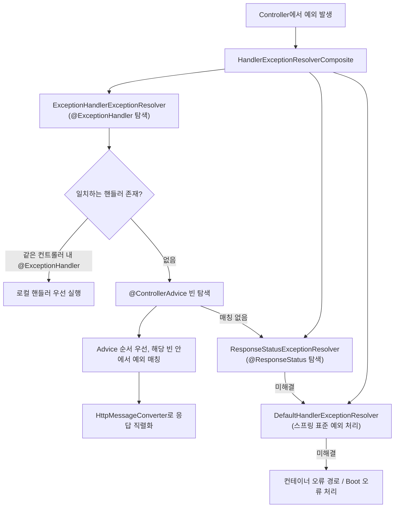

# 전역 예외 처리와 ControllerAdvice

## 핵심 정의
`@ControllerAdvice`(REST API에서는 `@RestControllerAdvice`)는 여러 컨트롤러에 공통으로 적용할 예외 처리, 데이터 바인딩(`@InitBinder`), 모델 속성(`@ModelAttribute`) 로직을 한 곳에 모아 등록하는 어노테이션이다. 그 안의 `@ExceptionHandler` 메서드가 적용 대상 컨트롤러의 요청 처리 중 발생한 예외에 매칭되어, 각 컨트롤러마다 try-catch를 반복하지 않고 일관된 에러 응답을 만들 수 있게 해준다.

Spring Framework는 RFC 9457의 Problem Details를 `ProblemDetail`/`ErrorResponse`로 지원한다. MVC의 `ResponseEntityExceptionHandler`를 상속하면 MethodArgumentNotValidException, HttpMessageNotReadableException 등 표준 예외 응답을 확장할 수 있다. WebFlux는 별도 패키지의 동명 클래스와 다른 예외 타입을 사용한다. 아래 흐름과 예제는 MVC 기준이다.

## 동작 원리 / 구조



탐색은 해당 컨트롤러의 로컬 핸들러를 먼저 찾고, 없으면 정렬된 ControllerAdvice 중 매칭되는 첫 빈을 사용한다. 한 빈 안에서 예외 타입의 구체성과 root/cause를 비교한다. 높은 우선순위 Advice의 cause 매칭이 낮은 Advice의 root 매칭보다 우선할 수 있다.

```java
@RestControllerAdvice
public class GlobalExceptionHandler extends ResponseEntityExceptionHandler {

    @ExceptionHandler(EntityNotFoundException.class)
    public ProblemDetail handleNotFound(EntityNotFoundException ex) {
        ProblemDetail problem = ProblemDetail.forStatusAndDetail(HttpStatus.NOT_FOUND, "요청한 리소스를 찾을 수 없습니다.");
        problem.setTitle("리소스를 찾을 수 없음");
        problem.setProperty("errorCode", "ENTITY_NOT_FOUND");
        return problem;
    }

    @ExceptionHandler(IllegalArgumentException.class)
    public ProblemDetail handleIllegalArgument(IllegalArgumentException ex) {
        return ProblemDetail.forStatusAndDetail(HttpStatus.BAD_REQUEST, "요청 값이 올바르지 않습니다.");
    }

    // MethodArgumentNotValidException 등 스프링 표준 예외는
    // ResponseEntityExceptionHandler가 이미 ProblemDetail로 처리해준다.
    // 필요 시 handleMethodArgumentNotValid()를 오버라이드해 커스터마이징한다.
}
```

Boot 4.1.1에서 `spring.mvc.problemdetails.enabled` 기본값은 false다. true이면 표준 MVC 예외를 처리하는 Problem Details 지원이 자동 구성된다. 직접 ResponseEntityExceptionHandler 기반 advice를 등록한 경우와 자동 구성의 중복·우선순위를 구분한다.

## 실무 관점
- **검증 실패의 상태 코드 보존**: `HandlerMethodValidationException`의 입력 오류는 400, 반환값 오류는 500이다. `ResponseEntityExceptionHandler`를 확장할 때 전달받은 상태 코드를 보존한다. `ConstraintViolationException`도 서비스 내부 불변식·반환값 검증에서 발생할 수 있으므로 타입만 보고 모두 400으로 바꾸지 않는다.
- **응답 포맷 표준화**: 팀 전체 API가 동일한 에러 응답 스키마(코드, 메시지, 타임스탬프, 필드별 검증 오류 목록 등)를 쓰도록 `@RestControllerAdvice` 하나에 모으는 것이 일반적이다. `ProblemDetail`의 `setProperty()`로 표준 필드 외 커스텀 필드(에러 코드, traceId 등)를 추가할 수 있다.
- **예외 계층 설계**: 도메인 예외를 `BusinessException` 같은 공통 상위 타입으로 묶고 에러 코드(enum)를 필드로 갖게 설계하면, `@ExceptionHandler(BusinessException.class)` 하나로 다양한 도메인 예외를 처리하면서도 각 예외가 자신의 상태 코드/메시지를 결정하게 할 수 있다.
- **로깅 수준 분리**: 4xx(클라이언트 귀책)와 5xx(서버 귀책)를 같은 로그 레벨로 남기면 알림/모니터링 노이즈가 커진다. `@ExceptionHandler`에서 상태 코드에 따라 `warn`/`error` 레벨을 분리하고, 5xx만 알림 채널로 연동하는 것이 실무 표준에 가깝다.
- **처리 경계**: DispatcherServlet 밖 Filter의 예외는 기본적으로 ControllerAdvice 대상이 아니다. 반면 핸들러에 연결된 Interceptor의 preHandle/postHandle 예외는 MVC 리졸버 경로로 처리될 수 있다. 핸들러를 아직 찾지 못한 오류와 afterCompletion 내부 오류는 같은 경로로 보장하지 않는다. 보안 인증 실패는 해당 EntryPoint/FailureHandler로 처리한다.
- **비동기/스트리밍 응답과의 충돌**: `@ExceptionHandler`가 실행되는 시점에 이미 응답이 커밋(commit)된 상태(예: 스트리밍 응답 일부가 이미 전송된 경우)라면 에러 응답 바디를 새로 쓸 수 없어 클라이언트에는 불완전한 응답만 도달한다. 스트리밍 API는 별도의 에러 프레이밍 전략이 필요하다.
- **민감 정보 노출 방지**: 내부 예외 메시지·SQL·클래스명은 로그와 외부 응답에서 구분한다. catch-all에서 ex.getMessage()를 그대로 노출하지 않는다. 예상하지 못한 예외까지 404/400으로 매핑하면 서버 결함을 숨기므로 업무상 예외와 프로그래밍 오류를 분류한다. 위 IllegalArgumentException 예제도 입력 검증 용도로만 사용하는 도메인 범위라는 전제가 필요하다.

## 심화 Q&A

### Q. 같은 컨트롤러에 로컬 `@ExceptionHandler`가 있고 전역 `@ControllerAdvice`에도 같은 예외 타입 핸들러가 있으면 어느 것이 실행되는가?
A. 로컬(같은 컨트롤러 내부) `@ExceptionHandler`가 항상 우선한다. `ExceptionHandlerExceptionResolver`는 예외가 발생한 핸들러가 속한 컨트롤러 자신을 먼저 탐색하고, 거기서 일치하는 메서드를 찾지 못했을 때만 `@ControllerAdvice` 빈들을 탐색한다. 특정 컨트롤러에만 예외적인 처리가 필요하면 로컬 핸들러로 오버라이드하는 패턴을 쓸 수 있다.
### Q. `@ExceptionHandler` 메서드 하나에 여러 예외 타입을 지정했는데 그중 부모-자식 관계인 예외가 둘 다 발생 가능한 상황이면 어떤 문제가 생길 수 있는가?
A. `@ExceptionHandler({ParentException.class, ChildException.class})`처럼 상속 관계에 있는 예외를 한 메서드에 나열하는 것 자체는 문법적으로 허용되지만, 서로 다른 `@ControllerAdvice` 빈에 부모 예외 핸들러와 자식 예외 핸들러가 각각 따로 등록된 경우 매칭 우선순위 문제가 생긴다. Spring은 예외 계층에서 가장 구체적인(가장 하위) 타입과 일치하는 핸들러를 우선 선택하도록 되어 있지만, 서로 다른 `@ControllerAdvice` 빈 사이의 우선순위는 `@Order`에 의존하므로 설계 시 상위 예외와 하위 예외를 같은 애드바이스 안에 두거나 순서를 명확히 지정해야 예상과 다른 핸들러가 실행되는 문제를 피할 수 있다.
### Q. `@ExceptionHandler` 메서드 안에서 또 다른 예외가 발생하면 어떻게 처리되는가?
A. MVC의 ExceptionHandlerExceptionResolver는 핸들러 호출 실패를 기록하고 보통 null을 반환해 원본 예외를 다음 리졸버가 처리하게 한다. 새 예외로 ControllerAdvice 탐색을 무한히 반복하지 않는다. 이후 리졸버가 원본을 처리할 수 있으며 끝까지 처리되지 않을 때 컨테이너 오류 경로로 간다. 이미 커밋된 응답이나 클라이언트 연결 종료는 별도 제약이 있다.
### Q. `ResponseEntityExceptionHandler`를 상속하지 않고 직접 모든 표준 예외를 `@ExceptionHandler`로 나열하면 어떤 단점이 있는가?
A. Spring MVC가 내부적으로 던지는 예외는 `MethodArgumentNotValidException`, `HttpMessageNotReadableException`, `HttpMediaTypeNotSupportedException`, `MissingServletRequestParameterException` 등 수십 종에 달하고, 각 예외마다 적절한 HTTP 상태 코드 매핑이 이미 프레임워크에 내장되어 있다. 이를 직접 나열하면 신규 스프링 버전에서 추가되는 예외 타입을 놓치기 쉽고 상태 코드 매핑 실수도 잦아진다. `ResponseEntityExceptionHandler`를 상속하면 기본 매핑을 그대로 물려받고 필요한 것만 오버라이드할 수 있어 유지보수 비용이 훨씬 낮다.
### Q. `@ControllerAdvice`의 `basePackages`나 `assignableTypes`를 지정하지 않으면 어떤 위험이 있는가?
A. 아무 제약도 지정하지 않은 `@ControllerAdvice`는 애플리케이션 컨텍스트 안의 모든 컨트롤러에 전역 적용된다. 멀티 모듈이나 여러 도메인 컨트롤러가 뒤섞인 큰 애플리케이션에서는, 특정 도메인 전용으로 만든 예외 처리 애드바이스가 의도치 않게 다른 도메인 컨트롤러의 예외까지 가로채 잘못된 에러 응답 포맷을 반환하는 문제가 생길 수 있다. 도메인별로 애드바이스를 분리해야 한다면 `assignableTypes`나 `basePackages`로 적용 범위를 명시적으로 제한하는 것이 안전하다.
### Q. WebFlux 환경에서 `@ExceptionHandler`는 리액티브 타입을 반환할 수 있는가?
A. 가능하다. WebFlux의 `@ExceptionHandler` 메서드는 `Mono<ResponseEntity<T>>`나 `Mono<ProblemDetail>`처럼 리액티브 반환 타입을 지원하며, 에러 응답을 만들기 위해 추가로 비동기 호출(예: 에러 로그를 외부 시스템에 남기는 호출)이 필요한 경우에 유용하다. 다만 이 비동기 처리 안에서 다시 블로킹 코드를 실행하면 [[Spring WebFlux와 리액티브 스트림]]에서 다루는 이벤트 루프 블로킹 문제가 예외 처리 경로에서도 그대로 재현된다는 점을 주의해야 한다.

## 관련 개념
- [[Bean Validation]]
- [[Filter와 Interceptor]]
- [[Spring WebFlux와 리액티브 스트림]]
- [[DispatcherServlet 요청 처리 흐름]]

## 참고 자료

부분 재검증: 2026-09-22. Spring MVC 7.0.9의 메서드 입력·반환값 검증 예외를 구분하고 MockMvc로 기본 상태 코드 400·500을 실행 확인했다.

- [HandlerMethodValidationException API](https://docs.spring.io/spring-framework/docs/7.0.9/javadoc-api/org/springframework/web/method/annotation/HandlerMethodValidationException.html) — 입력·반환값의 HTTP 상태 차이.

검증일: 2026-09-08. 적용 범위: Spring MVC 7.0, Boot 4.1.1 Problem Details, RFC 9457.

- [MVC ExceptionHandler](https://docs.spring.io/spring-framework/reference/web/webmvc/mvc-controller/ann-exceptionhandler.html) — 로컬·전역·원인 예외 우선순위.
- [ExceptionHandlerExceptionResolver 소스](https://raw.githubusercontent.com/spring-projects/spring-framework/7.0.x/spring-webmvc/src/main/java/org/springframework/web/servlet/mvc/method/annotation/ExceptionHandlerExceptionResolver.java) — 핸들러 실패 후 원본 예외 처리.
- [Boot 설정 속성](https://docs.spring.io/spring-boot/appendix/application-properties/index.html) — Problem Details 기본 false.
- [RFC 9457](https://www.rfc-editor.org/rfc/rfc9457) — Problem Details 필드와 보안 고려.
