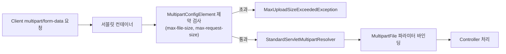

# 파일 업로드 처리

## 핵심 정의

파일 업로드는 `multipart/form-data` 인코딩으로 전송된 요청을 서블릿 컨테이너 또는 프레임워크가 파싱해 `MultipartFile`(서블릿 스택) 또는 `Part`/`FilePart`(WebFlux)로 컨트롤러에 전달하는 처리다. Spring Boot는 서블릿 스택에서 `StandardServletMultipartResolver`를 기본으로 사용하며, 이는 서블릿 컨테이너(Tomcat 등)에 내장된 멀티파트 파싱 기능에 위임한다.

## 동작 원리 / 구조

### 파일 업로드 흐름



```java
@PostMapping("/files")
public ResponseEntity<Void> upload(@RequestParam("file") MultipartFile file) throws IOException {
    if (file.isEmpty()) {
        throw new IllegalArgumentException("빈 파일은 업로드할 수 없습니다.");
    }
    // uploadDir는 서버가 관리하며 웹 실행 경로와 분리된 디렉터리다.
    // 타입·크기·업무 권한 검증을 통과한 파일만 저장한다.
    Path target = Path.of(uploadDir).resolve(UUID.randomUUID().toString());
    try (InputStream input = file.getInputStream()) {
        Files.copy(input, target); // 기존 파일을 덮어쓰지 않는다.
    }
    return ResponseEntity.ok().build();
}
```

Spring Boot 4.1.1의 Servlet MultipartProperties 기본값: `spring.servlet.multipart.max-file-size`는 1MB, `spring.servlet.multipart.max-request-size`(전체 요청 크기, 여러 파일+폼 필드 합산)는 10MB, `file-size-threshold`(디스크로 흘려쓰기 전 메모리에 유지할 임계값)는 기본 0으로 즉시 디스크에 기록한다. 실무에서는 대부분 이 기본값을 애플리케이션 요구에 맞게 명시적으로 재정의한다.

WebFlux는 서블릿 멀티파트 대신 `DefaultPartHttpMessageReader`가 파싱을 담당하며, `spring.webflux.multipart.max-in-memory-size`, `spring.webflux.multipart.max-disk-usage-per-part` 등 별도의 프로퍼티 체계를 쓴다.

## 실무 관점

- **대용량 파일 업로드 전략**: 수백 MB 이상의 파일을 애플리케이션 서버가 직접 받는 방식은 서버 메모리/디스크/스레드를 오래 점유해 확장성이 떨어진다. 실무에서는 클라이언트가 스토리지(S3 등)에 직접 업로드하도록 서버가 서명된 URL(Presigned URL)만 발급하는 패턴을 많이 쓴다. 서버를 반드시 경유해야 한다면 스트리밍 방식(파일 전체를 메모리에 올리지 않고 청크 단위로 처리)을 검토한다.
- **크기 초과 응답**: Spring MVC 7.0.9는 `MaxUploadSizeExceededException`을 413 Content Too Large로 처리하는 표준 경로를 제공한다. Boot 4.1.1·Tomcat 11.0.24에서 파일 제한 8바이트를 설정하고 4바이트 파일은 200, 9바이트 파일은 413으로 응답함을 확인했다. 프록시·컨테이너 제한에서 먼저 차단되면 다른 응답이나 연결 종료가 발생할 수 있으므로 실제 경로별 동작과 ProblemDetail 형식을 확인한다.
- **저장 검증**: 원본 파일명·확장자·Content-Type은 모두 사용자 입력이다. 저장 이름을 서버에서 생성하고 실제 내용과 허용 형식을 확인한다. 원본 이름은 정리된 메타데이터로만 보관한다. 실행 권한·다운로드 Content-Disposition·크기/개수 제한도 적용한다.
- **임시 파일 정리**: `file-size-threshold`를 초과해 디스크에 임시로 기록된 멀티파트 파일은 요청 처리가 끝나면 정리되지만, 예외 발생 시나 대용량 트래픽 상황에서 임시 디렉터리 용량 관리에 신경 써야 한다.
- **검사 전 공개 금지**: 업로드 객체를 격리된 저장 위치에 두고 필요한 악성 코드 검사·형식 검증이 끝난 뒤 다운로드를 허용한다. 웹 실행 경로와 분리하고 최소 권한을 적용한다. 압축 파일을 푼다면 전송 크기 외에 실제 해제된 총량·항목 수와 저장 경로도 제한한다.

## 심화 Q&A

### Q. `MultipartFile`을 `@Async` 메서드나 작업 큐에 넘겨 나중에 처리해도 되는가?
A. 요청 종료 뒤 원래 임시 저장소가 살아 있다고 가정하면 안 된다. Spring 7.0.9의 `MultipartFile` 계약은 요청 처리 종료 시 임시 저장소가 정리된다고 명시한다. 요청 안에서 애플리케이션이 관리하는 저장소로 복사·이동을 완료한 뒤 작업에는 객체 키와 메타데이터를 넘긴다. 파일 저장과 DB 상태 변경이 하나의 로컬 DB 트랜잭션으로 원자화되지는 않으므로, `업로드됨 → 검사 중 → 사용 가능/실패` 상태와 미참조 객체 정리·재시도 정책을 함께 설계한다. `transferTo(File)`은 컨테이너에 따라 이동할 수 있어 같은 임시 파일에 반복 호출하지 않는다.

### Q. 멀티파트 요청에서 `max-file-size`와 `max-request-size` 제한을 서로 다르게 설정하면 어떤 순서로 검사가 이루어지는가?
A. 파일별 최대 크기와 요청 전체의 최대 크기는 독립된 제한이며 검사 순서는 컨테이너·Content-Length·파싱 진행에 따라 다르다. 전체 크기에는 multipart 경계와 폼 필드도 포함된다. max-request-size가 작으면 실효 파일 허용량도 줄어들지만 설정 자체가 불법은 아니다. 정상 최대 업로드와 파일 개수를 수용하도록 총량 예산을 정한다.

### Q. WebFlux에서 대용량 파일을 업로드받을 때 `FilePart`를 어떻게 다뤄야 메모리 문제를 피할 수 있는가?
A. FilePart.content는 Flux<DataBuffer>이며 transferTo(Path)로 저장을 연결할 수 있다. 기본 multipart reader는 FilePart를 전달하기 전에 이미 디스크에 임시 저장했을 수 있어 이것만으로 네트워크부터 끝까지 직접 스트리밍한다고 말하면 안 된다. 순차 실시간 처리는 Flux<PartEvent>를 검토하고 각 버퍼를 소비·전달·해제한다. DataBufferUtils.write는 오버로드별 해제·스트림 종료 계약이 다르므로 확인한다.

## 관련 개념

- [[전역 예외 처리와 ControllerAdvice]]
- [[Spring WebFlux와 리액티브 스트림]]
- [[CORS 설정]]
- [[Transactional 동작 원리]]

## 참고 자료

검증일: 2026-09-08. 적용 범위: Spring Framework 7.0 및 Boot 4.1.1 Servlet/WebFlux multipart.

- [MultipartProperties API](https://docs.spring.io/spring-boot/api/java/org/springframework/boot/servlet/autoconfigure/MultipartProperties.html) — Servlet 크기 제한 기본값.
- [MaxUploadSizeExceededException API](https://docs.spring.io/spring-framework/docs/current/javadoc-api/org/springframework/web/multipart/MaxUploadSizeExceededException.html) — 크기 초과 ErrorResponse.
- [WebFlux Multipart](https://docs.spring.io/spring-framework/reference/web/webflux/controller/ann-methods/multipart-forms.html) — PartEvent 스트리밍과 버퍼 수명.
- [Boot multipart defaults](https://docs.spring.io/spring-boot/appendix/application-properties/index.html) — 크기·파일 임계값 기본 설정.
- [MaxUploadSizeExceededException 소스](https://raw.githubusercontent.com/spring-projects/spring-framework/v7.0.9/spring-web/src/main/java/org/springframework/web/multipart/MaxUploadSizeExceededException.java) — 413 기본 상태 코드.

부분 재검증: 2026-09-23. Framework 7.0.9의 임시 파일 수명·전송 계약과 OWASP 업로드 지침을 대조하고 Boot 4.1.1·Tomcat 11.0.24의 실제 HTTP 업로드 2건으로 파일 크기 제한을 확인했다. 프록시·WebFlux 업로드 경로는 이번 실행 범위에 포함하지 않았다.

- [MultipartFile 7.0.9 API](https://docs.spring.io/spring-framework/docs/7.0.9/javadoc-api/org/springframework/web/multipart/MultipartFile.html) — 요청 범위 임시 저장소와 `transferTo` 계약.
- [OWASP File Upload Cheat Sheet](https://cheatsheetseries.owasp.org/cheatsheets/File_Upload_Cheat_Sheet.html) — 저장 격리·검사·해제 후 크기 제한.
