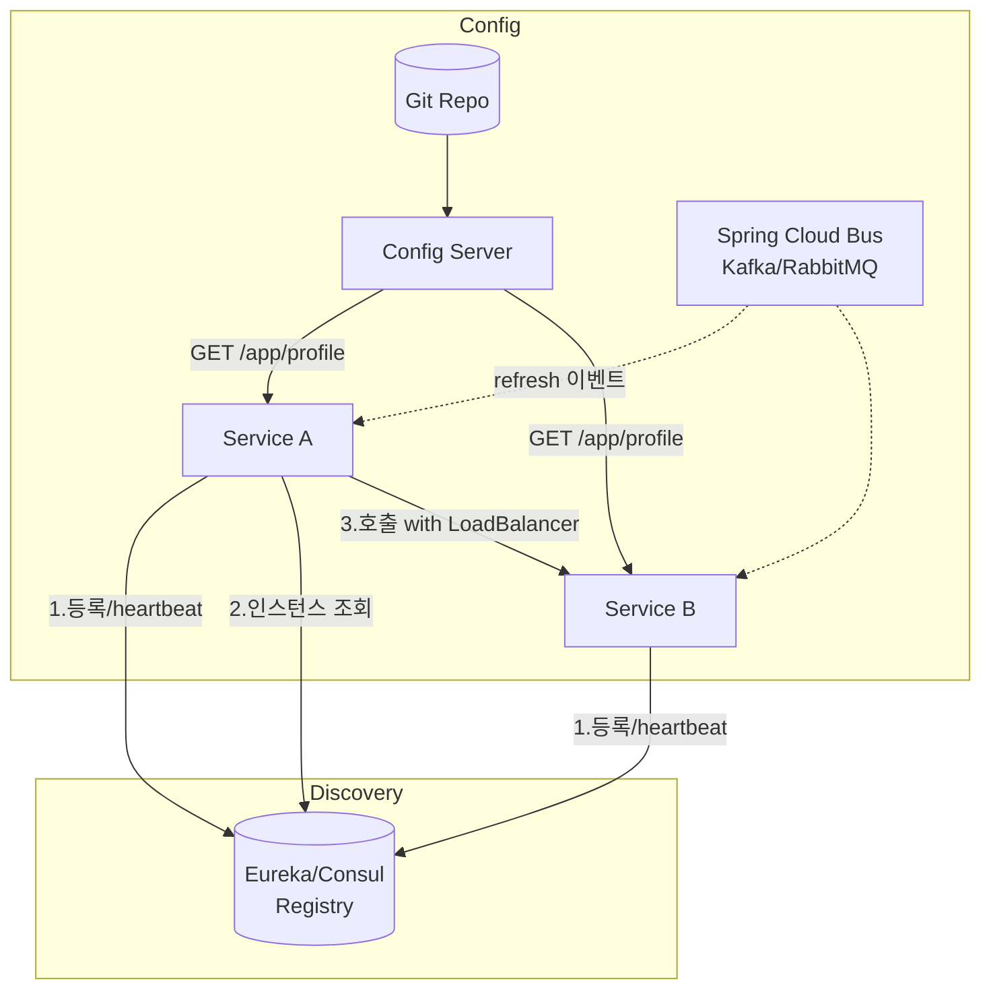

# Spring Cloud Config와 서비스 디스커버리

## 핵심 정의
Spring Cloud Config는 여러 서비스의 외부 설정을 Git, Vault 등의 백엔드에서 제공하는 중앙 설정 시스템이다. Git을 사용하면 설정 이력을 버전 관리할 수 있으며, 실행 중 갱신은 refresh를 지원하도록 구성한 빈과 설정에 한정된다. 서비스 디스커버리(service discovery)는 인스턴스의 IP/포트가 바뀌어도 서비스 이름으로 대상을 찾게 하는 메커니즘이다. 설정 제공과 서비스 탐색은 독립된 기능이다.

## 동작 원리 / 구조

**Config Server**
- 클라이언트는 `spring.config.import=configserver:http://...`로 서버의 `/{application}/{profile}/{label}` API에서 공통·애플리케이션·프로파일별 설정을 받아 병합한다. `optional:`이 없으면 서버 연결 실패가 기동 실패로 이어진다. Config Data 방식에는 별도 `bootstrap.yml`이 필요 없다.
- 설정 변경은 자동으로 모든 빈에 즉시 적용되지 않는다. 노출·인증한 `POST /actuator/refresh` 또는 Spring Cloud Bus의 `/actuator/busrefresh`로 갱신을 요청한다. Bus 전파도 모든 인스턴스에 같은 순간 원자적으로 적용되는 배포는 아니다.
- `@RefreshScope`가 붙은 빈은 refresh 이벤트 시 내부 프록시가 대상 빈을 지연 재생성(lazy re-creation)한다. 즉 빈을 즉시 새로 만드는 게 아니라, 다음 메서드 호출 시점에 새 값으로 다시 초기화된 빈을 참조하도록 스코프 캐시를 무효화하는 방식이다.

**서비스 디스커버리**
- `DiscoveryClient`는 Eureka/Consul/Zookeeper/Kubernetes 등 구현체를 추상화한 인터페이스로, 애플리케이션 코드는 특정 레지스트리 구현에 종속되지 않는다.
- Eureka의 기본 heartbeat 간격은 30초, lease 만료 기간은 90초이며 레지스트리 fetch 간격은 30초다. fetch는 전체 목록 또는 delta를 사용한다. 만료 검사 주기, 서버·클라이언트 캐시와 자기 보호 모드 때문에 마지막 heartbeat로부터 정확히 90초 후 모든 클라이언트에서 제거된다고 보장할 수 없다.
- Spring Cloud LoadBalancer를 사용할 때 `@LoadBalanced`는 `RestClient.Builder`/`WebClient.Builder` 빈 또는 `RestTemplate` 빈에 적용한다. 서비스 이름을 실제 인스턴스 주소로 해석하는 호출 경로에 LoadBalancer 의존성과 구성이 필요하다.

| 방식 | 대표 구현 | 등록 주체 | 특징 |
|---|---|---|---|
| 클라이언트 사이드 디스커버리 | Eureka, Consul | 애플리케이션 자신(self-registration) | 애플리케이션에 클라이언트 라이브러리 필요, 세밀한 제어 가능 |
| 플랫폼 네이티브 디스커버리 | Kubernetes Service/DNS | Service·EndpointSlice를 관리하는 컨트롤러 | DNS는 이름 해석, kube-proxy 또는 CNI 데이터 경로는 Service 트래픽 전달 |
| 서비스 메시 | Istio 등 | 플랫폼과 메시 제어부가 인스턴스 정보 제공 | 데이터 경로의 프록시가 mTLS·트래픽 정책 처리; 사이드카 없는 방식도 있음 |

## 실무 관점
- Kubernetes에서는 ConfigMap/Secret을 배포 설정과 연결하고 변경 시 재배포하는 방식, Service/DNS를 통한 탐색을 사용할 수 있다. Reloader는 설정 변경으로 워크로드 재시작을 유도하는 별도 컨트롤러다. Git 기반 설정 이력만으로 Config Server가 필수인 것은 아니며, GitOps로도 관리할 수 있다. 실행 중 refresh나 여러 플랫폼을 함께 지원해야 하는 요구를 기준으로 선택한다.
- 공식 호환 표에서 Spring Cloud 2025.1(Oakwood)은 Boot 4.0.x 및 Config 5.0.x, 2025.0(Northfields)은 Boot 3.5.x에 대응한다. 이 매핑을 모든 Boot 4.x/3.x에 일반화하지 말고 사용하는 release train의 호환 범위를 확인한다.
- 실행 중인 클라이언트의 메모리 설정 유지와 새 프로세스의 설정 복구는 다르다. Config Client가 마지막 성공 설정을 디스크에 자동 저장해 다음 기동에 복구하는 기능은 없다. 서버 HA·재시도, 명시적인 로컬 대체 설정과 필수값 검증을 설계한다. `fail-fast=false`는 영속 캐시 기능이 아니다.
- Eureka의 self-preservation mode(자기 보호 모드)는 네트워크 파티션으로 heartbeat 유실률이 임계치를 넘으면 인스턴스를 함부로 제거하지 않고 레지스트리를 보존하는 안전장치다. 개발 환경에서 이 때문에 죽은 인스턴스가 계속 목록에 남아있는 걸 보고 "장애"로 오인하는 경우가 흔하다.
- Spring Cloud Bus로 전체 브로드캐스트할 때, 리스너가 많은 대규모 클러스터에서는 짧은 시간에 다수 인스턴스가 동시에 설정을 재조회하면서 Config Server/Git 저장소에 순간적인 부하 스파이크가 생길 수 있다.
- **키 삭제와 설정 롤백을 구분한다**: Cloud Context 5.0.3에서 AOP 프록시가 아닌 일반 JavaBean의 재바인딩은 기존 객체를 유지하면서 프로퍼티를 클래스 기본값으로 초기화한 뒤 새 설정을 적용한다. 기본 생성자 등 초기화 조건이 맞는 대상에서는 원격 키를 지우면 이전 값 유지가 아니라 기본값으로 복귀할 수 있다. 기능을 끄려는 경우 키 삭제에 의존하지 말고 명시적 값으로 전환하고, 변경·삭제·이전 버전 복구를 각각 시험한다. 이 동작을 생성자 바인딩·외부 자원 객체 전체에 일반화하지 않는다.
- **refresh 완료와 업무 요청의 일관성**: AOP 프록시가 아닌 일반 빈의 재바인딩은 같은 객체를 수정하므로 다른 스레드가 중간 값을 읽을 수 있다. 재바인딩끼리 직렬화되어도 모든 읽기가 보호되는 것은 아니다. 금액 한도·재시도 횟수·외부 주소처럼 함께 맞아야 하는 값은 검증한 설정 묶음으로 사용하고, 다중 인스턴스의 적용 버전도 확인한다. HTTP refresh 성공만으로 진행 중인 모든 작업과 모든 인스턴스가 같은 설정을 사용한다고 판단하지 않는다.

## 심화 Q&A

### Q. Config Server가 다운된 상태에서 새 인스턴스를 배포하면 어떤 일이 생기는가?
A. 이 노트의 Config Data 방식에서는 `spring.config.import`에 `optional:`이 없으면 연결 실패로 기동이 실패한다. `optional:configserver:`는 원격 설정 없이 진행할 수 있게 하지만 필수값 검증이나 빈 생성 때문에 결국 실패할 수도 있다. 레거시 bootstrap의 `fail-fast` 기본값과 혼동하지 않는다. 재시도에는 문서에 명시된 의존성(`spring-retry`, AOP)과 설정이 필요하다. 이미 실행 중인 프로세스는 메모리의 기존 설정을 유지하지만 새 프로세스는 이를 물려받지 않는다.

### Q. `@RefreshScope`로 갱신되지 않는 값이 있는 이유는 무엇인가?
A. 프록시의 대상 빈을 다음 호출 때 다시 만드는 기능이지 모든 객체의 필드를 일괄 교체하는 기능이 아니다. 다른 빈에 복사된 값이나 실행 중 작업이 캡처한 값은 그대로 남을 수 있다. 생성자 바인딩/record `@ConfigurationProperties`, 기본 never-refreshable인 `HikariDataSource`, AOT/native 환경에는 제약이 있다. 프록시가 아닌 일반 빈의 재바인딩도 여러 프로퍼티를 읽는 코드에 원자적인 스냅샷을 보장하지 않으므로 일관된 설정 묶음의 교체 방식을 설계한다.

### Q. Eureka 대신 Kubernetes 네이티브 디스커버리를 쓰면 무엇을 잃고 무엇을 얻는가?
A. Kubernetes Service/DNS를 쓰면 애플리케이션의 레지스트리 클라이언트 의존성을 줄일 수 있다. kubelet이 수행한 readiness probe 결과와 Pod 상태가 EndpointSlice에 반영되고, Service 데이터 경로가 준비된 대상에 트래픽을 전달한다. DNS 자체가 헬스체크·로드밸런싱 프록시는 아니다. VM까지 아우르는 탐색이나 애플리케이션별 메타데이터 정책이 필요하면 별도 DiscoveryClient 도입을 검토한다.

### Q. 클라이언트 사이드 디스커버리와 서비스 메시(사이드카) 방식의 근본적인 차이는 무엇인가?
A. 클라이언트 방식에서는 애플리케이션 라이브러리가 탐색과 인스턴스 선택을 수행한다. 메시에서는 프록시와 제어부가 이 책임을 맡는다. 애플리케이션은 보통 기존 서비스 주소/DNS 이름을 호출하고 트래픽이 프록시로 전달되므로 `localhost`만 호출해야 하는 구조가 아니다. 언어별 구현 부담은 줄지만 프록시 리소스, 정책 및 제어부 운영 비용이 생긴다.

### Q. Eureka 클라이언트의 레지스트리 캐시 갱신 주기 때문에 발생할 수 있는 구체적인 장애 패턴은?
A. 종료된 인스턴스가 다른 클라이언트의 캐시에 남아 연결 실패나 타임아웃을 유발할 수 있다. 종료 전에 신규 유입을 차단하고 상태 변경·등록 해제의 전파 시간을 확보한 뒤 진행 중 요청을 drain한다. 종료 훅만으로 모든 호출자가 즉시 상태를 안다고 가정하지 않으며, 재시도는 요청의 멱등성과 남은 deadline 안에서 제한한다.

### Q. Config Server의 Git 백엔드에서 브랜치/프로파일 전략은 어떻게 설계하는가?
A. `{label}`은 Git 브랜치·태그·커밋 ID, `{profile}`은 활성 설정 프로파일에 대응한다. 환경별 브랜치 방식과 공통 브랜치+프로파일 방식 중 승격·롤백·드리프트 관리에 맞는 것을 고른다. 비밀은 평문 Git 저장을 피하고 Vault 등 비밀 저장소 또는 `{cipher}` 암호화를 사용한다. 복호화 키는 저장소와 분리하고 Config API, refresh/암호화 엔드포인트의 인증·권한도 별도로 제한한다.

## 관련 개념
- [[자동 구성 원리]]
- [[Actuator와 헬스체크]]
- [[Kubernetes 핵심 오브젝트]]
- [[오토스케일링]]

## 참고 자료

부분 재검증: 2026-10-04. Cloud Context 5.0.3의 AOP 프록시가 아닌 일반 `@ConfigurationProperties` 빈의 재바인딩만 실행 확인했다. 기본 생성자·setter가 있는 빈에서 동일 인스턴스 유지와 삭제된 일반/중첩 프로퍼티의 기본값 복귀를 컴포넌트 JUnit 테스트로 재현했다. Config Server·Bus·다중 인스턴스 전파 및 release train 전체 호환성을 실행 검증한 것은 아니다.

- [ConfigurationPropertiesRebinder 5.0.3](https://raw.githubusercontent.com/spring-cloud/spring-cloud-commons/v5.0.3/spring-cloud-context/src/main/java/org/springframework/cloud/context/properties/ConfigurationPropertiesRebinder.java) — 기본값 초기화 조건과 동시 읽기 한계.
- [Cloud Commons 5.0.3 Context Services](https://docs.spring.io/spring-cloud-commons/reference/spring-cloud-commons/application-context-services.html) — Environment Changes와 Refresh Scope의 차이.

검증일: 2026-09-08. 적용 범위: Spring Cloud Config/Commons/Netflix 5.0.x, Spring Cloud 2025.1–Boot 4.0.x 호환 조합.

- [Config Client](https://docs.spring.io/spring-cloud-config/reference/client.html) — Config Data import, 필수 설정과 재시도.
- [Refresh Scope](https://docs.spring.io/spring-cloud-commons/reference/spring-cloud-commons/application-context-services.html) — 프록시 재생성과 재바인딩 제한.
- [Eureka Client](https://docs.spring.io/spring-cloud-netflix/reference/spring-cloud-netflix.html) — 등록·heartbeat·캐시·자기 보호.
- [Cloud Commons](https://docs.spring.io/spring-cloud-commons/reference/spring-cloud-commons/common-abstractions.html) — DiscoveryClient와 LoadBalanced builder.
- [Supported Versions](https://github.com/spring-cloud/spring-cloud-release/wiki/Supported-Versions) — release train별 Boot 호환.
- [Kubernetes Service](https://kubernetes.io/docs/concepts/services-networking/service/) — Service와 EndpointSlice·DNS의 역할.
- [Istio Architecture](https://istio.io/latest/docs/ops/deployment/architecture/) — 메시 제어부와 데이터 경로.
- [Eureka config properties](https://docs.spring.io/spring-cloud-netflix/reference/configprops.html) — heartbeat·lease·fetch 기본값.
