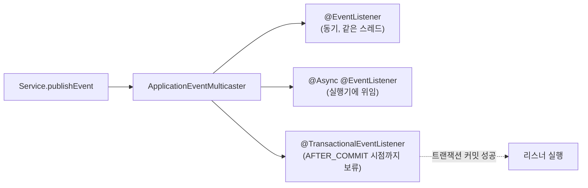

# Spring Event와 비동기 처리

## 핵심 정의
Spring Event는 애플리케이션 컨텍스트 내부에서 발행자(publisher)와 구독자(listener)를 직접 참조하지 않고 느슨하게 결합(loose coupling)시키는 옵저버 패턴(observer pattern) 구현체다. `ApplicationEventPublisher.publishEvent()`로 이벤트를 발행하면 `@EventListener`가 붙은 메서드가 이를 받아 처리하며, 기본 동작은 같은 스레드에서 동기적으로 실행된다. 여기에 `@Async`를 결합하면 리스너를 별도 스레드에서 비동기로 실행할 수 있고, `@TransactionalEventListener`를 쓰면 리스너 실행 시점을 발행 트랜잭션의 특정 단계(커밋 후 등)에 묶을 수 있다.

## 동작 원리 / 구조



- 멀티캐스터가 타입에 맞는 리스너에 전달하며 @Order로 상대 순서를 제어할 수 있다. 순서를 지정하지 않은 리스너 간 실행 순서를 업무 규칙으로 의존하지 않는다. 여러 발행 스레드나 비동기 리스너의 완료 순서는 발행 순서와 같지 않을 수 있다.
- **동기 vs 비동기**: 기본 멀티캐스터는 동기 실행이다. `@Async`를 리스너 메서드에 붙이면 AOP 프록시가 해당 호출을 executor에 위임한다. `@EnableAsync`가 선행 조건이다. Boot 4.1.1의 자동 구성이 적용되고 사용자 executor 선택이 없는 경우에는 자동 구성한 실행기를 사용한다. 가상 스레드를 활성화하면 `SimpleAsyncTaskExecutor`, 그 밖에는 `ThreadPoolTaskExecutor`가 기본 자동 구성 대상이며 `@Async("이름")`·`AsyncConfigurer` 등으로 선택을 바꿀 수 있다.
- **트랜잭션 결합**: `@TransactionalEventListener`는 `TransactionSynchronizationManager`에 리스너 실행을 등록해두었다가, 지정한 phase(`BEFORE_COMMIT`, `AFTER_COMMIT`(기본값), `AFTER_ROLLBACK`, `AFTER_COMPLETION`)에 실제로 실행한다. 진행 중인 트랜잭션이 없는 상태에서 이벤트가 발행되면 `fallbackExecution=true`를 명시하지 않는 한 리스너 자체가 실행되지 않는다.
- `@Async` + `@TransactionalEventListener`가 워커 스레드에서 실행되면 발행 스레드의 트랜잭션 컨텍스트(영속성 컨텍스트, 트랜잭션 동기화 자원)를 공유하지 않는다. 리스너 안에서 지연 로딩(lazy loading) 엔티티에 접근하면 `LazyInitializationException`이 발생할 수 있어 이벤트에는 ID와 필요한 불변 값을 담는다. `@Async`의 실제 실행 위치는 아래 실행기 정책도 확인한다.

```java
@Async("eventExecutor")
@TransactionalEventListener(phase = TransactionPhase.AFTER_COMMIT)
public void onOrderPlaced(OrderPlacedEvent event) {
    notificationService.send(event.orderId());
}
```

## 실무 관점
- Spring Event는 같은 애플리케이션 컨텍스트와 부모 컨텍스트 안에서 결합을 줄인다. 같은 트랜잭션 매니저를 공유해야만 사용할 수 있는 기능은 아니며 분산 메시징을 대체하지 않는다. 일반 메모리 이벤트에는 프로세스 장애 후 재전달 보장이 없다.
- 기본 `AFTER_COMMIT`의 `@Async @TransactionalEventListener`로 "주문 저장 후 알림 발송"처럼 부가 로직을 분리할 수 있다. 리스너 실행이 실패해도 원본 트랜잭션은 이미 커밋된 뒤이므로 롤백되지 않는다. 알림 발송 실패를 감지해 별도로 재처리하는 안전망(재시도 큐, 아웃박스 테이블 기록 등)이 없으면 이벤트가 유실된다.
- 신뢰성 있는 이벤트 처리가 필요하다면 [[트랜잭셔널 아웃박스]] 패턴처럼 이벤트를 같은 트랜잭션 안에서 DB 테이블에 기록해두고 별도 프로세스가 안전하게 재전송하는 방식을 쓰거나, Spring Modulith의 이벤트 발행 등록(event publication registry) 기능으로 "발행됐지만 아직 처리 안 된" 이벤트를 추적해 재시도하는 방법을 쓴다.
- 여러 비동기 작업이 같은 풀을 공유하면 느린 리스너가 다른 작업의 대기열·스레드까지 점유할 수 있다. 가상 스레드 실행기에는 같은 풀 크기 논리를 그대로 적용하지 말고 DB 연결·동시 요청 수 등 하류 자원을 제한한다. 격리가 필요한 업무 경계에는 이름 있는 executor와 용량·거부 정책(rejection policy)을 명시한다. Spring Framework 단독의 기본 실행기 탐색·fallback은 Boot 자동 구성과 구분한다.
- **CallerRuns의 트랜잭션 경계**: 풀 포화 시 `CallerRunsPolicy`는 제출 스레드에서 작업을 실행한다. 따라서 같은 `@Async` 호출도 워커에서는 호출자의 명령형 트랜잭션을 공유하지 않다가 포화 시에는 호출자의 트랜잭션·ThreadLocal을 볼 수 있다. 이는 트랜잭션이 다른 스레드로 전파된 결과가 아니다. 부하에 따라 지연·트랜잭션 참여가 바뀌면 안 되는 작업에는 호출자 실행 정책을 사용하지 말고 거부·재처리 방법을 명시한다. 정책 자체의 원리는 [[ExecutorService와 스레드 풀]] 참고.
- 동기 리스너 예외는 기본 멀티캐스터에서 발행자에게 전파되지만 사용자 ErrorHandler가 바꿀 수 있다. `@Async` void 메서드는 `AsyncUncaughtExceptionHandler`로, Future를 직접 받는 `@Async` 호출은 결과의 예외로 실패를 관측한다. 그러나 `publishEvent`는 리스너의 Future를 돌려주거나 비동기 완료를 기다리는 API가 아니므로 이벤트 처리 실패의 관측·재처리는 별도로 설계한다. executor 제출 거부는 호출자에서 발생할 수도 있다.

## 심화 Q&A

### Q. `@TransactionalEventListener(phase = AFTER_COMMIT)`가 붙은 리스너가 아예 호출되지 않는 경우는 언제인가?
A. 활성 트랜잭션이 없거나 원본이 롤백되면 AFTER_COMMIT은 실행되지 않는다. fallbackExecution=true는 트랜잭션이 없을 때 일반 이벤트처럼 처리하며, Async가 있으면 선택한 실행기에 위임한다. 6.1 이후 리액티브 트랜잭션도 지원하지만 Reactor context의 트랜잭션 컨텍스트를 이벤트 source에 포함시키는 TransactionalEventPublisher 경로가 필요하다.

### Q. 같은 이벤트를 여러 리스너가 구독할 때, 리스너 하나가 예외를 던지면 다른 리스너 실행에 영향을 주는가?
A. 일반 동기 `@EventListener`를 기본 멀티캐스터로 호출하면 앞선 리스너의 예외가 발행자에게 전파되어 뒤 리스너가 호출되지 않을 수 있다. `@Async`로 분리하더라도 제출 거부·공유 실행기 고갈과 실패 관측은 별도로 다룬다.

트랜잭션 이벤트는 단계도 구분한다. Framework 7.0.9의 명령형 트랜잭션에 연결된 동기 리스너에서 `BEFORE_COMMIT` 예외는 커밋 경로로 전파되어 롤백을 일으킬 수 있다. 반면 `AFTER_COMMIT` 리스너는 `TransactionSynchronization.afterCommit()`이 아니라 `afterCompletion` 경로에서 실행된다. 이 경로는 리스너 예외를 로그에 남기고 다음 동기화 콜백을 계속 호출하므로, 발행 서비스의 정상 반환만으로 후속 처리가 성공했다고 판단하지 않는다. 별도 실패 기록·재처리 경로가 필요하다.

### Q. Spring Event 기반 비동기 처리와 메시지 큐(Kafka/RabbitMQ) 기반 이벤트 처리는 언제 갈라 써야 하는가?
A. 같은 애플리케이션(모놀리스 또는 모듈러 모놀리스) 내부에서 관심사를 분리하고 싶을 뿐이고 프로세스 재시작 시 유실돼도 치명적이지 않은 부가 로직(캐시 무효화, 로그성 알림 등)이라면 Spring Event로 충분하다. 서비스 경계를 넘나들거나, 컨슈머가 다운돼도 메시지가 보존돼야 하거나, 처리량 조절/재처리/순서 보장이 필요한 경우에는 [[Kafka 아키텍처]] 같은 외부 메시지 브로커를 쓰는 것이 맞다. 두 방식을 조합해 "내부는 Spring Event, 서비스 경계는 아웃박스+Kafka"로 계층을 나누는 구성도 흔하다.

### Q. 리스너에서 새로운 트랜잭션을 시작하고 싶다면 어떻게 해야 하는가?
A. 이벤트 애노테이션은 새 트랜잭션을 열지 않는다. 동기 AFTER_COMMIT에서 원래 자원이 남아 보여도 추가 쓰기가 커밋되는 것은 아니므로 별도 빈의 REQUIRES_NEW 등으로 새 경계를 연다. 별도 워커에서 실행되어 기존 트랜잭션이 없다면 별도 서비스의 REQUIRED도 새 트랜잭션을 만들 수 있다. Framework 7.0.9의 표준 RestrictedTransactionalEventListenerFactory는 BEFORE_COMMIT 이외 리스너에 직접 결합된 @Transactional을 REQUIRES_NEW·NOT_SUPPORTED로 제한한다. 이 검사에서 @Async 자체는 예외 조건이 아니며, 별도 서비스 호출과 리스너에 애노테이션을 직접 붙이는 것을 구분한다.

### Q. 이벤트 리스너 안에서 원본 트랜잭션의 엔티티를 그대로 참조하면 왜 위험한가?
A. 다른 스레드에서 엔티티/EntityManager를 공유하면 스레드 안전성과 트랜잭션 가시성이 깨진다. 컨텍스트가 이미 닫혔다면 지연 로딩 예외가 날 수 있고, 항상 닫혀 있다는 전제도 틀리다. 필요한 시점의 값을 불변 DTO로 담고 별도 트랜잭션 조회가 필요하면 ID로 다시 읽는다.

### Q. `ApplicationEventPublisher`로 발행한 이벤트가 스프링 컨텍스트 시작 초기에 유실되는 경우가 있는가?
A. 컨텍스트는 refresh 초기에 발행된 일부 이벤트를 earlyApplicationEvents에 보관했다가 리스너 등록 시 전달한다. 따라서 ContextRefreshedEvent 이전이면 모두 유실되는 것은 아니다. 다만 EventListener 메서드 어댑터 등록·조기 빈 생성 등 순서 차이가 있어 초기화 이벤트를 일반 업무 이벤트처럼 의존하지 않는다. Boot runner까지 완료돼야 하는 작업은 ApplicationReadyEvent에 연결한다.

## 관련 개념
- [[Transactional 동작 원리]]
- [[트랜잭션 전파와 격리]]
- [[트랜잭셔널 아웃박스]]
- [[프록시 기반 AOP 동작 원리]]

## 참고 자료

부분 재검증: 2026-09-22. Spring Framework 7.0.9의 트랜잭션 이벤트 팩토리 소스와 팩토리 실행으로 BEFORE_COMMIT 예외, 직접 결합 가능한 전파 속성, Async가 해당 검사를 우회하지 않는 것을 확인했다. Boot 4.1.1의 기본 실행기 선택과 가상 스레드 활성화 조건도 구분했다.

- [RestrictedTransactionalEventListenerFactory 7.0.9](https://raw.githubusercontent.com/spring-projects/spring-framework/v7.0.9/spring-tx/src/main/java/org/springframework/transaction/annotation/RestrictedTransactionalEventListenerFactory.java) — 리스너 메서드·타입의 Transactional 검사.
- [Boot Task Execution and Scheduling](https://docs.spring.io/spring-boot/reference/features/task-execution-and-scheduling.html) — 자동 구성 조건·실행기 선택·가상 스레드.
- [EnableAsync 7.0.9](https://docs.spring.io/spring-framework/docs/7.0.9/javadoc-api/org/springframework/scheduling/annotation/EnableAsync.html) — Framework 기본 실행기 탐색과 AsyncConfigurer.
- [ApplicationEventPublisher 7.0.9](https://raw.githubusercontent.com/spring-projects/spring-framework/v7.0.9/spring-context/src/main/java/org/springframework/context/ApplicationEventPublisher.java) — void 발행 계약과 실행·완료 경계.

검증일: 2026-09-08. 적용 범위: Spring Framework 7.0; 6.1 이후 리액티브 트랜잭션 이벤트 지원.

- [Transaction-bound Events](https://docs.spring.io/spring-framework/reference/data-access/transaction/event.html) — phase·fallback·리액티브 컨텍스트.
- [SimpleApplicationEventMulticaster API](https://docs.spring.io/spring-framework/docs/current/javadoc-api/org/springframework/context/event/SimpleApplicationEventMulticaster.html) — 동기 호출과 오류 정책.
- [AbstractApplicationContext 소스](https://raw.githubusercontent.com/spring-projects/spring-framework/7.0.x/spring-context/src/main/java/org/springframework/context/support/AbstractApplicationContext.java) — 초기 이벤트 보류와 리스너 등록.
- [Spring Scheduling](https://docs.spring.io/spring-framework/reference/integration/scheduling.html) — Async void/Future 예외.
- [Spring Modulith events](https://docs.spring.io/spring-modulith/reference/events.html) — 이벤트 발행 기록과 재전송.

부분 재검증: 2026-10-04. Framework 7.0.9·DataSourceTransactionManager·H2 2.4.240에서 BEFORE_COMMIT 리스너 예외의 전파·DB 롤백, AFTER_COMMIT 리스너 예외의 로그 기록·원본 커밋 유지·다음 리스너 실행을 JUnit 2건으로 확인했다. 리액티브·비동기·분산 이벤트의 예외 계약으로 일반화하지 않는다.

추가 실행 확인: 같은 Framework·DB 조합에서 `@Async` 실행기의 워커 여유/포화 2건을 비교했다. 1개 워커·대기 큐 0·CallerRunsPolicy 구성에서 미커밋 행은 워커에서 0개, 호출자에서 1개로 보였고 트랜잭션 활성 여부도 달랐다. 일반 Async 호출 시험이며 트랜잭션 이벤트의 모든 단계 조합을 실행한 것은 아니다.

- [TransactionPhase 7.0.9 API](https://docs.spring.io/spring-framework/docs/7.0.9/javadoc-api/org/springframework/transaction/event/TransactionPhase.html) — AFTER_COMMIT의 afterCompletion 실행 단계.
- [TransactionalApplicationListenerSynchronization 7.0.9](https://github.com/spring-projects/spring-framework/blob/v7.0.9/spring-tx/src/main/java/org/springframework/transaction/event/TransactionalApplicationListenerSynchronization.java) / [TransactionSynchronizationUtils 7.0.9](https://github.com/spring-projects/spring-framework/blob/v7.0.9/spring-tx/src/main/java/org/springframework/transaction/support/TransactionSynchronizationUtils.java) — 명령형 리스너 호출과 예외 전파·기록의 차이.
