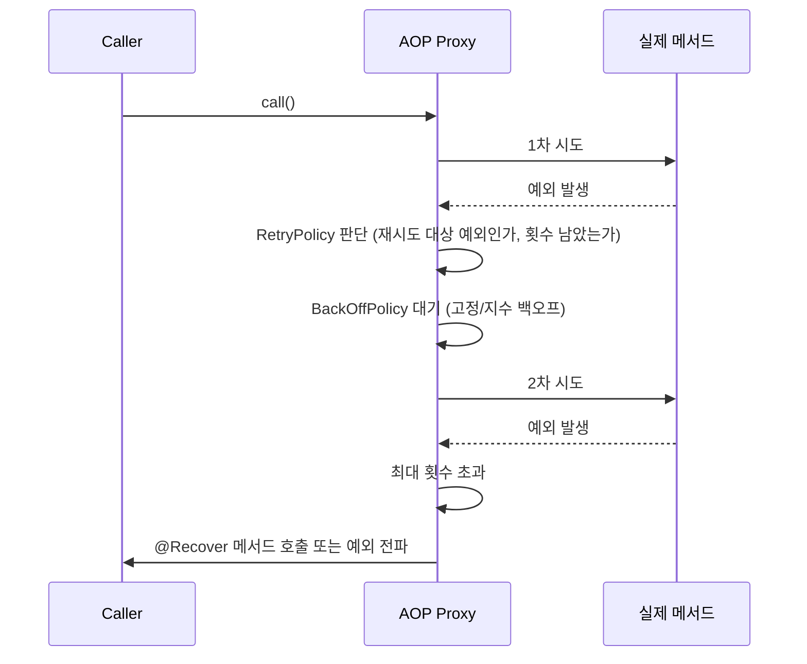

# Spring Retry와 재시도 전략

## 핵심 정의
재시도(retry)는 네트워크 순단, DB 커넥션 일시 부족, 외부 API의 일시적 5xx 응답처럼 원인이 오래 지속되지 않는 일시적 장애(transient failure)에 대해 같은 요청을 다시 시도해 성공률을 높이는 회복탄력성(resilience) 패턴이다. Spring 진영에서는 오랫동안 별도 라이브러리인 `spring-retry`(`org.springframework.retry`)가 `@Retryable`/`@Recover` 어노테이션과 `RetryTemplate`을 통해 이 기능을 제공해왔고, Spring Framework 7(Spring Boot 4)부터는 이 기능 일부가 핵심 프레임워크에 `@Retryable`/`@ConcurrencyLimit`으로 네이티브 편입되었다.

2026-09-08 확인한 Spring Retry 공식 저장소는 spring-attic으로 이동했고 오픈소스 유지보수 종료를 알리고 있다. 신규 기능은 Framework 7의 별도 API를 검토하되 두 Retryable을 동일 API로 취급하지 않는다.

## 동작 원리 / 구조



- 애노테이션 방식은 프록시를 통과해야 하며 self-invocation에는 적용되지 않는다. spring-retry의 RetryOperationsInterceptor와 Framework 7의 RetryAnnotationBeanPostProcessor 등은 다른 구현이다. 아래 정책 클래스·Recover·코드 예제는 spring-retry 2.x 기준이다.
- **RetryPolicy**: 어떤 예외에 대해 몇 번까지 재시도할지 결정. `SimpleRetryPolicy`(횟수 기반), `TimeoutRetryPolicy`(제한 시간 기반) 등.
- **BackOffPolicy**: 재시도 사이 대기 전략. 고정 지연(`FixedBackOffPolicy`), 지수 백오프(`ExponentialBackOffPolicy`), 지터를 섞은 랜덤 백오프 등. 외부 서비스가 이미 과부하 상태일 때 즉시 재시도를 반복하면 부하를 더 키우므로(retry storm) 지수 백오프 + 지터 조합이 기본 권장이다.
- @Recover는 spring-retry의 복구 메서드 표시다. 반환 타입과 원래 인자에 맞춰 선택하며 첫 Throwable 인자는 선택 사항이다. Framework 7의 org.springframework.resilience.annotation.Retryable에는 이 애노테이션을 그대로 옮기지 않는다.

```java
@Retryable(
    retryFor = { RemoteCallException.class },
    maxAttempts = 4, // spring-retry: 총 실행 횟수 (최초 1회 + 재시도 3회)
    backoff = @Backoff(delay = 500, multiplier = 2, maxDelay = 5000)
)
public Response callExternalApi() { ... }

@Recover
public Response fallback(RemoteCallException e) {
    return Response.fallback();
}
```

**spring-retry와 Framework 7 네이티브 차이 (2026-09-08 확인)**

| 항목 | spring-retry (`org.springframework.retry`) | Spring Framework 7 네이티브 |
|---|---|---|
| 의존성 | `spring-retry`와 AOP 인프라; Boot 3의 예는 `spring-boot-starter-aop` | spring-context/spring-core와 필요한 Spring AOP 인프라 사용 |
| 활성화 | `@EnableRetry` | `@EnableResilientMethods` |
| 횟수 속성 | `maxAttempts` = **최초 시도 포함 총 실행 횟수**(기본값 3) | `maxRetries` = **최초 시도를 제외한 재시도 횟수만**(기본값도 동일하게 3이라 숫자만 보면 같아 보이지만 의미가 다르다) |
| 관측 | `RetryListener` 인터페이스 | `MethodRetryEvent` 기반 이벤트 |
| 추가 기능 | 재시도 중심 | `@ConcurrencyLimit`(동시 실행 수 제한)까지 같은 모듈에서 제공 |

두 방식은 횟수 속성의 의미가 다르므로(위 표), 마이그레이션 시 `maxAttempts=3`을 그대로 `maxRetries=3`으로 옮기면 실제 총 실행 횟수가 달라질 수 있다는 점을 반드시 확인해야 한다.

Framework 7.0.9의 `@ConcurrencyLimit`는 기본적으로 한도 초과 호출을 대기시키며, 7.0.3부터 `policy=REJECT`로 `InvocationRejectedException`을 즉시 발생시킬 수 있다. 타입 수준 제한을 상속하는 메서드들은 같은 프록시 인스턴스의 제한을 공유하고, 메서드에 직접 선언한 제한은 그 메서드의 별도 카운터를 사용한다. JVM 전체나 모든 파드의 전역 제한은 아니다.

### 비동기 반환값에서 실제로 재시도되는 범위

Framework 7.0.9 네이티브 `@Retryable`은 반환 타입에 따라 처리 경계가 다르다. 동기 호출을 비동기로 바꿀 때 애노테이션이 그대로 있다고 같은 장애 복구가 유지되는 것은 아니다.

| 메서드 형태 | 실패 시 실제 동작 | 실무 확인 |
|---|---|---|
| 일반 반환 타입 | 메서드 호출을 다시 실행 | 최초 시도와 재시도에 같은 업무 멱등키 사용 |
| `CompletableFuture` 반환 | 반환 뒤 Future의 예외 완료는 재시도 대상이 아님 | 비동기 작업 자체의 실패·재생성 경계를 명시 |
| `Mono`/`Flux` 반환 | 이미 반환된 Publisher에 다시 구독 | 구독 시마다 외부 작업이 새로 시작되는지 확인 |

예를 들어 이미 실행한 Future를 `Mono.fromFuture(future)`로 감싸면 재구독해도 같은 실패 결과를 다시 받는다. 새 호출이 필요하면 `Mono.defer(...)` 또는 supplier 기반 생성처럼 구독마다 작업을 만드는 구조를 사용한다. `Mono`를 반환하기 전에 메서드 본문에서 동기 예외가 발생하면 이 버전의 리액티브 재시도 경로에 들어가지 않는다. 재시도 소진 예외도 일반 동기 경로의 원본 예외와 Reactor 경로의 래핑 예외를 구분해 처리한다.

## 실무 관점
- 재시도는 **멱등(idempotent)한 연산에만** 적용해야 한다. 결제 승인처럼 부작용이 있는 호출을 멱등키 없이 재시도하면 중복 처리로 이어진다. 외부 API 호출 시 멱등키(idempotency key)를 함께 설계하는 것이 원칙이다.
- 상태 코드만으로 결정하지 않는다. 429·일부 408은 Retry-After와 예산을 고려해 재시도할 수 있고, 5xx·타임아웃도 이미 부수 효과가 처리됐을 수 있다. 결과를 알 수 없는 요청에는 멱등키·상태 조회 정책이 필요하다.
- 재시도 로직과 서킷 브레이커(circuit breaker, 예: Resilience4j)는 함께 쓰이는 경우가 많다. 재시도만 있으면 장애가 지속되는 하위 시스템에 계속 트래픽을 보내 회복을 방해할 수 있으므로, 일정 실패율을 넘으면 회로를 차단(open)해 즉시 실패시키는 서킷 브레이커와 조합해 "재시도 → 실패 누적 → 회로 차단 → 반개방 상태로 점진적 복구 확인" 흐름을 만든다.
- 백오프 없이 즉시 재시도(no backoff)를 여러 인스턴스가 동시에 수행하면, 장애 발생 직후 오히려 부하가 폭증하는 재시도 폭풍(retry storm)이 발생해 장애를 악화시키는 사례가 흔하다.
- **트랜잭션 재시도 경계**: rollback-only가 된 같은 트랜잭션 안에서 메서드 일부만 다시 실행하지 않는다. 재시도 루프가 매 시도의 트랜잭션 시작·커밋까지 감싸게 하고, 새 트랜잭션에서 필요한 데이터를 다시 읽는다. 외부 트랜잭션이 없는 별도 서비스의 `REQUIRED`도 매번 새 경계를 만들 수 있으며, 이미 외부 트랜잭션이 있다면 `REQUIRES_NEW`의 독립 커밋·추가 연결 비용을 검토한다. 커밋 시 발생한 예외까지 어느 Advisor가 관찰하는지 확인한다.

## 심화 Q&A

### Q. `@Retryable`이 붙은 메서드를 같은 클래스의 다른 메서드에서 호출했는데 재시도가 동작하지 않는다. 원인은?
A. Spring AOP는 기본적으로 프록시 기반이라 외부에서 빈을 통해 호출할 때만 인터셉터를 거친다. 같은 클래스 내부에서 `this.retryableMethod()`처럼 자기 자신을 직접 호출하면 프록시를 우회하므로 재시도 로직이 적용되지 않는다. 재시도가 필요한 메서드는 별도의 빈으로 분리해 외부에서 주입받아 호출해야 한다.

### Q. 재시도와 타임아웃을 함께 설정할 때 흔히 하는 실수는 무엇인가?
A. 전체 시간은 최초 시도를 포함한 모든 호출 시간과 백오프·큐 대기의 합이다. TimeoutRetryPolicy는 시간이 지난 뒤 새 시도를 허용할지 판단하며 이미 실행 중인 호출을 중단하는 강제 deadline이 아니다. 각 I/O 타임아웃과 상위 요청의 남은 예산을 함께 적용한다.

### Q. 재시도 정책과 서킷 브레이커를 함께 쓸 때 적용 순서는 왜 중요한가?
A. Retry가 바깥이면 개별 시도가 서킷 통계에 반영되며, open 거부 예외를 retry 대상에서 제외해야 한다. CircuitBreaker가 바깥이면 재시도 전체가 하나의 논리 호출로 관측된다. 어떤 실패를 집계할지와 예산에 따라 정하며 하나의 순서를 보편적 표준으로 고정하지 않는다.

### Q. `@Recover` 메서드가 여러 개일 때 어떤 기준으로 매칭되는가?
A. 반환 타입·원본 인자·선택적 Throwable 인자를 고려하고 해당 예외 계층에 더 가까운 복구 메서드를 찾는다. Throwable이 없는 기본 복구 메서드도 가능하다. 복구가 설정됐지만 적합한 메서드를 못 찾는 경로는 ExhaustedRetryException이 될 수 있어 항상 마지막 원본 예외가 그대로 나온다고 단정하지 않는다.

### Q. Resilience4j의 재시도 기능과 Spring Retry/네이티브 재시도의 근본적인 차이는 무엇인가?
A. Resilience4j는 재시도·서킷 브레이커·벌크헤드·레이트 리미터를 하나의 일관된 데코레이터 체인으로 조합하도록 설계된 반면, Spring Retry(또는 Framework 7 네이티브)는 재시도(및 동시성 제한) 자체에 집중한 경량 기능이다. 여러 회복탄력성 패턴을 함께 조합해야 하는 복잡한 마이크로서비스 환경에서는 Resilience4j 쪽이 정책 조합의 일관성을 관리하기 유리하고, 단순히 특정 메서드에 재시도만 걸고 싶은 경우에는 어노테이션 하나로 끝나는 Spring 쪽이 더 가볍다.

### Q. spring-retry에서 Framework 7 네이티브 재시도로 마이그레이션할 때 가장 먼저 점검해야 할 것은?
A. `maxAttempts`(총 실행 횟수 기준)를 `maxRetries`(재시도 횟수만 기준)로 그대로 옮기면 실제 재시도 동작 횟수가 하나 어긋난다. 또한 `RetryListener` 기반의 관측 로직을 쓰고 있었다면 `MethodRetryEvent` 기반 이벤트 리스너로 전환해야 하고, `@EnableRetry`를 `@EnableResilientMethods`로 바꿔야 한다는 점도 함께 확인해야 한다.

### Q. Framework 7의 @ConcurrencyLimit를 붙이면 반환된 Mono의 외부 호출 수도 제한되는가?
A. Framework 7.0.9 구현은 메서드 진입부터 반환까지 제한하고, 반환된 Publisher가 구독·완료될 때까지 카운터를 유지하지 않는다. 빠르게 Mono를 반환하는 메서드는 한도가 1이어도 여러 구독이 동시에 실행될 수 있다. 리액티브 작업은 구독부터 종료·취소까지 permit을 관리하는 제한 수단을 사용한다. 기본 BLOCK 정책으로 이벤트 루프를 대기시키는 것도 피한다.

## 관련 개념
- [[프록시 기반 AOP 동작 원리]]
- [[Advice 종류와 실행 순서]]
- [[Transactional 동작 원리]]
- [[트랜잭션 전파와 격리]]
- [[HTTP 호출 타임아웃과 재시도 예산]]
- [[Bulkhead 패턴]]

## 참고 자료

부분 재검증: 2026-10-04. Framework 7.0.9 네이티브 재시도의 반환 타입별 실패 경계를 소스로 확인했다. 프록시 호출 JUnit 5개에서 동기 재호출, cold Mono 재구독, 이미 실패한 Future의 Mono 변환, Future 예외 완료, Publisher 생성 전 동기 예외를 재현했다. 기존 spring-retry·동시성 제한 설명의 전체 검증일은 유지한다.

- [AbstractRetryInterceptor 7.0.9 소스](https://raw.githubusercontent.com/spring-projects/spring-framework/v7.0.9/spring-context/src/main/java/org/springframework/resilience/retry/AbstractRetryInterceptor.java) — Future 제외, Publisher 생성과 재구독 위치, 동기 예외 전파.
- [Framework 7.0.9 Resilience](https://docs.spring.io/spring-framework/reference/core/resilience.html) — 리액티브 반환 타입에 대한 Reactor 재시도 적응.

부분 재검증: 2026-09-22. Framework 7.0.9의 maxRetries 횟수, ConcurrencyLimit의 범위·기본 대기·REJECT 정책·Publisher 수명과의 차이를 소스와 실행 예제로 확인했다. 트랜잭션 재시도는 매 시도의 커밋까지 감싸는 경계로 구체화했다.

- [ConcurrencyLimit API 7.0.9](https://docs.spring.io/spring-framework/docs/7.0.9/javadoc-api/org/springframework/resilience/annotation/ConcurrencyLimit.html) — 타입·메서드 제한 범위와 7.0.3 이후 REJECT.
- [ConcurrencyLimitBeanPostProcessor 7.0.9](https://raw.githubusercontent.com/spring-projects/spring-framework/v7.0.9/spring-context/src/main/java/org/springframework/resilience/annotation/ConcurrencyLimitBeanPostProcessor.java) — 프록시별 카운터와 인터셉터 선택.
- [ConcurrencyThrottleInterceptor 7.0.9](https://raw.githubusercontent.com/spring-projects/spring-framework/v7.0.9/spring-aop/src/main/java/org/springframework/aop/interceptor/ConcurrencyThrottleInterceptor.java) — 메서드 반환 시 카운터 해제.

검증일: 2026-09-08. 적용 범위: spring-retry 2.x와 Spring Framework 7.0의 별도 resilience API.

- [Spring Retry 저장소](https://github.com/spring-attic/spring-retry) — 유지보수 종료와 Retry/Recover 계약.
- [Framework Resilience](https://docs.spring.io/spring-framework/reference/core/resilience.html) — 네이티브 애노테이션과 maxRetries.
- [Recover 소스](https://raw.githubusercontent.com/spring-attic/spring-retry/main/src/main/java/org/springframework/retry/annotation/Recover.java) — 선택적 Throwable 인자.
- [Recovery handler 소스](https://raw.githubusercontent.com/spring-attic/spring-retry/main/src/main/java/org/springframework/retry/annotation/RecoverAnnotationRecoveryHandler.java) — 복구 메서드 미발견 시 예외.
- [TimeoutRetryPolicy 소스](https://raw.githubusercontent.com/spring-attic/spring-retry/main/src/main/java/org/springframework/retry/policy/TimeoutRetryPolicy.java) — 후속 시도 허용 시간.
