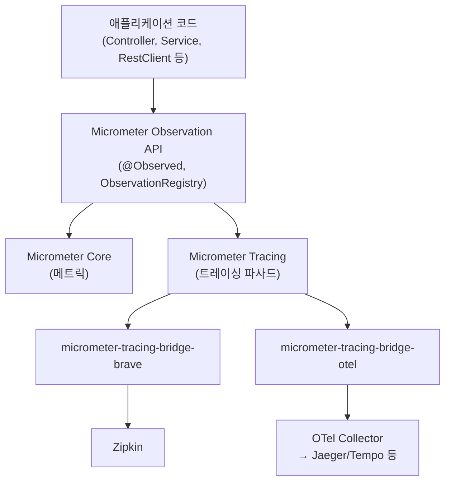
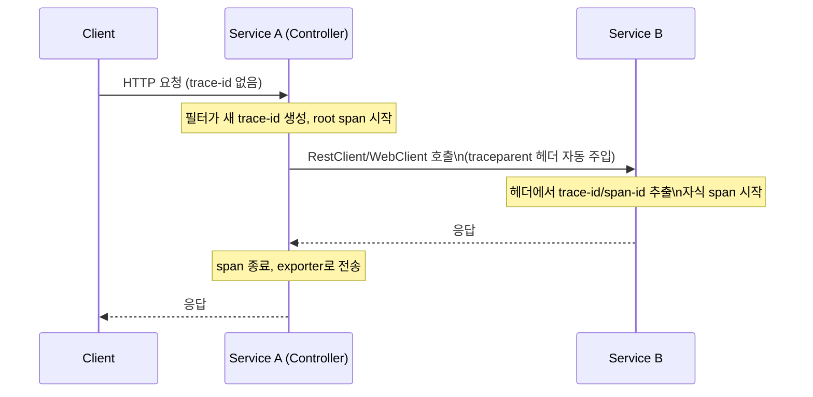

# Micrometer와 분산 트레이싱 연동

## 핵심 정의
Micrometer는 애플리케이션 메트릭(metric)을 수집해 Prometheus, Datadog 등 다양한 모니터링 백엔드로 내보내는 벤더 중립 계측(instrumentation) 파사드(facade)다. SLF4J가 로깅 구현체를 추상화하듯, Micrometer는 메트릭 수집 라이브러리를 추상화한다.

Micrometer Tracing은 여기에 더해 분산 트레이싱(distributed tracing) 계측을 담당하는 별도의 파사드로, Brave(Zipkin 계열)나 OpenTelemetry 중 하나를 브리지(bridge)로 선택해 스팬(span)/트레이스(trace) 생성과 컨텍스트 전파를 처리한다. Spring Boot 3부터는 과거의 Spring Cloud Sleuth를 대체해 Micrometer Observation API + Micrometer Tracing 조합이 표준 관측(observability) 계층이 되었다. Sleuth는 수명 종료(EOL)되어 Spring Boot 3를 지원하지 않는다.

## 동작 원리 / 구조

### 계측 계층 구조



등록된 `ObservationHandler`가 Observation 생명주기에 반응한다. 메트릭 핸들러와 트레이싱 핸들러를 함께 구성하면 같은 관측에서 타이머와 스팬을 만들 수 있지만, 핸들러가 없으면 해당 신호는 생성되지 않으며 스팬의 기록·전송 여부는 샘플링 정책에도 좌우된다.

Boot 자동 구성에는 Brave 또는 OpenTelemetry 중 사용할 트레이서와 exporter 조합을 명확하게 선택한다. 두 브리지를 무심코 추가하면 어떤 빈이 구성되는지 불명확해질 수 있지만 항상 특정 형태의 중복 스팬이나 기동 실패가 발생한다고 단정하지 않는다. 기존 백엔드와 전파 규약, 필요한 exporter 지원으로 선택한다.

### 요청 하나가 트레이스로 기록되는 흐름



자동 전파에는 Boot가 구성한 `RestTemplateBuilder`, `WebClient.Builder`, `RestClient.Builder`로 만든 클라이언트가 필요하다. Feign도 관측 capability와 registry가 연결돼야 한다. 전파 헤더(W3C/B3)는 트레이서 구현체와 별개의 설정이다. Kafka 등 메시징은 해당 클라이언트·리스너의 observation 옵션을 켜야 하며, MDC의 `traceId`/`spanId`는 로그 패턴에 포함해 로그와 트레이스를 연결한다.

### 설정 예시 (Spring Boot 3.5, OTLP HTTP 기준)

Actuator, `micrometer-tracing-bridge-otel`, `opentelemetry-exporter-otlp` 의존성이 있다는 전제다.

```yaml
management:
  tracing:
    sampling:
      probability: 0.1   # 기본값 10%, 전수 수집은 운영 부하가 커 샘플링 필수
  otlp:
    tracing:
      endpoint: http://otel-collector:4318/v1/traces
```

```java
@RestController
@RequiredArgsConstructor
class OrderController {

    private final ObservationRegistry observationRegistry;
    private final OrderService orderService;

    @GetMapping("/orders/{id}")
    Order get(@PathVariable("id") Long id) {
        return Observation.createNotStarted("order.lookup", observationRegistry)
            .lowCardinalityKeyValue("order.type", "standard")
            .observe(() -> orderService.findById(id));
    }
}
```

Boot 4.1의 OTLP endpoint 키는 `management.opentelemetry.tracing.export.otlp.endpoint`다. 위 3.5 설정을 그대로 복사하지 않는다.

`Observation` 직접 계측은 registry의 핸들러를 사용한다. `@Observed`는 애너테이션만 붙여서는 충분하지 않고 `ObservedAspect`와 AOP 설정이 필요하다. Boot에서 지원하는 자동 구성을 사용하면 `management.observations.annotations.enabled=true` 및 AspectJ 의존성을 확인한다. 이미 관측하는 컨트롤러에 중복 계측을 추가할 필요가 있는지도 판단한다.

## 실무 관점
- **샘플링**: Boot 기본 확률은 10%다. 오류·고지연 요청을 기준으로 보관하려면 tail sampler까지 필요한 스팬이 도달해야 한다. 애플리케이션에서 먼저 버린 스팬을 collector가 복원할 수는 없다. 전송량·collector 버퍼·판정 대기 시간과 오류 보존 범위를 함께 설계한다.
- **의존성 조합**: Boot 4.1은 OTel+OTLP용 `spring-boot-starter-opentelemetry`, Brave+Zipkin용 `spring-boot-starter-zipkin`을 제공한다. 원하는 조합과 실제 자동 구성 빈을 확인하고, Boot 3.5의 개별 bridge/exporter 의존성 예제를 그대로 섞지 않는다.
- **비동기 경계에서 컨텍스트 전파가 끊기는 문제**가 흔하다. `@Async`, 커스텀 `ExecutorService`, 리액티브 체인에서 스레드가 바뀌면 Micrometer의 `ContextPropagation` API(예: `ContextSnapshotFactory`)나 Reactor의 `Context` 연동을 명시적으로 구성하지 않으면 자식 스팬이 부모와 연결되지 않고 별도 트레이스로 잘려 보인다.
- **전파 대상과 수명**: Context Propagation 1.2.1의 snapshot은 등록된 accessor가 읽은 값을 캡처한다. 이후 원래 `ThreadLocal`에 다른 값을 설정해도 이미 만든 snapshot이 갱신되지는 않는다. `snapshot.setThreadLocals()`로 연 scope를 닫으면 실행 스레드의 이전 값을 복원하므로 `try-with-resources`로 범위를 제한한다. 모든 `ThreadLocal`이나 DB 트랜잭션이 자동 이전되는 기능으로 해석하지 않는다.
- **로그-트레이스 상관관계**는 `logging.pattern.level`에 `%X{traceId}`, `%X{spanId}`를 넣거나 Spring Boot의 기본 correlation 패턴을 사용해 구성한다. 이 조합이 없으면 트레이스로 이상 구간을 찾아도 관련 로그를 수동으로 대조해야 해 장애 대응 속도가 떨어진다. [[관측 가능성 3요소]]에서 메트릭·로그·트레이스 삼각 연계를 다룬다.
- **카디널리티(cardinality)**: 표준 메트릭 핸들러는 low-cardinality 값만 메트릭 태그에 넣는다. `highCardinalityKeyValue`는 기본적으로 트레이스에만 포함되므로 이를 썼다는 이유로 메트릭 시계열이 폭증하지 않는다. 사용자 ID·주문 번호를 low-cardinality 태그에 넣거나 커스텀 Meter 태그로 옮기는 것이 위험하다. 트레이스 속성도 개인정보·검색 비용을 고려한다.
- **Gauge의 관측 대상**: Micrometer 1.17.1의 기본 Gauge는 관측 객체를 약한 참조(Weak Reference)로 보유한다. 임시 `AtomicInteger`만 등록하고 애플리케이션이 참조를 유지하지 않으면 GC 후 `NaN` 등이 나타날 수 있다. 같은 이름·태그로 새 객체를 재등록해도 기존 meter의 관측 대상이 교체되지 않는다. 기존 객체를 갱신하거나 명시적으로 기존 meter를 제거한 뒤 재등록한다.
- **순간값과 누적값**: Gauge는 관측 시점의 값이므로 두 수집 사이의 짧은 큐 길이 급증을 놓칠 수 있다. 누적 요청 수는 Counter, 지연 분포는 Timer 등 목적에 맞는 meter로 기록하고 Gauge만으로 피크가 없었다고 판단하지 않는다.
- **비동기 작업의 측정 끝점**: Micrometer 1.17.1의 `timer.record(() -> future)`는 Supplier가 Future를 반환할 때까지 측정한다. 실제 작업 완료를 재려면 완료 경로에서 `Timer.Sample.stop(timer)`을 호출하거나 해당 비동기 타입을 지원하는 계측을 사용한다. 같은 sample의 `stop`을 여러 번 호출하면 매번 기록되므로 성공·실패·취소 경로가 중복 계측하지 않도록 한다. `@Timed`의 Future 지원 계약을 일반 `Timer.record`에 그대로 적용하지 않는다.
- **최댓값과 백분위 해석**: 기본 Timer 구현의 `max`는 시간 창이 만료되면 0으로 돌아갈 수 있어 프로세스 기동 이후 최댓값이 아니다. `publishPercentiles`로 계산한 인스턴스별 p99를 평균내도 서비스 전체 p99가 되지 않는다. 여러 인스턴스를 합쳐 평가하려면 백엔드가 지원하는 histogram과 버킷 경계를 설정하고 [[SLI SLO와 에러 버짓]]의 집계 기준을 따른다.
- **노출과 전송 구분**: trace exporter는 수집 백엔드로 데이터를 보내며 Actuator의 웹 endpoint 노출 목록으로 켜는 기능이 아니다. `httpexchanges` 등 관리 엔드포인트의 접근 권한과 trace exporter의 인증·민감 정보 제거는 각각 설정한다.

## 심화 Q&A

### Q. Micrometer Metrics와 Micrometer Tracing은 왜 별도 라이브러리로 분리되어 있는가?
메트릭은 시계열 집계값(카운터, 타이머, 게이지)이고 트레이싱은 요청 단위의 인과관계 그래프라는 점에서 데이터 모델과 저장/전송 방식이 근본적으로 다르다. 메트릭은 낮은 카디널리티로 오래 보관되지만, 트레이스는 요청마다 고유한 span을 생성하고 보관 기간이 짧다. Micrometer Observation API가 상위에서 "하나의 관측 이벤트"를 표현하고, 그 이벤트를 메트릭으로 기록할지 트레이스로 기록할지는 각각의 핸들러(`MeterObservationHandler`, `TracingObservationHandler`)가 독립적으로 처리하도록 분리해, 트레이싱 백엔드 없이 메트릭만 쓰거나 반대의 조합도 가능하게 만들었다.

### Q. Brave에서 OpenTelemetry 브리지로 전환할 때 트레이스 ID 포맷이 달라지는가?
항상 그렇지는 않다. B3는 64비트와 128비트 trace ID를 모두 지원하고, W3C Trace Context의 trace ID는 128비트다. Brave=64비트/B3, OTel=128비트/W3C라는 일대일 대응은 성립하지 않는다. 마이그레이션에서는 ID 길이와 consume/produce 헤더 형식을 각각 확인하고, 전환 기간에는 수신 측이 기존 형식도 해석하도록 구성한다.

### Q. 샘플링 비율을 10%로 두면 정작 문제가 된 그 요청이 트레이스로 안 남을 수 있는데 어떻게 대응하는가?
요청 시작 시 head sampler가 기록하지 않기로 한 스팬은 응답 오류를 본 뒤 완전한 트레이스로 되살릴 수 없다. 모든 오류를 보존하려면 필요한 서비스들이 해당 trace의 스팬을 기록·전송하고 collector에서 오류·지연을 보고 tail sampling하도록 구성해야 한다. head와 tail을 함께 쓰면 tail 정책은 head 단계를 통과한 부분집합에만 적용된다. 로그·오류 메트릭은 샘플링과 별도로 남겨 탐지 공백을 보완한다.

### Q. `@Observed` 애너테이션 기반 계측과 `Observation.createNotStarted`로 직접 계측하는 방식의 트레이드오프는?
`@Observed`는 AOP 프록시로 동작하므로 [[Spring Cache 추상화]]와 마찬가지로 self-invocation에서는 적용되지 않고, 프록시 오버헤드가 있다. 대신 코드가 깔끔하고 횡단 관심사로 분리하기 쉽다. `Observation.createNotStarted`로 직접 감싸면 메서드 내부 특정 블록만 세밀하게 계측할 수 있고 프록시 제약이 없지만, 코드에 계측 로직이 섞여 가독성이 떨어진다. 메서드 전체를 계측할 때는 애너테이션, 메서드 내부 일부 구간만 계측할 때는 프로그래매틱 방식을 선택하는 것이 일반적인 기준이다.

### Q. 컨슈머가 메시지를 배치로 처리하는 경우 분산 트레이싱 컨텍스트는 어떻게 되는가?
배치에는 서로 다른 부모 trace의 메시지가 섞일 수 있다. 처리 모델에 따라 메시지별 자식 스팬 또는 배치 스팬과 여러 span link로 표현하며, link는 일반 문자열 속성과 다른 관계 표현이다. 모든 배치가 반드시 하나의 새 root여야 하는 것은 아니다. Spring Kafka 배치 리스너는 단건 관측과 지원 범위가 다르므로 버전별 옵션을 확인하고 자동 부모 연결을 가정하지 않는다.

### Q. Micrometer Tracing이 도입되기 전 Spring Cloud Sleuth와 비교했을 때 실무에서 체감되는 가장 큰 차이는?
Sleuth의 마지막 마이너 계열은 3.1이며 Boot 3을 지원하지 않는다. Boot 3부터 Micrometer Tracing으로 이전할 때 bridge/exporter, `spring.sleuth.*`에서 관측·트레이싱 설정으로의 변경, 비동기 전파와 계측 적용 범위를 확인한다. Sleuth에서도 OTel 연동 프로젝트가 있었으므로 Brave만 사용 가능했다고 단정하지 않는다.

## 관련 개념
- [[관측 가능성 3요소]]
- [[분산 트레이싱]]
- [[분산 트레이스 ID 전파]]
- [[ELK와 Prometheus Grafana]]
- [[컨슈머 랙과 백프레셔]]

## 참고 자료

부분 재검증: 2026-10-04. Micrometer 1.17.1·SimpleMeterRegistry·MockClock으로 Supplier의 Future 반환 시 측정 종료, 같은 sample의 중복 stop, 시간 창 만료 시 max만 0이 되고 누적 count/sum은 유지되는 경우를 3건 실행했다. 백분위 집계 제약은 공식 문서로 확인했으며 Prometheus exporter·실제 서버 수집은 이번 시험에 포함하지 않았다.

- [Micrometer Timers](https://docs.micrometer.io/micrometer/reference/concepts/timers.html), [Histograms and Percentiles](https://docs.micrometer.io/micrometer/reference/concepts/histogram-quantiles.html) — 1.17.1, 시간 창과 백분위 집계 범위.
- [AbstractTimer 1.17.1 소스](https://raw.githubusercontent.com/micrometer-metrics/micrometer/v1.17.1/micrometer-core/src/main/java/io/micrometer/core/instrument/AbstractTimer.java), [Timer.Sample 1.17.1 소스](https://raw.githubusercontent.com/micrometer-metrics/micrometer/v1.17.1/micrometer-core/src/main/java/io/micrometer/core/instrument/Timer.java) — Supplier 실행 경계와 stop 호출마다 기록하는 동작.

검증일: 2026-09-08. 적용 범위: Spring Boot 3.5와 4.1 설정 차이, Micrometer Observation/Tracing.

- [Micrometer Observation Components](https://docs.micrometer.io/micrometer/reference/observation/components.html) — 핸들러·카디널리티·ObservedAspect.
- [Boot 4.1 Tracing](https://docs.spring.io/spring-boot/reference/actuator/tracing.html) — 자동 구성 builder·sampling·OTLP.
- [Boot 3.5 Tracing](https://docs.spring.io/spring-boot/3.5/reference/actuator/tracing.html) — 3.5 OTLP 설정 키.
- [Boot Observability](https://docs.spring.io/spring-boot/reference/actuator/observability.html) — 애너테이션 계측·컨텍스트 전파.
- [OpenTelemetry Sampling](https://opentelemetry.io/docs/concepts/sampling/) — head와 tail 결정 시점·운영 비용.
- [B3 Propagation](https://github.com/openzipkin/b3-propagation) — 64/128비트 trace ID와 전파 형식.
- [Kafka Observation](https://docs.spring.io/spring-kafka/reference/kafka/micrometer.html) — 관측 활성화 및 배치 제약.

부분 재검증: 2026-09-23. Boot 4.1.1 관리 Micrometer 1.17.1과 Context Propagation 1.2.1에서 Gauge의 순간값·같은 meter 재등록·snapshot 캡처와 scope 복원 3건을 실행했다. 약한 참조는 고정 버전 소스로 확인했으며 실제 GC 시점이나 exporter 전송은 이 시험에서 검증하지 않았다.

- [Micrometer Gauges](https://docs.micrometer.io/micrometer/reference/concepts/gauges.html) — 관측 객체 수명·순간값·재등록 계약.
- [DefaultGauge 1.17.1](https://raw.githubusercontent.com/micrometer-metrics/micrometer/v1.17.1/micrometer-core/src/main/java/io/micrometer/core/instrument/internal/DefaultGauge.java) — 약한 참조와 대상 소멸 시 값.
- [Context Propagation Purpose](https://docs.micrometer.io/context-propagation/reference/purpose.html) 및 [Examples](https://docs.micrometer.io/context-propagation/reference/usage.html) — 1.2.1, accessor·캡처·scope 복원.
