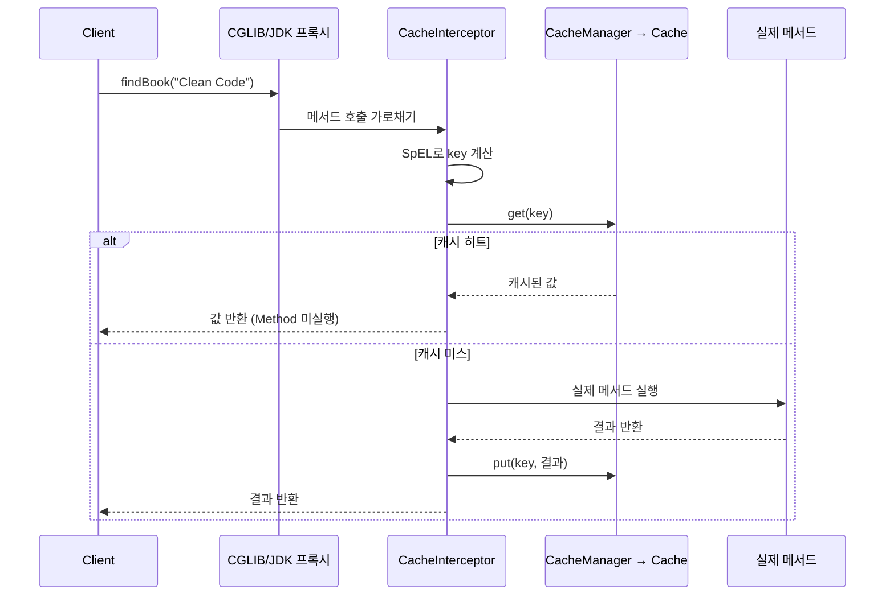
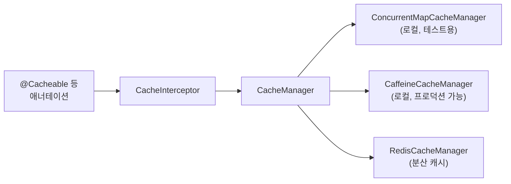

# Spring Cache 추상화

## 핵심 정의
Spring Cache 추상화(Cache Abstraction)는 `@Cacheable`, `@CachePut`, `@CacheEvict` 같은 애너테이션으로 메서드 호출 결과를 캐시에 저장/조회/삭제하는 선언적 캐싱 모델이다. Ehcache, Caffeine, Redis 등 실제 캐시 구현체를 `CacheManager` 뒤로 숨겨, 비즈니스 코드는 어떤 저장소를 쓰는지 몰라도 되게 만든다. Spring Framework 3.1부터 제공되며, 프록시 기반 AOP로 메서드 호출을 가로채는 기본 모델은 Spring Boot 3(Spring Framework 6) 기준으로도 동일하다. 다만 Spring Framework 6.1(Spring Boot 3.2)부터 `CompletableFuture`와 리액티브 타입(`Mono`/`Flux`) 반환값도 `@Cacheable` 등으로 캐싱할 수 있도록 기능이 확장되었다는 점은 3.1 시절과 달라진 부분이다.

이 추상화는 그 자체로 캐시 구현체가 아니라 프록시 기반 관점 지향 프로그래밍(AOP)으로 메서드 호출을 가로채는 계층이다. 실제 저장/축출 로직은 `CacheManager`가 감싸는 `Cache` 구현체(`ConcurrentMapCache`, `CaffeineCache`, `RedisCache` 등)에 위임한다.

## 동작 원리 / 구조

### 프록시 기반 인터셉션 흐름



`@EnableCaching`을 선언하면 Spring이 `@Cacheable` 등이 붙은 빈에 대해 프록시를 생성한다. 다른 Spring AOP 기반 기능(`@Transactional` 등)과 마찬가지로 **같은 클래스 내부 self-invocation은 프록시를 거치지 않아 캐싱이 적용되지 않는다.**

### 주요 애너테이션

| 애너테이션 | 동작 | 반환값 요구 |
|---|---|---|
| `@Cacheable` | 캐시 조회 → 히트 시 메서드 미실행, 미스 시 실행 후 저장 | 필요 |
| `@CachePut` | 항상 메서드 실행 후 결과로 캐시 갱신 (조회는 하지 않음) | 필요 |
| `@CacheEvict` | 캐시 항목 삭제. `allEntries=true`로 전체 삭제, `beforeInvocation`으로 실행 전/후 삭제 시점 제어 | 불필요(void 가능) |
| `@Caching` | 위 세 개를 조합해 한 메서드에 여러 캐시 규칙 적용 | - |

### key와 condition/unless의 평가 시점

- `@Cacheable`의 조회 key와 condition은 메서드 호출 전에 평가한다. `@CachePut`의 key, `beforeInvocation=false`인 `@CacheEvict`의 key는 결과(`#result`)를 참조할 수 있으므로 모든 애너테이션의 key가 실행 전 평가되는 것은 아니다.
- `unless`는 **메서드 실행 후** 결과(`#result`)를 보고 캐싱 여부를 거부(veto)할 때 쓴다. null이나 빈 컬렉션을 캐싱하지 않으려 할 때 사용.

```java
@Cacheable(
    cacheNames = "orders",
    key = "#customerId",
    condition = "#customerId != null",
    unless = "#result == null || #result.isEmpty()"
)
public List<Order> findByCustomerId(Long customerId) { ... }

@CacheEvict(cacheNames = "orders", key = "#order.customerId")
public void updateOrder(Order order) { ... }
```

### 키 생성 전략

`SimpleKeyGenerator`는 인자가 없으면 `SimpleKey.EMPTY`, 단일 비배열·비null 인자는 그 객체, 그 외에는 인자를 담은 `SimpleKey`를 사용한다. 다중 인자 자체가 불안정한 것은 아니다. 키의 equals/hashCode, 가변 객체 여부와 같은 캐시를 쓰는 다른 메서드의 충돌을 확인하고, 의미 있는 일부 인자나 버전·테넌트 경계를 표현해야 할 때 명시적 key를 사용한다.

### CacheManager와 실제 백엔드



`@EnableCaching` 등으로 캐시 기능을 켜고 사용자 정의 `CacheManager`/`CacheResolver`가 없는 경우 Boot가 클래스패스와 제공자 우선순위에 따라 관리자를 구성한다. 여러 라이브러리가 있으면 특정 하나가 있다는 이유만으로 선택을 단정하지 말고 실제 빈 또는 `spring.cache.type`으로 확인한다.

## 실무 관점
- **분산 환경의 캐시 선택**: 여러 인스턴스에서도 Caffeine 등 로컬 캐시를 사용할 수 있다. 변경 전파가 필요한 데이터에는 TTL, 무효화 이벤트 또는 외부 공유 캐시가 필요하다. 모든 데이터에 Redis가 필수인 것은 아니며 허용 가능한 stale 기간과 조회 비용으로 판단한다. [[캐시와 DB 정합성]] 참고.
- **null 캐싱**: null 저장 가능 여부는 제공자 설정에 달려 있다. negative caching은 존재하지 않는 키의 반복 DB 조회, 즉 캐시 관통을 줄일 수 있지만 새 데이터 생성 후에는 짧은 TTL이나 명시적 무효화가 필요하다. null 저장을 끈 제공자는 예외를 낼 수 있으므로 `unless = "#result == null"`로 저장을 제외하는 방식과 구분한다.
- **self-invocation 함정**: 같은 클래스 안에서 `this.cachedMethod()`로 호출하면 프록시를 거치지 않아 캐싱이 무시된다. 캐싱 경계를 별도 빈으로 분리하는 방식을 우선 검토한다. `AopContext.currentProxy()`는 `exposeProxy=true`와 같은 스레드의 활성 프록시 호출 문맥이 모두 필요하며, 기본 설정에서는 사용할 수 없다.
- **캐시 장애의 전파**: 기본 `SimpleCacheErrorHandler`는 캐시 접근 예외를 호출자에게 던진다. 캐시 장애가 자동으로 DB 조회로 전환된다고 가정하지 않는다. 사용자 `CacheErrorHandler`로 조회 오류를 허용하더라도 DB 유입 급증, 값 저장 실패, 무효화 실패를 각각 관측하고 복구 정책을 정한다. 무효화 실패를 삼키면 stale 값이 남을 수 있다.
- **동시성(cache stampede)**: `sync=true`는 `Cache.get(key, Callable)` 등 제공자의 로딩 경로에 동기화를 위임한다. 단일 캐시만 지정할 수 있고 `unless`나 다른 캐시 연산과의 조합에 제약이 있다. 제공자의 원자적 로드 지원과 락 범위를 확인해야 하며 이 옵션만으로 분산 단일 실행을 보장하지 않는다.
- **TTL/만료 정책은 애너테이션이 아니라 CacheManager 설정에서 관리**한다. `RedisCacheManager`는 `RedisCacheConfiguration`으로 캐시 이름별 TTL을 다르게 줄 수 있다(`RedisCacheManager.builder(...).withCacheConfiguration("orders", config)`).
- **직렬화 방식**: RedisCache의 기본 값 직렬화는 JDK 직렬화다. JSON으로 바꿀 때 타입 정보·호환성·역직렬화 허용 범위를 설계한다. Spring Data Redis 4.0부터 Jackson 2용 `GenericJackson2JsonRedisSerializer`는 deprecated이며 Jackson 3용 `GenericJacksonJsonRedisSerializer`가 대체 타입이다.
- **트랜잭션과의 상호작용**: RedisCacheManager의 `transactionAware()` 또는 트랜잭션 인지 데코레이터는 활성 Spring 트랜잭션의 일반 put/evict/clear를 성공 커밋 뒤로 미룬다. `CacheManager` 인터페이스 자체에 공통 setter가 있는 것은 아니다. `putIfAbsent`, `evictIfPresent` 같은 즉시 연산은 지연할 수 없고, DB와 Redis의 원자적 분산 커밋이나 캐시 반영 실패 복구까지 제공하지 않는다.
- **동기 로딩과 롤백**: Framework 7.0.9의 `TransactionAwareCacheDecorator`는 `get(key, Callable)` 로딩을 실제 캐시에 직접 위임한다. 따라서 `@Cacheable(sync=true)`로 미커밋 DB 값을 읽어 적재하면 트랜잭션 인지 설정이 있어도 롤백 뒤 그 값이 캐시에 남을 수 있다. `sync=true`는 로더 동시성 제어이며 커밋 시점 제어가 아니다. 쓰기 트랜잭션 안의 캐시 적재를 피하거나, 실제 제공자의 로딩·저장 경로와 커밋 이후 갱신 정책을 함께 검증한다.
- **리액티브 반환 타입**: 6.1부터 Mono의 값, Flux의 완료된 원소 목록을 캐싱한다. 무한·대용량 Flux나 세밀한 스트리밍 제어에는 적합하지 않다. 제공자의 비동기 retrieve 지원을 확인하고 Caffeine은 async cache mode를 사용한다. 6.1.3부터 제공되는 JVM 시스템 프로퍼티 `spring.cache.reactivestreams.ignore=true`는 리액티브 적응을 무시하는 구버전 호환 옵션으로, 캐싱 자체를 끄는 일반 Boot 설정이 아니다.

## 심화 Q&A

### Q. `@Cacheable`과 `@CachePut`을 같은 메서드에 함께 쓰면 안 되는 이유는?
`@Cacheable`은 캐시 히트 시 실행을 줄이려 하고 `@CachePut`은 결과 갱신을 위해 실행을 요구한다. 유효한 put 연산이 있으면 메서드는 실행되므로 Cacheable이 항상 이겨 put이 무시된다는 설명은 틀리다. 호출 전에 상호 배타적 조건을 판정할 수 있는 특수 경우 외에는 조회와 갱신 메서드를 분리한다.

### Q. `@CacheEvict(beforeInvocation = true)`는 언제 필요한가?
기본값 false는 메서드가 성공적으로 완료된 뒤 무효화한다. `beforeInvocation=true`는 결과와 관계없이 먼저 무효화해야 하는 작업에 사용할 수 있지만, DB 커밋 전에 다른 요청이 이전 데이터를 읽어 캐시를 다시 채우는 경쟁을 막지 못한다. stale 값 제거를 보장하는 해결책으로 간주하지 말고 DB 변경·커밋·캐시 갱신의 순서와 실패 복구를 함께 설계한다.

### Q. Redis를 캐시로 쓸 때 `@Cacheable`의 `sync = true`가 분산 락을 대체할 수 있는가?
이 옵션 자체는 분산 락이 아니다. 로컬 Caffeine 등의 동기화는 해당 캐시 인스턴스 범위이며, RedisCache는 실제 RedisCacheWriter 설정에 따라 달라진다. 기본 non-locking writer에서는 같은 JVM의 로드도 단일 실행이라고 가정할 수 없다. locking writer는 캐시 단위 락을 사용하므로 키 단위 분산 락과 비용·범위가 다르다. 제공자 구현과 실패 시 보장 수준을 확인한다.

### Q. `@Cacheable`의 `condition`과 `unless`를 함께 쓸 때 평가 순서와 실무 활용법은?
`condition`은 메서드 호출 전에 인자만으로 평가되어 "이 요청 자체를 캐싱 대상으로 볼지"를 결정하고, `unless`는 메서드 실행 후 결과를 보고 "이 결과를 캐시에 넣을지"를 결정한다. 예를 들어 검색어 길이가 너무 짧으면(`condition = "#keyword.length() >= 2"`) 캐싱 자체를 하지 않고, 검색 결과가 비어 있으면(`unless = "#result.isEmpty()"`) 결과는 실행하되 캐시에는 남기지 않는 식으로 역할을 분리해 불필요한 캐시 오염을 막는다.

### Q. 로컬 캐시(Caffeine)와 Redis 기반 분산 캐시를 Spring Cache 추상화 하나로 다중 계층(L1/L2)으로 구성할 수 있는가?
추상화는 커스텀 다중 계층 구현을 수용할 수 있지만 자동 L1/L2 일관성을 제공하지 않는다. `CompositeCacheManager`는 요청한 이름의 Cache를 처음 제공하는 관리자를 선택할 뿐, 선택된 캐시의 key miss를 다음 관리자에서 다시 조회하는 계층 캐시가 아니다. 별도 Cache/CacheResolver 또는 컴포넌트로 승격·TTL·무효화·장애 정책을 구현해야 한다.

### Q. `@Cacheable`이 걸린 메서드가 체크 예외를 던지면 어떻게 되는가?
캐시 미스로 실제 메서드가 실행되다 예외가 발생하면 그 예외는 그대로 호출자에게 전파되고, `CacheInterceptor`는 캐시에 아무것도 저장하지 않는다(정상 반환값이 없으므로). 다음 호출은 다시 캐시 미스로 시작해 원본 저장소를 재호출한다. 즉 예외는 캐싱되지 않으므로, 같은 실패가 반복되는 장애 상황에서는 매 요청이 원본 저장소에 재시도로 몰릴 수 있다는 점을 감안해 서킷 브레이커 등 별도 방어가 필요하다.

### Q. `@Cacheable`을 WebFlux의 `Flux<Book>` 반환 메서드에 붙이면 스트리밍 특성이 그대로 유지되는가?
그대로 유지된다고 가정할 수 없다. Flux는 완료된 원소를 List로 저장하고 히트 때 그 목록을 Flux로 제공한다. 히트 Publisher도 downstream demand에 맞춰 전달할 수 있으므로 배압 프로토콜 자체가 사라진다는 뜻은 아니다. 다만 원본 조회를 점진적으로 수행하는 특성과 캐시 적재 비용은 달라진다. 무한 스트림은 목록이 완료되지 않으며 대용량 스트림은 메모리 부담이 커 별도 리액티브 캐시 설계가 필요하다.

## 관련 개념
- [[Cache-Aside와 Write-Through-Behind]]
- [[캐시와 DB 정합성]]
- [[캐시 스탬피드]]
- [[로컬 캐시와 멀티레벨 캐시]]

## 참고 자료

검증일: 2026-09-08. 적용 범위: Spring Framework 6.1–7.0, Spring Data Redis 4.x.

- [Cache annotations](https://docs.spring.io/spring-framework/reference/integration/cache/annotations.html) — 키 생성·sync·리액티브 처리·애너테이션 실행.
- [Redis Cache](https://docs.spring.io/spring-data/redis/reference/redis/redis-cache.html) — writer 락 범위·직렬화·트랜잭션.
- [TransactionAwareCacheDecorator](https://docs.spring.io/spring-framework/docs/current/javadoc-api/org/springframework/cache/transaction/TransactionAwareCacheDecorator.html) — 커밋 후 반영과 즉시 연산 예외.
- [CompositeCacheManager](https://docs.spring.io/spring-framework/docs/current/javadoc-api/org/springframework/cache/support/CompositeCacheManager.html) — 캐시 이름으로 관리자 선택.
- [CacheAspectSupport](https://docs.spring.io/spring-framework/docs/current/javadoc-api/org/springframework/cache/interceptor/CacheAspectSupport.html) — 리액티브 호환 모드 시스템 프로퍼티.
- [GenericJackson2JsonRedisSerializer](https://docs.spring.io/spring-data/redis/docs/current/api/org/springframework/data/redis/serializer/GenericJackson2JsonRedisSerializer.html) — 4.0 deprecation과 Jackson 3 대체 타입.
- [Boot Caching](https://docs.spring.io/spring-boot/reference/io/caching.html) — 캐시 제공자 자동 구성 조건.

부분 재검증: 2026-09-23. Framework 7.0.9에서 기본 캐시 오류 전파와 AopContext 사용 조건을 공식 문서·API로 확인했다. 캐시 get 오류가 호출자에게 전파되고 대상 메서드가 실행되지 않는 것을 프록시 호출 테스트로 재현했다. 기존의 제공자별 구현 설명 전체를 재검증한 것은 아니다.

- [SimpleCacheErrorHandler 7.0.9](https://docs.spring.io/spring-framework/docs/7.0.9/javadoc-api/org/springframework/cache/interceptor/SimpleCacheErrorHandler.html) — 기본 오류 전파.
- [AopContext 7.0.9](https://docs.spring.io/spring-framework/docs/7.0.9/javadoc-api/org/springframework/aop/framework/AopContext.html) — 노출 설정과 프록시 호출 문맥.

부분 재검증: 2026-10-04. Framework 7.0.9·TransactionAwareCacheManagerProxy·ConcurrentMapCacheManager·H2 2.4.240에서 실제 Cacheable 프록시를 호출했다. 일반 캐시 적재는 롤백 시 반영되지 않았지만 sync=true의 로더는 미커밋 값을 즉시 적재해 롤백 뒤 조회에도 반환하는 것을 JUnit 2건으로 확인했다. Redis/Caffeine의 모든 설정이나 분산 경쟁을 실행 검증한 것은 아니다.

- [TransactionAwareCacheDecorator 7.0.9 소스](https://github.com/spring-projects/spring-framework/blob/v7.0.9/spring-context-support/src/main/java/org/springframework/cache/transaction/TransactionAwareCacheDecorator.java) — 일반 put의 커밋 후 처리와 로더 호출의 직접 위임.
- [Cacheable 7.0.9 API](https://docs.spring.io/spring-framework/docs/7.0.9/javadoc-api/org/springframework/cache/annotation/Cacheable.html) — sync의 제공자 위임 범위.
