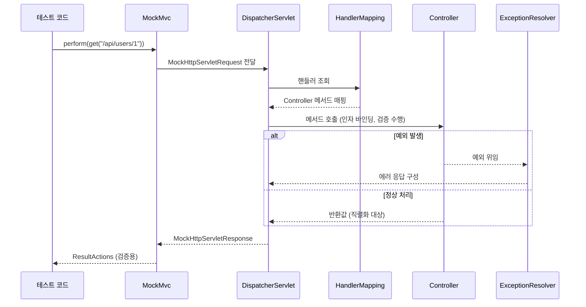

# MockMvc

## 핵심 정의
MockMvc는 실제 서블릿 컨테이너를 기동하지 않고 모의 요청·응답 객체로 DispatcherServlet 기반 Spring MVC 처리를 검증하는 spring-test 구성 요소다. 라우팅, 바인딩, 메시지 컨버터의 직렬화, 검증과 예외 처리를 실행하지만, 등록된 테스트 구성 범위만 검증한다. 실제 소켓·컨테이너 설정·배포 프록시까지 같은 환경으로 재현하는 것은 아니다.

## 동작 원리 / 구조

### 요청 처리 흐름


실제 MVC 구성 요소를 모의 Servlet API 위에서 실행하므로 네트워크 왕복이 없다. 필터도 테스트에 등록하면 실행되며, 직렬화 자체가 생략되는 것은 아니다. 실제 HTTP 방식보다 대체로 기동 비용이 작지만 전체 속도는 컨텍스트 구성과 외부 연동에 따라 달라진다.

### 두 가지 구성 방식

```java
// 1) standaloneSetup: 애플리케이션 설정을 로딩하지 않고 컨트롤러 직접 등록
mockMvc = MockMvcBuilders.standaloneSetup(new UserController(userService))
        .build();

// 2) @WebMvcTest: 선택된 MVC 슬라이스와 필요한 협력 빈으로 구성
@WebMvcTest(UserController.class)
class UserControllerTest {
    @Autowired MockMvc mockMvc;
    @MockitoBean UserService userService; // 협력 빈은 목으로 대체
}
```

| 방식 | 로딩 범위 | 장점 | 단점 |
|---|---|---|---|
| `standaloneSetup` | 지정한 컨트롤러만 | 빠르고 세밀한 제어 가능 | 실제 MVC 설정(인터셉터, 컨버터, 글로벌 예외 핸들러 등) 누락 위험 |
| `webAppContextSetup` / `@WebMvcTest` | 전자는 주어진 웹 컨텍스트, 후자는 선택된 MVC 슬라이스 | 포함한 MVC 구성의 결합 검증 | 전체 애플리케이션의 모든 설정이 자동 포함되지는 않음 |

### 기본 검증 API vs AssertJ 기반 API
전통 API는 `perform(...).andExpect(...)`를 사용한다. Framework 6.2에 추가된 `MockMvcTester`는 AssertJ 기반 API를 제공한다. 요청 처리 중 resolver가 해결하지 못한 예외를 즉시 던지는 대신 `MvcTestResult`에 담아 검증할 수 있다는 차이가 있다. 검증(assertion) 실패 자체를 삼키거나 나중으로 미루는 기능은 아니다.

```java
// 전통 방식
mockMvc.perform(get("/api/users/1"))
        .andExpect(status().isOk())
        .andExpect(jsonPath("$.name").value("kim"));

// MockMvcTester (AssertJ)
assertThat(mockMvcTester.get().uri("/api/users/1"))
        .hasStatusOk()
        .bodyJson().extractingPath("$.name").isEqualTo("kim");
```

## 실무 관점
- `@WebMvcTest`는 선택된 MVC 구성에 집중하므로 일반 `@Service`/`@Repository`는 스캔하지 않는다. 협력 빈은 `@MockitoBean`으로 대체하거나 필요한 실제 빈을 `@Import`한다. `@MockitoBean`은 Framework 6.2부터 제공되며, Boot의 `@MockBean`은 3.4에서 deprecated되고 4.0에서 제거됐다.
- `standaloneSetup`은 빠르지만 `@ControllerAdvice`, 커스텀 `HandlerMethodArgumentResolver`, 메시지 컨버터 설정이 자동으로 포함되지 않아, 실제 운영 환경과 다른 결과가 나올 수 있다. 전역 예외 처리나 공통 응답 포맷을 검증해야 한다면 `@WebMvcTest` 기반이 안전하다.
- 흔한 실수: `jsonPath` 검증에서 필드 하나만 확인하고 전체 응답 스키마 변경(필드 추가/삭제)을 놓치는 경우. 계약이 중요한 API라면 스냅샷 테스트나 JSON 스키마 검증을 병행한다.
- **보안 검증**: 미인증 요청은 설정에 따라 401·로그인 리다이렉트·403이 될 수 있다. `@WithMockUser`만으로 unsafe 메서드의 CSRF 검증이 해결되지는 않으므로 `csrf()`와 인증·권한 조건을 각각 테스트한다. 필터를 제거해 모든 요청을 통과시키면 운영 인가 동작을 검증할 수 없다.
- MockMvc는 컨버터 직렬화를 실제 수행하지만 포트·TLS·서블릿 컨테이너의 multipart 처리·reverse proxy 경로는 완전히 검증하지 못한다. 필요한 경우 RANDOM_PORT 서버 테스트와 배포 환경 검증을 추가한다. RANDOM_PORT 자체가 운영 프록시를 띄워주는 것은 아니다.
- 요청·응답 출력에는 `alwaysDo(print())`나 로그 핸들러를 사용할 수 있지만 매 요청 출력인지 실패 시 출력인지 설정을 구분한다. 토큰·개인정보가 테스트 로그에 남지 않도록 출력 대상을 관리한다.

## 심화 Q&A

### Q. `standaloneSetup`과 `webAppContextSetup`(또는 `@WebMvcTest`) 중 어느 쪽이 "더 신뢰할 수 있는" 테스트인가?
A. 확인하려는 위험에 따라 다르다. standaloneSetup은 명시적으로 등록한 컨트롤러 동작을 좁게 검증하고, webAppContextSetup은 주어진 컨텍스트의 실제 MVC 구성을 검증한다. WebMvcTest도 슬라이스 필터 때문에 일부 Configuration과 빈을 제외하므로 필요한 advice·컨버터·보안 설정이 포함됐는지 확인한다. 전체 배선의 검증이 필요하면 실제 애플리케이션 컨텍스트 테스트를 보완한다.

### Q. MockMvc 테스트가 통과했는데 실제 배포 환경에서 404가 발생하는 경우는 왜 생기는가?
A. 대표적으로 컨텍스트 경로(context-path)나 서블릿 매핑 설정 차이, 혹은 `standaloneSetup`으로 인해 실제 라우팅 설정(예: 전역 prefix, API 버저닝 인터셉터)이 테스트에 반영되지 않았을 가능성이 크다. 또한 리버스 프록시나 게이트웨이 레벨의 경로 재작성(rewrite)은 MockMvc 범위 밖이므로, 이런 부분은 E2E 테스트나 실제 배포 환경 점검으로 커버해야 한다.

### Q. MockMvc와 `WebTestClient`, `TestRestTemplate`의 근본적인 차이는 무엇인가?
A. MockMvc는 MVC를 모의 서블릿 객체 위에서 실행한다. TestRestTemplate은 실제 서버에 HTTP 요청을 보내는 클라이언트이고, WebTestClient는 실제 서버 또는 모의 서버 양쪽에 연결할 수 있다. MVC 모의 바인딩은 `MockMvcWebTestClient.bindToController(...)`/`bindToApplicationContext(...)`를 사용한다. `WebTestClient.bindToController(...)` 자체는 WebFlux 바인딩이므로 두 API를 혼동하지 않는다.

### Q. `MockMvcTester`(AssertJ 기반)가 기존 `perform().andExpect()` 방식보다 나은 이유는 구체적으로 무엇인가?
A. 미해결 요청 처리 예외를 `MvcTestResult`에 담아 `.failure()`로 검증할 수 있고, AssertJ 기반 상태·헤더·JSON 검증을 일관되게 작성할 수 있다. assertion이 실패하면 여전히 AssertionError로 테스트가 실패한다. 기존 andExpect 테스트를 일괄 변경할 필요 없이 팀이 사용하는 assertion 방식에 맞춰 선택한다.

### Q. 비동기 컨트롤러(`Callable`, `DeferredResult`, 코루틴 서스펜드 함수 등)를 MockMvc로 테스트할 때 주의점은?
A. 첫 perform은 비동기 처리를 시작한 상태의 결과를 반환할 수 있으며, 컨테이너가 없으므로 최종 ASYNC 디스패치를 자동으로 수행하지 않는다. `request().asyncStarted()`를 확인하고 결과를 기다린 뒤, 받은 MvcResult로 `mockMvc.perform(asyncDispatch(result))`를 호출해 최종 응답을 검증한다. 최초 응답만 검사하면 완료 후 상태·본문 검증을 놓친다.

### Q. `@WebMvcTest`에서 시큐리티 설정을 완전히 재현하지 못하는 경우는 언제인가?
A. Boot 4.1.1에서는 테스트 의존성부터 확인한다. MVC 테스트 스타터만으로 보안 테스트 모듈까지 포함되지는 않으며, 보안 자동 설정을 가져오는 `spring-boot-security-test`가 클래스패스에 필요하다. Boot 버전에 맞는 `spring-boot-starter-security-test`를 테스트 의존성으로 사용할 수 있다. 해당 모듈이나 명시적인 보안 설정 등록 없이 `@WebMvcTest`만 사용하면 보안 라이브러리가 있어도 필터 체인이 없는 테스트가 될 수 있다. 그다음 커스텀 `SecurityFilterChain` 구성과 조건부 빈이 슬라이스에 포함됐는지 확인하고 필요한 설정을 `@Import`한다. 실제 체인 등록과 익명 요청 거부를 함께 검증해야 잘못된 성공을 발견할 수 있다.

## 관련 개념
- [[단위 테스트와 통합 테스트 경계]]
- [[TestContainers]]

## 참고 자료

검증일: 2026-09-08. 적용 범위: Spring Framework 6.2–7.0, Spring Boot 3.4–4.1.

- [MockMvc overview](https://docs.spring.io/spring-framework/reference/testing/mockmvc/overview.html) — 모의 서블릿 기반 MVC 검증.
- [MockMvc setup](https://docs.spring.io/spring-framework/reference/testing/mockmvc/hamcrest/setup.html) — standalone과 WebApplicationContext 구성.
- [Async requests](https://docs.spring.io/spring-framework/reference/testing/mockmvc/hamcrest/async-requests.html) — 수동 asyncDispatch.
- [MockMvcTester](https://docs.spring.io/spring-framework/docs/current/javadoc-api/org/springframework/test/web/servlet/assertj/MockMvcTester.html) — 미해결 요청 예외와 AssertJ 검증.
- [Boot testing](https://docs.spring.io/spring-boot/reference/testing/spring-boot-applications.html) — WebMvcTest 범위·실제 서버 테스트.
- [Boot 4 migration](https://github.com/spring-projects/spring-boot/wiki/Spring-Boot-4.0-Migration-Guide) — MockBean 제거와 테스트 모듈 변경.
- [MockMvcWebTestClient](https://docs.spring.io/spring-framework/reference/testing/webtestclient.html) — MockMvc와 WebFlux 바인딩 구분.

부분 재검증: 2026-10-04. Boot 4.1.1·Security 7.1.1에서 보안 테스트 모듈에 따른 슬라이스 자동 설정을 확인했다. 커스텀 보안 설정이 없는 같은 `@WebMvcTest`에서 해당 모듈이 없으면 체인 0개·익명 GET 200, 추가하면 체인 1개·401을 모의 요청으로 확인했다. 운영 보안 정책이나 실제 HTTP 서버를 검증한 결과는 아니다.

- [Boot 4.1.1 Security MockMvc imports](https://raw.githubusercontent.com/spring-projects/spring-boot/v4.1.1/module/spring-boot-security-test/src/main/resources/META-INF/spring/org.springframework.boot.webmvc.test.autoconfigure.AutoConfigureMockMvc.imports) — 보안 테스트 모듈의 자동 설정 등록.
- [Boot 4.1.1 Security test starter](https://raw.githubusercontent.com/spring-projects/spring-boot/v4.1.1/starter/spring-boot-starter-security-test/build.gradle) — 테스트 스타터의 모듈 의존성.
