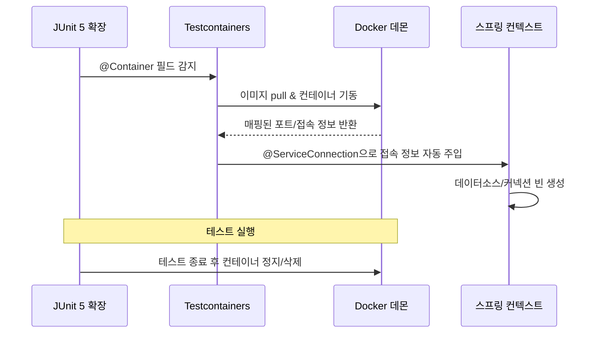

# TestContainers

## 핵심 정의
Testcontainers는 테스트 실행 시점에 Docker 컨테이너로 실제 데이터베이스, 메시지 브로커, 캐시 등의 인프라를 띄우고, 테스트가 끝나면 자동으로 정리(clean up)해주는 자바 라이브러리다. H2 같은 인메모리 대체재나 목(mock) 대신 운영에서 실제로 사용하는 것과 동일한 엔진(예: PostgreSQL, Kafka, Redis)을 사용하므로, "테스트는 통과했는데 실제 DB 방언 차이로 운영에서 깨지는" 문제를 근본적으로 줄여준다. JUnit 5 확장(`@Testcontainers`)이나 스프링 부트의 `@ServiceConnection`과 결합해 컨테이너 생명주기와 애플리케이션 설정 연결을 선언적으로 처리한다.

## 동작 원리 / 구조

### 기본 흐름


### 연결 확인 예시 (Boot 4.1 + Testcontainers 2.x)

Boot의 JDBC 자동 구성, PostgreSQL 드라이버, `spring-boot-testcontainers`, Testcontainers PostgreSQL/JUnit Jupiter 모듈이 필요하다. 아래는 연결 smoke test이며 실제 저장소 검증에는 쿼리·제약·트랜잭션 assertion을 추가한다.
```java
@Testcontainers
@SpringBootTest
class PostgreSqlConnectionTest {

    @Container
    @ServiceConnection
    // import org.testcontainers.postgresql.PostgreSQLContainer;
    static PostgreSQLContainer postgres =
            new PostgreSQLContainer("postgres:16-alpine"); // 운영 대상과 이미지 버전 정렬

    @Autowired
    JdbcTemplate jdbcTemplate;

    @Test
    void 실제_PostgreSQL에_연결된다() {
        assertThat(jdbcTemplate.queryForObject("select version()", String.class))
            .startsWith("PostgreSQL");
    }
}
```
`spring-boot-testcontainers`의 `@ServiceConnection`은 지원하는 컨테이너 타입/서비스 이름에 맞는 팩토리로 ConnectionDetails 빈을 만든다. DataSource 등은 이를 소비하는 Boot 자동 구성이 생성한다. 따라서 서비스 연결 애너테이션 자체가 모든 클라이언트 빈을 생성하는 것은 아니다. 추가 설정은 DynamicPropertySource로 제공할 수 있다.

컨테이너를 `@Bean`으로 옮기면 Boot는 이미지 이름을 알아내려고 빈을 미리 생성하지 않고 **메서드 반환 타입**으로 서비스를 판별한다. PostgreSQL처럼 전용 컨테이너 타입을 반환하거나, Redis를 `GenericContainer<?>`로 반환한다면 `@ServiceConnection(name = "redis")`처럼 이름을 지정한다. 정적 필드에서 동작한 설정을 일반 반환 타입의 빈으로 옮기기만 하면 연결 정보 팩토리를 찾지 못할 수 있다.

```java
// @ServiceConnection 이전 방식: 수동 프로퍼티 바인딩
@DynamicPropertySource
static void registerProperties(DynamicPropertyRegistry registry) {
    registry.add("spring.datasource.url", postgres::getJdbcUrl);
    registry.add("spring.datasource.username", postgres::getUsername);
    registry.add("spring.datasource.password", postgres::getPassword);
}
```

### 컨테이너 재사용(reuse)과 싱글턴 패턴
JUnit 확장의 static @Container는 해당 테스트 클래스의 메서드 사이에서 공유하고 클래스가 끝나면 정지한다. 상속받았다는 이유만으로 JVM 전체에서 한 번만 시작하는 것은 아니다. 여러 클래스가 Spring 컨텍스트를 공유한다면 컨테이너를 Spring 빈으로 관리해 컨텍스트 수명과 맞추거나, JUnit의 @Container 수명 관리와 섞지 않는 수동 singleton 패턴을 사용한다.

실행 간 재사용은 별개의 실험적 기능이다. `~/.testcontainers.properties`의 `testcontainers.reuse.enable=true` 또는 환경 변수로 허용하고, `.withReuse(true)` 컨테이너를 수동 start하며 stop하지 않아야 한다. 클래스패스 properties나 JUnit 자동 종료와 조합하면 의도대로 재사용되지 않는다. CI에는 권장하지 않으며 잔존 데이터 정리가 필요하다.

## 실무 관점
- 언제 쓰는가: DB 방언에 민감한 쿼리(네이티브 쿼리, 특정 함수), 메시지 브로커 연동, 외부 시스템의 실제 프로토콜 동작을 검증해야 할 때. 반대로 순수 도메인 로직 검증에는 오버스펙이다.
- 트레이드오프: 호환 컨테이너 런타임과 이미지 접근이 필요하다. 로컬 Docker Desktop뿐 아니라 설정한 원격 Docker 환경·Testcontainers Cloud 등도 사용할 수 있다. CI에서 반드시 DinD나 호스트 소켓 마운트만 써야 하는 것은 아니며 팀 런타임·네트워크·권한 정책에 맞춘다.
- 흔한 실수: 컨테이너를 인스턴스 필드(`static`이 아닌)로 선언해 테스트 메서드마다 매번 새 컨테이너를 기동하는 경우. 테스트 스위트 실행 시간이 선형으로 늘어난다.
- 흔한 실수: CI에서 이미지 캐시가 없어 매 빌드마다 이미지를 새로 pull하면서 파이프라인이 느려지는 경우. CI 러너에 이미지 레이어 캐시를 구성하거나 사내 레지스트리 미러를 사용해 완화한다.
- 기동 실패는 pull 인증·네트워크·플랫폼 이미지·로그·CPU/메모리 제한을 먼저 확인한다. 프로세스 실행이나 포트 listen만으로 애플리케이션 준비가 끝났다고 볼 수 없으므로 실제 health check·로그·프로토콜에 맞는 WaitStrategy를 사용한다. 원인 확인 없이 timeout만 늘리지 않는다.
- 튜닝 포인트: 컨텍스트 캐시보다 컨테이너가 먼저 정지하면 다음 클래스가 종료된 DB 주소를 재사용할 수 있다. 공통 베이스 클래스뿐 아니라 수명 관리 주체까지 통일하고, 테스트별 데이터 정리와 병렬 실행의 격리를 검증한다.
- **병렬 실행의 지원 범위**: Testcontainers 2.0.5의 JUnit Jupiter 확장은 순차 테스트 실행만 검증하며 병렬 테스트 실행은 지원하지 않는다고 명시한다. `static @Container` 공유와 데이터 정리만으로 확장의 병렬 안전성까지 보장하지 않는다. 해당 확장을 쓰는 테스트는 순차 실행하고, CI 작업을 나눠 병렬화할 때도 각 작업의 컨테이너·DB·포트·외부 리소스를 격리한다.
- Testcontainers 2.x는 개별 컨테이너 클래스를 모듈별 새 패키지(예: `org.testcontainers.postgresql.PostgreSQLContainer`)로 재정리하면서 기존 `org.testcontainers.containers.*` 클래스들을 deprecated 처리하는 큰 API 변경을 포함한다. 다만 Testcontainers 코어 자체는 여전히 JUnit 4 연동(`@Rule` 기반)을 지원하므로, 1.x에서 업그레이드할 때는 "JUnit 4 제거"가 아니라 패키지/클래스 경로 변경 위주로 마이그레이션 가이드를 확인해야 한다.

## 심화 Q&A

### Q. Testcontainers 대신 H2 같은 인메모리 DB를 쓰면 안 되는 이유는 구체적으로 무엇인가?
A. H2는 PostgreSQL/MySQL 호환 모드를 제공하지만 완벽한 방언 호환은 아니다. 특정 함수(예: `JSONB` 연산, 윈도우 함수 세부 동작, 락 힌트), 제약조건 처리 방식, 트랜잭션 격리 수준의 미묘한 차이 때문에 H2에서는 통과하는 쿼리가 실제 PostgreSQL에서 문법 오류나 다른 결과를 낼 수 있다. Testcontainers는 같은 엔진을 사용해 이런 차이를 줄이지만 버전·확장·설정·네트워크·복제 토폴로지까지 자동으로 운영과 같아지는 것은 아니다. 다만 그만큼 기동 비용이 있으므로 모든 테스트에 적용하기보다 리포지토리/쿼리 검증 계층에 집중하는 것이 합리적이다.

### Q. 여러 테스트 클래스가 컨테이너를 공유할 때 테스트 간 데이터 격리는 어떻게 보장하는가?
A. 컨테이너 공유와 데이터 격리는 별개다. 같은 스레드의 테스트 관리 트랜잭션에 참여한 DB 작업은 롤백할 수 있지만, 실제 HTTP 서버 스레드·비동기 작업·메시지 발행·REQUIRES_NEW 커밋까지 되돌리지는 못한다. 필요하면 테스트별 스키마, 명시적 정리 SQL, 독립 컨테이너를 사용하고 병렬 테스트가 서로의 데이터를 삭제하지 않도록 한다.

### Q. CI 환경에서 Docker 소켓 접근이 제한된 경우(예: 보안 정책상 DinD 금지) 대안은 무엇인가?
A. Testcontainers Cloud 같은 원격 Docker 실행 서비스를 사용하거나, CI 벤더가 제공하는 Docker-enabled 러너를 사용하는 방법이 있다. 근본적으로 Docker 실행 환경이 전혀 불가능하다면 해당 통합 테스트 계층은 별도의 스테이징 환경 검증이나 계약 테스트로 대체하는 절충이 필요하다.

### Q. `@ServiceConnection`과 `@DynamicPropertySource`를 함께 써야 하는 경우가 있는가?
A. 있다. `name`은 커스텀 이미지가 어떤 서비스인지 식별할 힌트이지 팩토리 빈 이름을 직접 지정하는 속성이 아니다. 지원되는 ConnectionDetails로 표준 접속 정보를 제공하고, 지원되지 않는 인증·추가 속성은 DynamicPropertySource나 커스텀 팩토리로 보완한다. 같은 접속 정보를 중복 설정하면 ConnectionDetails 우선순위 때문에 프로퍼티가 기대대로 적용되지 않을 수 있다.

### Q. 컨테이너 기동 시간이 테스트 스위트 전체 시간의 병목이 될 때 어떤 순서로 최적화하는가?
A. 먼저 pull·start·애플리케이션 컨텍스트·테스트 본문 시간을 나눠 측정한다. 같은 클래스 안의 static 공유, 여러 클래스의 컨텍스트/컨테이너 수명 정렬, 이미지 캐시를 적용한다. 실행 간 reuse는 로컬에서 데이터 초기화까지 설계한 후 검토한다. 단순히 베이스 클래스로 옮겼다고 중복 기동이 사라졌다고 가정하지 않는다.

### Q. Testcontainers가 실행 환경(로컬 Docker Desktop vs CI Docker 데몬)에 따라 다르게 동작할 수 있는 지점은 어디인가?
A. 대표적으로 포트 바인딩과 호스트 접근 방식이다. Docker Desktop 환경(macOS/Windows)은 컨테이너 네트워킹을 가상화 계층 위에서 처리하므로 `host.docker.internal` 같은 특수 호스트명이 필요할 수 있는 반면, 리눅스 기반 CI 러너는 브리지 네트워크로 직접 접근 가능한 경우가 많다. Testcontainers는 대부분 이 차이를 추상화해주지만, 커스텀 네트워크 설정이나 컨테이너 간 통신(예: 애플리케이션 컨테이너에서 DB 컨테이너 접근)을 직접 구성할 때는 환경별 차이를 염두에 둬야 한다.

## 관련 개념
- [[단위 테스트와 통합 테스트 경계]]
- [[MockMvc]]

## 참고 자료

부분 재검증: 2026-10-04. Testcontainers Java 2.0.5의 JUnit Jupiter 병렬 실행 제한과 Spring Boot 4.1.1의 `@Bean` 반환 타입 기반 ServiceConnection 판별을 확인했다. 이 두 항목은 공식 문서 검증이며 컨테이너 실행 시험은 수행하지 않았다.

- [JUnit Jupiter 확장 제한](https://java.testcontainers.org/test_framework_integration/junit_5/#limitations) — 병렬 테스트 실행 지원 여부.
- [Boot Testcontainers 서비스 연결](https://docs.spring.io/spring-boot/reference/testing/testcontainers.html#testing.testcontainers.service-connections) — 정적 필드와 `@Bean`의 서비스 판별 차이.

검증일: 2026-09-08. 적용 범위: Testcontainers Java 2.0.x, Spring Boot 4.1; ServiceConnection은 Boot 3.1부터.

- [Testcontainers JUnit Jupiter](https://java.testcontainers.org/test_framework_integration/junit_5/) — 클래스/메서드 생명주기.
- [Boot Testcontainers](https://docs.spring.io/spring-boot/reference/testing/testcontainers.html) — ConnectionDetails·컨텍스트와 컨테이너 생명주기.
- [Reusable containers](https://java.testcontainers.org/features/reuse/) — 실험적 재사용·사용자 설정 파일·수동 시작.
- [PostgreSQL module](https://java.testcontainers.org/modules/databases/postgres/) — 2.x 컨테이너 API.
- [Runtime requirements](https://java.testcontainers.org/supported_docker_environment/) — 호환 런타임과 원격 환경.
- [Wait strategies](https://java.testcontainers.org/features/startup_and_waits/) — 프로세스 시작과 준비 상태 구분.
- [JUnit 4 support](https://java.testcontainers.org/test_framework_integration/junit_4/) — 2.x에도 남아 있는 JUnit 4 통합.
