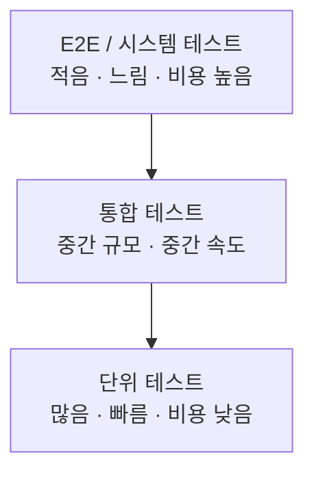

# 단위 테스트와 통합 테스트 경계

## 핵심 정의
단위 테스트(unit test)는 작은 행동 단위를 빠르고 결정적으로 검증한다. 단위가 반드시 클래스 하나일 필요는 없고, 순수한 실제 협력 객체를 함께 사용해도 된다. Spring 없이 POJO로 테스트하고 외부 I/O나 제어하기 어려운 경계에 필요한 mock/stub을 사용한다. 통합 테스트(integration test)는 여러 구성 요소가 실제 계약에 따라 연결되는지 검증하며 범위는 MVC 슬라이스부터 실제 DB·브로커 연동까지 달라진다.

두 테스트의 경계는 "무엇을 신뢰하고 무엇을 검증할 것인가"의 문제다. 단위 테스트는 로직의 정확성을, 통합 테스트는 컴포넌트 간 배선(wiring)과 실제 인프라와의 상호작용을 검증한다. 이 경계를 명확히 하지 않으면 느리고 깨지기 쉬운 테스트 스위트로 수렴하게 된다.

## 동작 원리 / 구조

### 테스트 피라미드 관점

### 스프링 애플리케이션에서의 실제 구분

| 구분 | 실행 방식 | 대표 애노테이션 | 속도 |
|---|---|---|---|
| 순수 단위 테스트 | POJO와 필요한 실제/대체 협력 객체, 컨텍스트 없음 | JUnit, 필요시 Mockito | 대체로 빠름 |
| 슬라이스 테스트(slice test) | 필요한 계층만 부분 로딩 | `@WebMvcTest`, `@DataJpaTest`, `@JsonTest` | 빠름 |
| 전체 컨텍스트 통합 테스트 | 전체 애플리케이션 구성, 외부 시스템 범위는 별도 선택 | `@SpringBootTest` | 구성·캐시·외부 I/O에 좌우 |
| E2E / 시스템 테스트 | 사용자 흐름을 실행 중 애플리케이션 경계에서 검증 | HTTP 클라이언트·환경 구성 도구 | 검증 범위에 좌우 |

슬라이스는 범위를 제한한 통합 테스트로 볼 수 있다. `@WebMvcTest`는 선택한 MVC 구성 요소의 결합을, `@DataJpaTest`는 JPA 매핑과 DB 상호작용을 확인한다. 전자의 서비스 빈은 `@MockitoBean` 또는 필요한 실제 빈으로 제공한다. Framework 6.2에서 도입된 MockitoBean이 Boot MockBean을 대체하며 MockBean은 Boot 4.0에서 제거됐다.

`@SpringBootTest`의 기본 webEnvironment는 MOCK이므로 실제 포트를 열지 않는다. RANDOM_PORT는 실제 서버를 띄우지만 외부 시스템을 무엇으로 구성했는지에 따라 검증 범위가 달라진다. Testcontainers를 사용했다는 사실만으로 E2E가 되는 것은 아니다.

### 판단 기준
- 검증 대상이 계산·분기·상태 전이이면 → 단위 테스트. 실제 협력 객체를 사용할지 대체할지는 격리할 위험과 비용으로 결정한다.
- 검증 대상이 프레임워크 배선(요청 매핑, 직렬화, 예외 핸들러, 쿼리 매핑)이면 → 슬라이스 테스트
- 검증 대상이 여러 계층/외부 시스템 간 실제 상호작용(트랜잭션 경계, 실제 SQL 방언, 메시지 큐 컨슈밍)이면 → 통합 테스트

## 실무 관점
- 테스트 비율을 고정하기보다 실패 위험·피드백 시간·유지 비용으로 구성한다. 순수 로직은 빠른 단위 테스트에, 쿼리·트랜잭션·프레임워크 계약은 해당 통합 테스트에 맡기며 커버리지 비율만으로 충분함을 판단하지 않는다.
- 흔한 실수: 서비스 계층 로직 검증에 `@SpringBootTest`를 남발해 CI 시간이 급격히 늘어나는 경우. 리포지토리 의존성 하나 때문에 전체 컨텍스트를 올릴 필요는 없다 — `@DataJpaTest`나 순수 Mockito로 축소할 수 있는지 먼저 검토한다.
- 흔한 실수: 단위 테스트에서 실제 구현체를 목으로 감싸면서 목의 동작을 실제와 다르게 정의해, 목은 통과하지만 실제 연동에서 깨지는 "가짜 초록불" 현상. 이런 계약(contract) 검증은 통합 테스트나 계약 테스트(contract test)로 보완해야 한다.
- 흔한 실수: `@SpringBootTest` 클래스마다 서로 다른 `@MockitoBean`/프로퍼티 조합을 사용해 스프링 컨텍스트 캐시(context cache)가 매번 새로 생성되는 경우. 컨텍스트 캐시 키가 달라질 때마다 재기동 비용이 발생하므로, 테스트 설정을 공유 가능한 형태로 통일하면 전체 스위트 속도가 크게 개선된다.
- 테스트 관리 트랜잭션은 보통 테스트 스레드에 바인딩되므로 실제 서버/비동기 스레드와 별도 트랜잭션까지 롤백하지 않는다. JPA는 flush로 SQL·제약을 실제 실행하고 필요시 clear 후 재조회해야 영속성 컨텍스트만 검사하는 거짓 통과를 줄일 수 있다. AFTER_COMMIT 동작은 TestTransaction으로 실제 커밋 경계를 만들거나 별도 커밋 테스트와 정리 전략을 사용한다.
- 통합 테스트를 별도 태스크나 `@Tag("integration")`로 분리해 선택 실행할 수 있게 한다. 로컬에서도 변경과 관련된 통합 테스트를 실행하고 CI에서 필요한 전체 범위를 실행한다. CI에서만 발견하도록 강제할 이유는 없다.

## 심화 Q&A

### Q. `@MockitoBean`으로 서비스 계층을 대체한 `@WebMvcTest`는 단위 테스트인가 통합 테스트인가?
A. 이름을 명확히 하면 MVC 슬라이스 통합 테스트다. 서비스 구현의 정확성은 검증하지 않지만 DispatcherServlet·컨버터·검증기·컨트롤러 사이 결합을 검증한다. 팀에서 컨트롤러 단위 테스트라고 부르더라도 실제 로딩 범위와 제외된 의존성을 함께 명시한다.

### Q. 단위 테스트 커버리지가 90%인데 운영 장애가 계속 발생한다면 무엇을 의심해야 하는가?
A. 커버리지는 실행 여부만 측정하지 계약의 정확성을 보장하지 않는다. 목이 실제 협력 객체의 동작(예외 조건, null 반환 시나리오, 타임아웃)을 정확히 반영하지 못하면 단위 테스트는 초록불이어도 통합 시점에 깨진다. 이 경우 핵심 연동 지점(DB 쿼리, 외부 API 호출, 메시지 발행)에 대한 통합 테스트를 추가하고, 목 설정이 실제 구현체의 스펙과 일치하는지 계약 테스트로 검증해야 한다.

### Q. `@DataJpaTest`는 단위 테스트에 가까운가 통합 테스트에 가까운가?
A. 통합 테스트에 가깝다. 실제 JPA/Hibernate 영속성 컨텍스트와 (내장 DB든 Testcontainers든) 실제 DB 엔진을 사용해 쿼리가 실제로 동작하는지 검증하기 때문이다. 다만 전체 애플리케이션 컨텍스트를 로딩하지 않으므로 `@SpringBootTest`보다는 가볍다. "부분 통합 테스트"로 이해하는 것이 정확하다.

### Q. 테스트 피라미드가 항상 정답인가, 예외적으로 통합 테스트 비중을 늘려야 하는 경우가 있는가?
A. 마이크로서비스 간 계약이 복잡하거나, 도메인 로직 자체보다 여러 시스템 간 오케스트레이션이 핵심 리스크인 경우(예: 사가 패턴, 분산 트랜잭션) 통합 테스트나 계약 테스트의 비중을 의도적으로 늘리는 "테스트 다이아몬드" 전략을 택하기도 한다. 피라미드는 기본 원칙이지 절대 규칙은 아니며, 리스크가 어디에 집중되어 있는지에 따라 조정한다.

### Q. 컨텍스트 캐시가 테스트 격리를 해칠 수 있는가?
A. 그렇다. 스프링 테스트 컨텍스트 캐시는 동일한 설정 키를 가진 테스트 클래스 간에 빈 인스턴스를 재사용한다. 만약 어떤 테스트가 싱글턴 빈의 상태를 변경하고 정리하지 않으면, 같은 컨텍스트를 공유하는 다른 테스트가 오염된 상태를 이어받을 수 있다. `@DirtiesContext`로 강제 초기화하거나, 애초에 상태를 가진 싱글턴을 테스트 친화적으로 설계하는 것이 근본 해법이다.

### Q. 단위 테스트에서 시간(Clock)이나 랜덤 값처럼 비결정적 요소는 어떻게 다루는가?
A. Clock을 생성자 의존성으로 받고 테스트에서 `Clock.fixed(...)`로 제공하면 Spring 컨텍스트 없이 시간 로직을 검증할 수 있다. 난수도 생성기 인터페이스/공급 함수를 주입해 고정 시퀀스나 seed를 사용한다. 실제 스케줄러·스레드 타이밍까지 Clock만으로 제어되는 것은 아니므로 시간 계산과 실행 인프라를 분리해 테스트한다.

## 관련 개념
- [[Spring 테스트 트랜잭션과 커밋 검증]]
- [[MockMvc]]
- [[TestContainers]]

## 참고 자료

검증일: 2026-09-08. 적용 범위: Spring Framework 6.2–7.0, Spring Boot 3.4–4.1 테스트 지원.

- [Spring unit testing](https://docs.spring.io/spring-framework/reference/testing/unit.html) — 컨테이너 없는 POJO 검증.
- [Boot testing](https://docs.spring.io/spring-boot/reference/testing/spring-boot-applications.html) — 슬라이스와 SpringBootTest webEnvironment.
- [Test context caching](https://docs.spring.io/spring-framework/reference/testing/testcontext-framework/ctx-management/caching.html) — 캐시 키와 격리.
- [Test transactions](https://docs.spring.io/spring-framework/reference/testing/testcontext-framework/tx.html) — 롤백·스레드 경계·flush·TestTransaction.
- [Boot 4 migration](https://github.com/spring-projects/spring-boot/wiki/Spring-Boot-4.0-Migration-Guide) — MockBean 제거.
- [Clock](https://docs.oracle.com/en/java/javase/25/docs/api/java.base/java/time/Clock.html) — 시간 의존성 주입.
