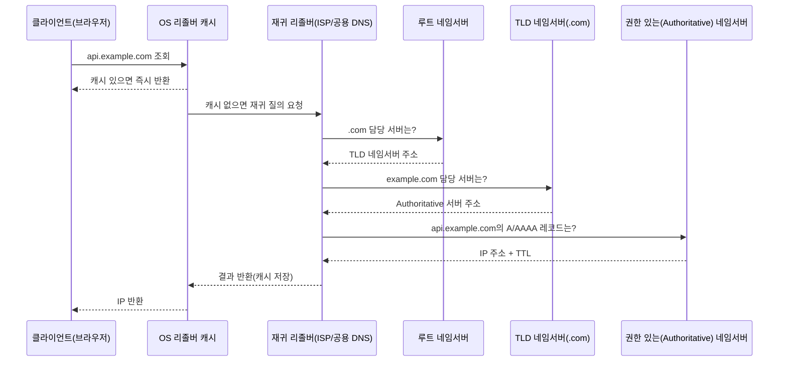

# DNS 조회 과정

## 핵심 정의
DNS(Domain Name System)는 사람이 읽을 수 있는 도메인 이름(예: `api.example.com`)을 IP 주소로 변환해주는 분산 데이터베이스이자 프로토콜이다. 계층적 네임스페이스(루트 → TLD → 도메인 → 서브도메인) 구조를 가지며, 각 계층을 담당하는 네임서버(name server)들이 재귀적/반복적 질의를 통해 최종 IP를 찾아준다.

DNS 조회(resolution)는 단순히 "이름을 IP로 바꾸는 것"을 넘어, 로드밸런싱(GSLB), 장애 조치(failover), CDN 라우팅 등 인프라 트래픽 제어의 첫 관문 역할을 한다.

## 동작 원리 / 구조

### 조회 흐름

- **재귀 질의(recursive query)**: 클라이언트 → 재귀 리졸버 구간. 리졸버가 최종 답을 찾을 때까지 대신 여러 서버를 순회한다.
- **반복 질의(iterative query)**: 재귀 리졸버 → 루트/TLD/Authoritative 구간. 위임을 받으면 다음 서버를 조회하고, 권한 있는 서버나 캐시에서 최종 답을 얻으면 조회를 끝낸다.
- 실제로는 각 단계에 캐시가 있어 대부분의 질의는 루트까지 가지 않고 리졸버 캐시나 ISP 캐시에서 끝난다.

### 주요 레코드 타입
| 타입 | 용도 |
|---|---|
| A | 도메인 → IPv4 |
| AAAA | 도메인 → IPv6 |
| CNAME | 도메인 → 다른 도메인(별칭) |
| MX | 메일 서버 지정 |
| TXT | 임의 텍스트(도메인 검증, SPF/DKIM 등) |
| NS | 해당 도메인을 관리하는 네임서버 |
| SOA | 존(zone)의 관리 정보(시리얼·갱신 주기·부정 캐시 TTL 계산용 MINIMUM 등) |

### TTL과 캐시
DNS 레코드의 TTL(Time To Live)은 일반적인 캐시 재사용 시간을 제한한다. TTL이 크면 조회 부하는 줄지만 변경 반영이 늦어지고, 작으면 재조회가 늘어난다. 다만 모든 클라이언트의 전환 완료 시각을 보장하지는 않는다. 애플리케이션의 별도 이름 해석 캐시·기존 연결이 남을 수 있고, RFC 8767의 serve-stale을 지원하는 리졸버는 권한 서버에서 갱신할 수 없을 때 만료된 데이터를 정책에 따라 응답할 수 있다.

### 부정 캐시와 새 레코드 생성

부정 캐시(Negative Cache)는 주소뿐 아니라 “없음”도 저장한다. RFC 2308에서 `NXDOMAIN`은 이름이 없다는 응답이고, `NODATA`는 이름은 있지만 요청한 타입의 레코드가 없다는 응답이다. 예를 들어 A는 있지만 AAAA가 없는 이름의 NODATA를 도메인 전체가 없다는 뜻으로 해석하지 않는다. 캐시 키도 NXDOMAIN은 이름·클래스, NODATA는 이름·타입·클래스로 구분한다.

권한 서버가 부정 응답에 담는 SOA의 TTL은 `min(SOA 레코드 TTL, SOA.MINIMUM)`으로 계산된다. 따라서 아직 없는 이름을 먼저 조회해 부정 응답이 캐시된 뒤 A 레코드를 생성하면, 새 A의 TTL을 짧게 설정해도 이전 부정 캐시가 즉시 사라지지 않는다. 신규 주소를 알리기 전에 레코드를 준비하고, 장애 진단에서는 권한 서버의 현재 답과 실제 애플리케이션이 사용하는 재귀 리졸버의 응답 코드·SOA 잔여 TTL을 비교한다. JVM의 실패 조회 캐시도 별도로 남을 수 있으므로 한 계층의 캐시만 지웠다고 전체 복구를 단정하지 않는다.

## 실무 관점
- **배포/장애 조치 시 TTL 전략**: 서버 IP를 바꾸거나 블루/그린 전환을 할 계획이 있다면 기존 TTL 이상 여유를 두고 TTL을 짧게(예: 60초) 낮춰두고 전환 후 다시 늘리는 방식을 쓴다. TTL을 낮추지 않고 IP를 바꾸면 일부 클라이언트가 옛 IP로 계속 요청을 보내 장애처럼 보일 수 있다.
- **CNAME과 루트 도메인 제약**: 루트 도메인(apex, `example.com`)에는 표준 DNS 스펙상 CNAME을 걸 수 없다(SOA/NS 레코드와 공존 불가). 로드밸런서나 CDN 앞단을 apex에 연결해야 할 때는 클라우드 벤더의 ALIAS/ANAME 레코드(Route53의 Alias 레코드 등)를 사용한다.
- **GSLB(Global Server Load Balancing)**: DNS 응답 시 지리적 위치, 상태 확인(health check) 결과에 따라 다른 IP를 반환해 리전 간 트래픽을 분산하거나 장애 리전을 제외하는 방식. Route53의 지연 시간 기반 라우팅, 가중치 기반 라우팅 등이 대표적이다.
- **흔한 장애 패턴**
  - DNS 전파 지연을 고려하지 않고 즉시 트래픽이 옮겨갈 것으로 가정 → 일부 사용자만 새 서버로 이동하는 현상.
  - 애플리케이션의 DNS 캐시·기존 연결 재사용 정책이 DNS 레코드 TTL과 다름 → JDK 25의 `InetAddress`는 `networkaddress.cache.ttl` 등 보안 속성으로 캐시를 제어하며 영구 캐시 설정도 가능하다. 배포된 JDK의 실제 정책과 HTTP connection pool 수명을 확인한다.
  - Authoritative 네임서버 단일 장애점(SPOF) — NS 레코드를 이중화하지 않아 해당 서버 다운 시 도메인 전체 조회 실패.
- **관련 설정/튜닝 포인트**: TTL 값 조정, NS 레코드 다중화, 헬스체크 기반 라우팅 정책, 클라이언트 측 DNS 캐시 TTL(JVM, OS resolver) 점검, DNS-over-HTTPS/TLS 적용 여부.

### 작은 조회만 성공하면 DNS의 TCP 경로도 확인한다

DNS는 UDP 전용이 아니다. RFC 7766은 범용 DNS 구현에 UDP와 TCP 지원을 요구하고, 처음부터 TCP로 조회하는 것도 허용한다. UDP 응답이 잘려 TC(truncated) 비트가 설정되면 TCP 재조회가 필요할 수 있다. DNSSEC 등으로 응답이 커지는 일부 조회만 실패한다면 캐시나 레코드 오타뿐 아니라 DNS 서버까지의 TCP 경로도 점검한다.

전통적인 DNS의 UDP 53만 열어둔 방화벽은 작은 응답 테스트를 통과해도 TCP 재조회를 막을 수 있다. 애플리케이션이 쓰는 리졸버와 그 리졸버의 상위 서버 구간을 구분하고, 응답의 TC·오류 코드와 실제 TCP 연결 성공을 확인한다. EDNS로 UDP 크기를 늘렸다는 사실만으로 TCP 지원이 불필요해지는 것은 아니다.

## 심화 Q&A

### Q. 재귀 질의와 반복 질의의 차이를 설명하고, 왜 이 구조가 필요한지 말해보라.
A. 클라이언트-리졸버 구간은 재귀(리졸버가 전 과정을 대신 수행하고 최종 답만 반환)이고, 리졸버-상위 네임서버 구간은 반복(각 서버가 "다음에 물어볼 곳"만 알려줌)이다. 만약 루트/TLD 서버까지 재귀 방식으로 동작한다면 전 세계 요청이 소수의 루트 서버에 집중되어 부하가 감당 불가능해진다. 반복 질의로 책임을 분산시키고, 재귀 리졸버 계층에 캐시를 두어 상위 서버 부하를 크게 줄이는 구조다.

### Q. TTL을 매우 짧게(예: 1초) 설정하면 어떤 문제가 생기는가?
A. 캐시를 공유하는 질의의 도착률에 따라 적중률이 낮아지고 권한 서버 재조회와 지연이 늘어날 수 있다. 짧은 TTL이라고 모든 HTTP 요청마다 권한 서버를 조회하는 것은 아니며, 리졸버의 캐시 공유·병합과 앱의 별도 캐시가 영향을 준다. TTL은 DNS 변경 반영 목표와 실제 질의량을 기준으로 정하고, 계획된 전환에서는 전환 예정 시각보다 기존 TTL 이상 앞서 낮춘다.

### Q. 애플리케이션에서 DNS 기반 로드밸런싱(라운드로빈 DNS)을 신뢰하기 어려운 이유는?
A. DNS 라운드로빈은 여러 IP를 순서를 바꿔가며 응답하는 방식인데, 클라이언트/OS/애플리케이션 각 단계의 캐싱 때문에 실제 분산 비율이 균등하지 않다. 또한 헬스체크 없이 죽은 IP도 그대로 반환하는 경우가 많아(별도 헬스체크 연동 서비스 제외) 장애 노드로 트래픽이 계속 흘러갈 수 있다. 이 때문에 실제 트래픽 분산과 장애 조치는 L4/L7 로드밸런서에 맡기고, DNS는 리전 단위의 큰 단위 라우팅이나 로드밸런서 자체를 가리키는 용도로 쓰는 것이 일반적이다.

### Q. JVM 애플리케이션에서 DNS 캐시로 인해 실제로 발생할 수 있는 장애 시나리오를 설명하라.
A. Java SE 25의 `InetAddress` 문서에서 성공 조회의 `networkaddress.cache.ttl` 기본 기간은 구현 의존적이며, `-1`은 영구 캐시다. 실패 캐시는 `networkaddress.cache.negative.ttl`, 만료된 주소 재사용은 `networkaddress.cache.stale.ttl`로 별도 제어한다. 과거 SecurityManager 기반 설명을 Java 25에 그대로 적용하지 않는다. RDS 등의 IP 변경에 대응하려면 사용 JDK의 보안 속성 설정과 HTTP/DB 연결 수명을 함께 확인하고, 조회 부하와 failover 요구에 맞게 캐시 기간을 정한다.

### Q. Anycast 방식의 DNS 서비스(예: 8.8.8.8, 1.1.1.1)는 일반 DNS 서버와 무엇이 다른가?
A. Anycast는 동일한 IP 주소를 전 세계 여러 위치에서 광고(announce)하고, BGP 라우팅이 클라이언트와 네트워크상 가장 가까운(혹은 최적 경로의) 노드로 트래픽을 자동으로 보내는 방식이다. 이 덕분에 단일 IP만으로도 지리적 부하 분산과 낮은 지연을 동시에 얻을 수 있고, 서비스 상태 감지와 경로 철회가 연동되어 있으면 특정 노드 장애 시 다른 노드로 우회할 수 있다. BGP 자체는 DNS 프로세스의 장애를 감지하지 않으며 경로 수렴에도 시간이 걸린다. 반면 일반적인 소규모 Authoritative 서버는 특정 리전에 고정된 IP를 가지므로 이런 이점이 없다.

### Q. 리버스 프록시나 로드밸런서 뒤에 있는 서버로 DNS만으로 트래픽을 전환하는 것과, 로드밸런서 설정으로 전환하는 것의 차이는?
A. DNS 전환은 TTL 만료 전까지 구버전 IP로 향하는 요청을 제어할 수 없어 전환이 점진적이고 예측이 어렵다(캐시를 무시하는 클라이언트도 존재). 반면 로드밸런서(L4/L7) 설정 변경은 로드밸런서의 VIP(가상 IP)는 그대로 유지한 채 뒷단 대상 그룹을 교체하므로 DNS 캐시 만료와 독립적으로 전환할 수 있다. 설정 전파, 기존 연결, draining 때문에 모든 요청이 즉시 바뀌는 것은 아니다. 그래서 실무에서는 도메인이 로드밸런서를 가리키게 고정해두고, 실제 배포/전환은 로드밸런서 대상 그룹 수준에서 처리하는 구조를 선호한다.

## 관련 개념
- [[L4와 L7 로드밸런싱]]
- [[리버스 프록시]]

## 참고 자료

- [RFC 1034: Domain Names](https://www.rfc-editor.org/rfc/rfc1034.html) — DNS 계층·재귀/반복 질의·CNAME·캐싱. 확인: 2026-09-08.
- [RFC 2308: Negative Caching](https://www.rfc-editor.org/rfc/rfc2308.html) — §4–5 SOA MINIMUM과 부정 캐시. 확인: 2026-09-08.
- [RFC 4786: Operation of Anycast Services](https://www.rfc-editor.org/rfc/rfc4786.html) — §4.4 서비스 상태와 경로 철회. 확인: 2026-09-08.
- [Java SE 25 InetAddress](https://docs.oracle.com/en/java/javase/25/docs/api/java.base/java/net/InetAddress.html) — 성공·실패·stale DNS 캐시 보안 속성. 확인: 2026-09-08.
- [Route 53 Alias records](https://docs.aws.amazon.com/Route53/latest/DeveloperGuide/resource-record-sets-choosing-alias-non-alias.html) — Alias와 zone apex 제약. 확인: 2026-09-08.

부분 재검증: 2026-09-22. [RFC 8767](https://www.rfc-editor.org/rfc/rfc8767.html)의 TTL 만료 데이터 응답 조건과 [JDK 25 InetAddress](https://docs.oracle.com/en/java/javase/25/docs/api/java.base/java/net/InetAddress.html)의 별도 이름 해석 캐시 정책을 대조했다. 그 외 서술은 이번 확인 범위 밖이므로 `verified`는 유지했다.

부분 재검증: 2026-09-23. [RFC 2308 §2–5](https://www.rfc-editor.org/rfc/rfc2308.html#section-2)의 NXDOMAIN/NODATA 구분, 부정 캐시 키와 SOA 기반 TTL 및 [JDK 25 InetAddress](https://docs.oracle.com/en/java/javase/25/docs/api/java.base/java/net/InetAddress.html)의 별도 실패 조회 캐시를 확인했다. 새 레코드 생성 뒤 실패가 남는 설명은 이 캐시 계약의 운영상 결과다. 리졸버별 캐시 상한·DNSSEC 부정 증명 재사용·실제 서비스 전환은 이번 검증 범위에 포함하지 않으며 기존 전체 `verified`는 유지한다.

부분 재검증: 2026-10-04. [RFC 7766 §4–5](https://www.rfc-editor.org/rfc/rfc7766.html)의 UDP 잘림·TCP 재조회·양 전송 지원 요구와 [OpenJDK jdk-25+36 DnsClient](https://raw.githubusercontent.com/openjdk/jdk/jdk-25%2B36/src/jdk.naming.dns/share/classes/com/sun/jndi/dns/DnsClient.java)의 truncated 응답 TCP 경로를 대조했다. JDK 25.0.4 JNDI DNS provider를 격리된 loopback 서버에 연결해 UDP TC=1 응답 후 TCP 질의 각 1회, A=127.0.0.2 수신을 실행 확인했다. OS/InetAddress 기본 리졸버·외부 DNS·DNSSEC 검증·방화벽 차단 시험으로 일반화하지 않으며 기존 캐시 계약 전체는 재검증하지 않아 `verified`를 유지했다.
