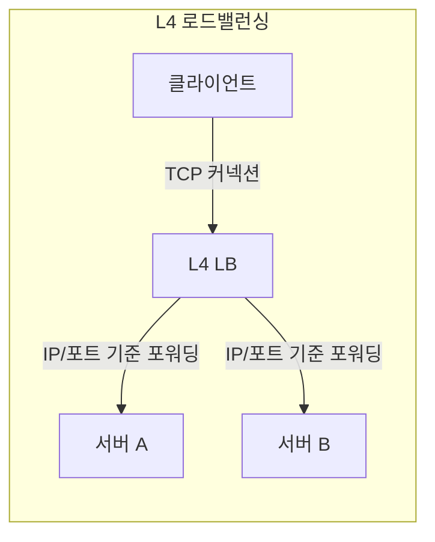
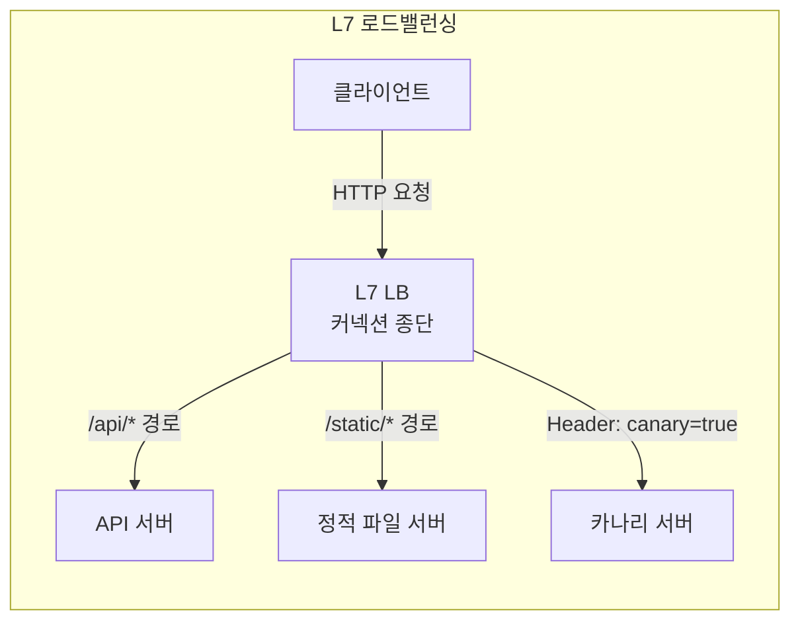

# L4와 L7 로드밸런싱

## 핵심 정의
로드밸런싱(Load Balancing)은 하나의 진입점(VIP, Virtual IP)으로 들어온 트래픽을 여러 백엔드 서버에 분산시키는 기술이다. OSI 7계층 모델을 기준으로 어느 계층의 정보를 보고 라우팅 결정을 내리느냐에 따라 L4(전송 계층)와 L7(애플리케이션 계층) 로드밸런싱으로 나뉜다.

L4 로드밸런서는 IP 주소와 포트, TCP/UDP 세그먼트 정보만 보고 트래픽을 전달(패킷 단위 포워딩에 가까움)하는 반면, L7 로드밸런서는 HTTP 요청의 URL 경로, 헤더, 쿠키, 메서드 등 애플리케이션 프로토콜 내용을 해석해서 더 정교한 라우팅을 수행한다.

## 동작 원리 / 구조

### 계층별 비교
| 구분 | L4 (Transport) | L7 (Application) |
|---|---|---|
| 참조 정보 | IP, 포트, TCP/UDP 헤더 | HTTP 메서드, URL, 헤더, 쿠키, 바디 |
| 처리 방식 | 연결/흐름 단위 전달(NAT·DSR 또는 TCP 프록시) | 요청을 종단(terminate)한 뒤 재구성해 전달 |
| 속도/오버헤드 | 낮은 오버헤드, 빠름 | 페이로드 파싱 필요, 상대적으로 느림 |
| 라우팅 기능 | 라운드로빈, IP 해시 등 단순 분산 | 경로 기반, 헤더 기반, 카나리, A/B 라우팅 |
| SSL 처리 | TLS passthrough 또는 종단(예: NLB TLS 리스너) | SSL Termination 후 재암호화 또는 평문 전달 |
| 대표 사례 | AWS NLB, LVS, HAProxy(TCP 모드), Kubernetes Service(kube-proxy) | AWS ALB, Nginx, HAProxy(HTTP 모드), Envoy, API Gateway |

### 요청 흐름 비교

- **L4**: 클라이언트와 서버 사이의 TCP 흐름을 NAT/DSR로 전달하거나 TCP 프록시로 종단하므로, 로드밸런서는 페이로드 내용을 몰라도 된다. Direct Server Return(DSR) 같은 방식은 응답 트래픽이 로드밸런서를 거치지 않고 바로 클라이언트로 나가게 해 처리량을 더 높인다.
- **L7**: 클라이언트와의 TCP/TLS 커넥션을 로드밸런서가 직접 종단(terminate)하고, 요청 내용을 해석한 뒤 백엔드의 별도 연결을 생성하거나 풀에서 재사용해 전달한다. 이 과정에서 헤더 추가(`X-Forwarded-For` 등), 압축, 캐싱, WAF 검사 같은 부가 기능을 넣을 수 있다.

gRPC는 HTTP/2 위의 애플리케이션 프로토콜이며 gRPC를 지원하는 L7 프록시로 RPC 단위 라우팅과 스트리밍 처리가 가능하다. L4/L7이라는 분류만으로 TLS 종단 여부, 헬스체크 프로토콜, 실제 성능을 단정하지 않는다. 예를 들어 NLB도 TLS 리스너와 HTTP/HTTPS 헬스체크를 지원한다.

## 실무 관점
- **선택 기준**
  - 애플리케이션 내용을 해석하지 않는 TCP/UDP 전달(게임 서버, DB 연결 등)이거나 초저지연/고처리량이 필요하면 L4.
  - HTTP(S) 기반 서비스에서 경로별 라우팅, 카나리 배포, 특정 헤더/쿠키 기반 라우팅, WAF 연동이 필요하면 L7.
  - 실무에서는 두 계층을 조합하는 경우가 많다(예: NLB로 1차 진입 후 내부에서 ALB/Nginx로 L7 라우팅).
- **SSL Termination의 트레이드오프**: L7에서 TLS를 종단하면 로드밸런서가 인증서 관리를 중앙화할 수 있어 운영이 편해지지만, 로드밸런서와 백엔드 사이 구간이 평문이면 내부망이라도 보안 요구사항(mTLS 등)을 다시 검토해야 한다.
- **세션 유지(Session Affinity/Sticky Session)**: L4는 보통 클라이언트 IP 기반 해시로, L7은 쿠키 기반으로 세션을 고정할 수 있다. 다만 스티키 세션은 특정 서버로 트래픽이 몰리는 불균형을 유발할 수 있어, 가능하면 애플리케이션을 무상태(stateless)로 만들고 세션을 Redis 등 외부 저장소로 분리하는 것이 근본적인 해결책이다.
- **헬스체크**: L4는 TCP 커넥션 성립 여부만 확인하는 경우가 많아 "포트는 열려 있지만 애플리케이션은 응답 불가" 상태를 못 잡을 수 있다. L7 헬스체크(특정 경로에 HTTP GET 후 상태 코드 확인)가 더 정확하지만, 헬스체크 엔드포인트가 DB 커넥션 풀 고갈 등으로 함께 느려지면 전체 노드가 연쇄적으로 제외되는 사고로 이어질 수 있다.
- **흔한 실수/장애 패턴**
  - L4 로드밸런서 뒤 서버에서 클라이언트 실제 IP를 그대로 로그에 남기려다 로드밸런서 IP만 찍히는 문제(L4는 NAT 방식에 따라 원본 IP 보존 여부가 다름, Proxy Protocol 활용 필요).
  - L7에서 `X-Forwarded-For` 헤더를 무조건 신뢰해 IP 기반 인증/레이트리밋을 우회당하는 보안 사고.
  - Keep-Alive 커넥션 재사용 설정 불일치로 커넥션 풀 고갈 또는 응답 지연 발생.
- **관련 설정/튜닝 포인트**: 헬스체크 간격/임계치, Idle Timeout, Connection Draining(Graceful shutdown 시 기존 커넥션 처리), Proxy Protocol 활성화, 로드밸런싱 알고리즘(라운드로빈, 최소 커넥션, 가중치, IP 해시) 선택.

### 가중 대상 그룹은 건강한 그룹으로의 자동 장애 전환을 뜻하지 않는다

AWS ALB의 weighted forward는 대상 그룹 사이에 가중치대로 트래픽을 배분한다. 한 그룹이 비어 있거나 그 안의 대상이 모두 비정상이 되어도, ALB는 그 몫을 건강한 다른 그룹으로 자동 전환하지 않는다. 따라서 카나리 그룹의 헬스체크 실패만으로 안정 버전 그룹이 모든 트래픽을 받는다고 가정하면 안 된다. 그룹별 오류·건강 상태를 관찰하고 중단 시 가중치나 리스너 규칙을 변경하는 복구 절차가 필요하다.

대상 그룹 고정(target group stickiness)을 사용하면 기존 쿠키에 의해 선택한 그룹으로 요청이 이어진다. 변경 뒤 새 쿠키가 없는 요청과 기존 쿠키가 있는 요청을 따로 시험해 실제 배분을 확인한다. 그룹 간 선택, 그룹 안의 대상 선택, 이미 처리 중인 연결의 종료를 서로 다른 단계로 진단한다.

## 심화 Q&A

### Q. 헬스체크에 실패한 대상은 항상 트래픽을 받지 않는가?
A. 제품과 실패 정책에 따라 다르다. AWS NLB는 모든 활성 가용 영역에서 전체 대상이 헬스체크에 실패하면 fail-open으로 동작해 비정상 대상을 포함한 등록 대상에 트래픽을 보낼 수 있다. 따라서 헬스체크 제외를 보안상 접근 차단이나 데이터 격리 수단으로 사용하면 안 된다. 공유 DB 장애를 모든 대상의 실패로 연결하는 정책은 이 동작까지 고려해 검증한다.

2026-09-23 AWS NLB 공식 가이드에서 HTTPS 헬스체크 대상이 TLS 1.3만 지원하면 검사에 실패하며 TLS 1.2 같은 이전 버전 지원이 필요하다고 명시한다. 이는 NLB의 해당 헬스체크 구현 제약이지 TLS 1.3이나 모든 L4 로드밸런서의 제약은 아니다. 실제 서비스 연결과 헬스체크의 프로토콜·Host 헤더·인증 조건을 별도로 확인한다.

### Q. L4 로드밸런서의 처리 비용이 L7보다 낮아질 수 있는 이유는? 어떤 상황에서 이 차이가 실제로 중요해지는가?
A. L4는 페이로드를 파싱하지 않고 헤더 정보만으로 포워딩 결정을 내리며, DSR 같은 구조에서는 응답 트래픽이 로드밸런서를 거치지 않아 CPU/대역폭 부담이 훨씬 적다. 반면 L7은 TCP/TLS를 종단하고 HTTP 메시지를 파싱한 뒤 백엔드의 별도 연결을 관리하므로 지연과 CPU 오버헤드가 늘어난다. 이 차이는 초당 수십만 커넥션 이상을 처리해야 하는 게임 서버, 실시간 스트리밍, 대규모 gRPC 트래픽에서 두드러지며, 이런 경우 L4(NLB 등)를 앞단에 두고 필요한 경로 라우팅만 내부 L7에 위임하는 구조를 쓴다.

### Q. L7 로드밸런서 뒤의 서버가 클라이언트의 진짜 IP를 알아야 할 때(레이트리밋, 지역 차단 등) 어떻게 처리하는가?
A. L7 로드밸런서는 `X-Forwarded-For`, `X-Real-IP` 같은 헤더에 원본 클라이언트 IP를 담아 백엔드로 전달한다. 다만 이 헤더는 클라이언트가 임의로 조작해 보낼 수 있으므로, 신뢰 경계(trust boundary)의 가장 바깥 로드밸런서에서 해당 헤더를 항상 덮어쓰도록 설정하고, 애플리케이션은 직접 연결한 peer부터 신뢰할 프록시 범위를 확인하고 X-Forwarded-For를 오른쪽부터 거슬러 올라가 첫 비신뢰 주소를 클라이언트로 판정해야 한다. 무조건 첫 값이나 마지막 값 하나를 택하지 않는다. L4의 경우 NAT 방식(SNAT)을 쓰면 원본 IP가 로드밸런서 IP로 바뀌어 버리므로, 이를 보존하려면 Proxy Protocol이나 DSR 구성이 필요하다.

### Q. 스티키 세션(Session Affinity)을 쓰면 로드밸런싱 관점에서 어떤 부작용이 생길 수 있는가?
A. 특정 클라이언트(또는 세션)를 항상 같은 서버로 보내기 때문에, 트래픽 패턴이 균등하지 않으면(특정 세션이 유난히 무거운 요청을 반복하는 경우 등) 서버 간 부하가 불균형해진다. 또한 스티키 세션이 걸린 서버가 재시작되거나 장애가 나면 해당 세션의 사용자는 로그인 세션 유실 등 경험 저하를 겪는다. 근본적으로는 세션 상태를 서버 로컬 메모리가 아니라 Redis 등 외부 스토어로 분리해 어떤 서버가 요청을 받아도 동일하게 응답할 수 있게 만드는 것이 더 견고한 해법이다.

### Q. 헬스체크를 L4(TCP 레벨)로만 구성했을 때 놓칠 수 있는 장애 상황을 예로 들어라.
A. 애플리케이션 프로세스가 살아있고 리스닝 포트도 열려 있지만, 스레드풀 고갈이나 DB 커넥션 풀 고갈, 데드락 등으로 실제 요청 처리가 멈춘 "좀비" 상태일 수 있다. TCP 헬스체크는 3-way handshake만 성공하면 정상으로 판단하므로 이런 상태를 잡아내지 못하고 계속 트래픽을 흘려보낸다. 반면 L7 헬스체크는 실제 애플리케이션 로직을 경유하는 엔드포인트(`/health`)에 HTTP 요청을 보내 상태 코드와 응답 시간을 확인하므로 이런 상황을 더 정확히 감지할 수 있다.

### Q. Connection Draining(또는 Graceful Deregistration)이 배포 과정에서 왜 중요한가?
A. 배포 시 로드밸런서 대상 그룹에서 구버전 인스턴스를 즉시 제거하면, 그 순간 처리 중이던 요청의 커넥션이 강제로 끊겨 클라이언트에 오류가 노출된다. Connection Draining은 해당 인스턴스를 새 트래픽 대상에서는 제외하되, 이미 맺어진 커넥션은 설정된 타임아웃 동안 정상 처리되도록 유예 시간을 주는 기능이다. 이 타임아웃을 애플리케이션의 최대 요청 처리 시간보다 짧게 잡으면 배포 중 요청이 중간에 끊기는 사고로 이어질 수 있다.

### Q. L4와 L7 로드밸런서를 계층적으로 함께 쓰는 구조(예: NLB 뒤에 ALB, 혹은 그 반대)는 각각 언제 유리한가?
A. NLB(L4)를 가장 바깥에 두고 그 뒤에 ALB(L7)를 두는 구조는 고정 IP나 초당 대량 커넥션 처리, PrivateLink 연동 같은 L4의 이점을 살리면서 내부적으로는 경로 기반 라우팅 같은 L7 기능을 함께 쓸 수 있다. 반대로 L7을 가장 바깥에 두고 그 뒤에서 L4 수준의 단순 포워딩만 필요하다면 굳이 이중 구조를 둘 필요는 없다. 일반적인 웹 서비스에서는 L7 하나로 충분하지만, 매우 높은 처리량이나 TLS passthrough가 필요한 트래픽이 섞여 있을 때 계층을 분리해 각 계층의 강점을 활용한다.

## 관련 개념
- [[리버스 프록시]]
- [[DNS 조회 과정]]

## 참고 자료

- [AWS Network Load Balancer](https://docs.aws.amazon.com/elasticloadbalancing/latest/network/introduction.html) — 연결 단위 라우팅·리스너·헬스체크. 확인: 2026-09-08.
- [Nginx realip module](https://nginx.org/en/docs/http/ngx_http_realip_module.html) — trusted proxy와 real_ip_recursive. 확인: 2026-09-08.
- [RFC 9110: HTTP Semantics](https://www.rfc-editor.org/rfc/rfc9110.html) — 프록시·메시지 의미. 확인: 2026-09-08.

부분 재검증: 2026-09-23. [AWS NLB target group health checks](https://docs.aws.amazon.com/elasticloadbalancing/latest/network/target-group-health-checks.html)의 전체 대상 실패 시 fail-open·HTTPS 검사 TLS 버전 제약을 확인했다. AWS 관리형 서비스의 조회일 기준 동작이며 다른 제품과 성능 수치는 이번 범위 밖이므로 `verified`는 유지했다.

부분 재검증: 2026-10-04. [AWS ALB listener action types — Forward actions](https://docs.aws.amazon.com/elasticloadbalancing/latest/application/rule-action-types.html)의 비어 있거나 전체 unhealthy인 가중 그룹에 대한 자동 failover 부재·target group stickiness를 확인했다. 적용 범위는 ALB weighted target groups이며 모든 로드밸런서 알고리즘의 공통 규칙이 아니다. 실제 가중치 변경·쿠키·실패 대상 전환 시험은 하지 않았고 `verified`는 유지했다.
