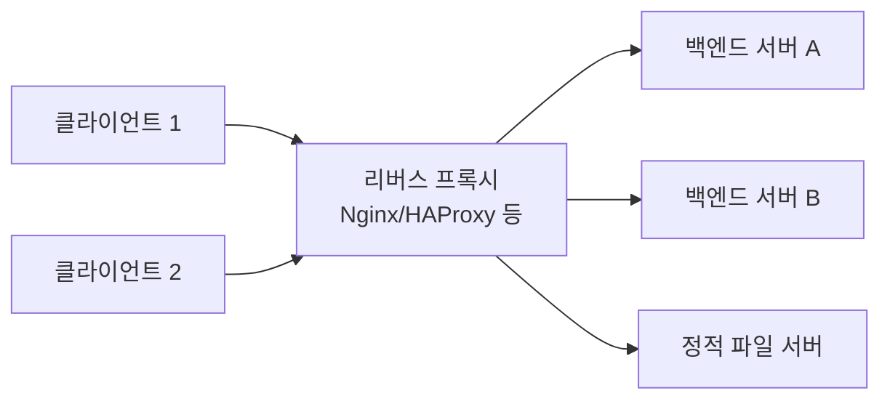

# 리버스 프록시

## 핵심 정의
리버스 프록시(Reverse Proxy)는 클라이언트와 백엔드 서버 사이에서 클라이언트의 요청을 대신 받아 내부 서버로 전달하고, 그 응답을 다시 클라이언트에게 돌려주는 서버다. 클라이언트 입장에서는 실제 백엔드 서버가 몇 대인지, 어디에 있는지 알 필요 없이 리버스 프록시만 상대하면 된다.

포워드 프록시(Forward Proxy)가 "클라이언트를 대신"해서 외부 서버에 요청하는 것과 달리, 리버스 프록시는 "서버를 대신"해서 클라이언트의 요청을 받는다는 점이 핵심 차이다.

## 동작 원리 / 구조



리버스 프록시는 L7 로드밸런싱과 개념적으로 겹치는 부분이 많지만, 초점이 조금 다르다.
- **로드밸런서**: "여러 서버 중 어디로 보낼지 분산"에 초점.
- **리버스 프록시**: "클라이언트에게 백엔드 구조를 숨기고 대신 응답"하는 데 초점(로드밸런싱, 캐싱, SSL Termination, 압축, 요청/응답 변조 등을 포함하는 더 넓은 개념).

실제로 Nginx, HAProxy, Envoy 같은 도구는 리버스 프록시이면서 동시에 L7 로드밸런서 역할도 함께 수행한다.

### 대표 기능
| 기능 | 설명 |
|---|---|
| 로드밸런싱 | 여러 백엔드 서버로 요청 분산 |
| SSL Termination | 클라이언트-프록시 구간 TLS 처리, 내부 통신 부담 경감 |
| 캐싱 | 정적 리소스나 응답을 프록시 레벨에서 캐싱해 백엔드 부하 감소 |
| 압축 | Gzip/Brotli 등 응답 압축을 프록시가 대신 처리 |
| 요청 라우팅 | 경로/호스트 기반으로 서로 다른 백엔드로 분기 |
| 보안 | 백엔드 IP/구조 은닉, WAF 연동, Rate Limiting |
| 원본 요청 정보 헤더 삽입 | `X-Forwarded-For`, `X-Real-IP`, `X-Forwarded-Proto` 추가 |

### Nginx 리버스 프록시 예시

인터넷 클라이언트가 이 NGINX에 직접 연결하고, 공개 주소는 `https://api.example.com:443` 하나이며, 백엔드는 이 프록시에서만 접근할 수 있는 구성을 전제로 한다. 앞선 로드밸런서가 있거나 여러 공개 호스트·경로 접두사를 사용하면 신뢰 체인과 재작성 값을 그 구성에 맞게 정해야 한다.

```nginx
server {
    listen 443 ssl;
    server_name api.example.com;
    ssl_certificate /etc/nginx/tls/fullchain.pem;
    ssl_certificate_key /etc/nginx/tls/privkey.pem;

    location /v1/ {
        proxy_pass http://backend_pool;
        proxy_set_header Host api.example.com; # 이 라우트의 고정 공개 호스트
        proxy_set_header X-Real-IP $remote_addr;
        proxy_set_header X-Forwarded-For $remote_addr; # 인터넷 진입점에서 외부 입력 제거
        proxy_set_header X-Forwarded-Proto $scheme;
        proxy_set_header Forwarded "";
        proxy_set_header X-Forwarded-Host "";
        proxy_set_header X-Forwarded-Port "";
        proxy_set_header X-Forwarded-Ssl "";
        proxy_set_header X-Forwarded-Prefix "";
    }
}

upstream backend_pool {
    server 10.0.0.11:8080;
    server 10.0.0.12:8080;
}
```

NGINX는 별도로 제거하지 않은 요청 헤더를 기본적으로 전달하므로, 예제는 외부 `Forwarded`·`X-Forwarded-Host`·`X-Forwarded-Port`·`X-Forwarded-Ssl`·`X-Forwarded-Prefix`를 빈 값 지시어로 제거한다. `Host`도 클라이언트 요청에서 얻는 `$host` 대신 이 라우트의 공개 호스트로 고정했다. 애플리케이션에 별도 host·port·prefix 정보가 필요하면 해당 프록시의 검증된 라우팅 정보로 재생성한다.

Spring Framework 7.0.9의 무인자 `ForwardedHeaderFilter`는 표준 `Forwarded`를 먼저 해석하고, 이것이 없으면 `X-Forwarded-*`를 해석한다. 따라서 X-Forwarded-For/Proto만 정제하고 위 제거 설정을 빠뜨리면 외부 입력으로 호스트·스킴·클라이언트 주소가 달라질 수 있다. 헤더군을 선택하는 생성자를 사용해도 선택한 헤더군 자체가 외부에서 위조되지 않았다는 검증은 별도로 필요하다. 필터가 해석 후 헤더를 숨기는 동작도 이미 적용한 값을 되돌리는 보안 정제가 아니다.

## 실무 관점
- **Spring Boot 애플리케이션 앞단**: 대부분의 실무 배포에서 Spring Boot(내장 Tomcat/Netty)는 직접 인터넷에 노출되지 않고 Nginx나 클라우드 로드밸런서(ALB) 뒤에 위치한다. 이때 애플리케이션이 `X-Forwarded-*` 헤더를 신뢰하도록 `server.forward-headers-strategy=native`(또는 `framework`) 설정을 해줘야 `HttpServletRequest.getRemoteAddr()`나 `isSecure()`가 올바른 값을 반환한다. 이 설정을 빠뜨리면 리다이렉트 URL이 `http`로 나가거나, 접속 IP 로그가 전부 프록시 IP로만 찍히는 문제가 흔하게 발생한다.
- **정적 리소스 분리**: 이미지, JS/CSS 같은 정적 파일은 리버스 프록시(또는 CDN)에서 직접 서빙하거나 캐싱해 애플리케이션 서버 부하를 줄이는 것이 일반적이다.
- **보안 계층 분리**: 리버스 프록시에서 TLS 종단, 기본적인 요청 검증(URL 길이 제한, 헤더 크기 제한), Rate Limiting을 처리하면 애플리케이션 코드는 비즈니스 로직에 집중할 수 있다.
- **흔한 실수/장애 패턴**
  - `proxy_read_timeout`을 응답 읽기 사이의 무응답 간격 제한(문서 기본값 60초)으로 이해하지 못하고 오래 걸리는 API(파일 업로드, 배치 조회)를 그대로 노출해 프록시 단계에서 504 Gateway Timeout이 발생.
  - 프록시와 백엔드 간 지속 연결이 비활성화된 구성에서 매 요청마다 TCP 커넥션을 새로 맺어 성능 저하.
  - `Host` 헤더를 전달하지 않아 백엔드에서 가상 호스트 기반 라우팅이나 도메인 검증 로직이 오작동.
  - 클라이언트 요청 바디 크기 제한(`client_max_body_size` 등)을 애플리케이션과 프록시에서 다르게 설정해, 프록시는 통과시켰는데 애플리케이션에서 거부하거나 그 반대의 불일치가 발생.
- **관련 설정/튜닝 포인트**: `proxy_pass`/`proxy_set_header`, 타임아웃(connect/read/send), Keep-Alive 커넥션 풀 크기, 버퍼 크기(`proxy_buffering`), Gzip/Brotli 압축, Rate Limiting(`limit_req`), 헬스체크 및 재시도(`proxy_next_upstream`).

### 전달 헤더는 최종 location의 상속 결과를 확인한다

NGINX의 `proxy_set_header`는 현재 설정 단계에 해당 지시어가 하나도 없을 때만 상위 단계의 설정을 상속한다. 상위 `server`에서 신뢰할 전달 헤더를 정의했더라도, 하위 `location`에 `proxy_set_header X-Request-ID ...` 하나를 추가하면 상위의 명시적 `X-Forwarded-For`·`X-Forwarded-Proto` 설정까지 자동으로 합쳐지지 않는다. 이때 헤더의 실제 전달 결과는 해당 단계의 설정과 기본 동작에 따라 달라지므로 상위의 보안 처리가 남아 있다고 가정하면 안 된다.

헤더를 재정의하는 location마다 필요한 전체 설정을 공통 include 등으로 적용하고, `nginx -T`의 최종 구성과 실제 백엔드 수신값을 대조한다. 구성 출력에는 민감한 설정이 포함될 수 있으므로 공유 전 확인한다. 외부 클라이언트가 위조한 전달 헤더를 넣었을 때 신뢰 경계에서 의도대로 덮어쓰거나 제거하는지, 새 경로와 예외 location에서도 같은지 확인한다.

## 심화 Q&A

### Q. 포워드 프록시와 리버스 프록시의 차이를 보안 관점에서 설명하라.
A. 포워드 프록시는 클라이언트 편에 서서 클라이언트의 신원과 내부망 구조를 외부로부터 숨기는 데 쓰인다(사내망에서 외부 사이트 접속 시 프록시를 거치는 경우). 반대로 리버스 프록시는 서버 편에 서서 실제 백엔드 서버의 개수, IP, 내부 아키텍처를 클라이언트로부터 숨기고, 외부 공격이 직접 애플리케이션 서버에 닿지 못하게 하는 방어선 역할을 한다. 두 경우 모두 "프록시가 누구를 대신하는가"의 관점에서 반대 방향을 향한다.

### Q. 리버스 프록시에서 SSL Termination을 수행한 뒤 백엔드와는 평문(HTTP)으로 통신하는 구성의 위험성과 완화 방법은?
A. 프록시-백엔드 구간이 평문이면, 같은 네트워크(VPC, 서브넷)에 침투한 공격자가 트래픽을 스니핑하거나 조작할 수 있는 위험이 생긴다. 완화 방법으로는 해당 구간을 프라이빗 네트워크로 격리하고 보안 그룹/네트워크 ACL로 접근을 제한하거나, 민감도가 높은 환경에서는 프록시-백엔드 구간도 별도 인증서로 재암호화(TLS Re-encryption)하거나 mTLS를 적용하는 방법이 있다. 트레이드오프는 재암호화 시 인증서 관리 부담과 약간의 성능 오버헤드가 늘어난다는 점이다.

### Q. 리버스 프록시가 있는 환경에서 애플리케이션이 `X-Forwarded-For` 헤더를 무조건 신뢰하면 어떤 문제가 생기는가?
A. 클라이언트가 직접 `X-Forwarded-For` 헤더를 조작해 보내면, 신뢰 가능한 프록시가 실제로 덧붙인 값인지 클라이언트가 임의로 넣은 값인지 애플리케이션이 구분할 수 없다. IP 기반 인증, 지역 차단, Rate Limiting을 이 헤더 값에만 의존하면 공격자가 임의의 IP를 자칭해 우회할 수 있다. 안전한 방법은 신뢰 경계의 가장 바깥 프록시에서 해당 헤더를 항상 덮어쓰게 설정하고, 애플리케이션은 직접 연결한 peer와 신뢰하는 프록시 범위를 바탕으로 체인을 해석하는 것이다. Spring의 forwarded-header 처리를 활성화하는 것만으로 임의 프록시가 신뢰 가능해지지 않는다. 신뢰 경계에서 외부 헤더를 제거하고 백엔드 직접 접근을 제한해야 한다.

### Q. 리버스 프록시 단계의 타임아웃과 애플리케이션(WAS) 단계의 타임아웃을 다르게 설정했을 때 발생할 수 있는 불일치 상황을 설명하라.
A. 백엔드가 응답 헤더를 보내기 전의 무응답 시간이 `proxy_read_timeout`을 넘으면, 애플리케이션이 처리 중이어도 프록시가 먼저 연결을 끊고 504를 반환할 수 있다. 이 경우 애플리케이션 로그에는 요청이 정상 완료된 것으로 보이는데 클라이언트는 오류를 받는 혼란스러운 상황이 발생한다. 반대로 프록시 타임아웃이 지나치게 길면, 응답 불가 상태의 백엔드에 대한 커넥션이 오래 유지되어 프록시의 커넥션 자원을 고갈시킬 수 있다. 애플리케이션의 전체 처리 deadline, 프록시의 읽기 간 무응답 제한, 호출자의 전체 timeout을 구분해 예산을 배분한다. 스트리밍 응답은 데이터가 계속 오면 proxy_read_timeout보다 오래 지속될 수 있으며, 프록시 연결 종료가 진행 중인 DB 작업의 취소를 보장하지는 않는다.

### Q. 리버스 프록시가 캐싱까지 담당할 때, 인증이 필요한 개인화된 응답을 잘못 캐싱하면 어떤 사고가 나는가?
A. `Cache-Control`, `Vary` 헤더 설정이 부정확한 상태에서 프록시가 응답을 캐싱하면, 한 사용자에게 개인화되어 내려간 응답(예: 로그인한 사용자 정보, 인증 토큰이 포함된 페이지)이 캐시 키가 겹치는 다른 사용자에게 그대로 노출될 수 있다. 개인화 응답은 공유 캐시를 금지하는 `private`, 저장 자체를 금지하는 `no-store`를 필요에 맞게 사용한다. RFC 9111에서 `Authorization` 요청의 응답은 기본적으로 공유 캐시에서 재사용할 수 없지만 `public`, `s-maxage`, `must-revalidate` 등 명시적인 예외와 그 조건이 있다. 쿠키만으로 인증하는 요청에 이 Authorization 규칙이 자동 적용되지는 않는다. `Vary`는 표현 선택에 쓰이는 요청 헤더를 캐시 키에 반영하는 장치이지 인가나 안전한 개인정보 캐싱을 보장하는 장치가 아니다. 프록시의 강제 캐시 설정·우회 조건도 확인한다.

### Q. 리버스 프록시와 L7 로드밸런서의 기능이 겹치는데, 실무에서 굳이 둘을 나눠서 두는 경우는 어떤 이유 때문인가?
A. 클라우드 환경에서는 관리형 L7 로드밸런서(ALB 등)로 TLS 종단과 기본 라우팅/헬스체크를 처리하고, 그 뒤에 Nginx 같은 리버스 프록시를 두어 애플리케이션에 특화된 세부 로직(정적 파일 서빙, 세밀한 캐싱 정책, 특정 경로 재작성(rewrite), 사이드카 패턴)을 담당하게 하는 구성이 흔하다. 이렇게 역할을 분리하면 로드밸런서는 인프라 팀이, 리버스 프록시 설정은 애플리케이션 팀이 각자 관리 범위를 나눠 가져갈 수 있고, 관리형 로드밸런서의 가용성 이점과 리버스 프록시의 세밀한 커스터마이징을 동시에 취할 수 있다. 다만 계층이 늘어난 만큼 타임아웃/헤더 전달 정합성을 양쪽에서 맞춰야 하는 복잡도는 트레이드오프로 남는다.

## 관련 개념
- [[L4와 L7 로드밸런싱]]
- [[DNS 조회 과정]]
- [[Nginx 리버스 프록시 설정]]

## 참고 자료

- [Nginx proxy module](https://nginx.org/en/docs/http/ngx_http_proxy_module.html) — proxy_pass·헤더·buffering·timeout. 확인: 2026-09-08.
- [Nginx realip module](https://nginx.org/en/docs/http/ngx_http_realip_module.html) — 프록시 신뢰 체인. 확인: 2026-09-08.
- [Spring Boot Web Servers](https://docs.spring.io/spring-boot/how-to/webserver.html) — 4.1.1 문서의 forwarded headers 처리; 개별 컨테이너의 신뢰 설정 확인. 확인: 2026-09-08.
- [RFC 9111: HTTP Caching](https://www.rfc-editor.org/rfc/rfc9111.html) — 인증 요청·private·no-store·Vary. 확인: 2026-09-08.

부분 재검증: 2026-09-22. [RFC 9111 §3.5·§4.1·§5.2](https://www.rfc-editor.org/rfc/rfc9111.html)의 인증 요청 공유 캐시 예외, Vary, private/no-store 의미를 대조했다. 노트 전체의 버전 의존 서술을 재검증한 것은 아니므로 `verified`는 유지했다.

부분 재검증: 2026-10-04. [NGINX proxy_set_header](https://nginx.org/en/docs/http/ngx_http_proxy_module.html#proxy_set_header)의 설정 단계별 상속 조건을 [NGINX 1.28.0 모듈 소스](https://raw.githubusercontent.com/nginx/nginx/release-1.28.0/src/http/modules/ngx_http_proxy_module.c)의 headers_source 병합과 대조했다. 적용 범위는 HTTP proxy 모듈의 헤더 설정이며 다른 프록시 제품의 상속 규칙으로 일반화하지 않는다. 실제 NGINX 구성 로드·헤더 전달 시험은 하지 않았고 `verified`는 유지했다.

부분 재검증: 2026-10-04. 위 NGINX 공식 문서의 proxy_pass_request_headers 기본 on·빈 proxy_set_header 값의 제거·Host 재작성·읽기 간 무응답 제한 계약과 [Spring Framework 7.0.9 ForwardedHeaderFilter 소스](https://github.com/spring-projects/spring-framework/blob/v7.0.9/spring-web/src/main/java/org/springframework/web/filter/ForwardedHeaderFilter.java)를 대조했다. JDK 25.0.4·Spring 7.0.9 모의 Servlet 요청으로 정제되지 않은 Forwarded 우선 적용, 남은 X-Forwarded-Host/Port/Prefix 적용, 전체 외부 전달 헤더 제거 후의 대조값, X 헤더군 선택과 removeOnly를 6개 사례로 확인했다. 실제 NGINX·Boot 자동 설정·Tomcat native 처리·외부 네트워크 요청은 실행하지 않았고 `verified`는 유지한다.

부분 재검증: 2026-10-04. [NGINX upstream keepalive](https://nginx.org/en/docs/http/ngx_http_upstream_module.html#keepalive)의 1.29.7 이후 기본 활성화 계약을 확인했다. 설정 생략을 곧바로 지속 연결 비활성화로 해석하지 않도록 장애 패턴의 전제를 좁혔으며, 실제 버전별 NGINX 실행 시험은 하지 않았다.
