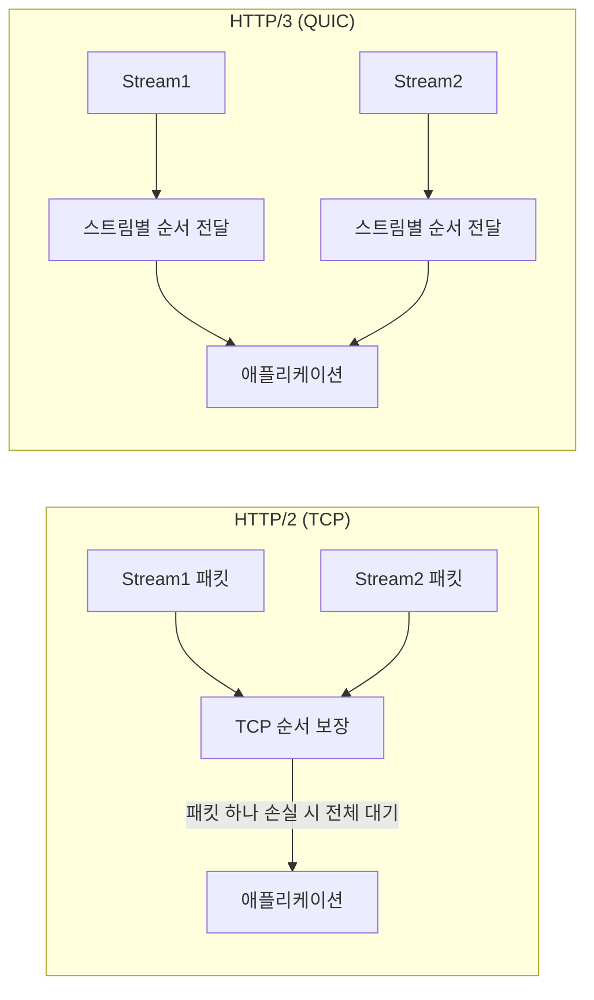

# HTTP 1.1과 HTTP 2 HTTP 3 비교

## 핵심 정의
HTTP/1.1, HTTP/2, HTTP/3은 같은 애플리케이션 계층 프로토콜의 서로 다른 버전으로, 전송 방식과 멀티플렉싱(multiplexing) 구조가 근본적으로 다르다. HTTP/1.1은 텍스트 기반 요청-응답을 TCP 연결 위에서 순차적으로(또는 파이프라이닝으로) 처리하고, HTTP/2(RFC 9113)는 하나의 TCP 연결 위에서 바이너리 프레임(frame)을 이용해 여러 요청/응답을 동시에 주고받는다. HTTP/3(RFC 9114)은 전송 계층 자체를 TCP에서 QUIC(RFC 9000, UDP 기반)으로 교체하여 TCP 레벨의 헤드 오브 라인 블로킹(Head-of-Line Blocking, HOL blocking)까지 해결한 버전이다. 적용 명세는 HTTP/1.1 RFC 9112, HTTP/2 RFC 9113, HTTP/3 RFC 9114다.

## 동작 원리 / 구조

### 버전별 핵심 차이 표

| 항목 | HTTP/1.1 | HTTP/2 | HTTP/3 |
|---|---|---|---|
| 전송 계층 | TCP | TCP | QUIC (UDP 기반) |
| 데이터 형식 | 텍스트 | 바이너리 프레임 | 바이너리 프레임(QUIC 스트림) |
| 멀티플렉싱 | 없음(연결당 1요청, 파이프라이닝은 사실상 미사용) | 스트림(stream) 단위 멀티플렉싱 | QUIC 스트림 단위 멀티플렉싱 |
| HOL 블로킹 | 있음(연결 레벨) | TCP 레벨에서 존재(패킷 손실 시 전체 스트림 지연) | TCP의 스트림 간 순서 대기는 제거; 같은 스트림·QPACK 대기는 가능 |
| 헤더 압축 | 없음(매 요청 전체 헤더 전송) | HPACK | QPACK |
| 연결 설정 | TCP 3-way handshake + TLS handshake | TCP 3-way handshake + TLS handshake | QUIC 자체 handshake(TLS 1.3 내장, 1-RTT, 재접속 시 0-RTT) |
| 서버 푸시 | 없음 | 스펙상 있음; Chrome 106에서 비활성화 | 스펙상 있음(RFC 9114 §4.6); 실제 지원 별도 확인 |
| 연결 마이그레이션 | 불가(IP 바뀌면 재연결) | 불가 | 가능(Connection ID 기반, 네트워크 전환에도 연결 유지) |
| 우선순위 지정 | RFC 9218 Priority 헤더 사용 가능 | RFC 9113에서 기존 의존성 트리 방식 폐기 권고; RFC 9218 사용 가능 | RFC 9218 Priority 헤더·PRIORITY_UPDATE 사용 가능 |

### HOL 블로킹의 위치 차이

HTTP/2는 애플리케이션 레벨에서는 여러 스트림을 멀티플렉싱하지만, 그 아래 TCP는 바이트 스트림을 순서대로 전달해야 하므로 한 패킷이 유실되면 그 뒤에 도착한 다른 스트림의 패킷도 재전송될 때까지 커널 버퍼에서 대기한다. QUIC은 스트림별 바이트 오프셋으로 순서를 관리해 손실되지 않은 다른 스트림의 데이터를 전달할 수 있다. 패킷 번호·ACK·손실 탐지는 패킷 번호 공간 단위이고 혼잡 제어는 연결 경로가 공유하므로, 손실에 따른 전송률 감소는 다른 스트림에도 영향을 줄 수 있다.

### 연결 수립 비교 (개략)
- HTTP/1.1 + TLS 1.2: TCP 3-way handshake(1-RTT) + TLS handshake(2-RTT) = 최소 3-RTT
- HTTP/2 + TLS 1.3: TCP 3-way handshake(1-RTT) + TLS 1.3 handshake(1-RTT) = 최소 2-RTT
- HTTP/3(QUIC + TLS 1.3 내장): 초기 연결 1-RTT, 재접속 시 세션 재개로 0-RTT 가능(단, 재생 공격 위험 때문에 안전한 요청도 애플리케이션 의미를 검토해 제한)

## 실무 관점

### 멀티플렉싱과 흐름 제어의 경계

HTTP/2의 `DATA` 프레임은 스트림별 윈도우와 연결 전체 윈도우를 모두 만족해야 전송할 수 있다. 스트림 하나의 윈도우만 소진되면 다른 스트림은 진행할 수 있지만, 연결 윈도우가 소진되면 그 연결의 다른 스트림도 데이터를 보내지 못한다. 이것은 TCP 패킷 손실로 생기는 HOL과 다른 대기 원인이다. 프록시를 통과하면 각 연결 구간이 독립적으로 흐름 제어를 수행한다.

따라서 지연을 조사할 때 네트워크 손실뿐 아니라 수신 애플리케이션의 소비 속도, 프록시 버퍼, 동시 스트림 한도도 확인한다. 헤더·제어 프레임은 `DATA` 흐름 제어 대상이 아니므로 데이터 윈도우 제한만으로 요청 수·헤더 처리 비용까지 제한할 수는 없다.

RFC 9218의 우선순위 정보는 서버가 자원을 배분하는 데 쓰는 힌트다. HTTP 버전을 올렸다는 이유만으로 우선순위 지원이나 처리 순서·지연시간이 보장되지는 않는다.

- HTTP/2 도입만으로도 일부 브라우저의 origin당 HTTP/1.1 병렬 연결 수 제한에 따른 병목(도메인 샤딩 관행)이 사라지므로, 프론트엔드에서 관행적으로 해오던 스프라이트 이미지 병합, 도메인 샤딩(domain sharding), 파일 번들링 같은 HTTP/1.1 시대 최적화 기법 상당수가 오히려 역효과를 낼 수 있다.
- Spring Boot는 지원되는 내장 서버(Tomcat/Netty 등; Boot 버전별 목록 확인)를 통해 HTTP/2를 지원하며, `server.http2.enabled=true`로 설정하며 h2c도 가능하다(대부분의 브라우저가 HTTP/2를 TLS 위에서만 협상하므로 사실상 HTTPS가 전제). HTTP/3(QUIC/UDP)은 JVM 서블릿 컨테이너 레벨에서의 직접 지원이 아직 제한적이라, 실무에서는 Nginx/Cloudflare/CDN 같은 엣지 계층에서 HTTP/3을 종단하고 백엔드로는 HTTP/1.1이나 HTTP/2로 전달하는 구성이 흔하다.
- QUIC은 UDP 기반이라 일부 기업 방화벽/프록시가 UDP 443을 차단하는 경우가 있어, 클라이언트가 HTTP/3 협상에 실패하면 HTTP/2 또는 HTTP/1.1로 폴백(fallback)할 수 있도록 TCP 기반 서비스도 유지한다. `Alt-Svc`는 대체 엔드포인트 광고이며 폴백 시간·병렬 시도는 클라이언트 구현에 달려 있다.
- HTTP/2 서버 푸시(server push)는 Chrome 106에서 비활성화되었다. 명세의 기능 존재와 브라우저·서버 구현 지원을 구분해야 하며, 리소스 발견 지연을 줄일 때 `103 Early Hints`와 `preload`도 검토한다.
- 모바일 환경에서 QUIC의 연결 마이그레이션(connection migration)은 와이파이-셀룰러 전환 시 TCP처럼 연결이 끊기지 않고 유지되는 실질적 이점을 준다. 실시간 스트리밍/화상회의 서비스에서 체감 효과가 크다.
- 로드밸런서/CDN 앞단에서 HTTP/2 멀티플렉싱을 쓸 때, 백엔드가 커넥션 풀을 재사용하지 못하고 스트림마다 별도 스레드를 만드는 구현이면 오히려 오버헤드가 늘 수 있으니 리버스 프록시 설정(keepalive, connection reuse)을 함께 점검해야 한다.

## 심화 Q&A

### Q. HTTP/2의 멀티플렉싱이 있는데도 왜 HTTP/3이 별도로 필요했는가?
HTTP/2의 멀티플렉싱은 애플리케이션 계층(스트림)에서만 이루어지고, 그 아래 TCP는 여전히 단일 순서 보장 바이트 스트림이다. 패킷 유실이 발생하면 TCP는 그 패킷을 재전송받을 때까지 이후 도착한 모든 바이트(다른 스트림의 데이터 포함)를 애플리케이션에 넘기지 않는다. 이 TCP 레벨 HOL 블로킹은 HTTP/2 설계로는 해결할 수 없고, 전송 계층 자체를 스트림 인식형(QUIC)으로 바꿔야만 해결된다.

### Q. QUIC이 UDP 위에 있다면 신뢰성(reliability)은 어떻게 보장하는가?
QUIC은 UDP의 비신뢰성 위에 자체적으로 시퀀스 번호, 확인응답(ACK), 재전송, 흐름 제어(flow control), 혼잡 제어(congestion control)를 구현한다. QUIC 구현은 이를 통해 스트림별 순서 전달과 연결 수준 손실 복구를 제공한다. 사용자 공간 라이브러리로 구현할 수 있다는 점은 커널 TCP와 독립적인 배포에 도움이 된다.

### Q. HTTP/3의 0-RTT는 왜 멱등 요청에만 권장되는가?
0-RTT는 이전 세션의 사전 공유 키(PSK)를 이용해 첫 패킷에 애플리케이션 데이터까지 실어 보내는데, 이 데이터는 재전송 공격(replay attack)에 노출된다. 공격자가 캡처한 0-RTT 패킷을 그대로 재전송하면 서버가 동일 요청을 다시 처리하게 되므로, 결제 생성 같은 비멱등 POST에 0-RTT를 쓰면 중복 처리 위험이 있다. 멱등성만으로 재생 안전성이 보장되지는 않는다. GET도 실제 부작용·개인정보·재생 시점을 평가하고, 위험한 요청은 early data를 거부해 425 Too Early 이후 handshake 완료 상태에서 재시도한다.

### Q. HPACK에서 QPACK으로 헤더 압축 방식이 바뀐 이유는 무엇인가?
HPACK은 하나의 동적 테이블(dynamic table)을 스트림 간에 순서대로 갱신하는 구조라, 헤더 압축 상태 자체가 스트림 순서에 의존한다. TCP처럼 순서가 보장되는 환경에서는 문제없지만, QUIC은 스트림이 독립적으로 도착할 수 있어 HPACK을 그대로 쓰면 헤더 압축 때문에 다시 HOL 블로킹이 생긴다. QPACK은 테이블 갱신과 확인을 전용 스트림으로 분리하고 SETTINGS_QPACK_BLOCKED_STREAMS로 차단될 수 있는 스트림 수를 제한한다. 아직 도착하지 않은 동적 테이블 항목을 참조하면 해당 헤더 해석이 대기할 수 있으므로 HOL을 완전히 제거하는 것은 아니다.

### Q. 회사 네트워크에서 UDP 443이 막혀 있으면 실제로 어떤 현상이 나타나고, 어떻게 대응하는가?
브라우저는 QUIC 연결 실패 시 TCP 기반 HTTP 연결로 폴백하거나 두 연결을 경쟁시킬 수 있다. 지연과 실패 캐싱 정책은 브라우저 구현·네트워크에 따라 달라 고정 수백 ms로 단정하지 않는다. `Alt-Svc`의 `ma`는 대체 서비스 광고의 유효기간이며 실패 타임아웃 자체를 지정하지 않는다. CDN에서 HTTP/3과 TCP 기반 HTTP를 함께 제공하고 실제 클라이언트로 차단 환경을 시험한다.

### Q. 내부망 서비스 간 통신(gRPC 등)에서도 HTTP/2 도입이 이득이 되는가?
gRPC는 HTTP/2를 기반 전송으로 사용하며, 하나의 연결로 다수의 RPC를 멀티플렉싱해 커넥션 수를 줄이고 헤더 압축으로 오버헤드를 낮춘다. 다만 내부망은 대개 지연/손실이 적어 HOL 블로킹의 체감 효과는 외부 인터넷 환경보다 작고, 오히려 로드밸런싱 관점에서 하나의 긴 연결에 트래픽이 몰리는 문제(커넥션 단위 로드밸런싱의 비효율)를 고려해야 한다. L7 로드밸런서나 클라이언트 사이드 로드밸런싱으로 스트림/요청 단위 분산을 보완하는 경우가 많다.

## 관련 개념
- [[TLS Handshake 과정]]
- [[HTTP 메서드와 상태 코드]]

## 참고 자료

- [RFC 9110: HTTP Semantics](https://www.rfc-editor.org/rfc/rfc9110.html) — HTTP 의미·안전성. 확인: 2026-09-08.
- [RFC 9114: HTTP/3](https://www.rfc-editor.org/rfc/rfc9114.html) — §3 연결 협상·§4.6 server push. 확인: 2026-09-08.
- [RFC 9000: QUIC](https://www.rfc-editor.org/rfc/rfc9000.html) — 스트림 오프셋·패킷 번호·연결 마이그레이션. 확인: 2026-09-08.
- [RFC 9204: QPACK](https://www.rfc-editor.org/rfc/rfc9204.html) — §2 blocked streams. 확인: 2026-09-08.
- [RFC 8470: Using Early Data in HTTP](https://www.rfc-editor.org/rfc/rfc8470.html) — 0-RTT 재생 위험·425. 확인: 2026-09-08.
- [Chrome HTTP/2 Server Push removal](https://developer.chrome.com/blog/removing-push) — Chrome 106 비활성화. 확인: 2026-09-08.
- [Spring Boot Web Servers](https://docs.spring.io/spring-boot/how-to/webserver.html) — 4.1.1 HTTP/2·h2c 구성. 확인: 2026-09-08.

부분 재검증: 2026-09-23. [RFC 9113 §5.2·§5.3·§6.9](https://www.rfc-editor.org/rfc/rfc9113.html#section-5.2)의 두 수준 흐름 제어와 기존 우선순위 방식, [RFC 9218](https://www.rfc-editor.org/rfc/rfc9218.html)의 HTTP 버전별 우선순위 전달을 확인했다. 브라우저·Spring Boot 지원표 등은 이번 범위 밖이므로 `verified`는 유지했다.
