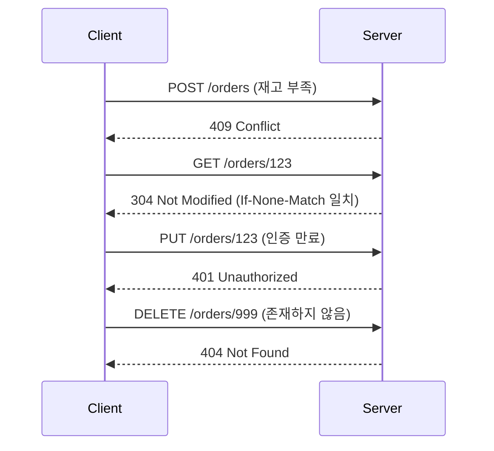

# HTTP 메서드와 상태 코드

## 핵심 정의
HTTP 메서드(method)는 클라이언트가 서버의 리소스에 대해 수행하려는 동작의 종류를 나타내는 동사(verb)이다. GET, POST, PUT, PATCH, DELETE, HEAD, OPTIONS 등이 있으며, 각 메서드는 안전성(safety), 멱등성(idempotency), 캐시 가능 여부(cacheability)라는 세 가지 속성으로 구분된다. HTTP 상태 코드(status code)는 서버가 요청을 처리한 결과를 3자리 숫자로 표현한 것으로, 첫째 자리 숫자에 따라 1xx(정보), 2xx(성공), 3xx(리다이렉션), 4xx(클라이언트 오류), 5xx(서버 오류)로 분류된다.

메서드와 상태 코드는 REST(Representational State Transfer) API 설계의 기본 어휘를 이룬다. 이 둘을 의미에 맞게 정확히 사용하는 것이 API의 예측 가능성과 캐시 효율성을 좌우한다.

## 동작 원리 / 구조

### 메서드 속성 표

| 메서드 | 안전(Safe) | 멱등(Idempotent) | 캐시 가능 | 용도 |
|---|---|---|---|---|
| GET | O | O | O | 리소스 조회 |
| HEAD | O | O | O | 헤더만 조회 |
| OPTIONS | O | O | X | 지원 메서드 확인(CORS preflight) |
| PUT | X | O | X | 리소스 전체 교체(생성/수정) |
| DELETE | X | O | X | 리소스 삭제 |
| POST | X | X | 조건부(O 가능) | 리소스 생성, 비멱등 처리 |
| PATCH | X | X | 조건부 | 리소스 부분 수정 |

- 안전(safe): 클라이언트가 상태 변경을 요청하지 않는 읽기 중심 의미의 메서드. 로그·과금 기록 같은 부수 효과까지 금지하는 뜻은 아니다. GET/HEAD/OPTIONS가 해당.
- 멱등(idempotent): 동일 요청을 N번 보내도 서버 상태가 1번 보낸 것과 같은 메서드. PUT은 "이 값으로 덮어써라"이므로 여러 번 보내도 결과가 같지만, POST는 매번 새 리소스를 만들 수 있어 멱등하지 않다. PATCH는 구현에 따라 멱등할 수도, 아닐 수도 있다(예: "카운터 +1"은 비멱등).

### 상태 코드 흐름 예시

### 자주 혼동되는 상태 코드
- 401 Unauthorized vs 403 Forbidden: 401은 인증(authentication) 자체가 안 된 상태(자격 증명 없음/무효), 403은 서버가 요청을 이해했으나 이행을 거부한 상태이며, 인증 성공을 전제로 하지 않는다. 401 응답은 적용 가능한 WWW-Authenticate challenge를 포함해야 한다.
- 302 Found vs 307 Temporary Redirect: 302는 리다이렉트 시 메서드가 GET으로 바뀔 수 있다는 모호함이 있고, 307/308은 원래 메서드와 바디를 유지하도록 명시적으로 보장한다.
- 201 Created vs 200 OK: 리소스를 새로 생성했다면 201을 쓰고 Location 헤더로 생성된 리소스 URI를 반환하는 것이 관례.
- 422 Unprocessable Content: 콘텐츠 형식과 문법은 이해했지만 담긴 지시를 처리할 수 없는 경우다(RFC 9110 §15.5.21). 400은 더 넓은 요청 오류에 사용할 수 있다.

PATCH 응답도 명시적 freshness 정보와 요청 URI에 일치하는 Content-Location을 갖추면 후속 GET/HEAD에 재사용할 수 있다(RFC 5789 §2). 일반적인 캐시 구현 지원 여부는 별도다. 재시도는 HTTP 의미 외에도 전체 deadline·Retry-After·백오프·중복 실행 방지를 함께 고려한다.

## 실무 관점
- Spring MVC/WebFlux에서는 `@GetMapping`, `@PostMapping` 등으로 메서드를 명시하고, `ResponseEntity<T>`로 상태 코드를 직접 제어한다. `@ResponseStatus`로 예외별 기본 상태 코드를 매핑해두면 컨트롤러 코드가 깔끔해진다.
- PUT을 부분 수정에 잘못 사용하는 실수가 흔하다. PUT은 리소스 전체 표현을 교체하는 것이 원칙이므로, 일부 필드만 보내면 나머지 필드가 null로 덮어써지는 버그가 발생할 수 있다. 부분 수정은 PATCH를 쓴다.
- GET 요청에 캐시 무효화 없이 상태 변경 로직을 넣는 실수(예: `/delete?id=1`을 GET으로 노출)는 CDN/프록시가 GET을 캐시하거나 크롤러가 프리페치(prefetch)하면서 의도치 않은 삭제를 유발할 수 있다.
- 멱등성은 재시도(retry) 전략과 직결된다. 네트워크 타임아웃 시 클라이언트가 재시도해도 안전한 메서드(GET/PUT/DELETE)와, 재시도 전 멱등키(idempotency key)가 필요한 POST를 구분해서 설계해야 한다. 결제/주문 API에서는 `Idempotency-Key` 헤더 패턴을 많이 쓴다.
- 상태 코드를 세분화하지 않고 모든 에러를 500으로 뭉뚱그리는 경우, 클라이언트가 일시적 제한·과부하(429/503)와 입력 오류(400/422)를 구분하기 어려워 장애 전파(cascading failure)로 이어질 수 있다.
- 상태 코드만으로 재시도를 허가하지 않는다. 429/503도 요청의 멱등성·실제 처리 여부·남은 deadline과 재시도 예산을 확인하고, 같은 잘못된 입력의 400/422는 입력을 고치기 전 반복하지 않는다. `Retry-After`는 기다릴 시점의 신호이며 중복 부작용의 안전성을 보장하지 않는다.
- 429 Too Many Requests에는 `Retry-After` 헤더를 함께 내려주는 것이 레이트 리미팅(rate limiting) 클라이언트 처리의 관례.

### 425 Too Early와 TLS 조기 데이터

RFC 8470의 425는 서버가 재생 공격(replay)의 위험이 있는 TLS 조기 데이터(early data)를 처리하지 않겠다는 의미다. 일반적인 과부하나 "아직 작업이 끝나지 않음"에 쓰는 상태 코드가 아니다. 조기 데이터로 보낸 요청이 425를 받으면 재시도할 수 있지만, 그 재시도를 다시 조기 데이터로 보내면 안 된다.

프록시는 이전 홉에서 조기 데이터로 받은 요청을 `Early-Data: 1`로 표시할 수 있다. 이 헤더가 표시된 요청은 현재 홉의 TLS handshake가 끝났다는 사실만으로 과거 홉의 재생 위험이 사라지지 않는다. 중간 프록시는 헤더를 제거하지 않아야 하며, 안전하게 처리할 수 없는 원본 서버는 425로 거부해야 한다. TLS 0-RTT를 도입할 때는 엣지 설정뿐 아니라 프록시와 원본의 처리 정책을 함께 검증한다.

### 202 응답과 비동기 작업 완료는 다른 상태다

`202 Accepted`는 처리를 수락했지만 아직 완료하지 않았다는 뜻이다. 실제 실행 단계에서 거절되거나 실패할 수 있으며, 먼저 보낸 202를 나중에 200이나 500으로 바꿔 전달하는 HTTP 기능은 없다. 따라서 클라이언트는 202를 결제·배치·파일 생성의 최종 성공으로 처리하지 않고, 작업 식별자와 상태 조회 경로 등 API가 정한 완료 확인 계약을 따른다.

서버는 현재 상태와 상태 확인 방법을 응답에 설명하고, 접수 실패와 접수 후 실행 실패를 운영 지표에서도 구분한다. 재시도할 때마다 새 작업을 만들지 않도록 접수 단계의 멱등성도 설계한다. 202 자체가 작업의 영속 저장·정확히 한 번 실행·최종 성공을 보장하는 것은 아니다.

## 심화 Q&A

### Q. PATCH가 멱등하지 않을 수 있다고 했는데, 언제 멱등하고 언제 아닌가?
PATCH 요청 본문이 "필드를 이 값으로 설정하라"(예: JSON Merge Patch)라면 여러 번 보내도 결과가 같으므로 멱등하다. 하지만 "카운터를 1 증가시켜라", "배열에 항목을 추가하라" 같은 상대적 연산을 표현하면 호출 횟수만큼 상태가 달라지므로 비멱등하다. PATCH는 메서드 정의상 멱등성을 요구하지 않으므로 패치 형식과 업무 의미로 판단한다. PUT·DELETE의 멱등성은 HTTP 메서드의 의미상 요구이며 이를 어기는 구현을 메서드 계약의 예외로 일반화하면 안 된다.

### Q. POST로 생성 요청을 두 번 보냈는데 네트워크 문제로 응답을 못 받아 재시도했다면 중복 생성을 어떻게 막는가?
클라이언트가 논리적 작업마다 고유하고 재시도에서는 동일한 `Idempotency-Key`를 헤더에 담아 보내고, 서버는 해당 키로 이미 처리된 요청인지 확인 후 처음 처리 결과를 그대로 반환한다. 키 선점과 결과 기록을 원자적으로 처리하고 동일 키의 다른 본문을 거부해야 한다. 키 보존 기간과 업무 트랜잭션의 연계를 정의하지 않으면 단순 Redis 응답 캐시만으로 동시 요청·프로세스 실패·TTL 만료 후 중복 실행을 막지 못한다.

### Q. 304 Not Modified는 왜 바디가 없는데도 유용한가?
클라이언트가 `If-None-Match`(ETag 기반) 또는 `If-Modified-Since` 헤더로 조건부 요청을 보내면, 서버는 리소스가 변경되지 않았을 때 바디 없이 304만 반환한다. 대역폭을 아끼면서도 클라이언트가 캐시된 사본을 계속 써도 된다는 것을 확인해주는 메커니즘으로, 정적 자산이나 자주 조회되지만 드물게 변하는 API 응답에 유용하다.

### Q. 리다이렉션 상태 코드 301/302/307/308의 차이는 실무에서 왜 중요한가?
301/308은 영구 이동, 302/307은 임시 이동을 의미한다. 동시에 301/302는 HTTP/1.0 시절부터 내려온 관행 때문에 브라우저가 리다이렉트 시 메서드를 GET으로 바꿔버릴 수 있다(RFC 9110도 "역사적 이유로 사용자 에이전트가 POST를 GET으로 바꿀 수 있다(MAY)"고 명시적으로 허용하는 예외로 규정해뒀을 뿐 스펙 위반은 아니며, 다만 원래 의도와 다르게 동작해 혼란을 준다는 점이 문제다), POST로 폼을 제출했는데 리다이렉트 후 GET으로 바뀌어 파라미터가 유실되는 문제가 생길 수 있다. 307/308은 메서드를 유지하는 리다이렉션이므로 기존 요청 의미를 보존해야 할 때 선택한다. 자동 리다이렉트의 허용 대상과 민감한 요청의 재전송 정책은 별도로 정한다.

### Q. 5xx와 4xx를 구분하는 기준이 애매한 경우는 어떻게 판단하는가?
원인이 클라이언트가 보낸 요청 자체의 문제(잘못된 파라미터, 인증 실패, 권한 없음, 존재하지 않는 리소스)면 4xx, 서버 내부 처리 실패(DB 연결 실패, 예상치 못한 예외, 다운스트림 서비스 장애)면 5xx다. 다운스트림 서비스가 4xx를 반환했다고 해서 내 서비스가 그대로 4xx를 전달해야 하는 것은 아니다. 하위 4xx가 호출자 입력 때문에 발생했는지 내 서비스의 잘못된 자격 증명/요청 때문에 발생했는지 구분한다. 502는 게이트웨이가 유효하지 않은 upstream 응답을 받은 경우, 503은 일시적 서비스 불가, 504는 upstream 응답 지연에 해당하며 하위 4xx를 일괄 변환하지 않는다.

### Q. HEAD와 GET의 차이를 캐싱/모니터링 관점에서 어떻게 활용하는가?
HEAD는 GET과 동일하게 처리되지만 응답 바디 없이 헤더만 반환한다. 헬스체크(health check)나 리소스 존재 여부 확인, Content-Length로 파일 크기만 먼저 확인할 때 대역폭을 아낄 수 있어 유용하다. 다만 서버 구현이 HEAD를 별도로 최적화하지 않으면 GET과 동일한 연산 비용이 드는 경우도 있으므로, 실제로 이득을 보려면 서버 측에서 HEAD 요청 시 바디 생성 로직을 건너뛰도록 구현해야 한다.

## 관련 개념
- [[HTTP 1.1과 HTTP 2 HTTP 3 비교]]
- [[TLS Handshake 과정]]

## 참고 자료

- [RFC 9110: HTTP Semantics](https://www.rfc-editor.org/rfc/rfc9110.html) — §9 안전성·멱등성·§15 상태 코드. 확인: 2026-09-08.
- [RFC 5789: PATCH Method](https://www.rfc-editor.org/rfc/rfc5789.html) — 조건부 캐시 가능성·원자적 변경. 확인: 2026-09-08.
- [RFC 9111: HTTP Caching](https://www.rfc-editor.org/rfc/rfc9111.html) — 캐시 재검증. 확인: 2026-09-08.
- [Spring Boot Web Servers](https://docs.spring.io/spring-boot/how-to/webserver.html) — Spring MVC 서버 구성 범위. 확인: 2026-09-08.

부분 재검증: 2026-09-22. [RFC 9110 §9.2.2·§10.2.3](https://www.rfc-editor.org/rfc/rfc9110.html)의 멱등성·자동 재시도·Retry-After와 [RFC 5789 §2](https://www.rfc-editor.org/rfc/rfc5789.html#section-2)의 PATCH 의미를 대조했다. 노트 전체의 버전 의존 서술을 재검증한 것은 아니므로 `verified`는 유지했다.

부분 재확인: 2026-09-23. [RFC 8470 §5·§6](https://www.rfc-editor.org/rfc/rfc8470.html)의 425·조기 데이터 재시도 금지·Early-Data 홉 전파를 확인했다. 이 내용은 TLS 조기 데이터 처리에 대한 계약이며 일반 업무 대기 상태가 아니다. [RFC 9110 §15.4](https://www.rfc-editor.org/rfc/rfc9110.html#section-15.4)의 메서드 보존 리다이렉션과 자동 재전송 주의도 대조했다. 기존 메서드·상태 코드 전체는 재검증하지 않아 `verified`는 유지한다.

부분 재검증: 2026-10-04. [RFC 9110 §15.3.3](https://www.rfc-editor.org/rfc/rfc9110.html#section-15.3.3)의 202 수락/미완료 의미, 최종 실행 비보장, 현재 상태와 monitor 안내를 확인했다. 작업 식별자·접수 멱등성·지표 분리는 이 HTTP 의미를 적용한 애플리케이션 설계 조건이며 특정 큐의 전달 보장을 주장하지 않는다. 실제 비동기 API·클라이언트 통합 시험은 하지 않았고 `verified`는 유지했다.
