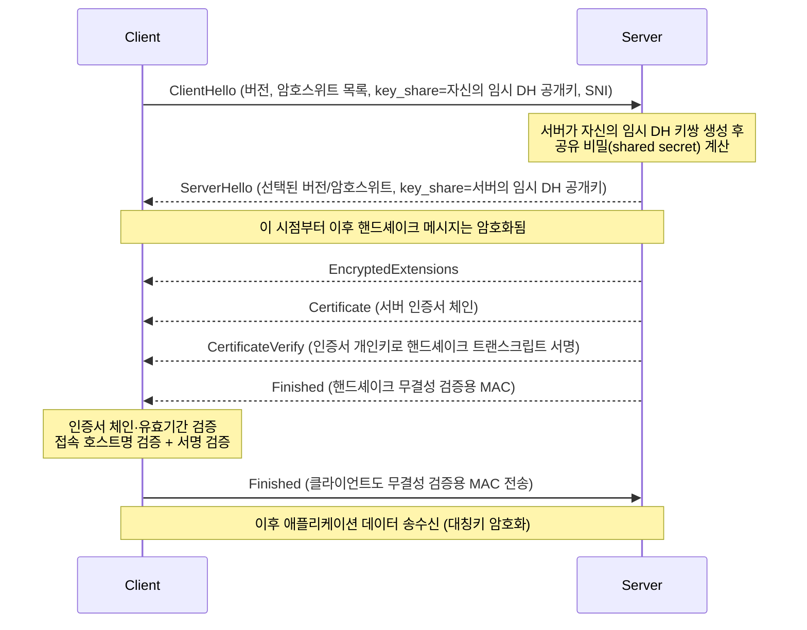

# TLS Handshake 과정

## 핵심 정의
TLS(Transport Layer Security) 핸드셰이크(handshake)는 클라이언트와 서버가 암호화 통신을 시작하기 전에 사용할 프로토콜 버전과 암호 스위트(cipher suite)를 합의하고, 서버(필요시 클라이언트도)를 인증서로 인증하며, 이후 모든 트래픽을 대칭키로 암호화하기 위한 공유 비밀(shared secret)을 네트워크에 노출하지 않고 안전하게 도출하는 과정이다. 이 노트의 적용 범위인 TLS 1.3(RFC 8446)은 HelloRetryRequest가 없는 기본 신규 연결에서 TLS 1.2의 2-RTT를 1-RTT로 줄이고, 재접속 시에는 0-RTT까지 지원한다.

## 동작 원리 / 구조

### TLS 1.3 전체 핸드셰이크 (신규 연결, 1-RTT)

### 단계별 설명
1. **ClientHello**: 클라이언트가 지원하는 TLS 버전, 암호 스위트 목록, 임시 Diffie-Hellman 키 교환용 공개키(key_share, 보통 X25519), SNI(Server Name Indication, 접속하려는 도메인명)를 평문으로 전송한다. TLS 1.3은 클라이언트가 서버가 받아들일 만한 key_share를 먼저 보내고, 서버가 이를 수락하면 추가 키 교환 왕복을 줄인다.
2. **ServerHello + 키 교환**: 서버가 자신의 key_share를 응답하면, 양측은 각자의 개인키와 상대의 공개키로 동일한 공유 비밀을 계산한다(ECDHE, Ephemeral Elliptic-Curve Diffie-Hellman). 이 시점부터 핸드셰이크 트래픽 키가 파생되어 이후 메시지(Certificate 등)는 암호화된다.
3. **서버 인증**: 서버는 인증서 체인(Certificate), 개인키로 서명한 CertificateVerify, 그리고 지금까지의 핸드셰이크 메시지 전체에 대한 무결성 검증값인 Finished를 보낸다.
4. **클라이언트 검증 및 완료**: 클라이언트는 인증서 체인을 신뢰 루트(CA, Certificate Authority)까지 검증하고, 도메인 일치 여부와 유효기간을 확인한 뒤 자신의 Finished를 보낸다. 이후 양측은 마스터 시크릿(master secret)에서 파생된 애플리케이션 트래픽 키로 대칭 암호화 통신을 시작한다.

### 0-RTT 재접속 (Session Resumption)
이전에 접속한 적이 있는 서버라면, 클라이언트는 이전 세션에서 파생한 PSK(Pre-Shared Key)와 서버가 발급한 세션 티켓를 이용해 ClientHello와 동시에 암호화된 애플리케이션 데이터(early data)까지 실어 보낼 수 있다. 왕복 없이 요청을 보낼 수 있어 매우 빠르지만, 이 early data는 재전송 공격(replay attack)에 취약하고 완전 순방향 비밀성(forward secrecy)을 제공하지 않으므로 애플리케이션의 재생 안전성을 확인한 요청에 한정한다. 멱등 메서드라는 이유만으로 허용하지 않는다.

### TLS 1.2 대비 차이 요약

| 항목 | TLS 1.2 | TLS 1.3 |
|---|---|---|
| 기본 신규 핸드셰이크 RTT | 2-RTT | 1-RTT(HelloRetryRequest 없음) |
| 재접속 | Session Resumption(1-RTT 단축) | 0-RTT 가능 |
| 키 교환 | RSA 정적 키교환 허용(순방향 비밀성 없음) | (EC)DHE·PSK-only·PSK+(EC)DHE; PSK-only와 0-RTT는 순방향 비밀성 예외 |
| 암호 스위트 | CBC/AEAD 등; RC4는 후속 RFC 7465에서 금지 | AEAD(AES-GCM, ChaCha20-Poly1305)만 허용 |
| 핸드셰이크 암호화 범위 | ServerHello 이후 일부만 | 키 교환 직후부터 대부분 암호화 |

위 흐름과 1-RTT 수치는 HelloRetryRequest가 없는 인증서 기반 신규 handshake를 단순화한 것이다. 공통 지원 그룹은 있지만 서버가 선택할 그룹의 key_share가 없으면 HelloRetryRequest로 추가 왕복이 필요하며, 서버는 자신의 Finished 뒤에 클라이언트 Finished를 기다리지 않고 애플리케이션 데이터를 보낼 수도 있다. PSK-only 재개에서는 인증서 메시지와 DH 교환이 생략될 수 있다.

## 실무 관점

### 장수명 연결의 키 갱신과 인증서 교체

TLS 1.3의 `KeyUpdate`는 기존 애플리케이션 트래픽 비밀에서 다음 세대 키를 도출하는 메시지다. 새로운 인증서 검증이나 (EC)DHE 교환을 수행하지 않는다. 과거 키를 삭제하면 이전 트래픽 보호에 도움이 되지만, 현재 트래픽 비밀을 탈취한 공격자는 이후 키도 도출할 수 있으므로 키 갱신만으로 침해가 복구되지는 않는다. 침해 원인을 제거하고 새로운 (EC)DHE 핸드셰이크를 수행해야 한다.

따라서 인증서 파일을 교체했다는 사실과 이미 열린 연결의 인증 상태를 구분한다. 인증서·신원 정책을 즉시 다시 평가해야 하는 운영 요구가 있다면 연결 최대 수명과 안전한 드레이닝(draining), 재연결을 함께 설계한다. 세션 티켓 키 로테이션, 인증서 교체, `KeyUpdate`는 서로 다른 키의 수명주기다.

- Spring Boot 애플리케이션 서버(내장 Tomcat 등)에서 TLS를 직접 종단(termination)하는 구성도 가능하지만, 실무에서는 Nginx나 클라우드 로드밸런서(ALB 등)에서 TLS를 종단하고 내부망은 평문 HTTP로 통신하는 구조가 흔하다. 이 경우 TLS 핸드셰이크 비용은 엣지에서만 발생하고, 서버 자원은 애플리케이션 로직에 집중할 수 있다.
- 인증서 체인 검증 실패(중간 인증서 누락)는 브라우저에서는 종종 신뢰 저장소 보완으로 가려지지만, 서버 간 통신(curl, Java `HttpClient` 등)에서는 그대로 핸드셰이크 실패로 이어진다. 서버 설정 시 리프 인증서뿐 아니라 중간 인증서 체인 전체를 함께 배포해야 한다.
- ECH를 사용하지 않는 TLS ClientHello의 SNI는 평문이다. ECH(Encrypted Client Hello)는 RFC 9849(2026-03)로 표준화되었으며 민감한 ClientHelloInner를 암호화한다. ClientHelloOuter와 목적지 IP는 여전히 관찰할 수 있고 실제 사용에는 클라이언트·서버 지원과 ECH 설정 배포가 필요하다.
- TLS 1.3의 (EC)DHE 기반 순방향 비밀성(forward secrecy)은 장기 개인키가 유출되더라도 과거에 캡처된 트래픽을 복호화할 수 없게 해주므로, RSA 정적 키교환에 의존하던 구형 로드밸런서/방화벽의 트래픽 복호화(패킷 검사) 장비가 TLS 1.3 전환 시 동작하지 못하는 사례가 실무에서 종종 보고된다. 이런 환경에서는 별도의 미들박스 대응(예: 엔드포인트에서 로그 수집)이 필요하다.
- JVM 기반 애플리케이션에서 외부 API를 호출할 때 오래된 JDK 버전은 TLS 1.3을 지원하지 않아 핸드셰이크 자체가 실패할 수 있다. 지원 중인 JDK의 실제 TLS 구현을 확인하고, `javax.net.ssl.SSLContext`나 HttpClient 설정에서 프로토콜 버전을 명시적으로 확인하는 것이 트러블슈팅의 첫 단계다.
- 세션 티켓/PSK를 서버가 어떻게 저장하고 로테이션(rotation)하는지도 보안에 영향을 준다. 티켓 키를 너무 오래 재사용하면 유출 시 다수의 0-RTT 세션이 위협받으므로 주기적 키 로테이션이 필요하다.

## 심화 Q&A

### Q. TLS 1.3에서 클라이언트가 처음부터 key_share를 보내는데, 서버가 그 키 교환 방식을 지원하지 않으면 어떻게 되는가?
인증서 기반 (EC)DHE 핸드셰이크에서는 클라이언트의 `supported_groups`와 서버의 허용 그룹에 공통 항목이 있어야 한다. 그 그룹의 key_share가 첫 ClientHello에 없으면 서버가 `HelloRetryRequest`로 해당 그룹을 선택하고 클라이언트가 새 key_share를 보낸다. 클라이언트가 애초에 지원한다고 알리지 않은 그룹을 서버가 임의로 요구하는 절차가 아니므로, 공통 그룹이 없으면 추가 왕복으로 복구하지 못하고 핸드셰이크가 실패한다. 따라서 지원 그룹 교집합과 처음 보낸 key_share를 나누어 확인한다. HRR이 필요한 경우에는 추가 왕복이 발생해 1-RTT 이득이 사라진다.

### Q. 순방향 비밀성(forward secrecy)은 TLS 1.3에서 언제 보장되고 언제 예외인가?
TLS 1.2의 RSA 키교환 방식에서는 서버의 장기 개인키만 있으면 과거에 캡처해둔 모든 세션의 공유 비밀을 사후에 계산할 수 있어, 개인키 유출 시 과거 트래픽까지 복호화되는 위험이 있다. TLS 1.3의 인증서 기반 (EC)DHE handshake는 임시 타원곡선 또는 유한체 DH 키를 사용해 장기 인증 키 유출로부터 과거 트래픽을 보호한다. PSK와 (EC)DHE를 결합한 재개도 이 보호를 제공하지만, PSK-only 재개와 0-RTT early data에는 같은 보장이 없다.

### Q. 0-RTT의 재전송 공격 위험을 완화하기 위해 서버가 취할 수 있는 조치는 무엇인가?
서버는 요청의 재생·재순서화가 데이터·권한·자원 사용에 미치는 영향을 확인해 재생 안전한 작업만 허용한다. GET이나 멱등 메서드라는 사실만으로 안전하지는 않다. 티켓 재사용 제한과 anti-replay 저장소를 적용할 때는 여러 서버·리전에서의 중복 수락 범위도 고려한다. HTTP 서버는 안전을 보장할 수 없으면 425 Too Early로 거부하고, 이를 받은 클라이언트는 early data 없이 재시도한다. 게이트웨이는 Early-Data 표식을 전파하고 원 서버가 early data를 안전하게 처리한다고 확인하지 않은 요청을 미리 전달하지 않는다. 중복 실행의 안전성을 입증하지 못하면 0-RTT를 비활성화한다.

### Q. SNI가 평문으로 노출되는 문제를 완화하는 방법과 그 한계는 무엇인가?
ECH(Encrypted Client Hello)는 ClientHello의 민감한 부분(SNI 포함)을 별도의 공개키로 암호화해 전송한다. 다만 ECH가 동작하려면 클라이언트와 서버(또는 CDN) 양쪽이 모두 지원해야 하고, DNS(HTTPS 레코드)를 통해 공개키를 미리 배포하는 인프라가 필요해 아직 전 세계적으로 균일하게 보급되지는 않았다. 지원하지 않는 환경에서는 여전히 SNI 기반 도메인 관찰(DPI 차단 등)이 가능하다.

### Q. TLS 종단을 로드밸런서에서 하는 구조와 애플리케이션 서버에서 직접 하는 구조는 각각 어떤 트레이드오프가 있는가?
로드밸런서 종단은 인증서 관리와 암호 스위트 정책을 한 곳에서 통제할 수 있고 애플리케이션 서버의 CPU 부담(비대칭키 연산)을 줄여주지만, 로드밸런서-서버 구간이 평문이라면 내부망 침해 시 트래픽이 노출된다는 위험이 있다. 이를 보완하려면 내부 구간도 서버 인증 TLS로 암호화하고, 클라이언트 서비스 신원까지 인증해야 하면 mTLS(mutual TLS)를 적용한다. 네트워크 분리(VPC, 서브넷 격리)는 접근 제한을 보완하지만 전송 암호화를 대신하지 않는다.

### Q. 클라이언트 인증서를 요구하는 mTLS는 TLS 1.3 핸드셰이크에서 어떻게 처리되는가?
서버가 CertificateRequest 메시지를 Certificate 앞에 추가로 보내 클라이언트 인증서를 요구하고, 클라이언트는 자신의 Certificate와 CertificateVerify를 Finished 이전에 함께 전송해 서버가 클라이언트 신원을 검증할 수 있게 한다. 이는 서비스 간 통신(service-to-service)에서 API 키나 토큰 대신 인증서 기반으로 상호 인증할 때 쓰이며, 인증서 발급/로테이션을 자동화하는 내부 PKI(사설 인증기관) 운영 부담이 뒤따른다.

## 관련 개념
- [[HTTP 1.1과 HTTP 2 HTTP 3 비교]]
- [[HTTP 메서드와 상태 코드]]

## 참고 자료

- [RFC 8446: TLS 1.3](https://www.rfc-editor.org/rfc/rfc8446.html) — §2·4·7·8 인증서 handshake·(EC)DHE/PSK·0-RTT. 확인: 2026-09-08.
- [RFC 9849: TLS Encrypted Client Hello](https://www.rfc-editor.org/rfc/rfc9849.html) — 2026-03 표준·ClientHelloInner/Outer. 확인: 2026-09-08.
- [RFC 8470: Using Early Data in HTTP](https://www.rfc-editor.org/rfc/rfc8470.html) — 재생 안전성·425. 확인: 2026-09-08.

부분 재검증: 2026-09-23. [RFC 8446 §4.6.3·§7.2·Appendix E.2](https://www.rfc-editor.org/rfc/rfc8446.html#section-4.6.3)의 TLS 1.3 KeyUpdate·트래픽 비밀 유출 이후 보호 한계와 인증서 교체의 운영상 구분을 확인했다. ECH·JDK 지원 등 기존의 다른 서술은 이번 범위 밖이므로 `verified`는 유지했다.

부분 재검증: 2026-10-04. [RFC 8446 §4.1.1·§4.2.8](https://www.rfc-editor.org/rfc/rfc8446.html#section-4.2.8)의 공통 그룹과 HRR selected_group 조건을 대조했다. JDK 25.0.4+7·SunJSSE 25, 임시 CA·loopback TLS 1.3에서 양쪽 x25519는 성공하고 서버 x25519/클라이언트 secp256r1만 허용하면 서버의 `No common named group` 오류로 실패함을 확인했다. 공통 그룹은 있지만 key_share만 없는 HRR 왕복·PSK-only·ECH·운영 로드밸런서는 실행하지 않았고 기존 `verified`는 유지한다.
