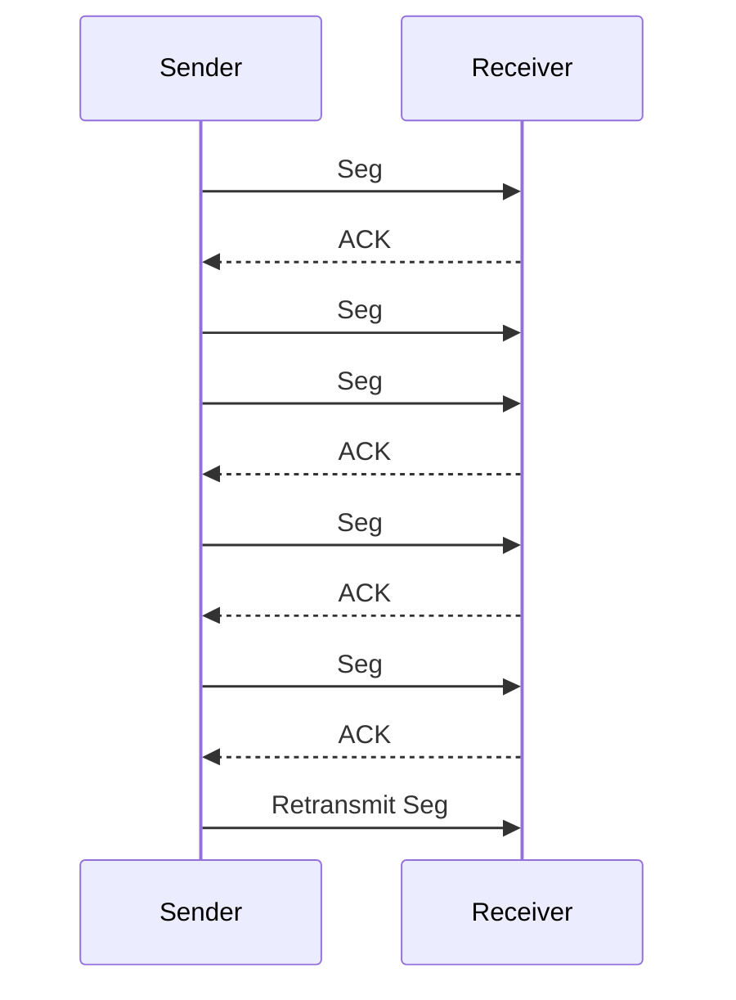

# TCP 신뢰성 보장 메커니즘

## 핵심 정의
TCP(Transmission Control Protocol)는 IP 계층이 보장하지 않는 데이터의 손상, 손실, 중복, 순서 뒤바뀜을 복구하기 위해 여러 메커니즘을 조합해 신뢰성 있는 바이트 스트림 전달을 제공한다. 핵심은 전송한 모든 바이트에 순번(sequence number)을 매기고, 수신 측의 확인 응답(ACK, Acknowledgment)을 받을 때까지 재전송 큐에 데이터를 보관하는 것이다. 이 기본 골격은 RFC 793에서 정의됐고, 현재는 이를 통합·갱신한 RFC 9293(2022)이 표준 명세다.

## 동작 원리 / 구조

### 순번과 확인 응답
- 송신 측은 바이트에 순번을 매기며 세그먼트(segment) 헤더에 첫 바이트 순번을 넣고, 데이터를 보낸 뒤 사본을 재전송 큐에 넣고 타이머를 시작한다.
- 수신 측은 누적 ACK(cumulative ACK) 방식으로 "다음에 받기를 기대하는 바이트 번호"를 응답한다.
- 타이머(RTO, Retransmission Timeout) 만료 전에 ACK가 오지 않으면 해당 세그먼트를 재전송한다.
- SYN과 FIN 같은 제어 플래그도 순번 공간을 1바이트씩 차지하도록 설계되어, 데이터와 동일한 방식으로 재전송·확인이 가능하다.

### 빠른 재전송(Fast Retransmit)
누적 ACK 특성상 중간 세그먼트가 유실되면 수신 측은 그 이후 도착하는 세그먼트에 대해 계속 같은 순번으로 중복 ACK(Duplicate ACK)를 보낸다.

- 동일한 순번에 대해 중복 ACK가 3개 누적되면(reordering으로 인한 오탐을 줄이기 위한 임계값), RTO를 기다리지 않고 즉시 재전송한다.
- 재전송 세그먼트는 원본과 동일한 순번을 쓰기 때문에, 이후 도착한 ACK가 원본에 대한 것인지 재전송에 대한 것인지 구분할 수 없는 "재전송 모호성(retransmission ambiguity)" 문제가 있다. 이는 RTT 측정에도 영향을 준다(Karn 알고리즘으로 재전송된 세그먼트의 RTT 샘플은 제외).

### SACK (Selective Acknowledgment)
- 누적 ACK만으로는 "어디까지 받았는지"만 알 수 있고 "어떤 세그먼트가 비어 있는지"는 알 수 없어, 유실 구간 앞뒤로 이미 잘 받은 데이터까지 불필요하게 재전송될 수 있다.
- SACK 옵션(RFC 2018 계열, RFC 9293에서 필수는 아니지만 고성능을 위해 권장하는 확장으로 언급)을 사용하면 수신 측이 "받은 블록의 범위"를 명시적으로 알려줘, 송신 측이 이미 수신한 블록을 피해 손실로 추정되는 범위를 선택 재전송할 수 있다. SACK 자체가 유실과 재정렬을 완벽히 구분하거나 수신 버퍼의 영구 보존을 보장하지는 않는다.
- 대부분의 상용 OS 스택(Linux, Windows)은 기본으로 SACK를 활성화한다.

### 체크섬과 순서 재정렬
- 세그먼트 헤더의 체크섬으로 데이터 손상을 탐지하고, 손상된 세그먼트는 폐기되어 결과적으로 미수신 처리되어 재전송 대상이 된다.
- 수신 버퍼에서 순번 기준으로 재정렬(reordering)하여 애플리케이션에는 항상 순서가 보장된 스트림으로 전달한다.

## 실무 관점
- **RTO 계산**: RTT 평균과 편차(RTTVAR)를 기반으로 동적으로 산출된다(Jacobson/Karels 알고리즘). 네트워크 지연 변동이 큰 환경(무선, 해외 리전 간 통신)에서는 RTO가 과도하게 커지거나 짧아져 불필요한 재전송이 발생할 수 있다.
- **SACK 비활성화 이슈**: 일부 방화벽/로드밸런서 구간에서 TCP 옵션을 필터링해 SACK 협상이 실패하면, 유실 시 불필요하게 넓은 범위를 재전송해 처리량이 급격히 떨어진다. 장애 발생 시 `tcpdump`/Wireshark로 SYN 패킷의 옵션 필드를 확인하는 것이 기본 점검 항목이다.
- **애플리케이션 레벨 착각**: TCP의 ACK는 "상대방 TCP 스택이 받았다"는 의미이지 "애플리케이션이 처리했다"는 의미가 아니다. Spring 기반 서버에서 커넥션이 끊겼는데도 로그상 요청이 들어온 것처럼 보이는 이슈는 이 지점에서 자주 오해가 생긴다.
- **모니터링 포인트**: `netstat -s`의 재전송(segments retransmitted) 카운터, `ss -i`의 `retrans` 필드로 재전송률을 추적하면 네트워크 품질 저하를 조기에 감지할 수 있다.
- **튜닝**: `net.ipv4.tcp_sack=1`(기본 활성), `net.ipv4.tcp_retries2`(설정 횟수와 RTO 백오프로 산출한 연결 실패 판단 시간의 기준) 등이 리눅스에서 조정 가능한 커널 파라미터다.

### 바이트 순서 보장과 메시지 경계

TCP는 애플리케이션의 `write` 한 번을 상대의 `read` 한 번으로 보존하지 않는다. 한 메시지가 여러 번의 읽기로 나뉘거나 여러 메시지가 한 번에 읽힐 수 있으며, PSH나 세그먼트 경계도 업무 메시지 구분자가 아니다. 직접 프로토콜을 만들 때는 길이 prefix·구분자 등 명시적인 프레이밍(framing)이 필요하다.

길이 기반 디코더라면 헤더 일부 수신, 본문 일부 수신, 한 번에 여러 프레임 수신을 모두 처리한다. 원격이 선언한 길이대로 바로 메모리를 할당하지 말고 프레임 상한·누적 버퍼 상한·완성 기한을 정한다. 스트림이 끝났는데 본문이 덜 왔다면 완성된 메시지로 전달하지 않는다. TCP의 순서 보장이 입력 검증이나 메모리 사용량 제한까지 대신하지는 않는다.

## 심화 Q&A

### Q. 빠른 재전송이 RTO보다 선호되는 이유는? RTO만으로는 왜 부족한가.
RTO는 타이머가 만료될 때까지 기다려야 하므로 최소 RTT의 몇 배에 달하는 지연이 발생한다. 반면 중복 ACK 3개는 이미 후속 세그먼트가 도착했다는 뜻이므로 네트워크는 정상 동작 중이고 특정 세그먼트만 유실됐다는 강한 신호다. 이 경우 타이머를 기다리지 않고 즉시 재전송하면 지연을 크게 줄일 수 있다. 다만 유실이 아니라 마지막 세그먼트들이거나 윈도우 끝부분이라 후속 데이터 자체가 없는 경우엔 중복 ACK가 발생하지 않아 기본 알고리즘에서는 RTO에 의존한다. RACK-TLP(RFC 8985)처럼 시간 기반 탐지와 tail-loss probe를 쓰는 구현은 마지막 데이터 손실도 RTO 전에 복구할 수 있다.

### Q. 재전송 모호성(retransmission ambiguity)이 실무에 미치는 영향은?
같은 순번의 세그먼트가 원본인지 재전송본인지 ACK만으로 구분할 수 없어, RTT 측정 샘플에 재전송된 세그먼트를 포함시키면 RTO 추정이 왜곡될 수 있다. Karn 알고리즘은 재전송이 발생한 세그먼트의 RTT 샘플을 측정에서 제외하고, 타임스탬프 옵션(RFC 7323)을 사용하면 세그먼트별로 실제 전송 시각을 구분해 이 문제를 근본적으로 해결할 수 있다.

### Q. SACK와 누적 ACK(cumulative ACK)만 쓰는 경우의 차이를 유실 패턴별로 설명하면.
연속된 여러 세그먼트 중 하나만 유실됐다면 두 방식의 차이가 크지 않다. 하지만 한 윈도우 내에서 여러 구간이 산발적으로 유실되면, 누적 ACK만으로는 송신 측이 "가장 오래된 미확인 지점" 이후 전체를 다시 보내야 할 수도 있어 대역폭 낭비가 크다. SACK는 어떤 블록이 이미 도착했는지 명시하므로 실제 빈 구간만 골라 재전송할 수 있어 고손실/고지연 환경에서 효과가 크다.

### Q. TCP의 신뢰성 보장이 애플리케이션 레벨의 신뢰성(at-least-once, exactly-once 등)까지 보장하는가?
아니다. TCP는 연결이 정상적으로 유지되는 동안 중복 없는 순서 있는 바이트 스트림을 제공하며, 장애가 지속되면 재시도 한도·사용자 timeout 등에 따라 연결 오류로 종료할 수 있다. 커넥션이 끊긴 시점에 애플리케이션이 요청을 이미 처리했는지, 응답만 유실됐는지는 TCP가 알려주지 않는다. 그래서 결제, 주문 같은 도메인에서는 TCP의 신뢰성과 별개로 멱등키(idempotency key), 애플리케이션 레벨 ACK 같은 상위 계층 신뢰성 장치가 필요하다.

### Q. 순번(sequence number) 공간이 32비트로 유한한데, 랩어라운드(wraparound)는 어떻게 처리되는가?
32비트 순번은 약 4GB 전송 후 0으로 순환한다. 순번 비교는 단순 정수 비교가 아니라 모듈러 연산 기반의 "앞선/뒤선" 판정을 사용하며, 고속 네트워크에서는 PAWS(Protection Against Wrapped Sequences, 타임스탬프 옵션 기반)를 함께 사용해 랩어라운드로 인해 오래된 세그먼트가 새 세그먼트로 오인되는 것을 방지한다.

### Q. 세그먼트 재정렬(reordering)과 유실을 TCP가 구분하지 못하면 어떤 문제가 생기는가?
네트워크 경로 변경이나 멀티패스 라우팅으로 세그먼트 순서가 뒤바뀌면 수신 측은 중복 ACK를 보내게 되어, 송신 측이 유실로 오판하고 불필요하게 재전송(spurious retransmission)할 수 있다. 이는 혼잡 윈도우를 불필요하게 줄이는 부작용까지 낳는다. 중복 ACK 임계값을 3으로 둔 것도 이런 오탐을 줄이기 위한 절충이며, F-RTO 같은 보완 기법은 타임아웃 재전송 후 프로브 세그먼트로 실제 혼잡 상황인지 재확인한다.

## 관련 개념
- [[흐름 제어와 혼잡 제어]]
- [[3-way handshake와 4-way handshake]]

## 참고 자료

- [RFC 9293: TCP](https://www.rfc-editor.org/rfc/rfc9293.html) — 바이트 순서·ACK·checksum·TCP 상태. 확인: 2026-09-08.
- [RFC 8985: RACK-TLP](https://www.rfc-editor.org/rfc/rfc8985.html) — tail loss·시간 기반 손실 탐지. 확인: 2026-09-08.
- [Linux IP sysctl](https://docs.kernel.org/networking/ip-sysctl.html) — tcp_sack·tcp_retries2 운영 의미. 확인: 2026-09-08.

부분 재확인: 2026-09-23. [RFC 9293 §3.7](https://www.rfc-editor.org/rfc/rfc9293.html#section-3.7)의 TCP 세그먼트·애플리케이션 읽기/쓰기 경계 비보장을 확인했다. 프레임 상한·부분 수신·완성 기한은 그 계약을 적용한 디코더 설계 기준이다. 기존 OS 기본값과 혼잡·재전송 확장 전체는 재검증하지 않아 `verified`는 유지한다.
