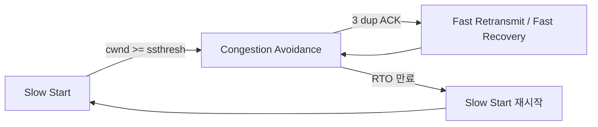

# 흐름 제어와 혼잡 제어

## 핵심 정의
흐름 제어(flow control)와 혼잡 제어(congestion control)는 둘 다 TCP 송신 속도를 조절하지만 목적이 다르다. 흐름 제어는 "수신 측이 처리할 수 있는 속도"를 넘지 않도록 조절해 수신 버퍼 오버플로를 막는 종단 간(end-to-end) 메커니즘이고, 혼잡 제어는 "네트워크 경로(중간 라우터/링크)가 감당할 수 있는 속도"를 넘지 않도록 조절해 네트워크 전체의 혼잡 붕괴를 막는 메커니즘이다. 미확인 전송 중 데이터의 상한은 min(rwnd, cwnd)에 제한된다. 새로 보낼 수 있는 양에서는 이미 전송 중인 바이트를 빼며, 실제 전송률은 pacing·애플리케이션 공급량에도 제한된다.

## 동작 원리 / 구조

### 흐름 제어: 수신 윈도우(rwnd)
- 수신 측은 TCP 헤더의 Window 필드로 자신의 수신 버퍼 여유 공간(receive window, rwnd)을 매 ACK마다 송신 측에 알린다.
- 헤더의 Window 필드는 16비트라 기본 최대치가 65,535바이트로 제한되지만, Window Scale 옵션(RFC 7323)으로 최대 1GB 수준까지 확장할 수 있다. 이 옵션은 3-way handshake 시점에만 협상 가능하다.
- rwnd가 0이 되면 송신 측은 전송을 멈추고, 이후 수신 측 버퍼에 여유가 생기면 Window Update로 재개를 알린다. 이때 유실 등으로 Window Update 자체가 전달되지 않으면 통신이 멈출 수 있어, 송신 측은 주기적으로 Zero Window Probe를 보내 확인한다.

### 혼잡 제어: 혼잡 윈도우(cwnd)
네트워크 경로의 혼잡 상태는 종단에서 직접 알 수 없기 때문에, 패킷 유실이나 지연 증가 같은 간접 신호로 추정한다. 아래는 Reno(RFC 5681) 기준의 단순화이며 CUBIC·BBR에 그대로 적용하지 않는다.

- **Slow Start**: 연결 시작 시 cwnd를 작게 시작해 ACK를 받을 때마다 지수적으로 증가시켜 가용 대역폭을 빠르게 탐색한다.
- **Congestion Avoidance**: cwnd가 ssthresh(slow start threshold)에 도달하면 증가 속도를 선형(RTT당 1 MSS)으로 늦춰 보수적으로 탐색한다.
- **Fast Retransmit / Fast Recovery**: 중복 ACK 3개로 유실을 감지하면 cwnd를 절반으로 줄이고 즉시 재전송한 뒤 congestion avoidance로 복귀한다(RTO까지 기다리며 slow start부터 다시 시작하는 것보다 훨씬 빠른 회복).
- **RTO 만료**: 타임아웃까지 발생하면 심각한 혼잡으로 간주해 cwnd를 1 MSS의 loss window로 줄이고 slow start부터 재시작한다.

### 주요 알고리즘 비교
| 알고리즘 | 표준/상태 | 방식 | 특징 |
|---|---|---|---|
| Reno/NewReno | RFC 5681 계열 | 손실 기반 | 유실 시 cwnd를 절반으로 감소, 선형 증가·AIMD 기반 |
| CUBIC | RFC 9438(2023) | 손실 기반 | Linux 커널 기본 알고리즘. cwnd 증가 곡선이 3차 함수 형태로, 고대역폭·고지연(BDP가 큰) 환경에서 Reno보다 빠르게 회복 |
| BBR (v3) | draft-ietf-ccwg-bbr-06(2026-07), RFC 미확정 | 모델 기반 | 대역폭(bandwidth)과 RTT로 모델을 만들고 손실·ECN 신호도 함께 사용. 처리량과 큐 압력의 균형을 목표로 하며, 지연·공정성 개선 정도는 병목과 경쟁 흐름에 따라 측정 |

리눅스는 오랫동안 CUBIC을 기본값으로 채택해왔고, BBR 사용 가능 여부와 버전은 배포 커널·모듈에 달려 있다. fq와 pacing 구성을 확인하되 드래프트의 BBRv3와 설치된 Linux BBR 구현을 동일시하지 않는다. BBR은 아직 IETF 표준화가 진행 중(BBRv3 드래프트)이며 RFC로 확정되지는 않았다.

### 흐름 제어와 혼잡 제어의 상호작용
미확인 전송 중 데이터의 상한은 `min(cwnd, rwnd)`에 제한되며, 실제 전송률에는 pacing과 애플리케이션의 데이터 공급도 영향을 준다. 예를 들어 애플리케이션이 소켓 버퍼를 다 못 비워 rwnd가 작아지면, 네트워크 자체는 여유가 있어도 처리량이 낮게 유지된다.

## 실무 관점
- **소켓 버퍼 크기 튜닝**: `SO_RCVBUF`, `SO_SNDBUF` 및 리눅스의 `net.ipv4.tcp_rmem`/`tcp_wmem`(min/default/max)를 조정해 rwnd 최대치를 확보해야 고대역폭·고지연(예: 해외 리전 간 DB 복제) 구간에서 처리량이 제한되지 않는다. BDP(Bandwidth-Delay Product)를 계산해 버퍼 크기를 잡는 것이 기본 공식이다.
- **버퍼블로트(bufferbloat)**: 중간 장비의 큐 버퍼가 과도하게 크면 손실 기반 알고리즘은 유실이 늦게 발생해 지연만 계속 쌓인다. CDN이나 프록시 계층에서 지연 스파이크가 원인 불명으로 보일 때 의심해볼 지점이며, BBR 채택 논의의 핵심 배경이다.
- **Nagle 알고리즘과의 상호작용**: 작은 패킷을 모아 보내는 Nagle 알고리즘과 지연 ACK(Delayed ACK)가 겹치면 응답 지연이 최대 수백ms까지 늘어날 수 있다(특히 요청-응답 패턴에서). 저지연이 중요한 API 서버에서는 `TCP_NODELAY`를 켜서 Nagle을 비활성화하는 것이 일반적이다.
- **컨테이너/클라우드 환경**: 컨테이너 네트워크(오버레이, CNI)를 거치면 실제 물리 네트워크보다 RTT가 늘어나 BDP 계산이 달라지므로, 기본 커널 파라미터를 그대로 쓰면 처리량이 예상보다 낮게 나올 수 있다.
- **장애 패턴**: cwnd가 유휴 연결에서 리셋되는 것(RFC에서 권장하는 idle restart 동작)을 모르고, 오래 유지된 커넥션 풀(HikariCP 등)의 첫 요청이 느려지는 현상을 원인 불명으로 방치하는 경우가 있다. 이는 slow start 재시작 때문일 수 있다.

### Zero Window가 요청 timeout을 대신하지 않는 이유

RFC 9293에서 수신자가 Zero Window Probe에 계속 ACK하면 연결을 열린 상태로 유지할 수 있다. 프로브는 윈도우가 다시 열렸는지 확인할 뿐, 수신 애플리케이션의 처리 완료를 보장하지 않는다. 상대 프로세스가 읽기를 멈췄어도 TCP 응답은 이어질 수 있으므로 요청 deadline·진행 정지 감지·대기열 제한을 애플리케이션에서 정한다.

rwnd가 계속 작을 때 수신 버퍼만 키우면 소비 지연을 숨기며 메모리와 큐잉 시간을 늘릴 수 있다. 반대로 rwnd가 큰데 전송량이 작다는 관측만으로 혼잡을 확정할 수도 없다. 애플리케이션이 데이터를 적게 만들거나 pacing이 전송을 제한할 수 있으므로 송수신 애플리케이션의 진행 상태와 함께 해석한다.

## 심화 Q&A

### Q. 흐름 제어와 혼잡 제어를 하나의 윈도우로 통합하지 않고 분리해서 관리하는 이유는?
두 문제의 성격이 다르기 때문이다. 흐름 제어는 특정 수신자 하나의 버퍼 상태라는 명확한 값을 헤더로 직접 전달받을 수 있는 결정론적 문제지만, 혼잡 제어는 경로상의 여러 라우터가 공유하는 자원 상태를 종단에서 직접 알 수 없어 유실이나 RTT 변화 같은 간접 신호로 추정해야 하는 확률적 문제다. 하나의 값으로 합치면 "수신자가 느려서"인지 "네트워크가 혼잡해서"인지 원인을 구분할 수 없어 최적 대응(버퍼 늘리기 vs 전송률 낮추기)이 불가능해진다.

### Q. Slow Start인데 왜 "느리다"고 부르는가? 실제로는 지수적으로 빠르게 증가하는데.
초기 IP 네트워크에서는 연결 시작 시 곧바로 큰 윈도우로 전송해 라우터 큐를 순간적으로 채워버리는 것이 문제였다. Slow Start는 "최종 목표 전송률"에 도달하는 과정이 (이전 방식인 즉시 최대 전송에 비해) 상대적으로 느리다는 뜻이지, 증가 자체는 RTT마다 두 배씩 늘어나는 지수 함수다. 상대적 명칭이라 오해하기 쉽다.

### Q. CUBIC이 고대역폭·고지연 네트워크에서 Reno보다 유리한 이유는?
Reno 계열은 RTT마다 선형으로 1 MSS씩만 cwnd를 늘리기 때문에, RTT가 큰 환경에서는 유실 이후 원래 처리량을 회복하는 데 매우 오래 걸린다. CUBIC은 cwnd 증가를 경과 시간의 3차 함수로 모델링해 RTT에 덜 의존적으로 만들고, 유실 직후에는 빠르게 증가하다가 이전 cwnd 근처에서는 완만해지는 곡선을 그려 안정성과 회복 속도를 동시에 개선한다.

### Q. BBR이 손실 기반 알고리즘과 같은 병목을 공유할 때 공정성(fairness) 문제가 있다는데 무슨 뜻인가?
BBR과 CUBIC의 대역폭 분배는 알고리즘 버전, RTT, 병목 큐 크기와 손실률에 따라 달라진다. BBR이 항상 절제해 손해를 보거나 항상 상대를 굶긴다는 단일 결론은 성립하지 않는다. BBR -06은 손실·ECN도 모델 제약에 활용하며, 도입 시 혼합 흐름에서 처리량뿐 아니라 지연과 공정성을 측정해야 한다.

### Q. rwnd가 0이 됐다가 애플리케이션이 버퍼를 비워도 통신이 재개되지 않는 경우가 있는데 왜 그런가?
Window Update 자체가 세그먼트이므로 네트워크에서 유실될 수 있다. 유실되면 송신 측은 rwnd가 여전히 0인 줄 알고 무한정 대기하게 되어 데드락처럼 보이는 상황이 발생한다. 이를 막기 위해 TCP는 Zero Window Probe(Persist Timer)로 주기적으로 1바이트짜리 프로브를 보내 수신 측의 최신 윈도우 값을 다시 확인한다.

### Q. cwnd와 rwnd 중 어느 것이 병목인지 실무에서 어떻게 구분하는가?
`ss -i` 명령이나 tcpdump로 캡처한 세그먼트의 Window 필드와 실제 전송된 데이터량(cwnd 추정치, `ss`의 `cwnd` 필드)을 비교한다. 수신 측 Window 값이 지속적으로 작게 유지되면 애플리케이션이 소켓에서 데이터를 빨리 읽지 못하는 것(흐름 제어 병목)이고, Window는 충분히 큰데도 실제 전송량이 그보다 훨씬 작고 재전송이 관찰되면 혼잡 제어(유실/지연 기반 cwnd 축소)가 원인이다.

## 관련 개념
- [[TCP 신뢰성 보장 메커니즘]]
- [[3-way handshake와 4-way handshake]]

## 참고 자료

- [RFC 5681: TCP Congestion Control](https://www.rfc-editor.org/rfc/rfc5681.html) — Reno 기준 slow start·fast recovery·RTO. 확인: 2026-09-08.
- [RFC 9438: CUBIC](https://www.rfc-editor.org/rfc/rfc9438.html) — CUBIC 윈도우 성장. 확인: 2026-09-08.
- [BBR draft-ietf-ccwg-bbr-06](https://datatracker.ietf.org/doc/html/draft-ietf-ccwg-bbr-06) — 2026-07 드래프트·대역폭/RTT 모델·손실/ECN. 확인: 2026-09-08.
- [Linux IP sysctl](https://docs.kernel.org/networking/ip-sysctl.html) — 혼잡 제어 선택·버퍼·idle restart. 확인: 2026-09-08.

부분 재확인: 2026-09-23. [RFC 9293 §3.8.6.1](https://www.rfc-editor.org/rfc/rfc9293.html#section-3.8.6.1)의 zero-window 상태·probe ACK와 연결 유지 범위를 확인했다. [IETF BBR 문서 이력](https://datatracker.ietf.org/doc/draft-ietf-ccwg-bbr/)은 확인일에도 -06(2026-07)이며 §3.2·§5.5·§5.6의 모델·pacing을 대조했다. 요청 deadline과 진단 항목은 운영 설계이며 기존 Linux 기본값 전체는 재검증하지 않아 `verified`는 유지한다.
