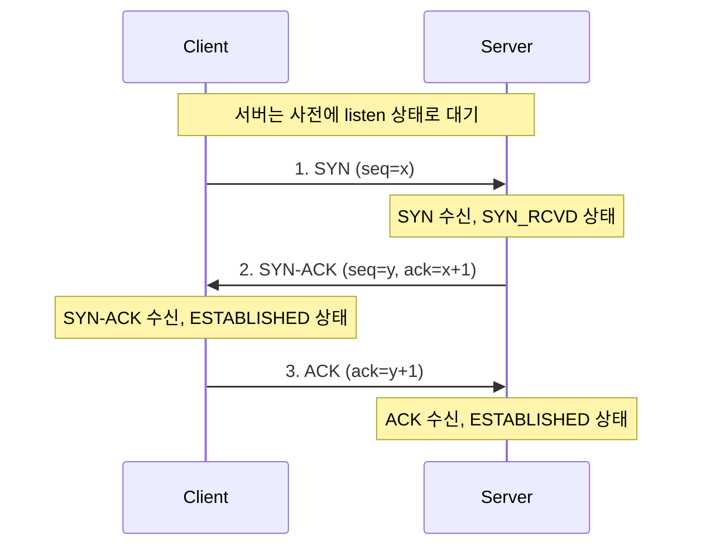
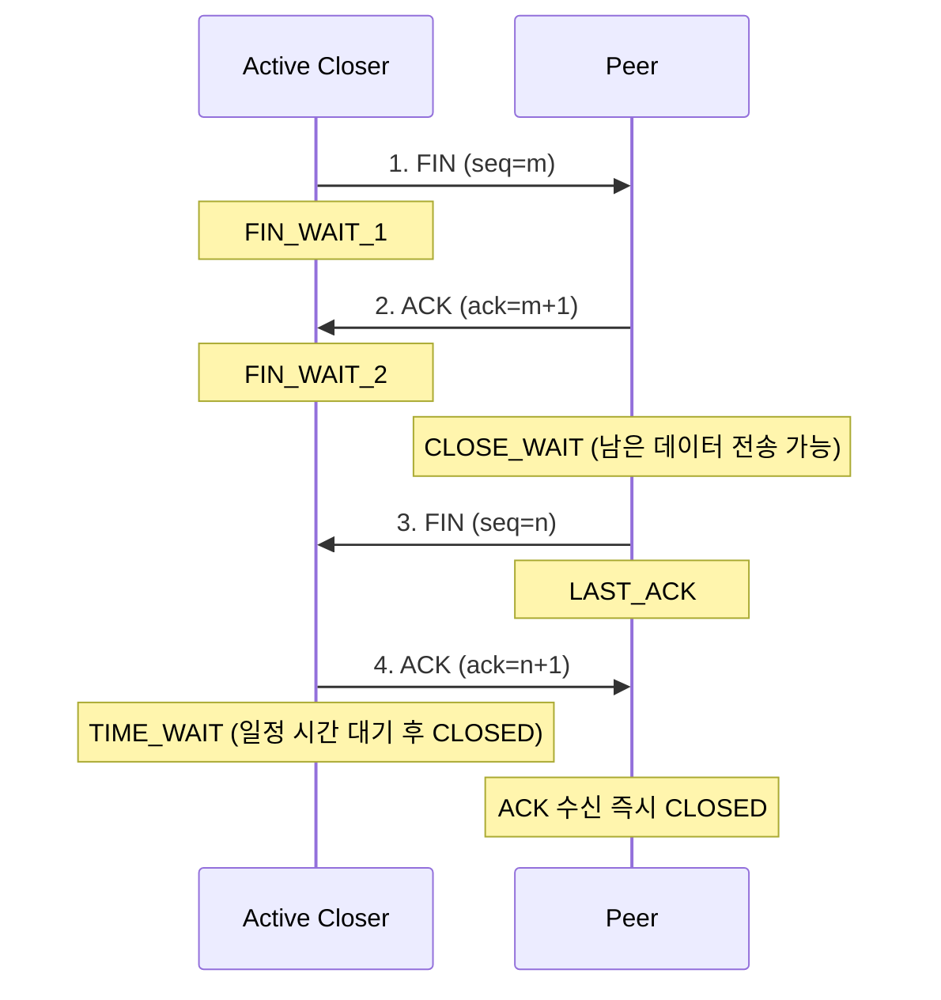

# 3-way handshake와 4-way handshake

## 핵심 정의
3-way handshake는 TCP가 데이터 전송 전에 두 종단(endpoint) 간 신뢰성 있는 연결을 수립(connection establishment)하기 위해 수행하는 3단계 메시지 교환 절차다. SYN, SYN-ACK, ACK 세 개의 세그먼트를 주고받아 양쪽 모두 서로의 송수신 준비 상태와 초기 시퀀스 번호(sequence number)를 확인한다.

4-way handshake는 TCP 연결을 정상적으로 종료(connection termination)할 때 사용하는 대표적인 4단계 교환이다. ACK와 FIN 결합이나 동시 종료에 따라 실제 세그먼트 수는 달라진다. TCP는 전이중(full-duplex) 연결이라 양쪽 방향을 각각 독립적으로 종료해야 하므로, 연결 수립보다 한 단계가 더 필요하다.

## 동작 원리 / 구조

### 3-way handshake (연결 수립)

1. 클라이언트가 임의의 초기 시퀀스 번호(ISN, Initial Sequence Number) `x`와 함께 SYN(Synchronize) 플래그를 보낸다.
2. 서버가 자신의 ISN `y`를 담은 SYN과, 클라이언트 SYN을 잘 받았다는 ACK(`x+1`)를 함께 실어 SYN-ACK로 응답한다.
3. 클라이언트가 서버의 SYN을 확인했다는 ACK(`y+1`)를 보내면 양쪽 모두 ESTABLISHED 상태가 되고 데이터 전송이 가능해진다.

서버 소켓 프로그래밍 관점에서, 2단계까지 받은 연결은 커널의 SYN 큐(SYN backlog)에 있다가 3단계 ACK가 도착하면 accept 큐(accept backlog)로 이동한다. `ServerSocket`이나 Netty/Tomcat의 accept 큐 크기 설정(`backlog`)이 이 부분과 직접 관련된다.

### 4-way handshake (연결 종료)

1. 연결 종료를 먼저 시작하는 쪽(active closer)이 FIN을 보내고 FIN_WAIT_1 상태로 전환한다.
2. 상대방(passive closer)이 FIN을 받았다는 ACK를 보내고 CLOSE_WAIT 상태가 된다. 이 시점에는 상대방→나 방향의 데이터 전송은 아직 가능하다(half-close).
3. 상대방도 보낼 데이터를 다 보낸 뒤 자신의 FIN을 보내고 LAST_ACK 상태가 된다.
4. active closer가 마지막 ACK를 보내고 TIME_WAIT 상태로 들어간 뒤, 일정 시간(RFC상 MSL의 2배, Linux v6.17 소스에서는 `TCP_TIMEWAIT_LEN`으로 60초가 하드코딩되어 있어 `sysctl`로 직접 바꿀 수 없다. `net.ipv4.tcp_fin_timeout`은 별개 상태인 FIN_WAIT_2의 타임아웃이므로 이 값을 줄여도 TIME_WAIT 지속 시간에는 영향이 없다) 대기 후 CLOSED 상태가 된다.

2번과 3번 사이에 상대방이 보낼 데이터가 없으면 ACK와 FIN을 합쳐 3-way로 종료되는 경우도 있다(이 경우 사실상 3단계로 끝나지만 이는 4-way의 변형이지 3-way handshake와는 무관한 별개 상황이다).

수신 서버의 TIME_WAIT가 많다고 같은 listen 포트가 곧바로 고갈되는 것은 아니다. 연결은 4-tuple로 구분되며 outbound 연결의 임시 포트 부족과 TIME_WAIT 상태의 메모리 비용을 구분해야 한다. SYN 큐/accept 큐 설명은 Linux의 일반적인 구현이며 SYN cookies·TCP Fast Open 등의 예외가 있다.

## 실무 관점
- **TIME_WAIT 상태 과다**: 짧은 요청/응답이 매우 많은 서버(예: 커넥션을 재사용하지 않고 매번 새로 여는 레거시 클라이언트, 또는 로드밸런서-백엔드 사이의 커넥션)에서 outbound 연결의 TIME_WAIT가 같은 목적지로 사용할 임시 포트 범위를 점유하면 포트 고갈(ephemeral port exhaustion)로 이어질 수 있다. 수신 listen 포트를 공유하는 accepted 연결의 TIME_WAIT는 이 문제와 구분한다. 우선 커넥션 재사용과 목적지별 4-tuple 사용량을 확인한다. SO_REUSEADDR는 동일 TCP 연결의 안전한 재사용을 보장하는 해결책이 아니며 tcp_tw_reuse는 주로 outbound 연결 재사용과 커널 조건에 영향을 준다. sysctl은 배포 커널 문서와 트래픽 특성을 확인한 뒤 변경한다.
- **SYN Flood 공격**: SYN을 대량 전송하고 서버의 SYN-ACK에 대한 마지막 ACK를 보내지 않아 서버의 SYN 큐를 고갈시키는 DoS 공격 패턴이다. SYN 큐 크기 조정, `SYN cookies` 같은 커널 방어 기법으로 대응한다.
- **CLOSE_WAIT 누적은 애플리케이션 버그일 확률이 높다**: CLOSE_WAIT는 상대가 FIN을 보냈는데 내 애플리케이션이 소켓을 close()하지 않은 상태다. 커넥션 풀 반환 누락, 예외 발생 시 소켓 미해제 같은 리소스 누수(resource leak)가 원인인 경우가 많다. `netstat -an | grep CLOSE_WAIT`로 지속적으로 늘어나는지 모니터링해서 애플리케이션 코드의 try-with-resources/finally 처리를 점검한다.
- **커넥션 풀과 handshake 비용**: DB 커넥션(HikariCP 등)이나 HTTP 클라이언트 커넥션 풀을 쓰는 근본 이유 중 하나가 매 요청마다 3-way handshake(및 TLS handshake까지 있다면 그 비용)를 반복하지 않기 위함이다. Keep-Alive 설정과 풀의 idle timeout을 서버 측 타임아웃보다 짧게 맞추지 않으면, 이미 서버가 4-way handshake로 닫아버린 소켓을 클라이언트가 재사용하려다 오류가 나는 경우가 흔하다.
- **로드밸런서 헬스체크**: L4 헬스체크는 3-way handshake 성공 여부만으로 서버 생존을 판단하는 경우가 많아, 애플리케이션이 실제로는 응답 불가 상태(예: 스레드 풀 고갈)여도 TCP 레벨에서는 정상으로 오인될 수 있다. 이 때문에 L7 헬스체크(HTTP 200 확인)를 병행하는 것이 일반적이다.

## 심화 Q&A

### Q. 왜 연결 종료는 4단계인데 연결 수립은 3단계로 끝나는가?
A. 연결 수립 시 서버는 클라이언트의 SYN에 대한 ACK와 자신의 SYN을 동시에 보낼 이유가 있고 실제로 그렇게 할 수 있어(할 말이 각각 하나뿐이라 묶을 수 있음) 3단계로 줄어든다. 반면 종료 시에는 내가 보낼 데이터가 끝났다는 것과 상대가 보낼 데이터가 끝났다는 것이 별개의 시점에 발생할 수 있다(전이중 연결이므로 한쪽만 먼저 끝낼 수 있음). 그래서 ACK와 FIN을 즉시 묶을 수 없는 경우가 많아 4단계가 기본형이 된다. 다만 상대가 보낼 데이터가 이미 없다면 ACK+FIN을 묶어 3단계로 종료되기도 한다.

### Q. TIME_WAIT는 왜 존재하며 없애면 안 되는 이유는 무엇인가?
A. TIME_WAIT는 두 가지 목적이 있다. 첫째, 마지막 ACK가 유실되어 상대방이 FIN을 재전송할 경우 이를 받아 다시 ACK해줄 수 있도록 일정 시간 대기하는 것(신뢰성 있는 종료 보장). 둘째, 같은 4-tuple(출발지 IP/포트, 목적지 IP/포트)을 가진 새 연결이 너무 빨리 열려서 이전 연결의 지연된 패킷(delayed duplicate segment)과 섞이는 것을 방지하는 것이다. TIME_WAIT를 무작정 없애면 이 두 안전장치가 사라져 데이터 정합성 문제가 생길 수 있으므로, 문제가 되면 먼저 커넥션 풀로 연결 생성률을 줄이고 실제 포트·메모리 병목을 측정한다. `tcp_tw_reuse`는 커널의 프로토콜 안전 조건에 따른 재사용 옵션이며 모든 TIME_WAIT 문제의 일반 처방은 아니다.

### Q. SYN Flood 공격이 3-way handshake의 어떤 특성을 악용하는가?
A. 서버는 SYN을 받으면 클라이언트의 ACK를 기다리는 동안 연결 상태 정보(SYN 큐 엔트리)를 메모리에 유지해야 한다. 공격자가 출발지 IP를 위조(spoofing)해 다량의 SYN만 보내고 ACK를 절대 보내지 않으면, 서버의 SYN 큐가 반쯤 열린 연결(half-open connection)로 가득 차 정상 클라이언트의 SYN을 받아줄 자리가 없어진다. SYN cookies는 이 상태 정보를 서버 메모리에 저장하지 않고 SYN-ACK의 시퀀스 번호 자체에 시간·연결 정보 기반 검증값 형태로 인코딩해서, 정상적인 ACK가 돌아왔을 때만 그 정보로부터 연결 상태를 재구성하는 방식으로 메모리 고갈을 방지한다.

### Q. 애플리케이션에서 소켓을 close()했는데도 CLOSE_WAIT가 계속 보인다면 무엇을 의심해야 하는가?
A. CLOSE_WAIT는 peer의 FIN 이후 로컬 송신 방향이 아직 종료되지 않았다는 뜻이다. 애플리케이션의 close가 풀 반환에 그쳤거나, dup/fork 등으로 같은 소켓을 참조하는 다른 파일 디스크립터가 남았거나, 실제로 다른 연결을 관찰하는 경우도 있다. 지속 누적 시 ss로 소유 프로세스·연결을 특정하고 예외 경로, 반납/물리 종료 구분, 참조 수를 확인한다.

### Q. 클라이언트와 서버 중 누가 먼저 연결을 끊는지에 따라 실무에서 달라지는 점이 있는가?
A. 일반적인 종료에서는 active closer(먼저 FIN을 보낸 쪽)에 남고, 동시 종료에서는 양쪽에 남을 수 있다. 만약 서버가 먼저 연결을 끊는 정책(예: Keep-Alive 타임아웃에 도달해 서버가 먼저 닫음)을 쓰면 TIME_WAIT가 서버 측에 남지만 accepted 연결들이 사용하는 listen 포트가 연결마다 하나씩 소진되지는 않는다. 같은 서버가 프록시·HTTP client로 여는 outbound 연결에서는 임시 포트 범위가 제약이 될 수 있다. 누가 먼저 닫는지만 바꾸기보다 연결 재사용률, 목적지별 4-tuple, 상태 메모리, 프록시 양쪽의 idle timeout을 함께 확인한다.

### Q. HTTP Keep-Alive와 TCP handshake는 어떤 관계가 있는가?
A. HTTP Keep-Alive는 하나의 TCP 연결(즉 한 번의 3-way handshake로 수립된 연결) 위에서 여러 개의 HTTP 요청/응답을 순차적으로 재사용하는 응용 계층 최적화다. Keep-Alive가 없으면 매 HTTP 요청마다 새로운 TCP 연결을 열고 닫아야 하므로 3-way handshake와 4-way handshake 비용이 요청 수만큼 반복된다. HTTPS의 경우 여기에 TLS handshake 비용까지 추가되므로, Keep-Alive와 커넥션 풀의 효과가 더욱 커진다. 서버의 Keep-Alive 타임아웃과 클라이언트(또는 로드밸런서)의 idle timeout 값이 어긋나면, 서버가 이미 닫은 연결을 클라이언트가 재사용하려다 `Connection reset` 오류가 발생하는 문제로 이어진다.

## 관련 개념
- [[OSI 7계층과 TCP-IP 4계층]]
- [[TCP 신뢰성 보장 메커니즘]]
- [[HTTP Keep-Alive와 커넥션 풀링]]

## 참고 자료

- [RFC 9293: TCP](https://www.rfc-editor.org/rfc/rfc9293.html) — §3.5–3.6 수립·종료·동시 종료. 확인: 2026-09-08.
- [Linux IP sysctl](https://docs.kernel.org/networking/ip-sysctl.html) — tcp_tw_reuse·tcp_fin_timeout·SYN cookies. 확인: 2026-09-08.
- [Linux v6.17 tcp.h](https://github.com/torvalds/linux/blob/v6.17/include/net/tcp.h) — TCP_TIMEWAIT_LEN 60초 구현 범위. 확인: 2026-09-08.

부분 재검증: 2026-09-22. [Linux IP sysctl](https://kernel.org/doc/html/latest/networking/ip-sysctl.html)의 tcp_tw_reuse 안전 조건과 [RFC 9293](https://www.rfc-editor.org/rfc/rfc9293.html)의 TCP 연결 식별·TIME-WAIT 의미에 맞춰 수신 연결과 outbound 임시 포트 설명을 구분했다. 기존 Linux v6.17의 60초 소스 값은 이번 확인 범위 밖이다. 노트 전체의 버전 의존 서술을 재검증한 것은 아니므로 `verified`는 유지했다.
